Wow you found this page, welcome! It's either you;
- Typed the correct URL (if that's the case, congrats!)
- One of people that I trust and owe something to, so I hope this can help and paid a bit of something I owed

Here's my personal interview preparation note. It started as an old note that I wrote back in college as a fresh-graduate, found in an old hard drive

But I decided to improve the whole thing by fact-checking and adding some things that either actually get asked in the interview or things that I learned, gained and experienced during my ~4+ years of career thus far

_// TODO: Visualize several things with three.js just like [1000 boids](../posts/1000_boids) article?_

# Fundamentals and C++

## 1. Scope and lifetime

- **Scope**: Where the variable is _visible_ (where you can type its name and the compiler knows what it is)
- **Lifetime**: When the variable actually _exists_ in the memory


Usually these overlaps, _but not always_

Example of mismatch: If an object gets created on the _Heap_ via `new` keyword, the pointer variable _might go out of scope_ (you can't see it anymore), but the object itself has an infinite **lifetime**, until you explicitly _delete_ it. Typically this is called **a memory leak**

## 2. Automatic storage (stack scope)

Default behavior for variables declared inside functions or code blocks `{}`

Object is created when execution reaches the declaration. It is **automatically destroyed** when execution reaches the closing curly brace `}` of that block

```cpp {linenos=inline}
class Player {
public:
    Player() { std::cout << "Player Created\n"; }
    ~Player() { std::cout << "Player Destroyed\n"; }
};

void GameLoop() {
    std::cout << "Start Loop\n";
    
    // Scope 1: The Function Body
    Player p1; // Created here

    {
        // Scope 2: A nested block (e.g., inside an if statement)
        std::cout << "Entering Block\n";
        Player p2; // Created here
        std::cout << "Leaving Block\n";
    } // <--- p2 is DESTROYED here immediately. p1 is still alive.

    std::cout << "End Loop\n";
} // <--- p1 is DESTROYED here.
```

Understand that `p2` does not exist outside that small block. Typically we often use `{}` blocks to specifically force an object (like a temporary texture or mutex lock) to die early to free up resources


## 3. Static storage (`static` keyword)

### 3a. Static local variable

A variable inside a function that gets marked as `static` is initialized **only once**, the first time the code runs and it **retains its value** between function calls. Its lifetime is the entire program execution


```cpp {linenos=inline}
int GetNextID() {
    // This line runs ONLY the first time GetNextID is called
    static int counter = 0; 
    
    counter++;
    return counter;
}

// Usage:
// GetNextID() -> returns 1
// GetNextID() -> returns 2 (It remembers!)
```

### 3b. Static class member

A variable in a class marked `static` is shared **by all instances** of that class. It is not stored inside the object itself

```cpp {linenos=inline}
class Enemy {
public:
    static int EnemyCount; // Declaration
    Enemy() { EnemyCount++; }
    ~Enemy() { EnemyCount--; }
};

// Definition (must be done outside the class, usually in .cpp)
int Enemy::EnemyCount = 0; 

// If you spawn 50 Enemy objects, there is still only ONE "EnemyCount" variable in memory.
```

## 4. RAII (Resource Acquisition is Initialization)

Stupid name. But arguably one of the most important concept in modern C++. It relies entirely on Scope and Lifetime

The concept: You _acquire a resource_ (open a file, allocate memory, lock a thread) in the **Constructor** and you _release it_ in the **Destructor**. C++ guarantees destructors run when a stack object goes out of scope, this subsequently prevents leaks

**=== BAD CODE ===**
```cpp {linenos=inline}
void ProcessFile() {
    FILE* f = fopen("data.txt", "r"); // Acquire
    
    if (!f) return;
    
    // ... do work ...
    if (ErrorDetected) {
        return; // DANGER! We returned without closing 'f'. Resource leak!
    }

    fclose(f); // Release
}
```

**=== GOOD CODE ===**
```cpp {linenos=inline}
class FileHandler {
    FILE* f;
public:
    FileHandler(const char* name) { f = fopen(name, "r"); }
    ~FileHandler() { if(f) fclose(f); } // Destructor handles cleanup
};

void ProcessFile() {
    FileHandler myFile("data.txt"); 
    
    // ... do work ...
    if (ErrorDetected) {
        return; // SAFE. myFile goes out of scope, destructor runs, file closes.
    }
}
```

Typically this proves that you know how to write "exception safe" code. If the game crashes or throws an error, RAII ensures you don't leave any memory leaks behind

## 5. Member initialization order

Class members are initialized in the order they are **declared in the header file**, _NOT_ the order they appear in the constructor's initialization list. This is often the trap that catches me off-guard

**The trap:**
```cpp {linenos=inline}
class BadClass {
    int y;
    int x; // Declared SECOND
public:
    // Constructor attempts to init x first, then use x to init y.
    // Looks fine here...
    BadClass(int val) : x(val), y(x * 2) {} 
};
```

**The bug:**
- The compiler looks at the header
- `y` is declared first
- It initializes `y` first
- It tries to set `y = x * 2`
- **BUT `x` hasn't been initialized yet!** it contains garbage memory
- `y` becomes garbage value
- Then `x` is initialized

To fix, always keep initialization list in the same order as your variable declarations. Most compilers will actually warn you about this (`-Wreorder`)

## 6. Constructors and Destructors

### 6a. Lifecycle

- **Constructor (`MyClass()`)**: Called automatically when an object is created. It sets up the "invariant" (state required for the object to function)
- **Destructor (`~MyClass()`)**: Called automatically when an object is destroyed, either due to eithergoes out of scope or `delete` is explicitly called

It's a good idea to avoid heavy logic in Constructors. Why? C++ constructors cannot return error codes. Let's say if loading a texture fails inside a constructor, you have to throw an exception (which many game engines disable) or leave the object in an invalid "zombie" state

Safe pattern: Lightweight constructor + an `Init()` function that returns a `bool` for success/failure

## 6b. Virtual Destructor

Say you have a Base class `Enemy`, and a derived class `Boss`. You are holding a pointer to the **Base** class, but _it points_ to the **derived object**

**The trap:**
```cpp {linenos=inline}
class Enemy {
public:
    Enemy() { std::cout << "Enemy Created\n"; }
    // NON-VIRTUAL Destructor
    ~Enemy() { std::cout << "Enemy Destroyed\n"; } 
};

class Boss : public Enemy {
    int* heavyData;
public:
    Boss() { heavyData = new int[1000]; std::cout << "Boss Created\n"; }
    ~Boss() { 
        delete[] heavyData; // Cleanup
        std::cout << "Boss Destroyed\n"; 
    }
};

void KillEnemy() {
    // Polymorphism: Base pointer holding Derived object
    Enemy* e = new Boss(); 
    
    // ... game logic ...

    delete e; // <--- PROBLEM HERE
}
```

This essentially makes it so that if `~Enemy()` is **not** marked as `virtual`, the compiler only looks at the pointer of type `Enemy*`. It calls `~Enemy()`, but **it never calls `~Boss()`**. Thus, `heavyData` array in `Boss` never gets deleted, causing memory leak

**The fix:**
```cpp {linenos=inline}
class Enemy {
public:
    virtual ~Enemy() { std::cout << "Enemy Destroyed\n"; }
};
```

Simple enough. Now, `delete e` looks up the `vtable` and sees that the object is actually a `Boss`. Subsequently calls `~Boss()` first, followed by `~Enemy()`


### 6c. Initialization lists vs. Assignment

There are two ways to give values to member variables in a constructor. One is faster; the other is sometimes impossible

#### Option A: Assignment, inside the body
```cpp {linenos=inline}
class Player {
    std::string name;
public:
    Player(std::string n) {
        name = n; 
    }
};
```

- `name` is default constructed (empty string created)
- The assignment operator is called to copy `n` into `name`
- The temporary string is destroyed

**We're wasting CPU cycles creating an empty string, just to overwrite it immediately**

#### Option B: Initialization list, after the colon
```cpp {linenos=inline}
class Player {
    std::string name;
public:
    Player(std::string n) : name(n) { // <--- This is the list
        // Body is empty
    }
};
```

Now, `name` is **copy constructed** directly from `n`. More efficient since we no longer waste CPU cycle for creating empty string

It's almost always a good idea to use initialization lists for:
- `const` members, since they cannot be assigned to later
- Reference members (`int& ref`, etc.), since they must be bound upon creation
- Objects without default constructors. If a member class requires arguments to be built, you must pass them in the list


### 6d. The rule of three (and five lol)

This relates to how C++ handles copying objects. By default, C++ **does a shallow copy**, which just copies the bits

It creates a problem, if your class manages a raw pointer (i.e., to a texture or an array), a shallow copy _copies the address_, not the data itself

Hypotetically, it goes like this:
- Obj A is created. Allocates memory at address `0x123`
- Obj B is created as _a copy of A_. It _also points to `0x123`_
- Obj A is destroyed, deletes `0x123`
- Obj B is destroyed as well, it tries to delete `0x123` **again**
- Crash, double free error

```cpp {linenos=inline}
#include <algorithm> // For std::copy

class Buffer {
private:
    int* data;
    size_t size;

public:
    // 1. Constructor (Resource Acquisition)
    Buffer(size_t s) : size(s) {
        data = new int[size]; 
        // Fill with dummy data
        for(size_t i=0; i<size; ++i) data[i] = 0;
    }

    // 2. Destructor (Resource Release)
    ~Buffer() {
        delete[] data; // If we didn't implement Copy logic, this would crash on copy!
    }

    // 3. Copy Constructor (Deep Copy)
    // Called when: Buffer b = a;
    Buffer(const Buffer& other) : size(other.size) {
        // A. Allocate NEW memory
        data = new int[size];
        
        // B. Copy the VALUES (Deep Copy), not the pointer
        std::copy(other.data, other.data + size, data);
    }

    // 4. Copy Assignment Operator (Deep Copy)
    // Called when: b = a; (Both already exist)
    Buffer& operator=(const Buffer& other) {
        // A. Self-assignment check (Critical!)
        // If someone writes "a = a;", we shouldn't delete our own data.
        if (this == &other) {
            return *this;
        }

        // B. Clean up OLD memory
        delete[] data;

        // C. Allocate NEW memory and Copy
        size = other.size;
        data = new int[size];
        std::copy(other.data, other.data + size, data);

        // D. Return *this to allow chaining (a = b = c)
        return *this;
    }
};
```

**The rule of three**: If you need to define a custom **Destructor** (to delete memory), you almost certainly _also_ need to define a custom **Copy Constrcutor** and **Copy Assignment Operator** to handle **Deep Copies** (allocating new memory for the copy)

Now with modern C++, there's **the rule of five**: For performance sake, we also add:
- **Move Constructor**, instead of copying data, we _"steal"_  the pointer from the temporary object that is about to die anyway
- **Move assignment operator** 

Typically this is called move semantics

```cpp {linenos=inline}
class Buffer {
    // ... (Previous Rule of Three code goes here) ...

public:
    // 5. Move Constructor
    // Called when: Buffer b = std::move(a);
    // Note: 'other' is not const, because we are going to modify it.
    Buffer(Buffer&& other) noexcept 
        : data(nullptr), size(0) // Initialize self to empty
    {
        // A. Steal the resources
        data = other.data;
        size = other.size;

        // B. Null out the source (So its destructor deletes nothing)
        other.data = nullptr;
        other.size = 0;
    }

    // 6. Move Assignment Operator
    // Called when: b = std::move(a);
    Buffer& operator=(Buffer&& other) noexcept {
        // A. Self-assignment check
        if (this == &other) {
            return *this;
        }

        // B. Clean up OUR old memory (We are being overwritten)
        delete[] data;

        // C. Steal resources
        data = other.data;
        size = other.size;

        // D. Null out the source
        other.data = nullptr;
        other.size = 0;

        return *this;
    }
};
```

**Pro-gamer move**: There's this trick called **Copy-and-Swap**. It simplifies above rules by reusing code and providing strong exception safety. Albeit with an addition of a `swap()` function

```cpp {linenos=inline}
class Buffer {
    int* data;
    size_t size;

public:
    // Constructor
    Buffer(size_t s) : size(s), data(new int[s]) {}
    
    // Destructor
    ~Buffer() { delete[] data; }

    // Copy Constructor (Same as before)
    Buffer(const Buffer& other) : size(other.size), data(new int[other.size]) {
        std::copy(other.data, other.data + size, data);
    }

    // Move Constructor (Same as before)
    Buffer(Buffer&& other) noexcept : data(nullptr), size(0) {
        swap(*this, other);
    }

    // FRIEND SWAP FUNCTION
    // Swaps the guts of two objects efficiently
    friend void swap(Buffer& first, Buffer& second) noexcept {
        using std::swap;
        swap(first.size, second.size);
        swap(first.data, second.data);
    }

    // UNIFIED ASSIGNMENT OPERATOR
    // Handles BOTH Copy-Assign and Move-Assign!
    // Notice the parameter is passed by VALUE (creates a copy or move automatically)
    Buffer& operator=(Buffer other) {
        // Swap our (old) data with the copy's (new) data.
        // When 'other' goes out of scope at the end of this function,
        // the destructor cleans up our old data automatically.
        swap(*this, other);
        return *this;
    }
};
```

### 6e. `explicit` keyword

Prevents accidental type conversion that can cause weird-ass bugs

**The trap:**
```cpp {linenos=inline}
class Health {
public:
    // Constructor that takes ONE argument
    Health(int hp) { ... } 
};

void HealPlayer(Health h) { ... }

// Usage
HealPlayer(50); // <--- This compiles!
```

Compiler sees you passed an `int` (50), sees `Health` has a constructor that takes an `int`, and **implicitly** converts 50 into a `Health` object. This is often confusing and likely unintended

**The fix:**
```cpp {linenos=inline}
class Health {
public:
    explicit Health(int hp) { ... }
};

HealPlayer(50); // Compiler Error!
HealPlayer(Health(50)); // Allowed. You must be explicit.
```

## 7. Stack and Heap allocation

### 7a. The Stack. Fast, automatic but small

Think of The Stack like a _stack_ of plates. **You can only add to the top, and take off the top**.
- Allocation is extremely fast. The CPU internally just moves a pointer, the "Stack Pointer" down to make a room. Typically only cost one CPU instruction
- Deallocation is also extremely fast. The CPU moves the pointer back up. The memory is "freed" instantly
- Lifetime is stricly tied to scope blocks `{}`
- Size limit is very small, usually 1-8MB depending on the OS

```cpp {linenos=inline}
void UpdatePlayer() {
    // Stack Allocation
    // 1. Fast.
    // 2. Automatically deleted when function ends.
    Vector3 position = {10.0f, 20.0f, 30.0f}; 
    
    int health = 100;
    
    // If you create a huge array here, you get a "Stack Overflow"
    // double hugeArray[1000000]; // <--- CRASH
}
```

### 7b. The Heap. Slow, manual but large

Also called the "Free Store", a giant pool of unstructured memory
- Allocation is slow. When calling `new` or `malloc`, the OS **has to search** through The Heap to find a continous block of empty memory that fits the request. This takes time
- Deallocation is slow and manual, must explicity call `delete` or `free`
- Lifetime persists until explicitly destroy it
-  Size limit depends on the physical RAM

```cpp {linenos=inline}
void CreateLevel() {
    // Heap Allocation
    // 1. Slower (OS has to find space).
    // 2. Must be manually deleted.
    Enemy* boss = new Enemy(); 
    
    // ... game runs ...
    
    delete boss; // If you forget this -> Memory Leak.
}
```

### 7c. "Game Loop"

Never allocate on The Heap, inside the main Game Loop (`Tick()`/`Update()`). Why?
- `new` is slow. Doing it 60 times/second (or 1000x a frame for particle systems, perhaps) definitely kills framerate
- Fragmentation, imagine The Heap as a block of Swiss Cheese
  - Allocate 10 bytes, then 20, then 10
  - You delete the middle (20 bytes one)
  - You now have a "hole"
  - If you then later try to allocate 30 bytes, you can't fit it in the hole. You have to go to the end and then _re-allocate_
  - Over hours of gameplay, The Heap becomes a mess of tiny holes (fragmentation), and eventually could cause an out of memory crash even if you technically still have free RAM

Then, when should we use Heap? Use heap for large assets, like textures or levels or objects that need to live longer than the current function scope

However, avoid Heap allocation inside game loop calls to prevent fragmentation and CPU spikes. For temporary data in a frame, prefer the stack


### 7d. Smart Pointers (Modern C++)

Since manual `delete` calls are error-prone, Modern C++ (>= C++11) introduced smart pointers

1. `std::unique_ptr`
- Owns the object `exclusively`, when the pointer goes out of scope, it automatically calls `delete` on the object
- Overhead is _almost_ zero, it's just a wrapper around a raw pointer
- I'd suggest to use this by default for heap objects

```cpp {linenos=inline}
#include <memory>

void SpawnEnemy() {
    // Creates an Enemy on the heap, wrapped in a unique_ptr
    std::unique_ptr<Enemy> e = std::make_unique<Enemy>();
    
    e->Attack();
    
    // No need to call delete! 
    // When 'e' goes out of scope here, the Enemy is deleted.
}
```

2. `std::shared_ptr`
- Multiple pointers can own the same object. The object is only deleted when the _last_ pointer looking at it dies
- Overhead is high since it maintains a "reference count" (internally, an int) that must be thread-safe (atomic). Every time you copy the pointer, it has to ++ or -- the counter
- I'd suggest to use this sparingly, only when ownership **is truly** shared. E.g., texture used by 50 different models. The texture should die when all 50 models are gone

### 7e. The "Pointer-chasing" problem

Connects to a topic called **Cache locality**

- In stack, data is usually contigous (next to each other). CPU **loves this**. It loads a "Cache Line" (typically 64 bytes) and gets all your variables at once
- In heap, the data is scattered randomly
  - If you have a `std::vector<Enemy*>`, the vector is just a list of ptrs
  - To update enemy 1, the CPU jumps address to address A
  - To update enemy 2, the CPU jumps address to address B
  - This jumping causes **Cache misses**, which are very slow

Prefer contigous memory as much as possible, like `std::vector<Enemy>` instead of `std::vector<Enemy*>` because it keeps the data close togehter and avoids "Pointer Chasing" on The Heap.


### 7f. Pro-gamer move: "Memory Arena"

The concept: Heap size, Stack speed

Now that we know that standard heap allocation is slow and causes fragmentation, while stack allocation is fast but the stack is too small - there's a neat trick that carries the best of both worlds called **Memory Arena**

- You allocate **a huge block** of memory on The Heap **at startup**, e.g., 100MB
- You manage this block yourself, using a simple pointer
- To "allocate" an object, you just move the pointer forward
- To "free" memory, you **don't delete** individual objects. Just **reset the pointer** to the start

Essentially this makes it so that:
- Allocating is just an integer addition, O(1), no OS overhead - fast
- Since you allocate objects one after another, they sit next to each other in RAM (cache locality)
- No fragmentation, since you immediately fill the block linearly, no holes
- Instant cleanup since we can free objects contained in the arenas by setting `Head = 0`

**The Trap: Destructors**
`Reset()` effectively frees the memory, but it **does not call destructors**
- If you store **POD** (Plain Old Data, like `int`, `Vector3`, `Matrix`), this is fine
- If you store complex objects (like `std::vector` or `std::string`) inside the arena, the object *wrapper* is freed, but the memory *it allocated internally* is leaked forever

**The Fix:** Only use Arenas for POD types, or manually call the destructor `p->~T()` before resetting

```cpp {linenos=inline}
#include <cstddef>
#include <cstdint>
#include <iostream>

class MemoryArena {
private:
    uint8_t* MemoryBlock; // The big chunk of memory
    size_t Size;          // Total size (e.g., 100MB)
    size_t Offset;        // Current "Head" position

public:
    // 1. Startup: Allocate the big block once (using malloc/new)
    MemoryArena(size_t sizeBytes) : Size(sizeBytes), Offset(0) {
        MemoryBlock = new uint8_t[sizeBytes]; 
    }

    // 2. Shutdown: Free the big block
    ~MemoryArena() {
        delete[] MemoryBlock;
    }

    // 3. Allocate: The "Pointer Bump"
    void* Alloc(size_t sizeBytes) {
        // Check if we have space
        if (Offset + sizeBytes > Size) {
            return nullptr; // Out of memory!
        }

        // Get the pointer to the current free spot
        void* ptr = &MemoryBlock[Offset];

        // Move the head forward
        Offset += sizeBytes;

        return ptr;
    }

    // 4. Deallocate: The Magic Reset
    // We don't free individual items. We wipe everything at once.
    void Reset() {
        Offset = 0;
    }
};


// Usage in game loop

struct Particle { float x, y; }; // POD type: Safe!

int main() {
    MemoryArena FrameArena(1024 * 1024); 

    while (GameIsRunning) {
        FrameArena.Reset(); 

        for (int i = 0; i < 1000; i++) {
            // Placement new
            void* mem = FrameArena.Alloc(sizeof(Particle));
            Particle* p = new(mem) Particle(); 
        }
        Render();
    }
}
```

When to use this? I found several useful case that benefits from this trick:

1. Frame allocator
I used a linear memory arena for temporary data that only needs to exist **for one frame**. E.g., UI text meshes, temp arrays for physics queries or debug drawing lines. At the end of the frame, I just call `Reset()` lol

2. Level allocator
When loading a level, I typically allocate **all** assets (textures, meshes, etc.) into a specific arena. When the player leaves the level, I don't have to track down _every single texture_ to delete it. I just destroy the entire level arena. Effectively doing instant cleanup and guarantees zero memory leaks between levels

**Important note**

Since `Alloc()` returns a `void*` (raw memory), the constructor is not called automatically. We need to use something called **Placement New**

- Standard `new Player()` -> allocates memory AND calls constructor
- Placement New `new(ptr) Player()` -> uses EXISTING memory `ptr` and calls constructor there

```cpp {linenos=inline}
void* mem = Arena.Alloc(sizeof(Enemy));
Enemy* e = new(mem) Enemy(); // Construct the enemy in our arena
```

**The Trap: Alignment**
If you allocate a `char` (1 byte) and then immediately allocate an `int` (4 bytes), the int might end up at memory address `0x01`. This is unaligned. On x86 CPUs, this is slow. On ARM (Mobile/Switch), this crashes the game

**The Fix**: We must align the pointer before returning it

```cpp {linenos=inline}
#include <cstddef>
#include <cstdint>
#include <memory> // for std::align

class MemoryArena {
private:
    uint8_t* MemoryBlock; 
    size_t Size;          
    size_t Offset;        

public:
    MemoryArena(size_t sizeBytes) : Size(sizeBytes), Offset(0) {
        MemoryBlock = new uint8_t[sizeBytes]; 
    }

    ~MemoryArena() {
        // WARNING: This does NOT call destructors for objects inside!
        // Only use Arena for POD (Plain Old Data) or manually call destructors before resetting.
        delete[] MemoryBlock;
    }

    void* Alloc(size_t sizeBytes, size_t alignment) {
        // 1. Calculate current address
        uintptr_t currentPtr = (uintptr_t)MemoryBlock + Offset;
        
        // 2. Calculate padding needed to align this address
        // Example: Address is 1, alignment is 4. We need 3 bytes padding.
        size_t padding = (alignment - (currentPtr % alignment)) % alignment;

        // 3. Check space
        if (Offset + padding + sizeBytes > Size) {
            return nullptr; 
        }

        // 4. Apply padding and return aligned pointer
        Offset += padding;
        void* ptr = &MemoryBlock[Offset];
        Offset += sizeBytes;
        
        return ptr;
    }

    void Reset() { Offset = 0; }
};

// Usage
// alignof(T) gets the required alignment for a type
void* mem = Arena.Alloc(sizeof(Enemy), alignof(Enemy));
Enemy* e = new(mem) Enemy();
```

## 8. Common C++ containers

Choosing the right container is often a choice between "easy to write" vs "runs fast". Understanding of **Big O notation** and **CPU cache behavior** is important

### 8a. `std::vector`

Under the hood this is just a dynamic array. It allocates a contigous block of memory on The Heap

- Performance:
  - Random access via `v[i]`: O(1)
  - Insertion at the end via `push_back()`: O(1) amortized, usually fast but slow when need to resize
  - Insertion/Deletion in Middle: O(n), since it has to **shift all** subsequent elements in memory
- CPU loves it. Since it's a contigous memory. The data sits side-by-side, thus the CPU loads it into the cache efficiently. Iterating through a vector is the fastest thing a CPU can do

**`reserve()` trick**

When a vector fills up, it has to:
- Allocate a new, bigger block of memory (usually 2x current size)
- **Move or Copy** everything from the old block to the new one.
- **The Trap:** `std::vector` will only **Move** (fast) if your Move Constructor is marked `noexcept`. If it isn't, C++ falls back to **Copying** (slow) to guarantee exception safety.
- Delete the old block

This is slow. By reserving a certain number of elements in the array, we'll avoid reallocation.

```cpp {linenos=inline}
std::vector<Enemy> enemies;
enemies.reserve(100); // No reallocation for the first 100 items.
```

It's also a good idea to mark your Move Constructor as `noexcept` though:
```cpp {linenos=inline}
class Particle {
public:
    // FAST: Vector will move this when resizing
    Particle(Particle&& other) noexcept { ... }

    // SLOW: Vector will COPY this when resizing because it's not safe to move
    Particle(Particle&& other) { ... } 
};
```

**Usage example: Entity Manager** 

Say you have a list of enemies, bullets or particles. You need to update them every single frame, and need maximum iteration speed

```cpp {linenos=inline}
struct Enemy {
    int id;
    float health;
    void Update() { /* AI logic */ }
};

class EnemyManager {
    // CHOICE: vector because we iterate this 60 times a second.
    // The contiguous memory means the CPU cache stays hot.
    std::vector<Enemy> enemies;

public:
    void InitLevel(int enemyCount) {
        // OPTIMIZATION: Reserve memory upfront to prevent resizing lag spikes.
        enemies.reserve(enemyCount); 
        
        for(int i = 0; i < enemyCount; i++) {
            enemies.push_back(Enemy{i, 100.0f});
        }
    }

    void UpdateAll() {
        // Fast iteration
        for (auto& e : enemies) {
            e.Update();
        }
    }
};
```

- Why not List? A list would scatter enemies across memory, causing cache misses every time we move to the next enemy
- Why not Map? We don't need to look them up by ID here, just need to process _all_ of them

### 8b. `std::list`

This is a doubly linked list. Each node contains `the data + a pointer to the next node + a pointer to the previous node` 

- Performance
  - Random access via `l[i]`: O(n), terrible. Since you have to walk the chain from the start to find the nth element
  - Insertion/Deletion: O(1), you just change the pointer. _However_, you have to find the spot first (which takes O(n))
- CPU hates it. Prone to cache misses since the nodes are scattered all over the heap. Iterating a list is significantly slower than a vector because the CPU has to wait for memory fetches constantly
- Use this only when you need to frequently insert/remove items from the _middle_ of the sequence and you already have a pointer to that location

**Usage example: Status effect system**

Say a player might have "Poison", "Regen" and "Stun" effects active. The effects expire at different times and with a random order. We frequently need to delete an effect from the _middle_ of the list when its timer runs out

```cpp {linenos=inline}
struct StatusEffect {
    std::string name;
    float duration;
};

class Player {
    // CHOICE: list because we delete from the middle frequently.
    // Removing an item from a list is just rewiring pointers (cheap).
    // Removing from the middle of a vector requires shifting all data (expensive).
    std::list<StatusEffect> activeEffects;

public:
    void AddEffect(std::string name, float time) {
        activeEffects.push_back({name, time});
    }

    void TickEffects(float deltaTime) {
        auto it = activeEffects.begin();
        while (it != activeEffects.end()) {
            it->duration -= deltaTime;
            
            if (it->duration <= 0) {
                // Efficient removal from middle (No data shifting)
                it = activeEffects.erase(it); 
            } else {
                ++it;
            }
        }
    }
};
```

- Why not Vector? If you have 50 effects and remove index 0, a vector has to _shift the other 49 items_ down one slot. A list just updates two pointers

### 8c. `std::map`

Under the hood, it's usually a Red-Black Tree (Binary Search Tree) that keeps elements **sorted** by key

Performance typically is O(log n) for lookups, insertions and deletions

Use this when you need the data to be sorted

**Usage example: Event Timeline / Replay System**

Say you want to store game events (player jumped, enemy died, etc.) keyed by the **Time** they occured. You need to process them strictly in chronological order

```cpp {linenos=inline}
struct GameEvent {
    std::string action;
    int actorID;
};

class ReplaySystem {
    // CHOICE: map because it automatically sorts by Key (Time).
    // float = Time (Key), GameEvent = Data (Value)
    std::map<float, GameEvent> timeline;

public:
    void RecordEvent(float time, std::string action, int id) {
        // Insertions are O(log n), but they are automatically sorted.
        timeline[time] = {action, id};
    }

    void Playback() {
        // Iterating a map ALWAYS goes from smallest Key to largest Key.
        for (const auto& pair : timeline) {
            float time = pair.first;
            const GameEvent& evt = pair.second;
            
            std::cout << "At " << time << "s: " << evt.action << "\n";
        }
    }
};
```

### 8d. `std::unordered_map`

Under the hood, it's a hash table. It hashes the Key to find a "bucket". Unlike `std::map`, the elements are **stored in random order**

Performance typically O(1), faster than std::map

There's a catch though, if many keys hash to the same bucket (collision), performance degrades to O(n). Also, calculating the Hash takes time

**Usage example: Asset Manager (Texture Cache)**

Say you need to load a texture by its filename. You don't care about the alphabetical order of files; you just want say "Give me `Hero.png`", and get it instantly

```cpp {linenos=inline}
class Texture { /* ... heavy image data ... */ };

class AssetManager {
    // CHOICE: unordered_map for O(1) lookup speed.
    // Key = Filename (string), Value = Pointer to Texture
    std::unordered_map<std::string, Texture*> textureCache;

public:
    Texture* GetTexture(std::string filename) {
        // 1. Check if we already loaded it (Fast lookup)
        auto it = textureCache.find(filename);
        
        if (it != textureCache.end()) {
            return it->second; // Found it! Return existing.
        }

        // 2. Not found, load from disk (Slow)
        Texture* newTex = new Texture(); // (Pseudo-code loading)
        textureCache[filename] = newTex;
        return newTex;
    }
};
```

### 8e. `std::array`

This is a fixed-size array that lives on The Stack, usually.

- Syntax: `std::array<int, 5> myArr;`
- Performance is identical to a raw C-Array (`int myArr[5]`)
- Use this over raw C-Array since it adds safe and handy features like `.size()` for capacity check and `.at()` for bounds checking, without any neglible performance cost

**Usage example:  Equipment Slots**

```cpp {linenos=inline}
class PlayerEquipment {
public:
    enum Slot { HEAD, CHEST, LEGS, FEET, COUNT };

    // CHOICE: array because the size is known at compile time (4 slots).
    // It lives on the Stack (inside the class), avoiding Heap allocation overhead.
    std::array<int, Slot::COUNT> itemIDs;

    PlayerEquipment() {
        // Safe filling
        itemIDs.fill(0); 
    }

    void Equip(Slot s, int id) {
        // .at() provides bounds checking (throws error if s is invalid)
        // unlike raw C-arrays which would just overwrite random memory.
        itemIDs.at(s) = id; 
    }
};
```
- Why not Vector? A vector would allocate heap memory for just 4 integers. That's wasteful.

### 8f. Pro-gamer move: Swap-and-Pop array (Unordered array/Swapback array)

As described above, deleting an object from a `std::vector` without `reserve()`-ing it ahead of time is inefficient. The following container is a simple workaround, albeit with a glaring downside

If you **don't care about the order** of elements, you can use a technique called Swap-and-Pop

- The technique:
  - Take the **last element** in the array
  - Copy/Move it into the slot of the **dead element**
  - Delete the **last element** (cheap!)
- Cost: O(1), moved **exactly** one object

- Use this when:
  - Order doesn't matter. E.g., particle system, pool of active enemies, list of SFXs, etc.
  - Frequent deletions, you add and remove items constantly every frame
- Don't use this when:
  - Order matters. E.g., rendering layer. Don't show background layer on after UI layer and vice versa
  - Indices are cached externally. If another system holds "index 5" to refer to a specific enemy, and you swap a different enemy into index 5, the other system will now point to the wrong enemy

**Implementation**:
```cpp {linenos=inline}
// We can implement this as a wrapper around std::vector

#include <vector>
#include <cassert>

template <typename T>
class SwapbackArray {
private:
    std::vector<T> data;

public:
    // Standard access
    T& operator[](size_t index) { return data[index]; }
    const T& operator[](size_t index) const { return data[index]; }
    size_t size() const { return data.size(); }
    
    // O(1) Insertion (Same as vector)
    void push_back(const T& value) {
        data.push_back(value);
    }

    // THE MAGIC: O(1) Removal
    void remove_at(size_t index) {
        assert(index < data.size());

        // 1. Overwrite the item to be removed with the last item
        // We use std::move to be efficient if T is a complex object
        data[index] = std::move(data.back());

        // 2. Remove the last item (now that it has been moved)
        // pop_back on a vector is O(1)
        data.pop_back();
    }
};

// Usage example: A particle system. We iterate through particles. If one dies, remove it instantly without breaking the loop or shifting memory

struct Particle {
    float lifeTime;
    float x, y;
};

int main() {
    SwapbackArray<Particle> particles;

    // Spawn 10,000 particles
    for(int i=0; i<10000; i++) {
        particles.push_back({10.0f, 0, 0});
    }

    // Update Loop
    // NOTICE: We iterate BACKWARDS or handle the index carefully
    // because swapping changes the current index!
    for (size_t i = 0; i < particles.size(); /* no increment here */) {
        
        Particle& p = particles[i];
        p.lifeTime -= 0.016f; // DeltaTime

        if (p.lifeTime <= 0) {
            // O(1) Removal
            // The particle at 'i' is replaced by the last particle.
            // We do NOT increment 'i', because we need to process 
            // the *new* particle that just got swapped into this slot.
            particles.remove_at(i);
        } else {
            // Only increment if we didn't remove
            ++i;
        }
    }
    
    return 0;
}
```

### 8g. Iterator Invalidation

What happens to iterators when you modify a container?

Say you're looping through a `vector` of enemies, and you decide to delete one

```cpp {linenos=inline}
std::vector<int> numbers = {1, 2, 3, 4, 5};

for (auto it = numbers.begin(); it != numbers.end(); ++it) {
    if (*it == 3) {
        numbers.erase(it); // <--- CRASH / Undefined Behavior
        // The 'erase' function invalidates the iterator 'it'.
        // The loop then tries to do '++it' on a dead iterator.
    }
}
```

**The fix**:
```cpp {linenos=inline}
for (auto it = numbers.begin(); it != numbers.end(); /* empty */) {
    if (*it == 3) {
        it = numbers.erase(it); // Update 'it' to the next valid element
    } else {
        ++it; // Only increment if we didn't delete
    }
}
```

## 9. Strings

### 9a. Cost of `std::string`

Unlike an `int` (which is just 4 bytes on stack), a `std::string` is a complex object

- Heap allocation: If the text is long, `std::string` calls `new` to store the characters on The Heap
- Copying is expensive (`std::string a = b;`) usually triggers a heap allocation and memory copy (`memcpy`)
- When the string goes out of the scope, it calls `delete`

The following code  allocates and frees memory every single frame (60 times/sec). This causes heap fragmentation and CPU overhead. We should cache the string or use a fixed-size buffer

```cpp {linenos=inline}
void UpdateHUD(int score) {
    // 1. Converts int to string (allocation)
    // 2. Creates "Score: " (allocation)
    // 3. Concatenates them (allocation + copy)
    std::string text = "Score: " + std::to_string(score); 
    
    RenderText(text);
} // text is destroyed (deallocation)
```

### 9b. SSO (Small String Optimization)

This is a compiler optimization in `std::string`. To avoid the expensive heap allocation for short strings like "Name", "HP", "Ammo", `std::string` has a small internal buffer (typically 15-22 chars) directly inside the object itself

- Short string (< 16 chars) -> stored on The Stack, inside the object itself. Fast, no `new`/`delete`
- Long string (> 16 chars) -> stored on The Heap, slow

Keep frequently used strings, like obj names or tags short enough to fit in SSO so it can avoid heap allocation

### 9c. `const char*` vs `std::string` vs `std::string_view`

#### 1.`const char*`, the C-Style String
- Just a pointer to a read-only array of chars ending in a null terminator `\0`
- Zero overhead, it's just a pointer (8 bytes)
- Unsafe, since you don't know the size. Have to use `strlen()` to find the length, which is O(n)

#### 2. `std::string`
- Safe, easy to resize, owns the memory
- It's heavy since it does allocations
- Use this when you need to _store_ or _modify_ texts

#### 3. `std::string_view`
- A lightweight wrapper that looks at an existing string, either `char*` or `std::string` without actually copying it. Consists of just a pointer and a length
- Use this for **function parameters**

```cpp {linenos=inline}
// BAD: Copies the string (Heap allocation if long)
void ProcessName(std::string name) { ... }

// BETTER: Pass by const reference (No copy, but requires a std::string input)
void ProcessName(const std::string& name) { ... }

// BEST (C++17): Accepts "char*" OR "std::string" with ZERO copies/allocations
void ProcessName(std::string_view name) { 
    if (name == "Player") { ... } // Fast comparison
}
```

### 9d. String Hashing

Comparing strings (`"Player" == "Player"`) is slow. It has to check every character; `P == P`, `l == l`, etc. This is O(n), where n is the length of the  string

Hashing/interning is used to get around this. In Unreal , we convert strings into integers (Hashes)

- "Player" -> Hash function -> `0xA1B2C3D4`
- "Enemy" -> Hash function -> `0xE5F6G7H8`

Then the comparison becomes:
`if (0xA1B2C3D4 == 0xE5F6G7H8)`, just a single integer comparison. O(1), extremely fast

In UE, `FName` is a hashed string. It is **case-insensitive** and **immutable**. It is used to identify assets, bones and sockets cz comparison is instant

### 9e. `snprintf() / fmt()` for Formatting

Concatenating strings with `+` is slow and messy

`std::string s = "Health: " + std::to_string(hp) + " / " + std::to_string(maxHp);`

**Better alternatives**:

#### `snprintf` (C-Style). Fast, writes to a stack buffer
```cpp {linenos=inline}
char buffer[64];
snprintf(buffer, sizeof(buffer), "Health: %d / %d", hp, maxHp);
```

#### `std::format` (C++20). Type-safe, fast and modern
```cpp {linenos=inline}
std::string s = std::format("Health: {} / {}", hp, maxHp);
```


## 10. Alignment and Padding

### 10a. CPU word size

The CPU reads memory **in chunks**, not byte-by-byte

- A 64-bit CPU wants to read data from addresses that are multiples of 8 (64 bits)
- A 32-bit integer wants to live at an address that is divisible by 4

If you put a 4-byte `int` at address `0x01` instead of `0x00` or `0x04`, the CPU has to do extra work (two reads + bit shifting) to get that number

This is called **Unaligned Access**. To prevent this, the compiler automatically inserts **Padding** (empty bytes)

### 10b. Padding visualizatoin

Let's look at the following struct. You might think the size is just the sum of its parts. It's not

**Naive struct**:

```cpp {linenos=inline}
struct BadStruct {
    char a;     // 1 byte
    // --- 3 bytes of PADDING inserted here ---
    int b;      // 4 bytes (Needs 4-byte alignment)
    char c;     // 1 byte
    // --- 3 bytes of PADDING inserted here ---
    // Total Size: 1 + 3 + 4 + 1 + 3 = 12 bytes
};
```

- `int b` needs to start at an address divisible by 4. Since `char a` only took 1 byte, the compiler adds 3 junk bytes so `b` starts at offset 4
- We're wasting 6 bytes due to padding (50%!)

**Nicely packed struct**:

```cpp {linenos=inline}
struct GoodStruct {
    int b;      // 4 bytes
    char a;     // 1 byte
    char c;     // 1 byte
    // --- 2 bytes of PADDING at the end ---
    // Total Size: 4 + 1 + 1 + 2 = 8 bytes
};
```

The key is to **reorder variables from largest to smallest**. Doing so, we reduced the size from 12 bytes -> 8 bytes

This looks like it won't matter that much, but consider if you have an array of 1.000.000 particles, 
- `BadStruct` -> 12MB RAM usage
- `GoodStruct` -> 8MB RAM usage

We saved 4MB of RAM usage and significantly reduced the number of times the CPU has to fetch data from main memory due to fewer cache misses

### 10c. `alignof` and `sizeof`

Consider the following:

```cpp {linenos=inline}
std::cout << sizeof(BadStruct); // Output: 12
std::cout << alignof(BadStruct); // Output: 4 (Because the largest member is an int)
```

The alignment of a struct is _usually_ equal to the alignment of its largest member

### 10d. Cache lines (the 64-byte rule)

Modern CPUs fetch memory in "Cache Lines", typically 64 bytes

- When you ask for `Variable A`, the CPU fetches **`Variable A` + the next ~60 bytes of data automatically**
- The key here is you want your struct **to fit nearly inside a cache line** so CPU gets _everything_ in one go

**Important note**:

There's a condition called **False sharing**, where 2 threads are writing to 2 different variables that _happen_ to sit on the _same_ cache line. The CPU cores fight over that cache line, causing massive slowdowns

To fix this, use `alignas(64)` to force a variable to start on a new cache line

```cpp {linenos=inline}
struct ThreadSafeCounter {
    alignas(64) int counterA; // Thread 1 uses this
    alignas(64) int counterB; // Thread 2 uses this
    // Now they are far apart in memory. No fighting.
};
```

### 10d. SIMD (Single Instruction, Multiple Data) alignment (vectorization)

#### SIMD concept

If you are doing heavy math (physics, graphics), you might use SIMD (Single Instruction, Multiple Data) instructions (SSE/AVX)

- These instructions operate on `4 floats` _at once_ (128 bits) or `8 floats` (256 bits)
- It is important that the data _must_ be aligned to 16 bytes (for SSE) or 32 bytes (for AVX). Otherwise, the program might crash

UE uses this internally inside `FVector`, often aligned specifically to allow fast math operations

Normal C++ code is SISD (Single Instruction, Single Data)

`float c = a + b;`, simple enough - one addition

#### Alignment requirement

To load data into these special registers efficiently, the memory address **must** be a multiple of the register size (typically 16 bytes for SSE)

- Aligned load via `_mm_load_ps`: Fast. Requires the addrress to end in `0`, `10`, `20`, etc. (Hex!). **Crashes** if address is wrong
- Unaligned load via `__mm_loadu_ps`: Historically slower, but on modern CPUs (Haswell and newer), the performance penalty is **negligible**. It is safe to use on _any_ address
- **The Crash:** The real danger isn't speed, it's using an *Aligned* instruction on *Unaligned* memory (e.g., address ending in `0x04`). The CPU throws a hardware exception and the game crashes instantly


#### Concrete example, the vector class

**The "Normal" Class (Dangerous for SIMD)**:
```cpp {linenos=inline}
struct Vector4 {
    float x, y, z, w; 
    // Size: 16 bytes.
    // Alignment: 4 bytes (because 'float' needs 4-byte alignment).
};

void Math() {
    // This might be allocated at address 0x1004.
    Vector4 v; 
}
```

**The "SIMD-Ready" Class**:
```cpp {linenos=inline}
// We use the alignas keyword (C++11) to force the compiler to pad the memory so it always starts on a 16-byte boundary.

#include <immintrin.h> // Header for SIMD intrinsics (SSE/AVX)

// Force this struct to always start at a memory address divisible by 16
struct alignas(16) Vector4SIMD {
    float x, y, z, w;
};

void FastAdd(Vector4SIMD* a, Vector4SIMD* b, Vector4SIMD* result) {
    // 1. Load data from RAM into 128-bit CPU Registers
    // _mm_load_ps REQUIRES 16-byte alignment.
    // If we didn't use alignas(16) above, this line would CRASH.
    __m128 vecA = _mm_load_ps(&a->x); 
    __m128 vecB = _mm_load_ps(&b->x);

    // 2. Do the math (Add 4 floats at once)
    __m128 vecRes = _mm_add_ps(vecA, vecB);

    // 3. Store back to RAM
    _mm_store_ps(&result->x, vecRes);
}
```

#### Heap allocation gotcha

`alignas(16)` works perfectly for variables on the **Stack** or **Global** variables. The compiler handles it

**However**, if you use `new`:

`Vector4SIMD* ptr = new Vector4SIMD();`

The standard `new` operator **does not guarantee 16-byte alignment** on all platforms, especially older Windows versions. It might give you an address ending in `8`

**The fix**:

Override the `new` and `delete` operators for your class to use `_aligned_malloc` for Windows or `posix_memalign` for Linux/Consoles

```cpp {linenos=inline}
struct alignas(16) Vector4SIMD {
    float x, y, z, w;

    // Override new to ensure heap allocation is aligned
    void* operator new(size_t i) {
        return _aligned_malloc(i, 16);
    }

    void operator delete(void* p) {
        _aligned_free(p);
    }
};
```

## 11. V-Table, or how Virtual Functions work

How does the computer actually know which function to call at runtime?

When a class has at least one `virtual` function, the compiler _secretly_ adds a hidden pointer to the class called the `vptr` (vritual pointer). This points to a static table in memory called `vtable` (virtual table)

- The vtable is an array of function pointers, shared by all objects of that class
- The cost:
  - Memory, every object gets 8 bytes larger (on 64-bit systems) to hold the `vptr`
  - Performance, calling a virtual function requires an extra memory lookup. Dereferencing `vptr` -> finding function address -> actually calling it. Again, this could cause cache miss due to indirect lookup. This also prevent compiler from inlining the function

Then, every function shouldn't be virtual. Because of the overhead explained above

```cpp {linenos=inline}
class Base {
    int x;
    virtual void Bark() {} // <--- Causes creation of vtable
};

// Memory Layout of 'Base' object:
// [ vptr ] (8 bytes) -> Points to Base::vtable
// [  x   ] (4 bytes)
// [ pad  ] (4 bytes)
```

## 12. C++ casting

In games, you constantly have a generic pointer (e.g., `AActor*` in Unreal or `GameObject` in Unity) and you need to cast it to a specific class (e.g., `Player*`)

### 12a. `static_cast<T>`

I like to call this the "I know what I'm doing" cast lol

- When? Compile-time check. Used when you are 100% sure the types are compatible (e.g., `float` to `int`, or `Base` to `Derived` if you are certain).
- Cost is free, zero runtime overhead
- Danger: If you cast a generic `Enemy*` to `Boss*`, but it was actually a `Minion*`, the game will crash or have a corrupted memory

### 12b. `dynamic_cast<T>`

This is the "safety check" cast

- When? Runtime check. Used when you don't know what the object is
- If the cast is illega, it returns `nullptr`
- Cost is slow, since it relies on RTTI (Run-time type information). It has to crawl through the class hierarchy string names to check compatibility
- Many game engines like UE disable RTTI for performance and provide their own version `Cast<T>`

### 12c. `const_cast<T>`
- When? To remove the `const` property
- Red flag: If you use this, you usually designed your architecture wrong

### 12d. `reinterpret_cast<T>`

Or as how I like to call it the "Trust me, bro" cast lol

- When? Treating bits as something else. e.g., Casting a pointer to an integer
- Usage is typically in low-level networking or serialization


### 12e. Example

```cpp {linenos=inline}
void OnHit(Entity* other) {
    // BAD: C-Style cast (Hard to search for, unsafe)
    // Player* p = (Player*)other; 

    // GOOD: Dynamic cast (Safe, but slow)
    Player* p = dynamic_cast<Player*>(other);
    if (p) {
        p->TakeDamage();
    }
    
    // BEST (In Unreal Engine):
    // Player* p = Cast<Player>(other); // Uses custom fast casting
}
```

## 13. `const` correctness

This is a "character trait", shows you are **disciplined**

If a function does not modify the object, it **must** be marked as `const`

Why?
- Safety, the compiler will error if you accidentally change a variable inside the function body
- API design, implicitly tells other programmer that "it's safe to call this function, this won't break anything since it doesn't mutate any value"

I typically got caught off-guard about this: `const int*` vs `int* const`
- `const int* ptr`: The data is constant. (You can't change the value `*ptr = 5`, but you can move the pointer `ptr++`)
- `int* const ptr`: The pointer is constant. (You can change the value `*ptr = 5`, but you can't move the pointer `ptr++`)
- `const int* const ptr`: Both are constant

```cpp {linenos=inline}
class Weapon {
    int ammo;
public:
    // This function MUST be const because it just reads data.
    int GetAmmo() const { 
        // ammo--; // <--- Compiler Error! Good!
        return ammo; 
    }

    // This function cannot be const because it changes state.
    void Fire() { 
        ammo--; 
    }
};

void UpdateUI(const Weapon& w) {
    // Because 'w' is passed as const reference...
    std::cout << w.GetAmmo(); // Allowed (GetAmmo is const)
    // w.Fire(); // Compiler Error! (Fire is not const)
}
```

## 14. Special Member Functions (The Implicit Rules)

We touched on the Rule of three and five. But you need to know exactly **what** the compiler generates for you and **when** it stops doing so

The 6 special members:
1. Default Constructor
2. Destructor
3. Copy Constructor
4. Copy Assignment Operator
5. Move Constructor
6. Move Assignment Operator

The hidden rules:
1. If you declare _any_ constrctor, the compiler **stops generating the Default Constructor**
2. If you declare a Move operation, be it constructor or assignment, the compiler **deletes** the Copy operations implicitly

Rule 2 caught me off-guard so many times

Say you write this:

```cpp {linenos=inline}
class Player {
    int health;
    std::string name;
};
```

Here is the **exact** code the compiler generates behind the scenes. It performs **Member-wise** operations

```cpp {linenos=inline}
class Player {
    int health;
    std::string name;

public:
    // 1. Implicit Default Constructor
    // It calls the default constructor of every member.
    // Note: 'health' (int) is NOT initialized (contains garbage) because it's a primitive.
    // 'name' (string) IS initialized to "" because std::string has a constructor.
    Player() : health(), name() {} 

    // 2. Implicit Destructor
    // Calls destructors of members in REVERSE order of declaration.
    ~Player() {
        // name.~string(); // Called automatically
        // health (int) has no destructor, so nothing happens.
    }

    // 3. Implicit Copy Constructor
    // Copies every member.
    Player(const Player& other) 
        : health(other.health), name(other.name) {} 

    // 4. Implicit Copy Assignment Operator
    Player& operator=(const Player& other) {
        health = other.health;
        name = other.name; // Calls std::string::operator=
        return *this;
    }

    // 5. Implicit Move Constructor
    // Casts every member to r-value reference (std::move).
    Player(Player&& other) 
        : health(std::move(other.health)), name(std::move(other.name)) {}

    // 6. Implicit Move Assignment Operator
    Player& operator=(Player&& other) {
        health = std::move(other.health);
        name = std::move(other.name); // Calls std::string::operator=(string&&)
        return *this;
    }
};
```

Typical game engine usage: `delete` keyword

In games, many object like `RenderContext` and `NetworkSocket` **should never be copied**. You must **explicitly** disable these functions

```cpp {linenos=inline}
class Texture {
public:
    // 1. Allow Default Construction
    Texture() = default;

    // 2. DISABLE Copying (Unique Asset)
    // If someone tries: Texture b = a; -> Compiler Error.
    Texture(const Texture&) = delete;
    Texture& operator=(const Texture&) = delete;

    // 3. ALLOW Moving (Transfer ownership)
    Texture(Texture&&) = default;
    Texture& operator=(Texture&&) = default;
};
```

## 15. CRTP (Curiously Recurring Template Pattern)

This is a technique to achieve **Polymorphism** (overriding behavior) without **Virtual Functions**. Weird, right?

Why it matters?
Virtual functions have runtime overhead (vtable lookup). CRTP resolves the function call at **Compile Time**. It is heavily used in engine math libraries and ECS frameworks

The pattern: The Base class takes the Derived class as a template parameter

`class Derived : public Base<Derived> { ... }`

```cpp {linenos=inline}
template <typename Derived>
class SpriteBase {
public:
    void Draw() {
        // STATIC POLYMORPHISM
        // We cast 'this' to the Derived type at compile time.
        // No vtable. No runtime lookup. The compiler inlines this.
        static_cast<Derived*>(this)->DrawImplementation();
    }
};

class PlayerSprite : public SpriteBase<PlayerSprite> {
public:
    void DrawImplementation() {
        std::cout << "Drawing Player\n";
    }
};

class EnemySprite : public SpriteBase<EnemySprite> {
public:
    void DrawImplementation() {
        std::cout << "Drawing Enemy\n";
    }
};

// Usage
template <typename T>
void Render(SpriteBase<T>& sprite) {
    sprite.Draw(); // Calls specific implementation directly
}
```

## 16. SFINAE (Substitution Failure Is Not An Error)

C++ and their stupid naming. Sounds scary but this is actually useful

It allows you to write functions that _only exist_ for specific types

Why it matters?

You might want a generic `Serialize()` function, but you'd like it to behave differntly for `int`, `struct`, and `ptrs`. SFINAE lets you enable/disable functions based on the type passed in

```cpp {linenos=inline}
#include <type_traits>
#include <iostream>

// Function 1: Only compiles if T is a Floating Point number (float, double)
template <typename T>
typename std::enable_if<std::is_floating_point<T>::value, void>::type
ProcessMath(T value) {
    std::cout << "Processing Float: " << value << "\n";
}

// Function 2: Only compiles if T is an Integer (int, long)
template <typename T>
typename std::enable_if<std::is_integral<T>::value, void>::type
ProcessMath(T value) {
    std::cout << "Processing Int: " << value << "\n";
}

int main() {
    ProcessMath(10.5f); // Calls Function 1
    ProcessMath(5);     // Calls Function 2
    // ProcessMath("String"); // Compiler Error: No matching function found!
}
```

## 17. Concepts (C++20's replacement for SFINAE)

In the previous section, we looked at SFINAE (`std::enable_if`). It is ugly, hard to read, and produces terrifying compiler error messages (often 100 lines of template garbage)

**Concepts** are the modern replacement. They allow you to specify **Constraints** on template parameters in plain English

### 17a. Replacing SFINAE with concepts

Let's rewrite the Math example from the previous section

SFINAE code:

```cpp {linenos=inline}
template <typename T>
typename std::enable_if<std::is_integral<T>::value, void>::type
Process(T value) { ... }
```

Concepts code:

```cpp {linenos=inline}
#include <concepts>

// Syntax 1: The "requires" clause
template <typename T>
requires std::integral<T> // <--- Readable!
void Process(T value) {
    std::cout << "Processing Int: " << value << "\n";
}

// Syntax 2: Abbreviated Template (Even cleaner)
void Process(std::floating_point auto value) {
    std::cout << "Processing Float: " << value << "\n";
}
```

### 17b. Custom Concepts aka. Duck Typing

You can define a Concept that says: "_Look, I don't care what class this is, as long as it has a `Draw()` function_".

Define the concept:

```cpp {linenos=inline}
template <typename T>
concept Renderable = requires(T a) {
    { a.Draw() } -> std::same_as<void>; // Must have Draw() returning void
    { a.GetZOrder() } -> std::convertible_to<int>; // Must have GetZOrder() returning int
};
```

Using the concept:

```cpp {linenos=inline}
class Player { 
public: 
    void Draw() {} 
    int GetZOrder() { return 1; }
};

class SoundManager { 
    // No Draw() function
};

// This function ONLY accepts types that fit the 'Renderable' concept
void RenderObject(Renderable auto& obj) {
    obj.Draw();
}

int main() {
    Player p;
    RenderObject(p); // OK!

    SoundManager s;
    // RenderObject(s); 
    // ERROR: "SoundManager does not satisfy concept Renderable. 
    //        because 'a.Draw()' would be invalid."
}
```

## 18. Template Metaprogramming (TMP)

Wikipedia calls it "art" of writing code that runs entirely during **Compilation**. Depending on your use-case though, this might actually complicate things and "muck" the "art"

Why it matters?
If you can calculate something at compile time, like Sine Table or a String Hash, the CPU can save cycles at runtime. As they say, "Runtime is expensive, Compile time is free"

In modern C++, we use `constexpr`. Unlike old C++ that uses recursive templates, starting from C++17 onwards, we use `constexpr` instead, which look like normal code but runs during compilation

Code example: Compile-time String Hashing
As discussed in the String section, game engines typically hashes Strings into integer IDs for faster comparison and indexing. With TMP, we can hash the string `"Player.png"` into an integer `0xA1B2` _while the game is compiling_

```cpp {linenos=inline}
// C++17 constexpr function
constexpr uint32_t HashString(const char* str) {
    uint32_t hash = 5381;
    while (*str) {
        hash = ((hash << 5) + hash) + *str; // hash * 33 + c
        str++;
    }
    return hash;
}

int main() {
    // This calculation happens inside the compiler.
    // The resulting binary just contains the number: 228562779
    // NO runtime CPU cost.
    constexpr uint32_t PlayerID = HashString("Player");

    switch(InputID) {
        case PlayerID: // We can even use it in switch cases!
            // ...
            break;
    }
}
```

# OOP vs DOD

A trendy topic. Game engines like Unity with DOTS and UE with Mass Entity are traditionally an OOP engine that attempting to move towards DOD. But why?

## 1. The fundamental difference
- OOP, _object-oriented_. Organizes code around "**Things**" (Objects)
  - _Mental model_: A `Player` is a:
    - Box that contains
      - `Health`
      - `Pos`
      - `Velocity`
      - `Update()` func
- DOD, _data-oriented_. Organizes code around "**Data**" (Arrays)
  - _Mental model_: There's arrays of:
    - `Healths`
    - `Positions`
    - `Velocities`
  - Player is just an `index` in all those arrays

## 2. The hardware reality (CPU cache)

- CPU is _super_ fast. While RAM is slow
- When the CPU asks for data, it fetches a **Cache Line** (64 bytes)
- Your goal is to: if you fetch 64 bytes, you want _all_ 64 bytes to be **useful** data

**The OOP problem (Array of Structs - AoS)**

Imagine you have an array of `Enemy` objects. You'd want to update their positions via `Pos += Vel * dt`

```cpp {linenos=inline}
class Enemy {
    bool isDead;        // 1 byte (+3 padding)
    Vector3 position;   // 12 bytes
    Vector3 velocity;   // 12 bytes
    int aiState;        // 4 bytes
    float health;       // 4 bytes
    Texture* sprite;    // 8 bytes
    // Total: ~48 bytes per Enemy
};

std::vector<Enemy> enemies; // The "Array of Structures"
```

The loop: 
```cpp {linenos=inline}
for (auto& e : enemies) {
    e.position += e.velocity * dt;
}
```

What the CPU sees:
1. Fetch `Enemy[0]`. We need `position` and `velocity` (24 bytes)
2. We also loaded `isDead`, `aiState`, `health`, and `sprite` into the cache. **We don't need them.** That is "Waste
3. Because the struct is large (48 bytes), a 64-byte cache line can only hold **1.3 enemies**
4. To update 1000 enemies, we need to fetch from RAM hundreds of times, slow

**The DOD approach (Structs of Arrays - SoA)**

Instead of one class, we split the data into separate arrays

```cpp {linenos=inline}
struct EnemySystem {
    std::vector<Vector3> positions;
    std::vector<Vector3> velocities;
    std::vector<float> healths;
    std::vector<int> aiStates;
};
```

The loop: 
```cpp {linenos=inline}
// We only touch the position and velocity arrays
for (int i = 0; i < count; i++) {
    positions[i] += velocities[i] * dt;
}
```

What the CPU sees:
1. We load the `positions` array. It is _just_ Vector3s
2. A 64-byte cache line holds **5.3 positions** (12 bytes each)
3. We load the `velocities` array

We process 4-5x more enemies per RAM fetch and this layout is perfectfor **SIMD**. Allowing the CPU to update 4 positions at once

## 3. When to use OOP vs DOD?

DOD by itself is not a silver bullet. It is harder to write and debug

- Use OOP for:
  - The Main Player (Complex logic, lots of unique state)
  - UI Systems
  - Game Mode / Game State logic
  - Interaction systems (Doors, Chests)

- Use DOD for:
  - 10,000 Zombies
  - Particle Systems
  - Traffic simulation
  - Anything where you have **lots of objects doing the same thing**

## 4. Converting OOP -> DOD code example

OOP style
```cpp {linenos=inline}
class Ball {
    Vector3 pos, vel;
public:
    void Update(float dt) {
        pos += vel * dt;
    }
};
std::vector<Ball> balls;
// Update: balls[i].Update(dt); -> Pointer chasing / Cache pollution
```

DOD style
```cpp {linenos=inline}
struct BallData {
    std::vector<Vector3> positions;
    std::vector<Vector3> velocities;
};

void UpdateBalls(BallData& data, float dt) {
    size_t count = data.positions.size();
    
    // This loop is incredibly fast and auto-vectorizable by the compiler
    for (size_t i = 0; i < count; ++i) {
        data.positions[i] += data.velocities[i] * dt;
    }
}
```

## 4. ECS
ECS is the formal architectural pattern for Data-Oriented Programming.

- Entity is just an ID (int), e.g., `Entity #50`
- Component: **Pure Data. No functions**
  - `PositionComponent { x, y, z }`
  - `VelocityComponent { x, y, z }`
- System: The logic itself. Runs on arrays of components
  - `MovementSystem`: Iterats _all_ `Position` and `Velocity` components, and adds them

- ECS uses a 'Structure of Arrays' layout which maximizes Cache Locality 
- By keeping similar data contiguous in memory, we reduce Cache Misses
- It also decouples logic from data, making it easier to parallelize (multithread) updates because systems don't have complex dependencies like OOP inheritance trees

**Mini, native ECS implementation**
```cpp {linenos=inline}
#include <vector>
#include <iostream>

// ==========================================
// 1. COMPONENTS (Pure Data)
// ==========================================
struct Position {
    float x, y;
};

struct Velocity {
    float x, y;
};

// ==========================================
// 2. THE ECS MANAGER (The "Database")
// ==========================================
class ECSManager {
public:
    // DEFINITION OF "ENTITY":
    // An Entity is just an index into these arrays.
    // Entity 0 is index 0, Entity 1 is index 1.
    
    // STORAGE (Structure of Arrays - SoA):
    // Instead of vector<Object>, we have vectors of data types.
    // This ensures contiguous memory for the CPU cache.
    std::vector<Position> positions;
    std::vector<Velocity> velocities;
    
    // MASKS:
    // We need to know which entity has which component.
    // (In a real engine, we'd use a Bitmask, e.g., 0b0011)
    std::vector<bool> hasPosition;
    std::vector<bool> hasVelocity;

    // Create a new "Entity" (Just resizing the arrays)
    int CreateEntity() {
        positions.emplace_back();
        velocities.emplace_back();
        hasPosition.push_back(false);
        hasVelocity.push_back(false);
        return positions.size() - 1; // Return the ID
    }

    // Add Component Functions
    void AddPosition(int entityID, float x, float y) {
        positions[entityID] = {x, y};
        hasPosition[entityID] = true;
    }

    void AddVelocity(int entityID, float x, float y) {
        velocities[entityID] = {x, y};
        hasVelocity[entityID] = true;
    }
};

// ==========================================
// 3. THE SYSTEM (The Logic)
// ==========================================
class MovementSystem {
public:
    void Update(ECSManager& ecs, float deltaTime) {
        // THE PERFORMANCE MAGIC:
        // We iterate through raw data arrays. 
        // The CPU loads a chunk of Positions, then a chunk of Velocities.
        // Very few cache misses compared to jumping between Objects.
        
        size_t count = ecs.positions.size();

        for (size_t i = 0; i < count; ++i) {
            // Check if this entity has BOTH components required for movement
            if (ecs.hasPosition[i] && ecs.hasVelocity[i]) {
                
                // Logic: Pos += Vel * dt
                ecs.positions[i].x += ecs.velocities[i].x * deltaTime;
                ecs.positions[i].y += ecs.velocities[i].y * deltaTime;
            }
        }
    }
};

// ==========================================
// 4. USAGE
// ==========================================
int main() {
    ECSManager ecs;
    MovementSystem mover;

    // 1. Create Entities
    int playerID = ecs.CreateEntity();
    ecs.AddPosition(playerID, 0, 0);
    ecs.AddVelocity(playerID, 10, 5); // Player moves

    int treeID = ecs.CreateEntity();
    ecs.AddPosition(treeID, 50, 50); 
    // Tree has NO velocity, so the system will skip it

    // 2. Game Loop
    float dt = 0.016f; // 60 FPS
    
    mover.Update(ecs, dt);

    std::cout << "Player Pos: " << ecs.positions[playerID].x << "\n"; // Output: 0.16
    std::cout << "Tree Pos: "   << ecs.positions[treeID].x   << "\n"; // Output: 50 (Unchanged)

    return 0;
}
```

**IMPORTANT NOTE**

- This is a naive implementation where the Entity ID matches the Array Index
- In a real engine (like EnTT or FLECS), we would use Sparse Sets or Archetypes to handle the fact that not all entities have all components, to avoid wasting memory on empty slots

## 5. Parallelization

### 5a. OOP concurrency problem

Why is it hard to multithread standard OOP code?
- Hidden Dependencies: Object A might call `ObjectB->GetHealth()`. If Thread 1 updates Object A and Thread 2 updates Object B, you might get a race condition
- Deadlocks: To fix race conditions, you add Mutexes/Locks. If A locks B, and B locks A, the game freezes
- Pointer Chasing: Threads spend more time waiting for RAM (Cache Misses) than actually doing math

### 5b. Data parallelism

In ECS, we have a contiguous array of `Positions`

- Independence: Updating `Position[0]` has zero effect on `Position[1]`
- The Strategy: We don't need complex locks. We just split the array
  - Core 1: Updates indices 0 to 5,000
  - Core 2: Updates indices 5,001 to 10,000

### 5c. Code example

We extend the previous Mini-ECS. We will use C++17 Parallel Algorithms (`std::execution::par`) to show how trivial this becomes with DOD. In UE, you'd use `ParallelFor` instead

```cpp {linenos=inline}
#include <execution> // C++17 Parallel Policies
#include <algorithm> // for std::for_each
#include <numeric>   // for std::iota

class MovementSystem {
public:
    // 1. Single-Threaded (Old Way)
    void UpdateSerial(ECSManager& ecs, float dt) {
        for (size_t i = 0; i < ecs.positions.size(); ++i) {
            ProcessEntity(ecs, i, dt);
        }
    }

    // 2. Multi-Threaded (The DOD Way)
    void UpdateParallel(ECSManager& ecs, float dt) {
        size_t count = ecs.positions.size();
        
        // Helper: Create a vector of indices [0, 1, 2, ... count-1]
        // We need this to iterate over indices in parallel.
        std::vector<int> indices(count);
        std::iota(indices.begin(), indices.end(), 0);

        // EXECUTE IN PARALLEL
        // std::execution::par tells the compiler: 
        // "You can split this loop across multiple CPU cores."
        std::for_each(std::execution::par, indices.begin(), indices.end(), 
            [&](int i) {
                // This lambda runs on multiple threads simultaneously.
                // Because 'i' is unique for every thread, 
                // we have NO Race Conditions on writing data.
                ProcessEntity(ecs, i, dt);
            }
        );
    }

private:
    // The logic is identical, but now thread-safe by design
    void ProcessEntity(ECSManager& ecs, int i, float dt) {
        if (ecs.hasPosition[i] && ecs.hasVelocity[i]) {
            // Read from Velocity (Safe)
            float vx = ecs.velocities[i].x;
            float vy = ecs.velocities[i].y;

            // Write to Position (Safe - no other thread touches index 'i')
            ecs.positions[i].x += vx * dt;
            ecs.positions[i].y += vy * dt;
        }
    }
};
```

### 5d. False Sharing

There's a hardware pitfall in the code above

- CPU Cores load memory in Cache Lines (64 bytes)
- `Position` struct is 8 bytes (`float x, y`)
- One Cache Line holds 8 Positions (`Pos[0]`-`Pos[7]`)

Possible scenario:
1. Core 1 tries to write to `Pos[0]`
2. Core 2 tries to write to `Pos[1]`
3. They are on the same Cache Line
4. The CPU cores fight over ownership of that cache line. The memory system has to "ping-pong" the cache line between cores
Result: Performance is worse than single-threaded code

To fix this, we're gonna do **chunking**. Instead of letting the library decide how to split the work, we explicitly divide our array into Chunks (or Blocks)

- Chunk Size: We pick a size (e.g., 1024 items) that is guaranteed to be larger than a Cache Line (64 bytes)
- The Logic: Thread 1 processes items `0`-`1023`. Thread 2 processes 1024 to 2047
The Result: They might fight over the one cache line at the very border (index 1023/1024), but the other 1023 items are processed at maximum speed with zero contention

```cpp {linenos=inline}
#include <execution>
#include <algorithm>
#include <vector>
#include <numeric>
#include <cmath>

class MovementSystem {
    // ... (Previous UpdateSerial code) ...

public:
    // 3. Multi-Threaded with CHUNKING (False Sharing Fix)
    void UpdateParallelChunked(ECSManager& ecs, float dt) {
        int totalEntities = ecs.positions.size();
        
        // STEP 1: Define a Chunk Size
        // A Cache Line is 64 bytes.
        // Position (8 bytes) + Velocity (8 bytes) = 16 bytes per entity.
        // 4 entities fill a cache line.
        // We choose 1024 to be extremely safe and reduce overhead.
        const int CHUNK_SIZE = 1024;

        // STEP 2: Calculate number of chunks needed
        // (Integer division ceiling trick: (A + B - 1) / B)
        int numChunks = (totalEntities + CHUNK_SIZE - 1) / CHUNK_SIZE;

        // Create a list of Chunk IDs: [0, 1, 2, ... numChunks-1]
        std::vector<int> chunkIDs(numChunks);
        std::iota(chunkIDs.begin(), chunkIDs.end(), 0);

        // STEP 3: Parallelize over CHUNKS, not Entities
        std::for_each(std::execution::par, chunkIDs.begin(), chunkIDs.end(), 
            [&](int chunkIndex) {
                
                // Calculate the range for this specific thread
                int start = chunkIndex * CHUNK_SIZE;
                
                // Ensure the last chunk doesn't go out of bounds
                int end = std::min(start + CHUNK_SIZE, totalEntities);

                // STEP 4: Process the Chunk (Serial Loop)
                // This thread now has exclusive access to this range of memory.
                // No other thread is writing to indices [start ... end].
                for (int i = start; i < end; ++i) {
                    ProcessEntity(ecs, i, dt);
                }
            }
        );
    }

private:
    void ProcessEntity(ECSManager& ecs, int i, float dt) {
        if (ecs.hasPosition[i] && ecs.hasVelocity[i]) {
            ecs.positions[i].x += ecs.velocities[i].x * dt;
            ecs.positions[i].y += ecs.velocities[i].y * dt;
        }
    }
};
```

# UE specific notes
## 1. `Tick()` problem

In Unreal, `Tick()` is the function that runs **every single frame**

Even an empty `Tick()` function has overhead. The engine has to iterate through a list of ticking actors, check if they are paused, check their tick group, and call the function

Imagine you have 1,000 enemies. Each one has a Blueprint with a Tick event checking "Is Player Close?"
- 1,000 checks x 60 FPS = 60,000 checks per second
- This logic runs on the **Game Thread**. If the Game Thread takes longer than 16.6ms, your FPS drops below 60

Ideally, disbable Tick by default (`PrimaryActorTick.bCanEverTick = false;`) and only enable it for actors that absolutely need continuous updates (like a homing missile/projectiles)

## 2. BP vs C++

Blueprints (BP) are a scripting language running on a Virtual Machine (VM)

- The Speed Difference: Depending on the complexity, raw C++ is roughly 10x to 100x faster than Blueprint logic
- The slowness comes from the "marshalling" overhead—calling a C++ function from BP requires the VM to translate data types back and forth

When to use which?

- Use C++ for:
  - Heavy math (Physics calculations, procedural generation)
  - `Tick()` logic (if you must tick)
  - Complex loops (looping 10,000 times in BP is suicide)
  - Core systems (Inventory, Health, Networking)
- Use BP for:
  - One-off events (OnOverlap, OnClicked)
  - Visuals (Timelines, spawning particles, playing sounds)
  - Level Design (referencing specific assets)

Ideally, the workflow should be like this;
- Expose a UFUNCTION(BlueprintImplementableEvent) called OnTakeDamageVisuals() in C++
- The C++ handles the math (subtracting HP), then calls the BP event so the designer can easily add a flash effect or sound without touching code

## 3. Event-driven architecture
Instead of checking "Is X happening?" every frame (Polling), wait for the engine to tell you "X happened" (Events)

**Bad (Polling in Tick):**
```cpp {linenos=inline}
void Tick(float DeltaTime) {
    // Running this every frame is wasteful
    if (GetDistanceTo(Player) < 100.0f) {
        Explode();
    }
}
```

**Event-Driven**:
```cpp {linenos=inline}
// Use a Collision Component (Sphere/Box). The physics engine is already checking overlaps efficiently using spatial partitioning (Octrees/BVH)

// In Constructor
SphereComp->OnComponentBeginOverlap.AddDynamic(this, &AMine::OnOverlap);

// Only runs ONCE when the player actually touches the sphere
void AMine::OnOverlap(...) {
    Explode();
}
```

## 4. Timers
If you need to check something periodically (e.g., "Regenerate Health"), do not use Tick. Use a Timer.

```cpp {linenos=inline}
GetWorldTimerManager().SetTimer(RegenHandle, this, &APlayer::RegenHealth, 1.0f, true);
```

This runs once per second, not 60 times per second. It removes the load from the critical frame loop

## 5. Significance Manager

Not all objects are equal. An enemy 5 meters away is "Significant." An enemy 500 meters away is "Insignificant"

How it works:
- You implement logic to lower the "Tick Rate" based on significance
  - Close: Tick every frame. High quality animation
  - Far: Tick every 10 frames. Disable animation updates. Use lower LOD (Level of Detail) meshes

Use Significance Manager to throttle the tick rate of distant entities, or simply disable their Tick entirely until they come within range

## 6. Cast vs Interface (Soft Reference)
This is about **Memory Management**

The Scenario: You have a `PlayerCharacter`. You want to interact with a `Chest`, a `Door`, and a `Lever`

1. Approach A: Casting (The "Hard Reference")
If you Cast, you tell the engine: "This Player class knows _about_ the Chest class"

```cpp {linenos=inline}
// Player.cpp
#include "Chest.h" // <--- HARD REFERENCE
#include "Door.h"  // <--- HARD REFERENCE

void APlayer::Interact(AActor* Target) {
    // Try to cast to Chest
    AChest* Chest = Cast<AChest>(Target);
    if (Chest) {
        Chest->Open();
        return;
    }

    // Try to cast to Door
    ADoor* Door = Cast<ADoor>(Target);
    if (Door) {
        Door->Open();
        return;
    }
}
```

When you load `Player.uasset` (or spawn the C++ class), the engine sees the `#include "Chest.h"`. It says "I need to load the Chest class to know what it is"
- The Chest class references a `Gold Texture`
- The Chest class references a `Wood Sound`
Just spawning the Player loads the Chest, the Door, the Gold Texture, and the Wood Sound into RAM. Even if there is no chest in the level...

2. Approach B: Interfaces (The "Decoupled" Solution)
An Interface is a contract. "I promise I have a function called `OnInteract()`." The Player doesn't care who implements it

Step 1: Define the Interface
```cpp {linenos=inline}
// InteractInterface.h
#pragma once
#include "CoreMinimal.h"
#include "UObject/Interface.h"
#include "InteractInterface.generated.h"

UINTERFACE(MinimalAPI)
class UInteractInterface : public UInterface { GENERATED_BODY() };

class IInteractInterface {
    GENERATED_BODY()
public:
    // BlueprintNativeEvent allows both C++ and BP to override this
    UFUNCTION(BlueprintNativeEvent, BlueprintCallable)
    void OnInteract();
};
```

Step 2: Implement in Objects
```cpp {linenos=inline}
// Chest.h
class AChest : public AActor, public IInteractInterface {
    // ...
    virtual void OnInteract_Implementation() override {
        OpenChestLogic();
    }
};
```

Step 3: Call it from Player (No Casting!)
```cpp {linenos=inline}
// Player.cpp
#include "InteractInterface.h" // Only includes the lightweight interface

void APlayer::Interact(AActor* Target) {
    // Check if the target implements the interface
    if (Target && Target->Implements<UInteractInterface>()) {
        
        // Execute the function. 
        // We don't know if it's a Chest or a Door. We don't care.
        IInteractInterface::Execute_OnInteract(Target);
    }
}
```

The Result:
- The Player class does not know `Chest.h` exists
- Loading the Player does not load the Chest textures/sounds
- You save memory usage and reduce load times

Prefer Interfaces for interaction systems to avoid creating hard reference chains. This ensures that loading the Player character doesn't accidentally load every interactive object in the entire game into memory

## 7. UE's UObject `Cast<T>`
### 7a. The Problem: `dynamic_cast` vs `Cast<T>`
In standard C++, `dynamic_cast` relies on RTTI (Run-Time Type Information)
- Pros: Safe. Returns nullptr if the cast fails
- Cons: Slow. It has to traverse the inheritance tree at runtime
- Unreal: Disables RTTI by default for performance. Therefore, `dynamic_cast` doesn't work on `UObjects` in the standard way

Unreal created its own reflection system to handle this

### 7b. How `Cast<T>` Works (The Two-Step Process)
When you call `Cast<AMyActor>(Obj)`, Unreal does two checks:

Step A: The Fast Path (Class Cast Flags)

For core engine classes (Actor, Pawn, Character, StaticMeshComponent, etc.), Unreal doesn't even look at the inheritance tree. It checks a **Bitmask**

Every class has a `ClassCastFlags` integer.
- `CASTCLASS_AActor`
- `CASTCLASS_APawn`

```cpp {linenos=inline}
// Pseudo-code of what happens inside Cast<>
if (Object->GetClass()->HasAnyCastFlag(TCastFlags<TargetType>::Value)) {
    return (TargetType*)Object;
}
```

Cost: Bitwise AND, extremely fast

Step B: The Generic Path (`IsA` / `IsChildOf`)

If you are casting to a custom class (e.g., `AMyGameHero`) that doesn't have a dedicated engine flag, Unreal calls `IsA<T>()`, which calls `IsChildOf()`

This is where the O(1) magic happens

### 7c. Performance difference in Editor vs. Shipping
The implementation of `IsChildOf` changes depending on your build configuration

In Editor Builds (`UE_EDITOR = 1`)
The engine assumes classes might change at runtime (Hot Reload / Live Coding)

- Algorithm: It walks up the inheritance tree
  - Check this. Is it Target? No
  - Check Super. Is it Target? No
  - Check Super->Super. Is it Target? Yes

Complexity: O(Depth). The deeper your hierarchy, the slower the cast

In Shipping/Game Builds (`UE_EDITOR = 0`)

The engine knows the class hierarchy is immutable (baked). It generates a `StructBaseChainArray` for every class

Concept: Every class holds an array of pointers to all its parents
Algorithm:
- Get the depth of the Target Class (e.g., Depth 3)
- Check if `MyClass.StructBaseChainArray[3] == TargetClass`

Complexity: O(1). Constant time. It doesn't matter if the inheritance depth is 2 or 50; it is a single array lookup

### 7d. Other Cast Types
- `CastChecked<T>`
  - Behavior: Casts the object. If it fails, Crashes the game (Asserts)
  - Performance: In **Shipping** builds, the check is stripped out. It compiles down to a `static_cast` (or raw cast), making it effectively free
  - Usage: Use this when you are 100% sure of the type (e.g., inside `BeginPlay` after spawning a specific blueprint) and you *want* it to crash during development if you are wrong

- `ExactCast<T>`
  - Behavior: Checks if the object is exactly that class (not a child)
  - Logic: `Object->GetClass() == T::StaticClass()`
  - Performance: Always O(1)

So, `Cast<T>` is _not_ always expensive. It depends on the build configuration
1. Fast Path: If casting to common engine classes like `AActor`, it uses a **Bitmask** check, which is instant
2. Generic Path: For custom classes, in the Editor, it walks the inheritance tree (O(Depth)). However, in Shipping builds, Unreal uses a cached `StructBaseChainArray` to perform the lookup in O(1) constant time

## 8. Modular Architecture

### 8a. The concept
Unreal Engine is a collection of Modules (`Core`, `Engine`, `AIModule`, etc.). Your game should be too

If you put your Inventory, AI, Combat, and UI all in one module (`MyGame`):
1. Spaghetti Dependencies: The UI accidentally accesses private AI variables
2. Compile Time: Changing one line in the Inventory header triggers a recompile of the AI and Combat systems
3. No Reuse: You can't easily copy your Inventory system to your next project

Instead, split features into separate Modules (or Plugins)
- `MyGame_Core`: Interfaces, Types, Math (Depends on nothing)
- `MyGame_Inventory`: Inventory Logic (Depends on Core)
- `MyGame_Combat`: Combat Logic (Depends on Core)
- `MyGame_Main`: The glue (Depends on Inventory & Combat)

### 8b. "Clean" dependency rule via `Build.cs`
Understand the difference between **Public** and **Private** dependencies in the `.Build.cs` file. This is how you enforce architecture

- PublicDependencyModuleNames: "I expose types from this module in my public headers." (Transitive)
- PrivateDependencyModuleNames: "I use this module internally, but no one including me needs to know about it." (Encapsulation)

Example:
Your `Inventory` module uses `Slate` internally to draw debug info.
- Put `Slate` in **PrivateDependency**
- Now, the `Combat` module (which depends on `Inventory`) does not automatically link against Slate. This keeps the build lightweight

### 8c. Concrete example, inventory module

Folder Structure:
```cpp {linenos=inline}
/Source
  /MyGame_Inventory
    /MyGame_Inventory.Build.cs
    /Public
      IInventoryInterface.h  <-- The Contract
      InventoryComponent.h   <-- The Public API
    /Private
      InventoryComponent.cpp <-- The Implementation
      InventoryInternalHelpers.h <-- Hidden from the rest of the game
```

**The Interface (`Public/IInventoryInterface.h`)**:

We use an Interface to decouple systems. The UI module doesn't need to know about the InventoryComponent class, only that something has items

```cpp {linenos=inline}
#pragma once
#include "CoreMinimal.h"
#include "UObject/Interface.h"
#include "IInventoryInterface.generated.h"

UINTERFACE(MinimalAPI)
class UInventoryInterface : public UInterface { GENERATED_BODY() };

class MYGAME_INVENTORY_API IInventoryInterface {
    GENERATED_BODY()
public:
    virtual int32 GetItemCount(FName ItemID) const = 0;
    virtual bool AddItem(FName ItemID, int32 Amount) = 0;
};
```

**The Build File (`MyGame_Inventory.Build.cs`)**:

```cpp {linenos=inline}
public class MyGame_Inventory : ModuleRules
{
    public MyGame_Inventory(ReadOnlyTargetRules Target) : base(Target)
    {
        // Expose the Interface to other modules
        PublicDependencyModuleNames.AddRange(new string[] { "Core", "CoreUObject", "Engine" });
        
        // Internal logic only
        PrivateDependencyModuleNames.AddRange(new string[] { "Slate", "SlateCore" }); 
    }
}
```

## 9. Automation testing

### 9a. Unit testing 

Unreal has a built-in testing framework. You should write **Unit Tests** for pure C++ logic (like math or inventory calculations) that doesn't require spawning an Actor in a world

```cpp {linenos=inline}
// File: Private/Tests/InventoryTests.cpp

#include "Misc/AutomationTest.h"
#include "InventoryComponent.h"

// Define the test: "MyGame.Inventory.AddItem"
// Flags: EditorContext (Runs in Editor), EngineFilter (Standard test)
IMPLEMENT_SIMPLE_AUTOMATION_TEST(FInventoryAddItemTest, "MyGame.Inventory.AddItem", EAutomationTestFlags::EditorContext | EAutomationTestFlags::EngineFilter)

bool FInventoryAddItemTest::RunTest(const FString& Parameters)
{
    // 1. Arrange (Setup)
    // Since UComponents usually need an Owner, we might test a plain C++ struct helper here
    // Or create a temporary object if possible.
    // For this example, let's assume we have a helper struct 'FInventoryContainer'.
    FInventoryContainer Container;
    
    // 2. Act (Execute)
    Container.AddItem("Sword", 1);
    Container.AddItem("Sword", 2);

    // 3. Assert (Verify)
    // TestEqual prints a nice error message if they don't match.
    TestEqual(TEXT("Sword count should be 3"), Container.GetCount("Sword"), 3);
    
    // TestTrue checks boolean
    TestTrue(TEXT("Container should not be empty"), Container.HasItems());

    return true;
}
```

### 9b. Functional Testing (Integration Test)
Unit tests are great, but in Unreal, you often need to test things that require the World, Physics, or Spawning. This is a **Functional Test**

We use `AFunctionalTest`, an actual Actor you place in a special Test Level
```cpp {linenos=inline}
// File: Private/Tests/Functional/InventoryFunctionalTest.h

#include "FunctionalTest.h"
#include "InventoryComponent.h"
#include "InventoryFunctionalTest.generated.h"

UCLASS()
class AInventoryFunctionalTest : public AFunctionalTest
{
    GENERATED_BODY()

public:
    AInventoryFunctionalTest()
    {
        // Set a time limit for the test
        TimeLimit = 5.0f;
    }

    virtual void StartTest() override
    {
        Super::StartTest();

        // 1. Spawn a dummy actor
        AActor* DummyActor = GetWorld()->SpawnActor<AActor>();
        
        // 2. Add our component
        UInventoryComponent* InvComp = NewObject<UInventoryComponent>(DummyActor);
        InvComp->RegisterComponent();

        // 3. Perform Action
        InvComp->AddItem("Gold", 100);

        // 4. Verify
        if (InvComp->GetItemCount("Gold") == 100)
        {
            FinishTest(EFunctionalTestResult::Succeeded, TEXT("Gold added successfully"));
        }
        else
        {
            FinishTest(EFunctionalTestResult::Failed, TEXT("Gold count mismatch"));
        }
        
        // Cleanup
        DummyActor->Destroy();
    }
};
```

How to run:
- Create a Level named `L_Test_Inventory`
- Drag `AInventoryFunctionalTest` into the level
- Open Session Frontend (Window -> Developer Tools -> Session Frontend)
- Go to the Automation tab
- Check your test and hit Start Tests

### 9c. Running test headlessly (CI/CD-friendly)
We can run tests without opening the Editor. Typically this is called Headless. This is useful when we already have pipeline in place doing auto-build every commit for example. You'd want to have build tested to catch logic / integration errors before ever reaching QAs

You do not use the standard UnrealEditor.exe (which loads the GUI). You use the Command-line version

- Location: [EnginePath]/Engine/Binaries/Win64/UnrealEditor-Cmd.exe
- It runs significantly faster because it doesn't load the Slate UI, and it can run on servers that don't have a monitor (Headless)

The template: `UnrealEditor-Cmd.exe "C:\Path\To\MyGame.uproject" -ExecCmds="Automation RunTests MyGame.Inventory" -unattended -nopause -testexit="Automation Test Queue Empty" -log -nullrhi`

- `-ExecCmds="Automation RunTests [Name]"`
    - This runs the specific test we wrote in the previous section (`MyGame.Inventory`)
    - You can also use `Automation RunAll` to run every test in the project
    - Note: `RunTests` performs a substring match. `RunTests MyGame` runs all tests starting with "`MyGame`"
- `-unattended`
    - Crucial for CI. It suppresses message boxes (e.g., "Do you want to restore assets?"). If a message box pops up on a CI server, the build hangs forever
- `-nullrhi`
    - Null Render Hardware Interface
    - This tells the engine: "Do not try to create a Window or initialize the GPU"
    - Essential for cloud servers (AWS/Azure) that might not have a GPU attached
- `-testexit="Automation Test Queue Empty"`
    - Tells the engine to shut down automatically once the tests are finished. Without this, the process stays open, and your CI job never completes
- `-log`
    - Ensures the output is written to the console (stdout) so your CI tool (Jenkins/TeamCity) can capture the text to check for "Success" or "Fail"

**Parsing the result**
The engine will output a lot of text. To determine if the build passed or failed in your automation script (Python/Batch), you look for specific strings in the log

- Success: Test Passed: [`MyGame.Inventory.AddItem`]
- Failure: Test Failed: [`MyGame.Inventory.AddItem`]

## 10. Networking
In Multiplayer games, **Bandwidth is the bottleneck**. You cannot replicate everything every frame

### 10a. Quantization
Never send a full `float` (4 bytes) if you don't need perfect precision

- A health bar (0-100) doesn't need 32-bit float precision
- A rotation (0-360) doesn't need 32-bit float precision

In Unreal, we use `NetQuantize`

```cpp {linenos=inline}
// BAD: Sends 12 bytes (3 x 4 bytes)
UPROPERTY(Replicated)
FVector ExactPosition; 

// GOOD: Sends ~6 bytes. Rounds to 2 decimal places.
// Sufficient for visual effects or non-gameplay critical items.
UPROPERTY(Replicated)
FVector_NetQuantize100 ApproximatePosition; 

// BEST: Compressing a float (0.0 to 1.0) into a single Byte (0 to 255)
// 4x bandwidth savings!
uint8 ReplicatedAlpha = (uint8)(MyFloat * 255.0f);
```

### 10b. Custom Struct Serialization (`NetSerialize`)
By default, replicating a `USTRUCT` replicates every property individually, adding metadata overhead for each field

**The Pro-gamer move**: 

Write a custom NetSerialize function to pack data at the bit-level

```cpp {linenos=inline}
USTRUCT()
struct FMyGunData {
    GENERATED_BODY()

    UPROPERTY()
    int32 Ammo; // 4 bytes normally
    
    UPROPERTY()
    bool bIsReloading; // 1 byte normally (plus padding)

    // Custom Serialization
    bool NetSerialize(FArchive& Ar, class UPackageMap* Map, bool& bOutSuccess) {
        // Write/Read Ammo. 
        // Optimization: We know max ammo is 100. We only need 7 bits (up to 127).
        // Standard int is 32 bits. We save 25 bits!
        Ar.SerializeBits(&Ammo, 7); 

        // Write/Read Bool. Takes exactly 1 bit.
        Ar.SerializeBits(&bIsReloading, 1);

        bOutSuccess = true;
        return true;
    }
};

// Result: This struct now takes ~1 byte (8 bits) to send over network.
// Without NetSerialize, it would take ~5-8 bytes.
```

### 10c. Fast Array Serialization (`FFastArraySerializer`)
Replicating a standard `TArray` is expensive. If you change one element, UE might check the whole array or send inefficient updates

For arrays that change frequently (Inventory, Active Buffs), use `FFastArraySerializer`. It uses an ID/Dirty-Bit system to only send exactly what changed

**The Setup:**
1. An Item Struct inheriting `FFastArraySerializerItem`
2. An Array Struct inheriting `FFastArraySerializer`
3. The `NetDeltaSerialize` function

```cpp {linenos=inline}
// 1. The Item
USTRUCT()
struct FInventoryItem : public FFastArraySerializerItem {
    GENERATED_BODY()
    
    UPROPERTY()
    int32 ItemID;
};

// 2. The Array Manager
USTRUCT()
struct FInventoryArray : public FFastArraySerializer {
    GENERATED_BODY()

    UPROPERTY()
    TArray<FInventoryItem> Items;

    // Boilerplate to link the array to the serializer
    bool NetDeltaSerialize(FNetDeltaSerializeInfo& DeltaParms) {
        return FFastArraySerializer::FastArrayDeltaSerialize<FInventoryItem, FInventoryArray>(Items, DeltaParms, *this);
    }
};

// 3. Usage
void APlayer::AddItem() {
    FInventoryItem& NewItem = Inventory.Items.AddDefaulted_GetRef();
    NewItem.ItemID = 50;
    
    // CRITICAL: You must mark the item or array as dirty!
    // This tells the engine "Only replicate this specific index"
    Inventory.MarkItemDirty(NewItem); 
}
```

### 10d. Replication Graph

The standard Unreal replication system works by iterating over **every replicated actor** for **every connected client**

- Complexity: O(N * M) where N = Actors, M = Players
- In a Battle Royale with 100 players and 50,000 loot items, this kills the server CPU

**What is it?**
Replication Graph is a high-level filtering system. It acts as a "Broadphase" for networking. Instead of checking every actor, it organizes actors into **Nodes** (usually based on location) and only checks actors inside the nodes relevant to the client

**Why use it?**
To scale player counts and actor counts beyond standard limits (e.g., Fortnite, Warzone)

- Spatialization: Divides the map into a Grid. If Player A is in Cell [0,0], they don't need to know about a gun in Cell [10,10]
- Frequency Management: You can tick distant actors less frequently than close actors

**How it works?**
The node system. You create a custom `UReplicationGraph` class and route actors into specific nodes:

1. Grid Node: For spatial actors (Players, Loot, Vehicles). Divides world into cells
2. Always Relevant Node: For things everyone must see (GameState, Storm/Zone)
3. Dormancy Node: For actors that rarely change

**Code example: Routing Actors**:
```cpp {linenos=inline}
// MyReplicationGraph.cpp

void UMyReplicationGraph::InitGlobalActorClassSettings()
{
    // 1. Create a Grid Node for spatial lookups
    GridNode = CreateNewNode<UReplicationGraphNode_GridSpatialization2D>();
    GridNode->CellSize = 10000.0f; // 100 meters per cell
    AddGlobalGraphNode(GridNode);

    // 2. Create an Always Relevant Node
    AlwaysRelevantNode = CreateNewNode<UReplicationGraphNode_ActorList>();
    AddGlobalGraphNode(AlwaysRelevantNode);

    // 3. Define Routing Rules
    // "If it's a Weapon, put it in the Grid."
    GlobalActorReplicationInfoMap.SetClassInfo(AWeapon::StaticClass(), { GridNode });
    
    // "If it's the GameState, put it in Always Relevant."
    GlobalActorReplicationInfoMap.SetClassInfo(AGameState::StaticClass(), { AlwaysRelevantNode });
}

void UMyReplicationGraph::RouteAddNetworkActorToNodes(const FNewReplicatedActorInfo& ActorInfo, FGlobalActorReplicationInfo& GlobalInfo)
{
    // This function runs when an Actor spawns.
    // We look up where it belongs based on the settings above.
    for (UReplicationGraphNode* Node : GlobalInfo.Settings.RoutingNodes)
    {
        Node->NotifyAddNetworkActor(ActorInfo);
    }
}
```

**Issues and Gotchas**
- Starvation: If the bandwidth limit is hit, RepGraph has to decide what not to send. Sometimes it prioritizes incorrectly, causing nearby enemies to "teleport" or not appear because the graph thought a distant explosion was more important
- Edge Case Logic: Fast-moving actors (planes/missiles) crossing grid boundaries can sometimes be lost or stutter if the graph update logic lags behind the physics
- Complexity: You lose the "It just works" nature of standard replication. If you spawn an actor and it doesn't replicate, it's likely because you forgot to add a Routing Rule for its class, so it sits in "Limbo" (no node owns it) lmao

### 10e. Iris, new data-oriented replication system
Introduced experimentally in UE 5.1 and production-ready in later versions. Iris is a complete rewrite of the underlying replication architecture

**Why use this?**
Legacy replication is **Object-Oriented** and **Reflection-based**

To replicate a `Health` float, the engine iterates properties via Reflection (slow), compares current value to shadow state (cache miss heavy), and writes to a bitstream.

Iris on the other hand, is data-oriented and descriptor-based
- It separates the Networking Data from the Game Actor
- It uses **Quantized State Buffers** internally
- It supports huge concurrency (multithreading) for replication, which the old system struggled with

**Comparison**
| Feature | Legacy Replication | Iris Replication |
| :--- | :--- | :--- |
| **Architecture** | Actor Channel + Reflection | Replication System + Fragments |
| **State Tracking** | Shadow States (Deep Copy of Actor) | Dirty Bitmasks & State Buffers |
| **Filtering** | `IsNetRelevantFor()` (Virtual func) | Filter Fragments (Data-driven) |
| **Scalability** | Linear degradation | Highly parallelizable |
| **Bandwidth** | Good, but relies on manual `DOREPLIFETIME` | Automatic delta compression |

**Comparison in code**
1. Legacy Replication (The "Polling" Model)

In the legacy system, the engine polls your variables. Every tick (defined by NetUpdateFrequency), the engine compares your current variable value against a "Shadow Copy" it saved last frame to see if it changed

```cpp {linenos=inline}

// Header (MyLegacyActor.h)

UCLASS()
class AMyLegacyActor : public AActor
{
    GENERATED_BODY()

public:
    // 1. Define variables directly in the class
    UPROPERTY(Replicated)
    float Health;

    UPROPERTY(Replicated)
    int32 Ammo;

    // 2. Standard boilerplate override
    virtual void GetLifetimeReplicatedProps(TArray<FLifetimeProperty>& OutLifetimeProps) const override;
};

// Cpp (MyLegacyActor.cpp)

#include "Net/UnrealNetwork.h"

void AMyLegacyActor::GetLifetimeReplicatedProps(TArray<FLifetimeProperty>& OutLifetimeProps) const
{
    Super::GetLifetimeReplicatedProps(OutLifetimeProps);

    // 3. MACROS. The engine uses these to build a list of properties to check.
    DOREPLIFETIME(AMyLegacyActor, Health);
    DOREPLIFETIME(AMyLegacyActor, Ammo);
}

void AMyLegacyActor::TakeDamage(float Damage)
{
    // 4. Just change the value.
    // The Engine will detect this change AUTOMATICALLY during the next NetUpdate tick
    // by comparing (CurrentHealth != ShadowHealth).
    Health -= Damage; 
}
```
Performance Cost (Under the hood): Even if Health didn't change, the CPU does this every update:
```cpp {linenos=inline}
// Pseudo-code of Legacy Engine Loop
for (Property : ReplicatedProps) {
    if (CurrentValue != ShadowValue) { // <--- Cache miss potential
        SendToClient();
        ShadowValue = CurrentValue;
    }
}
```

2. Iris Replication (The "Push" Model)
In Iris, we group data into a struct (State). The engine does **not** poll individual variables. It waits for **you** to tell it "I modified this chunk of memory"

```cpp {linenos=inline}
// Header (MyIrisActor.h)

#include "Iris/ReplicationState/ReplicationStateDescriptor.h"

// 1. Define the Data Layout (The Fragment)
USTRUCT()
struct FPlayerStatsState
{
    GENERATED_BODY()

    UPROPERTY(Replicated)
    float Health;

    UPROPERTY(Replicated)
    int32 Ammo;
};

UCLASS()
class AMyIrisActor : public AActor
{
    GENERATED_BODY()

    // 2. The State Container
    UPROPERTY(Replicated)
    FPlayerStatsState PlayerStats;

    // Handle to the registered fragment (for efficiency)
    UE::Net::FReplicationFragmentHandle StatsHandle;

public:
    virtual void RegisterReplicationFragments(UE::Net::FFragmentRegistrationContext& Context, UE::Net::EFragmentRegistrationFlags RegistrationFlags) override;
};

// Cpp (MyIrisActor.cpp)

#include "Iris/ReplicationSystem/ReplicationSystem.h"

void AMyIrisActor::RegisterReplicationFragments(UE::Net::FFragmentRegistrationContext& Context, UE::Net::EFragmentRegistrationFlags RegistrationFlags)
{
    // 3. Register the Memory Block
    // We tell Iris: "Here is a block of memory. Here is the Descriptor (Schema) for it."
    const auto* Desc = UE::Net::TReplicationStateDescriptor<FPlayerStatsState>::GetDescriptor();
    
    // We store the handle so we can mark it dirty later
    StatsHandle = Context.RegisterReplicationFragment(this, Desc, &PlayerStats);
}

void AMyIrisActor::TakeDamage(float Damage)
{
    // 4. Modify the data
    PlayerStats.Health -= Damage;

    // 5. EXPLICIT DIRTYING (The "Push")
    // We must tell Iris that this specific fragment changed.
    // If we forget this, the client never sees the change.
    if (auto* RepSys = GetReplicationSystem())
    {
        RepSys->MarkDirty(StatsHandle);
    }
}
```

Performance Cost (Under the hood):
- If Health didn't change, the CPU does... nothing
- If Health changed, the CPU sees the Dirty Bit is set and copies the memory immediately

```cpp {linenos=inline}
// Pseudo-code of Iris Engine Loop
if (FragmentHandle.IsDirty()) { // <--- Bitwise check (Fast)
    // We know exactly which memory block to send.
    // No property iteration. No shadow state comparison.
    SerializeFragment(FragmentPtr); 
}
```

**How to use it (Native / "Pure" Iris)**
You can use Iris in "Compatibility Mode" (where it still reads GetLifetimeReplicatedProps), but to get the performance benefits and remove "baggage," you should use Replication Fragments

1. Setup (`DefaultEngine.ini`)
```ini
[SystemSettings]
net.Iris.Enable=1
```
2. The Code (Registering Fragments)
Instead of defining `DOREPLIFETIME` macros, we register data chunks

```cpp {linenos=inline}
// The header

#include "Iris/ReplicationState/ReplicationStateDescriptor.h"

USTRUCT()
struct FMyReplicationState
{
    GENERATED_BODY()

    // We define the data layout here. 
    // Iris will manage this memory block efficiently.
    
    UPROPERTY(Replicated)
    float Health;

    UPROPERTY(Replicated)
    int32 Ammo;
};

UCLASS()
class AMyIrisActor : public AActor
{
    GENERATED_BODY()

    // The struct holding our data
    UPROPERTY(Replicated)
    FMyReplicationState NetState;

public:
    // Override this to hook into Iris
    virtual void RegisterReplicationFragments(UE::Net::FFragmentRegistrationContext& Context, UE::Net::EFragmentRegistrationFlags RegistrationFlags) override;
};

// The cpp

#include "Iris/ReplicationSystem/ReplicationFragment.h"

// 1. We don't use GetLifetimeReplicatedProps anymore!

void AMyIrisActor::RegisterReplicationFragments(UE::Net::FFragmentRegistrationContext& Context, UE::Net::EFragmentRegistrationFlags RegistrationFlags)
{
    // 2. Create a Fragment
    // A fragment is a "view" into a piece of memory that needs replicating.
    // We point it to our 'NetState' struct.
    
    // Create the descriptor (describes the layout of the struct)
    const UE::Net::FReplicationStateDescriptor* Desc = UE::Net::TReplicationStateDescriptor<FMyReplicationState>::GetDescriptor();

    // Register the fragment
    // This tells Iris: "Monitor this memory address using this layout descriptor."
    Context.RegisterReplicationFragment(this, Desc, &NetState);
}

// 3. Modifying Data
void AMyIrisActor::TakeDamage(float Damage)
{
    NetState.Health -= Damage;

    // CRITICAL: In pure Iris, we must explicitly mark the state dirty.
    // (Legacy system did this by comparing values every frame, which was slow).
    // Iris assumes nothing changed unless you say so.
    Iris::FReplicationSystem* RepSys = GetReplicationSystem();
    if (RepSys)
    {
        // Mark the 'Health' member of the fragment as dirty
        RepSys->MarkDirty(this); 
    }
}
```
In the Legacy system, the `UNetDriver` owns the replication logic. It is tightly coupled to `AActor`

In Iris, the Replication System owns the data
- You can technically replicate things that are _not_ Actors, as long as you register a Fragment
- By using `RegisterReplicationFragments`, you bypass the expensive `PreReplication` -> `GetLifetimeReplicatedProps` -> Compare Properties loop of the legacy system. The engine simply looks at the Dirty Bitmask you set and sends that memory chunk

## 11. UE's Multithreading
### 11a. `std::mutex` / `FCriticalSection`
The brute-force fix. "I am using this variable, nobody else touch it"

- Pros: Easy to use
- Cons: Slow. If Thread A has the lock, Thread B goes to sleep (Context Switch). Waking up takes thousands of CPU cycles

```cpp {linenos=inline}
// UE4/5 Wrapper for mutex
FCriticalSection MyLock; 

void TakeDamage(int Amount) {
    // Locks here. If another thread is here, we wait.
    FScopeLock Lock(&MyLock); 
    
    Health -= Amount;
} // Unlocks automatically when 'Lock' goes out of scope
```

## 11b. `std::atomic`
The lightweight fix. Hardware-supported operations that cannot be interrupted

- Pros: Extremely fast (no context switching)
- Cons: Only works for simple data (int, bool, pointers). You can't make an `atomic<PlayerClass>`

```cpp {linenos=inline}
#include <atomic>

std::atomic<int> Health;

void TakeDamage(int Amount) {
    // This is a single CPU instruction. Impossible to interrupt.
    // No locks needed.
    Health -= Amount; 
}
```

## 11c. Job Systems (Task Graph)
Creating threads (`std::thread` or `FRunnable`) is expensive

- Each thread takes ~1MB stack memory
- OS scheduling overhead

**Ideal Approach**: Create a pool of worker threads (one per CPU core) at startup. Break your work into tiny "Tasks" or "Jobs" and feed them to the pool

Unreal Example (`ParallelFor`):

```cpp {linenos=inline}
// Don't spawn a thread to process 10,000 items. Use the Task Graph

void UpdateParticles() {
    int32 NumParticles = 10000;

    // Splits the loop into chunks and distributes them to available Worker Threads.
    // Blocks the main thread until all chunks are done.
    ParallelFor(NumParticles, [&](int32 Index) {
        
        // This code runs on multiple threads at once!
        Particles[Index].Update();
        
    }); // <--- Implicit synchronization barrier here
}
```

Unreal Example (`Async` / TaskGraph):

```cpp {linenos=inline}
// Run on a background thread (Any available worker)
AsyncTask(ENamedThreads::AnyBackgroundThreadNormalTask, [this]() {
    
    HeavyCalculation();

    // Return to Game Thread to update UI (UI is NOT thread-safe!)
    AsyncTask(ENamedThreads::GameThread, [this]() {
        UpdateUI();
    });
});
```

# Finding and Fixing Framerate Hitches

## 1. The Tools of the Trade
Before you fix it, you must see it. Never guess

- Unreal Engine: Unreal Insights (The gold standard) or the in-game command `stat unit` / `stat game`
- Unity: Unity Profiler and Frame Debugger
- Graphics: RenderDoc (for inspecting exactly what the GPU drew in a specific frame)

## 2. What to see and search
When you open a Profiler, you will see a timeline graph. You are looking for **Spikes** (tall bars). Here is exactly what to search for in the call stack when you click on a spike

### 2a. The "Game Logic" Spike (CPU Bound)
Symptoms: The "Game Thread" bar is huge. The GPU bar is waiting
Search Keywords: 
- `Tick`
- `Blueprint`
- `Physics`
- `LineTrace`

What to look for (typically, not always):
- World Tick Time: If this is high, you have too many actors ticking
- Blueprint Time: If you see a specific Blueprint function taking 5ms, you found the culprit. It’s likely a heavy loop in a Blueprint
- PhysX / Chaos: Too many colliding objects. Look for "Complex Collision" being used on moving objects
- SpawnActor / DestroyActor: Spawning is expensive. If you see this inside a loop, you are killing the CPU

### 2b. The "Garbage Collection" Spike (Memory Bound)
Symptoms: The game runs smooth, then freezes for 100ms every 10-20 seconds
Search Keywords: 
- `GC`
- `CollectGarbage`
- `MarkAndSweep`
- `ReachabilityAnalysis`

What to look for:
- The "Sawtooth" Graph: If you graph memory usage, it goes up, up, up, then drops instantly (the spike)
- Cause: You are creating temporary objects (e.g., `NewObject<Bullet>()`) every frame. The GC has to pause the game to clean them up

### 2c. The "Render" Spike (GPU/Draw Call Bound)
Symptoms: The "Render Thread" or "GPU" bar is high
Search Keywords: 
- `BasePass`
- `ShadowDepths`
- `Translucency`
- `DrawCall`

What to look for:
- Draw Calls (Count): If this is > 2000-3000 (for mobile/mid-range), the CPU is struggling to tell the GPU what to draw
- ShadowDepths: Dynamic shadows are expensive. If this is high, you have too many dynamic lights casting shadows
- Translucency: Smoke, glass, water. If you have lots of overlapping transparent particles (Overdraw), this spikes

### 2d. The "Loading" Spike (I/O Bound)
Symptoms: A spike happens exactly when you open a menu or walk into a new room
Search Keywords: 
- `LoadObject`
- `Serialize`
- `FAsyncLoading`

Typical cause: Synchronous Loading. The game paused execution to read a file from the hard drive because you referenced an asset that wasn't in memory yet (The "Hard Reference" problem we discussed earlier)

### 3. How to fix
#### 3a. Object Pooling (Fixes SpawnActor & GC Spikes)
Instead of  Spawn/Destroy every time a gun is fired:

1. Create 100 bullets at the start of the level. Hide them
2. When firing: Teleport a hidden bullet to the gun, unhide it
3. When it hits: Hide it. **Do not destroy it**

```cpp {linenos=inline}
// Bad
void Fire() { GetWorld()->SpawnActor<ABullet>(...); }

// Good (Pooling)
void Fire() {
    ABullet* b = BulletPool.GetNextAvailable();
    b->SetActorLocation(MuzzleLoc);
    b->SetHidden(false);
    b->Activate();
}
```

#### 3b. Amortization (Fixes `Tick` Spikes)
"Amortization" means spreading the cost over time. If you need to spawn 100 enemies, don't do it in one frame. Spawn 5 enemies per frame for 20 frames

If I see a spike due to a heavy calculation (like pathfinding for a squad), I would time-slice it. Calculate the path for Unit 1 on Frame A, Unit 2 on Frame B, etc.

Here's a simple amortization (splatting) system and the usage that I have made:

```cpp {linenos=inline}
// Header File (AmortizationSubsystem.h)

#pragma once

#include "CoreMinimal.h"
#include "Subsystems/WorldSubsystem.h"
#include "AmortizationSubsystem.generated.h"

// Define a generic "Job" as a function that takes no args and returns void.
// We use TFunction so we can pass Lambdas with captured variables.
using FAmortizedJob = TFunction<void()>;

UCLASS()
class MYGAME_API UAmortizationSubsystem : public UWorldSubsystem
{
    GENERATED_BODY()

public:
    // 1. The Public API: "Queue this work for later"
    void QueueJob(FAmortizedJob Job);

    // 2. Configuration: How much time per frame can we spend?
    // Default: 2 milliseconds (leaving 14ms for the rest of the game at 60fps)
    float MaxTimePerFrameMS = 2.0f;

protected:
    // 3. Tick: Process the queue
    virtual void OnWorldBeginPlay(UWorld& InWorld) override;
    virtual bool DoesSupportWorldType(const EWorldType::Type WorldType) const override;
    
    // We need to hook into the engine's Tick
    FDelegateHandle TickDelegateHandle;
    void Tick(UWorld* World, ELevelTick TickType, float DeltaSeconds);

private:
    // A simple Queue (FIFO - First In, First Out)
    TQueue<FAmortizedJob> JobQueue;
};

// Cpp File (AmortizationSubsystem.cpp)

#include "AmortizationSubsystem.h"
#include "Misc/ScopeLock.h"

void UAmortizationSubsystem::OnWorldBeginPlay(UWorld& InWorld)
{
    Super::OnWorldBeginPlay(InWorld);

    // Register a Tick function for this subsystem
    TickDelegateHandle = FWorldDelegates::OnWorldTickStart.AddUObject(this, &UAmortizationSubsystem::Tick);
}

bool UAmortizationSubsystem::DoesSupportWorldType(const EWorldType::Type WorldType) const
{
    // Only run in Game or PIE (Play In Editor), not in asset previews
    return WorldType == EWorldType::Game || WorldType == EWorldType::PIE;
}

void UAmortizationSubsystem::QueueJob(FAmortizedJob Job)
{
    JobQueue.Enqueue(MoveTemp(Job));
}

void UAmortizationSubsystem::Tick(UWorld* World, ELevelTick TickType, float DeltaSeconds)
{
    if (JobQueue.IsEmpty())
    {
        return;
    }

    // 1. Start the stopwatch
    double StartTime = FPlatformTime::Seconds();
    double MaxTimeSeconds = MaxTimePerFrameMS / 1000.0;

    // 2. Process jobs until we run out of time
    FAmortizedJob Job;
    while (!JobQueue.IsEmpty())
    {
        // Check time budget
        double CurrentTime = FPlatformTime::Seconds();
        if ((CurrentTime - StartTime) > MaxTimeSeconds)
        {
            // We ran out of budget! Stop here and resume next frame.
            break; 
        }

        // Dequeue and Execute
        if (JobQueue.Dequeue(Job))
        {
            Job();
        }
    }
}
```

Usage example, spawning high amount of actors
```cpp {linenos=inline}
// Naive way

void AZombieSpawner::SpawnArmy()
{
    for (int i = 0; i < 500; i++) {
        GetWorld()->SpawnActor<AZombie>(...); // LAG SPIKE!
    }
}

// "Ammortized way"

void AZombieSpawner::SpawnArmy()
{
    // Get the Subsystem
    UAmortizationSubsystem* Amortizer = GetWorld()->GetSubsystem<UAmortizationSubsystem>();
    if (!Amortizer) return;

    for (int i = 0; i < 500; i++) {
        
        // Calculate spawn location here (or capture 'i' to calculate inside)
        FVector SpawnLoc = GetActorLocation() + FVector(i * 100, 0, 0);

        // Queue the job using a Lambda
        // [=] captures variables by value (safest for simple types)
        Amortizer->QueueJob([this, SpawnLoc]() 
        {
            // This code runs in the future, spread across multiple frames.
            // Check if 'this' (Spawner) is still valid before spawning!
            if (IsValid(this)) 
            {
                GetWorld()->SpawnActor<AZombie>(ZombieClass, SpawnLoc, FRotator::ZeroRotator);
            }
        });
    }
}
```

#### 3c. LODs & Culling (Fixes `Render` Spikes)
- LOD (Level of Detail): If an object is far away, switch to a low-poly version
- Culling: If an object is behind a wall, don't draw it
- Merge Meshes: If you have a fence made of 50 individual planks, merge them into 1 mesh. This reduces 50 Draw Calls to 1 Draw Call

**Bottom line**: Never guess. Always profile.
I would reproduce the hitch using a Profiler like Unreal Insights to isolate the bottleneck
1. If it's on the **Game Thread**, I'd look for expensive `Tick` logic or heavy Blueprint loops. I might move that logic to C++, use a Timer, or implement Object Pooling if it's related to spawning
2. If it's a **GC Spike**, I'd check if we are allocating too many temporary objects and refactor to reuse memory
3. If it's on the **Render Thread**, I'd check **Draw Calls** and dynamic shadows. I might suggest merging meshes or baking lighting


# Debugging and Crash Analysis
Writing code is half the job. Fixing it when it explodes is the other half

## 1. Unreal Asserts: `check`, `ensure`, `verify`

Unreal provides 3 main ways to scream when something goes wrong. Knowing the difference saves you from crashing the Production build

### 1a. `check(Condition)`
- **Behavior:** If Condition is false, **Crash immediately**
- **Builds:** Active in Editor and Development. **Stripped (Removed)** in Shipping
- **Use case:** "Logic impossibility." If this happens, the game state is corrupted and we must stop immediately to preserve the callstack
  - `check(PlayerState != nullptr);`

### 1b. `ensure(Condition)`
- **Behavior:** If Condition is false, **Log a Callstack** to the console, but **Do NOT Crash**.
- **Builds:** Active in all builds
- **Performance:** The first time it fails, it pauses slightly to dump the stack. Subsequent failures are usually silenced
- **Use case:** "Unexpected but recoverable." Something is wrong, but we can limp along.
  - `if (ensure(Texture != nullptr)) { Render(Texture); }`

### 1c. `verify(Condition)`
- **Behavior:** Same as `check` (Crashes on fail).
- **Builds:** The check remains in **Shipping**, but the crash behavior might vary. Crucially, the *expression inside* is always executed
- **Use case:** When the check itself performs a necessary action.
  - `verify(Component->RegisterComponent());` // We need RegisterComponent to run even in Shipping!

## 2. Data Breakpoints (The "God Tier" Tool)

**The Scenario:** You have a variable `PlayerHealth`. Sometime during the frame, it changes from `100` to `-23421`. You have no idea which function touched it

**The Fix:**
1. Run the game in Rider / Visual Studio
2. Hit a breakpoint *before* the bug happens
3. Go to the **Watch** window
4. Right-click the variable address -> **"Break when value changes"**
5. Hit Continue

Your IDE will pause execution the **exact nanosecond** that memory address is written to. You will land directly on the line of code causing the bug

## 3. Memory Stomps
**The Symptom:** You have a class `Player`. The `Health` variable is fine, but the `Ammo` variable next to it contains garbage numbers like `3452816845`

**The Cause:** You likely wrote out of bounds on an array *before* this variable
```cpp
int MyArray[5];
int Ammo = 100;

// Writing to index 5 (which is the 6th slot) overwrites the NEXT variable in memory.
MyArray[5] = 9999; 
// Now 'Ammo' is 9999.
```

**The Fix:**
- Use `std::vector` or `TArray` with bounds checking (`.at()` or `[]` in debug)
- Enable **PageHeap** (gflags) on Windows to force a crash immediately when writing out of bounds

## 4. Reading a Call Stack

When the game crashes, look at the Call Stack.
1. **Ignore the top:** Usually system DLLs (`ntdll.dll`, `kernel32.dll`)
2. **Find the first "MyGame" line:** This is where your code crashed
3. **Check for "Inline":** In Release/Shipping, functions are inlined. The call stack might say you are in `Update()`, but the crash actually happened inside a small helper function called by `Update()` that the compiler merged
4. **Optimized Out:** If the debugger says a variable is "Optimized out," look at the **Registers** or assembly, or add a temporary `UE_LOG` to print the value before the crash

# Game Math

## 1. Vectors: The Basics
A Vector represents a **Direction** and a **Magnitude** (Length)

- Point: A specific location in space (e.g., (`10, 50, 0`))
- Vector: The displacement between two points

## 1a. LookAt formula
To get a vector pointing from **A (You)** to **B (Enemy)**:

$$Vector = Destination - Origin$$
$$Vector = EnemyPos - PlayerPos$$

## 1b. Normalization
Often, you only care about the _direction_, not the distance

- Normalize: Keeps the direction but sets the length to 1.
- Usage: Movement. If you don't normalize, a player moving diagonally (1, 1) moves faster (length ≈≈ 1.41) than a player moving forward (1, 0)

```cpp {linenos=inline}
FVector MoveDirection = TargetLocation - MyLocation;
MoveDirection.Normalize(); // Now length is 1.0

// Move at speed 500
Velocity = MoveDirection * 500.0f;
```

## 2. The Dot Product
Used often to detect "facing"

**The Formula:** $A \cdot B = |A| |B| \cos(\theta)$

If vectors A and B are **Normalized** (length 1), the result is simply the **Cosine of the angle** between them

**The Cheat Sheet (Result Range: -1 to 1):**
- **1.0:** Vectors point in the **exact same** direction
- **0.0:** Vectors are **Perpendicular** (90 degrees)
- **-1.0:** Vectors point in **opposite** directions

How do you detect if an enemy is in front of or behind the player?
```cpp {linenos=inline}
// 1. Get the vector from Player to Enemy
FVector ToEnemy = EnemyLoc - PlayerLoc;
ToEnemy.Normalize();

// 2. Get Player's Forward Vector (Normalized by default)
FVector PlayerForward = GetActorForwardVector();

// 3. Dot Product
float DotResult = FVector::DotProduct(PlayerForward, ToEnemy);

if (DotResult > 0.0f) {
    // Enemy is In Front (roughly)
    
    if (DotResult > 0.9f) {
        // Enemy is directly in front (within narrow cone)
    }
} 
else {
    // Enemy is Behind
}
```

## 3. The Cross Product
Used often to find "axis"

The concept: Takes two vectors and returns a **third vector** that is **perpendicular** (90 degrees) to both


**Usage:**:

1. **Finding "Right":** If you have `Forward` and `Up`, Cross Product gives you `Right`
2. **Surface Normals:** If you have a triangle (3 points), you can calculate the edges, Cross Product them, and get the direction the face is pointing (Lighting/Physics)
3. **Turret Rotation:** To decide if a tank turret should turn Left or Right to face a target

Say we'd like to have a Tank Turret turning
```cpp {linenos=inline}
FVector Forward = Turret->GetForwardVector();
FVector ToTarget = (TargetLoc - TurretLoc).GetSafeNormal();

// Cross Product returns a Vector (Up or Down relative to the tank)
FVector Cross = FVector::CrossProduct(Forward, ToTarget);

// Assuming Z is Up:
if (Cross.Z > 0) {
    // Turn Right
} else {
    // Turn Left
}
```

## 4. Interpolation (Lerp)

**Linear Interpolation** blends between two values based on an Alpha ($t$) between 0 and 1.

**Formula:** $Result = A + (B - A) * t$

**BE CAREFUL THOUGH, DON'T EVER MAKE SOMETHING INTERPOLATED IN A FRAME-DEPENDENT WAY**
```cpp {linenos=inline}
// BAD: Framerate Dependent
// If FPS is 60, this runs 60 times. If FPS is 30, it runs 30 times.
// The object moves at different speeds on different computers.
CurrentPos = FMath::Lerp(CurrentPos, TargetPos, 0.1f); 
```

**Time Corrected**:
```cpp {linenos=inline}
// GOOD: Uses DeltaTime
// FInterpTo calculates the correct 't' based on time passed.
CurrentPos = FMath::FInterpTo(CurrentPos, TargetPos, DeltaTime, InterpSpeed);
```

## 5. Quaternion vs Euler Angles

You typically don't need to know the complex imaginary number math behind Quaternions ($i^2 = j^2 = k^2 = ijk = -1$). You need to know **why Euler angles fail** and **how to use Quaternions to fix it**

### 5a. Euler Angles (`FRotator`)
Euler angles represent rotation as three separate values applied in a specific order: **Roll (X), Pitch (Y), and Yaw (Z)**

- **Pros:** Human-readable. "Pitch 90" means looking straight up
- **Cons:** **Gimbal Lock** and messy interpolation

**The Problem: Gimbal Lock**

Imagine a gyroscope with three rings (gimbals)
1.  You rotate the outer ring (Yaw)
2.  You rotate the middle ring (Pitch) by **90 degrees** 
3.  Now, the inner ring (Roll) is physically aligned with the outer ring (Yaw) 

**Result:** Rotating "Roll" and rotating "Yaw" now spin the object on the **exact same axis**.  You have lost a degree of freedom. You can no longer rotate left/right

If you try to interpolate Euler angles near 90 degrees pitch, the camera often flips out or spins wildly because the math breaks down

### 5b. Quaternions (`FQuat`)
A Quaternion uses 4 numbers (X, Y, Z, W) to represent a rotation around a specific 3D axis


- **Pros:**
    - **No Gimbal Lock:** It doesn't rely on sequential axes
    - **Shortest Path:** When rotating from A to B, Quaternions always take the shortest arc. Euler angles might take a weird, wobbly path
    - **Performance:** Multiplying Quaternions is computationally cheaper for the CPU than calculating sine/cosine for three Euler angles
- **Cons:** Impossible to visualize (e.g., `X=0.2, Y=0.5, Z=0.1, W=0.8` means nothing to a human)

### 5c. Code example
Say You want a turret to smoothly rotate to face the player

**The "Bad" Way (Euler/FRotator):**

Using `RInterpTo` (which uses Euler math) works for simple things, but if the turret has to look straight up or flip upside down, it will jitter or take a long path

**The "Pro-gamer" Way (Quaternion/FQuat):**

We use **SLERP** (Spherical Linear Interpolation). This guarantees the smoothest, shortest path between two rotations

```cpp {linenos=inline}
void ATurret::Tick(float DeltaTime)
{
    // 1. Where am I looking now? (Convert Euler to Quat)
    FQuat CurrentQuat = GetActorQuat();

    // 2. Where do I WANT to look?
    FVector DirectionToTarget = (Target->GetActorLocation() - GetActorLocation()).GetSafeNormal();
    
    // Create a Quaternion from a Direction Vector
    // (This is much safer than MakeRotFromX)
    FQuat TargetQuat = DirectionToTarget.ToOrientationQuat();

    // 3. Interpolate (SLERP)
    // Slerp takes (Start, End, Alpha). 
    // Alpha needs to be 0.0 to 1.0. 
    // We use a constant speed trick here for frame-rate independence.
    float RotationSpeed = 5.0f;
    FQuat NewQuat = FQuat::Slerp(CurrentQuat, TargetQuat, RotationSpeed * DeltaTime);

    // 4. Apply Rotation
    SetActorRotation(NewQuat);
}
```

Or you'd like to combine rotations. Say you have a spaceship, you'd like to apply a "Roll" rotation based on input, relative to its current rotation

**The "Bad" Way (Euler Addition):**

```cpp {linenos=inline}
// Adding Euler angles is dangerous because order matters.
// Doing this might accidentally affect Pitch/Yaw due to axis coupling.
FRotator Current = GetActorRotation();
Current.Roll += 5.0f; 
SetActorRotation(Current);
```

**The "Pro-gamer" Way (Quaternion Multiplication):**

In Quaternion math, **Multiplication = Addition**
To apply rotation B to rotation A, you multiply them: `Result = B * A`
*Note: Order matters! `Parent * Child` vs `Local * World`*

```cpp {linenos=inline}
void ASpaceship::AddRollInput(float Val)
{
    // 1. Create a Quaternion representing ONLY the new roll
    // Axis: X (Forward), Angle: Val (converted to Radians)
    float AngleRadians = FMath::DegreesToRadians(Val);
    FQuat RollDelta(FVector::ForwardVector, AngleRadians);

    // 2. Get current rotation
    FQuat CurrentQuat = GetActorQuat();

    // 3. Combine them
    // Multiplying (New * Old) applies the rotation in Local Space.
    // Multiplying (Old * New) applies it in World Space.
    FQuat NewQuat = CurrentQuat * RollDelta; 

    // 4. Apply
    SetActorRotation(NewQuat);
}
```

###  5d. Misc things that could caught you off-guard and conclusion
- **`FRotator`:** Used in the Editor (Details Panel) and Blueprints because it's easy to read
- **`FQuat`:** Used by the Physics Engine (PhysX/Chaos) and the Renderer internally
- **Conversion:**
    - `MyRotator.Quaternion()` -> Returns `FQuat`
    - `MyQuat.Rotator()` -> Returns `FRotator`

So, when to use `FQuat`, over `FRotator`?

Prefer `FRotator` for UI, logging, and simple level placement. However, for any runtime logic involving interpolation (like a homing missile or camera smoothing) or combining multiple rotations (like a tank turret on a moving hull), then I convert to `FQuat` to avoid Gimbal Lock and ensure smooth SLERPing

## 6. Distance Squared
Calculating distance requires a Square Root (`sqrt`), which is computationally expensive

**Formula:** $Distance = \sqrt{(x_2-x_1)^2 + (y_2-y_1)^2}$

**Optimization:**
If you just want to check "Is Player within 10 meters?", you don't need the exact distance. You can compare the **Squared Distance**


**Code Example:**
```cpp {linenos=inline}
float Range = 1000.0f; // 10 meters
float RangeSq = Range * Range; // 1,000,000

// DistSquared is much faster than Dist (No Sqrt)
float DistSq = FVector::DistSquared(PlayerLoc, EnemyLoc);

if (DistSq < RangeSq) {
    // Player is in range
}
```

# Modular project example

Unfortunately, the world runs in OOP. To get a job, you have to know and willing to do OOP. This means you have to deal with abstractions and bad decisions that comes with an attempt to "simplify" things initially

Like they said, "The road to hell is paved with good intentions"

But anyway, this architecture implemented in Unreal is what gets me through to Stairway Games. I won't share the code (it's on my private repo), but the explanation is here

> **Relevant source files**
>
> - [Source/FishingFeature/Private/ActorComponent/ActorComponent_FishingComponent.cpp](https://github.com/rezonated/Unreal-Fishing-Test/blob/main/Source/FishingFeature/Private/ActorComponent/ActorComponent_FishingComponent.cpp)
> - [Source/StairwayFishingGameCore/Private/PlayerController/PlayerController_StairwayFishingGamePlayerController.cpp](https://github.com/rezonated/Unreal-Fishing-Test/blob/main/Source/StairwayFishingGameCore/Private/PlayerController/PlayerController_StairwayFishingGamePlayerController.cpp)
> - [Source/VAGameplayMessaging/Private/GameInstanceSubsystem/VAGameplayMessagingSubsystem.cpp](https://github.com/rezonated/Unreal-Fishing-Test/blob/main/Source/VAGameplayMessaging/Private/GameInstanceSubsystem/VAGameplayMessagingSubsystem.cpp)
> - [Source/FishingGameplayTags/Public/FishingTags.h](https://github.com/rezonated/Unreal-Fishing-Test/blob/main/Source/FishingGameplayTags/Public/FishingTags.h)
> - [Source/StairwayFishingGameCore/Private/GameModeBase/GameModeBase_StairwayFishingGame.cpp](https://github.com/rezonated/Unreal-Fishing-Test/blob/main/Source/StairwayFishingGameCore/Private/GameModeBase/GameModeBase_StairwayFishingGame.cpp)
> - [Source/FishingFeature/Private/Actor/Actor_FishingRod.cpp](https://github.com/rezonated/Unreal-Fishing-Test/blob/main/Source/FishingFeature/Private/Actor/Actor_FishingRod.cpp)
> - [Source/FishingFeature/Private/Actor/Actor_Fish.cpp](https://github.com/rezonated/Unreal-Fishing-Test/blob/main/Source/FishingFeature/Private/Actor/Actor_Fish.cpp)
> - [Source/FishingFeature/Private/Actor/Actor_FishSpawnArea.cpp](https://github.com/rezonated/Unreal-Fishing-Test/blob/main/Source/FishingFeature/Private/Actor/Actor_FishSpawnArea.cpp)
> - [Source/StairwayFishingGameCore/Private/Pawn/Pawn_StairwayFishingGame.cpp](https://github.com/rezonated/Unreal-Fishing-Test/blob/main/Source/StairwayFishingGameCore/Private/Pawn/Pawn_StairwayFishingGame.cpp)

## Home

### Introduction

I built this Unreal Fishing Test project to implement a modular, event-driven fishing gameplay system. I centered the core architecture around the `UActorComponent_FishingComponent`, which acts as the primary logic controller for all fishing-related actions. I decoupled the system by using a `UVAGameplayMessagingSubsystem` and `FGameplayTag` for state management and event communication, allowing different parts of the system (UI, animation, game logic) to react to events without direct dependencies.

The gameplay loop involves player input for casting, a timed waiting period, and reeling in a catch. I created distinct actors for the fishing rod, the fish, and spawn areas, each with its own configurable behavior driven by `UDataAsset` instances. This data-driven approach allows me to tune parameters like cast distance, fish behavior, and spawn rates without altering code. I managed high-level game states, such as transitioning from fishing to displaying the caught fish, via the `AGameModeBase_StairwayFishingGame`, which handles camera transitions and player input modes.

### System Architecture

I composed the fishing system of several key classes that interact to create the gameplay experience. The `UActorComponent_FishingComponent` is the central orchestrator, attached to the player pawn. It processes input, manages the fishing state machine, and communicates with other actors and systems.

Sources: [Source/FishingFeature/Private/ActorComponent/ActorComponent_FishingComponent.cpp](https://github.com/rezonated/Unreal-Fishing-Test/blob/main/Source/FishingFeature/Private/ActorComponent/ActorComponent_FishingComponent.cpp), [Source/StairwayFishingGameCore/Private/PlayerController/PlayerController_StairwayFishingGamePlayerController.cpp](https://github.com/rezonated/Unreal-Fishing-Test/blob/main/Source/StairwayFishingGameCore/Private/PlayerController/PlayerController_StairwayFishingGamePlayerController.cpp)

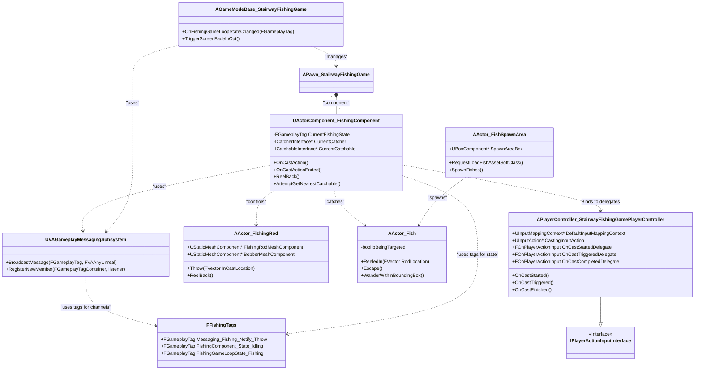
```mermaid
classDiagram
    direction TD
    class APawn_StairwayFishingGame
    class IPlayerActionInputInterface {
        <<Interface>>
    }
    class APlayerController_StairwayFishingGamePlayerController {
        +UInputMappingContext* DefaultInputMappingContext
        +UInputAction* CastingInputAction
        +FOnPlayerActionInput OnCastStartedDelegate
        +FOnPlayerActionInput OnCastTriggeredDelegate
        +FOnPlayerActionInput OnCastCompletedDelegate
        +OnCastStarted()
        +OnCastTriggered()
        +OnCastFinished()
    }

    class UActorComponent_FishingComponent {
        -FGameplayTag CurrentFishingState
        -ICatcherInterface* CurrentCatcher
        -ICatchableInterface* CurrentCatchable
        +OnCastAction()
        +OnCastActionEnded()
        +ReelBack()
        +AttemptGetNearestCatchable()
    }

    class AActor_FishingRod {
        +UStaticMeshComponent* FishingRodMeshComponent
        +UStaticMeshComponent* BobberMeshComponent
        +Throw(FVector InCastLocation)
        +ReelBack()
    }

    class AActor_Fish {
        -bool bBeingTargeted
        +ReeledIn(FVector RodLocation)
        +Escape()
        +WanderWithinBoundingBox()
    }

    class AActor_FishSpawnArea {
        +UBoxComponent* SpawnAreaBox
        +RequestLoadFishAssetSoftClass()
        +SpawnFishes()
    }

    class AGameModeBase_StairwayFishingGame {
        +OnFishingGameLoopStateChanged(FGameplayTag)
        +TriggerScreenFadeInOut()
    }

    class UVAGameplayMessagingSubsystem {
        +BroadcastMessage(FGameplayTag, FVAAnyUnreal)
        +RegisterNewMember(FGameplayTagContainer, listener)
    }

    class FFishingTags {
        +FGameplayTag Messaging_Fishing_Notify_Throw
        +FGameplayTag FishingComponent_State_Idling
        +FGameplayTag FishingGameLoopState_Fishing
    }

    APlayerController_StairwayFishingGamePlayerController --|> IPlayerActionInputInterface
    UActorComponent_FishingComponent ..> APlayerController_StairwayFishingGamePlayerController : Binds to delegates
    APawn_StairwayFishingGame "1" *-- "1" UActorComponent_FishingComponent : "component"
    UActorComponent_FishingComponent ..> AActor_FishingRod : "controls"
    UActorComponent_FishingComponent ..> AActor_Fish : "catches"
    UActorComponent_FishingComponent ..> UVAGameplayMessagingSubsystem : "uses"
    AGameModeBase_StairwayFishingGame ..> UVAGameplayMessagingSubsystem : "uses"
    AActor_FishSpawnArea ..> AActor_Fish : "spawns"
    AGameModeBase_StairwayFishingGame ..> APawn_StairwayFishingGame : "manages"
    UVAGameplayMessagingSubsystem ..> FFishingTags : "uses tags for channels"
    UActorComponent_FishingComponent ..> FFishingTags : "uses tags for state"
```
This diagram illustrates the primary classes and their relationships. The `PlayerController` captures input and invokes delegates that the `FishingComponent` listens to. The `FishingComponent` then drives the behavior of the `FishingRod` and interacts with `Fish` actors, which are spawned by the `FishSpawnArea`. I routed all major state changes and events via the `VAGameplayMessagingSubsystem` using channels defined in `FFishingTags`.

Sources: [Source/FishingFeature/Private/ActorComponent/ActorComponent_FishingComponent.cpp](https://github.com/rezonated/Unreal-Fishing-Test/blob/main/Source/FishingFeature/Private/ActorComponent/ActorComponent_FishingComponent.cpp), [Source/StairwayFishingGameCore/Public/PlayerController/PlayerController_StairwayFishingGamePlayerController.h](https://github.com/rezonated/Unreal-Fishing-Test/blob/main/Source/StairwayFishingGameCore/Public/PlayerController/PlayerController_StairwayFishingGamePlayerController.h), [Source/FishingFeature/Public/Actor/Actor_FishSpawnArea.h](https://github.com/rezonated/Unreal-Fishing-Test/blob/main/Source/FishingFeature/Public/Actor/Actor_FishSpawnArea.h), [Source/VAGameplayMessaging/Private/GameInstanceSubsystem/VAGameplayMessagingSubsystem.cpp](https://github.com/rezonated/Unreal-Fishing-Test/blob/main/Source/VAGameplayMessaging/Private/GameInstanceSubsystem/VAGameplayMessagingSubsystem.cpp), [Source/FishingGameplayTags/Public/FishingTags.h](https://github.com/rezonated/Unreal-Fishing-Test/blob/main/Source/FishingGameplayTags/Public/FishingTags.h)

### Core Gameplay Loop: Casting and Catching

I designed the fishing process as a multi-stage sequence initiated by the player and managed by the `UActorComponent_FishingComponent`. It flows from input capture, through casting and waiting, to finally reeling in a fish.

#### Input Handling

Player input is the entry point for the fishing mechanic. I used the `APlayerController_StairwayFishingGamePlayerController` to bind hardware input to gameplay actions.

1.  On `BeginPlay`, the controller maps the `DefaultInputMappingContext`.
2.  The `CastingInputAction` is bound to three separate trigger events: `Started`, `Triggered`, and `Completed`.
3.  Each event calls a corresponding handler (`OnCastStarted`, `OnCastTriggered`, `OnCastFinished`), which in turn executes a public delegate (`OnCastStartedDelegate`, etc.).
4.  The `UActorComponent_FishingComponent` binds its own functions (`OnCastAction`, `OnCastActionEnded`) to these delegates to initiate and conclude the fishing actions.

Sources: [Source/StairwayFishingGameCore/Private/PlayerController/PlayerController_StairwayFishingGamePlayerController.cpp](https://github.com/rezonated/Unreal-Fishing-Test/blob/main/Source/StairwayFishingGameCore/Private/PlayerController/PlayerController_StairwayFishingGamePlayerController.cpp), [Source/FishingFeature/Private/ActorComponent/ActorComponent_FishingComponent.cpp](https://github.com/rezonated/Unreal-Fishing-Test/blob/main/Source/FishingFeature/Private/ActorComponent/ActorComponent_FishingComponent.cpp)

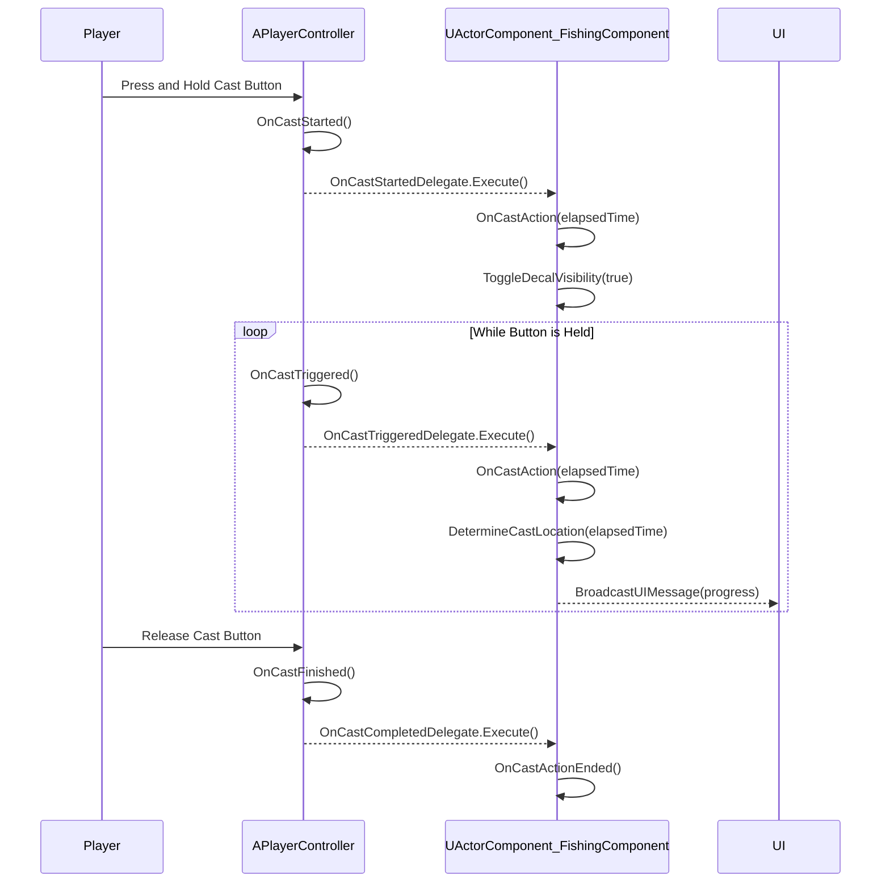
```mermaid
sequenceDiagram
    participant Player
    participant PC as APlayerController
    participant FC as UActorComponent_FishingComponent
    participant UI

    Player->>PC: Press and Hold Cast Button
    PC->>PC: OnCastStarted()
    PC-->>FC: OnCastStartedDelegate.Execute()
    FC->>FC: OnCastAction(elapsedTime)
    FC->>FC: ToggleDecalVisibility(true)
    loop While Button is Held
        PC->>PC: OnCastTriggered()
        PC-->>FC: OnCastTriggeredDelegate.Execute()
        FC->>FC: OnCastAction(elapsedTime)
        FC->>FC: DetermineCastLocation(elapsedTime)
        FC-->>UI: BroadcastUIMessage(progress)
    end
    Player->>PC: Release Cast Button
    PC->>PC: OnCastFinished()
    PC-->>FC: OnCastCompletedDelegate.Execute()
    FC->>FC: OnCastActionEnded()
```
This sequence shows how I translated player input into continuous updates for the casting power and visual feedback, culminating in the final cast action when the input is released.

#### The Fishing Sequence

Once the cast is initiated by `OnCastActionEnded`, a sequence of events involving animations, timelines, and messaging occurs to simulate the fishing process.

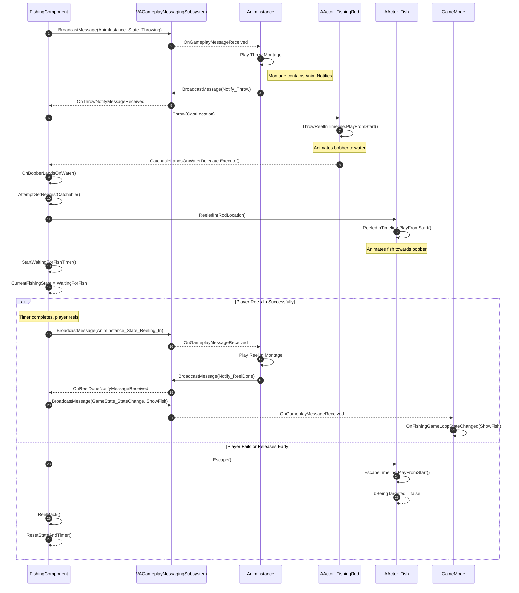
```mermaid
sequenceDiagram
    autonumber
    participant FC as FishingComponent
    participant GMS as VAGameplayMessagingSubsystem
    participant Anim as AnimInstance
    participant Rod as AActor_FishingRod
    participant Fish as AActor_Fish
    participant GM as GameMode

    FC->>GMS: BroadcastMessage(AnimInstance_State_Throwing)
    GMS-->>Anim: OnGameplayMessageReceived
    Anim->>Anim: Play Throw Montage
    Note right of Anim: Montage contains Anim Notifies
    Anim->>GMS: BroadcastMessage(Notify_Throw)
    GMS-->>FC: OnThrowNotifyMessageReceived
    FC->>Rod: Throw(CastLocation)
    Rod->>Rod: ThrowReelInTimeline.PlayFromStart()
    Note over Rod: Animates bobber to water
    Rod-->>FC: CatchableLandsOnWaterDelegate.Execute()
    FC->>FC: OnBobberLandsOnWater()
    FC->>FC: AttemptGetNearestCatchable()
    FC->>Fish: ReeledIn(RodLocation)
    Fish->>Fish: ReeledInTimeline.PlayFromStart()
    Note over Fish: Animates fish towards bobber
    FC->>FC: StartWaitingForFishTimer()
    FC-->>FC: CurrentFishingState = WaitingForFish
    
    alt Player Reels In Successfully
        Note over FC: Timer completes, player reels
        FC->>GMS: BroadcastMessage(AnimInstance_State_Reeling_In)
        GMS-->>Anim: OnGameplayMessageReceived
        Anim->>Anim: Play Reel In Montage
        Anim->>GMS: BroadcastMessage(Notify_ReelDone)
        GMS-->>FC: OnReelDoneNotifyMessageReceived
        FC->>GMS: BroadcastMessage(GameState_StateChange, ShowFish)
        GMS-->>GM: OnGameplayMessageReceived
        GM->>GM: OnFishingGameLoopStateChanged(ShowFish)
    else Player Fails or Releases Early
        FC->>Fish: Escape()
        Fish->>Fish: EscapeTimeline.PlayFromStart()
        Fish-->>Fish: bBeingTargeted = false
        FC->>FC: ReelBack()
        FC-->>FC: ResetStateAndTimer()
    end
```
This diagram details the event-driven flow of the fishing action. The `FishingComponent` initiates state changes by sending messages, which are received by the Animation Instance. The animation, in turn, sends notify messages back at key moments, driving the logic forward without the `FishingComponent` needing to know about animation specifics.

Sources: [Source/FishingFeature/Private/ActorComponent/ActorComponent_FishingComponent.cpp](https://github.com/rezonated/Unreal-Fishing-Test/blob/main/Source/FishingFeature/Private/ActorComponent/ActorComponent_FishingComponent.cpp), [Source/FishingFeature/Private/Actor/Actor_FishingRod.cpp](https://github.com/rezonated/Unreal-Fishing-Test/blob/main/Source/FishingFeature/Private/Actor/Actor_FishingRod.cpp), [Source/FishingFeature/Private/Actor/Actor_Fish.cpp](https://github.com/rezonated/Unreal-Fishing-Test/blob/main/Source/FishingFeature/Private/Actor/Actor_Fish.cpp), [Source/StairwayFishingGameCore/Private/GameModeBase/GameModeBase_StairwayFishingGame.cpp](https://github.com/rezonated/Unreal-Fishing-Test/blob/main/Source/StairwayFishingGameCore/Private/GameModeBase/GameModeBase_StairwayFishingGame.cpp)

### Key Components and Actors

#### `UActorComponent_FishingComponent`

This is the central class of the feature, responsible for managing the entire fishing lifecycle.

| Responsibility | Description |
| :--- | :--- |
| **State Management** | Uses `FGameplayTag` to track the current state (e.g., `Idling`, `Throwing`, `WaitingForFish`). |
| **Input Binding** | Binds to delegates from the `PlayerController` to react to player input. |
| **Actor Spawning** | Asynchronously loads and spawns the `AActor_FishingRod`. |
| **Logic Orchestration** | Calls functions on the `FishingRod` and `Fish` actors at appropriate times. |
| **Event Handling** | Listens for messages (e.g., animation notifies) from the `VAGameplayMessagingSubsystem`. |
| **Physics/Tracing** | Performs line traces to find a valid water surface for casting and sphere traces to find nearby fish. |

I made the component's behavior configurable through `UDataAsset_FishingComponentConfig`, which defines properties like cast range, timing, and socket names for attaching the rod.

Sources: [Source/FishingFeature/Private/ActorComponent/ActorComponent_FishingComponent.cpp](https://github.com/rezonated/Unreal-Fishing-Test/blob/main/Source/FishingFeature/Private/ActorComponent/ActorComponent_FishingComponent.cpp)

#### `AActor_FishingRod`

This actor is the visual representation of the fishing rod and bobber.

-   **Components**: It consists of a `FishingRodMeshComponent` (the rod) and a `BobberMeshComponent`. I attached a `CatchableAttachPoint` to the bobber for holding the fish.
-   **Animation**: It does not use skeletal animation. Instead, I used `FTimeline` objects driven by `UCurveFloat` assets to interpolate the bobber's position when `Throw()` and `ReelBack()` are called. This provides a simple procedural animation.

Sources: [Source/FishingFeature/Private/Actor/Actor_FishingRod.cpp](https://github.com/rezonated/Unreal-Fishing-Test/blob/main/Source/FishingFeature/Private/Actor/Actor_FishingRod.cpp)

#### `AActor_Fish`

Represents a single fish that can be caught.

-   **AI Behavior**: When not targeted, the fish performs a simple `WanderWithinBoundingBox` behavior, moving towards random points within the confines of its `AActor_FishSpawnArea`.
-   **State**: A boolean `bBeingTargeted` flag controls whether the fish is wandering or being interacted with.
-   **Interaction**: Implements the `ICatchableInterface`. The `ReeledIn` function triggers a timeline to move the fish towards the bobber. The `Escape` function triggers a different timeline to return it to its initial location.

Sources: [Source/FishingFeature/Private/Actor/Actor_Fish.cpp](https://github.com/rezonated/Unreal-Fishing-Test/blob/main/Source/FishingFeature/Private/Actor/Actor_Fish.cpp)

#### `AActor_FishSpawnArea`

This actor defines a volume in the world where fish can be spawned and exist.

-   **Spawning Logic**: On `BeginPlay`, it asynchronously requests to load the fish actor's class from a `TSoftClassPtr` defined in its config data asset.
-   **Async Loading**: I used `UAssetManager::GetStreamableManager().RequestAsyncLoad` to prevent hitches from loading the fish asset.
-   **Volume**: Once the asset is loaded, it spawns a configured number of fish at random locations within its `UBoxComponent` bounds. It also passes its bounds to each fish so they know the area within which they can wander.

Sources: [Source/FishingFeature/Private/Actor/Actor_FishSpawnArea.cpp](https://github.com/rezonated/Unreal-Fishing-Test/blob/main/Source/FishingFeature/Private/Actor/Actor_FishSpawnArea.cpp)

### State and Event Management

I relied on a decoupled messaging system and gameplay tags for managing state and communication.

#### Gameplay Tags (`FFishingTags`)

I created a central singleton class, `FFishingTags`, to define all gameplay tags used by the system. This prevents errors from typos and provides a single source of truth for all tags.

| Tag Category | Example | Purpose |
| :--- | :--- | :--- |
| **Messaging Channel** | `Messaging.Fishing.Notify.Throw` | Used as a channel ID for broadcasting and listening to events. |
| **Anim Instance State** | `AnimInstance.Fishing.State.Throwing` | Sent to the Animation Blueprint to trigger a specific animation state. |
| **Component State** | `FishingComponent.State.WaitingForFish` | Used internally by `FishingComponent` to manage its state machine. |
| **Game Loop State** | `FishingGameLoopState.ShowFish` | A high-level state managed by the Game Mode. |

Sources: [Source/FishingGameplayTags/Public/FishingTags.h](https://github.com/rezonated/Unreal-Fishing-Test/blob/main/Source/FishingGameplayTags/Public/FishingTags.h)

#### Game Mode State Transitions

The `AGameModeBase_StairwayFishingGame` handles high-level game states that affect the entire experience, such as switching between active gameplay and a cinematic view of a caught fish.

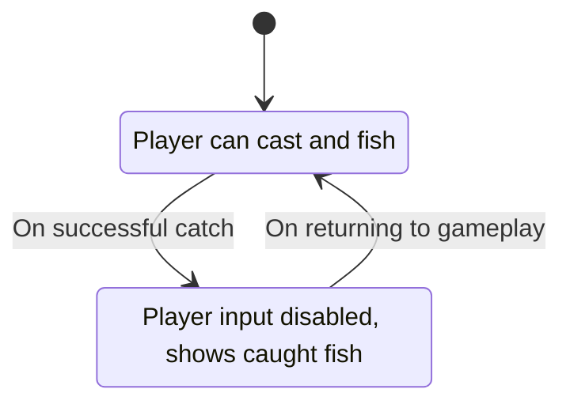
```mermaid
stateDiagram-v2
    [*] --> Fishing
    Fishing: Player can cast and fish
    ShowFish: Player input disabled, shows caught fish

    Fishing --> ShowFish: On successful catch
    ShowFish --> Fishing: On returning to gameplay
```
This state transition is handled in `OnFishingGameLoopStateChanged`. When the state changes, this function:
1.  Toggles player input between `FInputModeGameOnly` and `FInputModeUIOnly`.
2.  Initiates a camera fade-out.
3.  Switches the active camera on the pawn (which implements `ISwitchableFishingViewInterface`).
4.  Broadcasts a `Messaging_GameMode_StateChangeFinish` message.
5.  Initiates a camera fade-in.

Sources: [Source/StairwayFishingGameCore/Private/GameModeBase/GameModeBase_StairwayFishingGame.cpp](https://github.com/rezonated/Unreal-Fishing-Test/blob/main/Source/StairwayFishingGameCore/Private/GameModeBase/GameModeBase_StairwayFishingGame.cpp), [Source/StairwayFishingGameCore/Private/Pawn/Pawn_StairwayFishingGame.cpp](https://github.com/rezonated/Unreal-Fishing-Test/blob/main/Source/StairwayFishingGameCore/Private/Pawn/Pawn_StairwayFishingGame.cpp)

### Conclusion

I built this fishing system to be modular and component-based. I focused on decoupling the messaging system for communication. The data-driven configuration via `UDataAsset`s allows me to tweak and balance the gameplay without code changes. I separated concerns—input handling in the `PlayerController`, core logic in the `ActorComponent`, and visual representation in various `Actor` classes—to keep the system maintainable.

---

### Getting Started

#### Related Pages


> **Relevant source files**
>
> - [Source/StairwayFishingGameCore/Private/GameModeBase/GameModeBase_StairwayFishingGame.cpp](https://github.com/rezonated/Unreal-Fishing-Test/blob/main/Source/StairwayFishingGameCore/Private/GameModeBase/GameModeBase_StairwayFishingGame.cpp)
> - [Source/FishingFeature/Private/Actor/Actor_FishSpawnArea.cpp](https://github.com/rezonated/Unreal-Fishing-Test/blob/main/Source/FishingFeature/Private/Actor/Actor_FishSpawnArea.cpp)
> - [Source/FishingFeature/Private/ActorComponent/ActorComponent_FishingComponent.cpp](https://github.com/rezonated/Unreal-Fishing-Test/blob/main/Source/FishingFeature/Private/ActorComponent/ActorComponent_FishingComponent.cpp)
> - [Source/FishingFeature/Private/Actor/Actor_FishingRod.cpp](https://github.com/rezonated/Unreal-Fishing-Test/blob/main/Source/FishingFeature/Private/Actor/Actor_FishingRod.cpp)
> - [Source/StairwayFishingGameCore/Private/PlayerController/PlayerController_StairwayFishingGamePlayerController.cpp](https://github.com/rezonated/Unreal-Fishing-Test/blob/main/Source/StairwayFishingGameCore/Private/PlayerController/PlayerController_StairwayFishingGamePlayerController.cpp)
> - [Source/StairwayFishingGameCore/Private/Pawn/Pawn_StairwayFishingGame.cpp](https://github.com/rezonated/Unreal-Fishing-Test/blob/main/Source/StairwayFishingGameCore/Private/Pawn/Pawn_StairwayFishingGame.cpp)
> - [Source/FishingFeature/Private/Actor/Actor_Fish.cpp](https://github.com/rezonated/Unreal-Fishing-Test/blob/main/Source/FishingFeature/Private/Actor/Actor_Fish.cpp)
> - [Source/VAGameplayMessaging/Private/GameInstanceSubsystem/VAGameplayMessagingSubsystem.cpp](https://github.com/rezonated/Unreal-Fishing-Test/blob/main/Source/VAGameplayMessaging/Private/GameInstanceSubsystem/VAGameplayMessagingSubsystem.cpp)
> - [Source/FishingGameplayTags/Public/FishingTags.h](https://github.com/rezonated/Unreal-Fishing-Test/blob/main/Source/FishingGameplayTags/Public/FishingTags.h)
> - [Source/FishingFeatureEditor/Private/DetailCustomization/DetailCustomization_FishingComponent.cpp](https://github.com/rezonated/Unreal-Fishing-Test/blob/main/Source/FishingFeatureEditor/Private/DetailCustomization/DetailCustomization_FishingComponent.cpp)

## Getting Started

Here is a technical overview of the fishing gameplay system I created for the Unreal-Fishing-Test project. I designed the system as a self-contained feature to handle all aspects of fishing, from casting a line to catching a fish. I built it upon several core components, a data-driven configuration approach using Data Assets, and a decoupled messaging system for communication between different parts of the game. I encapsulated the core logic within an Actor Component, making it portable and easy to attach to any player character.

My architecture emphasizes separation of concerns: player input, fishing logic, actor behaviors (fish, fishing rod), and game state transitions are all handled by distinct classes. I facilitated communication via the `VAGameplayMessagingSubsystem`, which uses `FGameplayTag` as channels to broadcast and listen for events, avoiding hard references between components. This guide details the key components, the overall gameplay flow, the state management system, and the configuration options I made available.

### Core Architecture and Components

I composed the fishing system of several key classes that work together to create the full gameplay experience. The main components are the Player Pawn, the Fishing Component, the Fishing Rod, the Fish, and the Fish Spawn Area.

Sources: [Source/StairwayFishingGameCore/Private/Pawn/Pawn_StairwayFishingGame.cpp](https://github.com/rezonated/Unreal-Fishing-Test/blob/main/Source/StairwayFishingGameCore/Private/Pawn/Pawn_StairwayFishingGame.cpp), [Source/FishingFeature/Private/ActorComponent/ActorComponent_FishingComponent.cpp](https://github.com/rezonated/Unreal-Fishing-Test/blob/main/Source/FishingFeature/Private/ActorComponent/ActorComponent_FishingComponent.cpp), [Source/FishingFeature/Private/Actor/Actor_FishingRod.cpp](https://github.com/rezonated/Unreal-Fishing-Test/blob/main/Source/FishingFeature/Private/Actor/Actor_FishingRod.cpp), [Source/FishingFeature/Private/Actor/Actor_Fish.cpp](https://github.com/rezonated/Unreal-Fishing-Test/blob/main/Source/FishingFeature/Private/Actor/Actor_Fish.cpp), [Source/FishingFeature/Private/Actor/Actor_FishSpawnArea.cpp](https://github.com/rezonated/Unreal-Fishing-Test/blob/main/Source/FishingFeature/Private/Actor/Actor_FishSpawnArea.cpp)

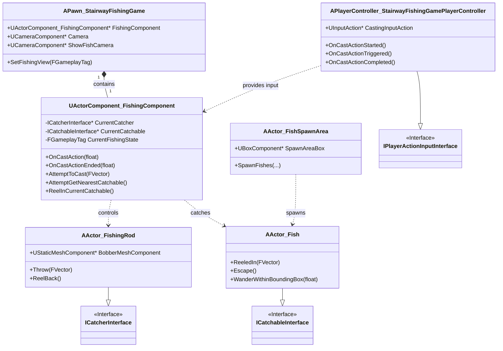
```mermaid
classDiagram
    direction TD

    class APawn_StairwayFishingGame {
        +UActorComponent_FishingComponent* FishingComponent
        +UCameraComponent* Camera
        +UCameraComponent* ShowFishCamera
        +SetFishingView(FGameplayTag)
    }

    class UActorComponent_FishingComponent {
        -ICatcherInterface* CurrentCatcher
        -ICatchableInterface* CurrentCatchable
        -FGameplayTag CurrentFishingState
        +OnCastAction(float)
        +OnCastActionEnded(float)
        +AttemptToCast(FVector)
        +AttemptGetNearestCatchable()
        +ReelInCurrentCatchable()
    }

    class ICatcherInterface {
        <<Interface>>
    }
    class AActor_FishingRod {
        +UStaticMeshComponent* BobberMeshComponent
        +Throw(FVector)
        +ReelBack()
    }

    class ICatchableInterface {
        <<Interface>>
    }
    class AActor_Fish {
        +ReeledIn(FVector)
        +Escape()
        +WanderWithinBoundingBox(float)
    }

    class AActor_FishSpawnArea {
        +UBoxComponent* SpawnAreaBox
        +SpawnFishes(...)
    }

    class IPlayerActionInputInterface {
        <<Interface>>
    }
    class APlayerController_StairwayFishingGamePlayerController {
        +UInputAction* CastingInputAction
        +OnCastActionStarted()
        +OnCastActionTriggered()
        +OnCastActionCompleted()
    }

    APawn_StairwayFishingGame "1" *-- "1" UActorComponent_FishingComponent : contains
    APlayerController_StairwayFishingGamePlayerController ..> UActorComponent_FishingComponent : provides input
    UActorComponent_FishingComponent ..> AActor_FishingRod : controls
    UActorComponent_FishingComponent ..> AActor_Fish : catches
    AActor_FishSpawnArea ..> AActor_Fish : spawns
    AActor_FishingRod --|> ICatcherInterface
    AActor_Fish --|> ICatchableInterface
    APlayerController_StairwayFishingGamePlayerController --|> IPlayerActionInputInterface
```
This diagram illustrates the primary classes and their relationships within the fishing system.

Sources: [Source/StairwayFishingGameCore/Public/PlayerController/PlayerController_StairwayFishingGamePlayerController.h](https://github.com/rezonated/Unreal-Fishing-Test/blob/main/Source/StairwayFishingGameCore/Public/PlayerController/PlayerController_StairwayFishingGamePlayerController.h), [Source/StairwayFishingGameCore/Private/Pawn/Pawn_StairwayFishingGame.cpp](https://github.com/rezonated/Unreal-Fishing-Test/blob/main/Source/StairwayFishingGameCore/Private/Pawn/Pawn_StairwayFishingGame.cpp), [Source/FishingFeature/Private/ActorComponent/ActorComponent_FishingComponent.cpp](https://github.com/rezonated/Unreal-Fishing-Test/blob/main/Source/FishingFeature/Private/ActorComponent/ActorComponent_FishingComponent.cpp), [Source/FishingFeature/Public/Actor/Actor_FishSpawnArea.h](https://github.com/rezonated/Unreal-Fishing-Test/blob/main/Source/FishingFeature/Public/Actor/Actor_FishSpawnArea.h)

#### Key Components

| Component                                                          | Description                                                                                                                                                                                               | Source File                                                                                                                                      |
| ------------------------------------------------------------------ | --------------------------------------------------------------------------------------------------------------------------------------------------------------------------------------------------------- | ------------------------------------------------------------------------------------------------------------------------------------------------ |
| `APawn_StairwayFishingGame`                                        | The player character pawn. It hosts the `UActorComponent_FishingComponent` and manages the active camera between the main gameplay view and the "show fish" view.                                           | `Pawn/Pawn_StairwayFishingGame.h`                                                                                                                |
| `UActorComponent_FishingComponent`                                 | The central logic hub for the fishing mechanic. It manages states, handles player input for casting, detects catchable fish, and controls the fishing rod and caught fish.                                   | `ActorComponent/ActorComponent_FishingComponent.h`                                                                                               |
| `APlayerController_StairwayFishingGamePlayerController`            | Implements `IPlayerActionInputInterface` to handle raw input from Unreal's Enhanced Input system. It binds the `CastingInputAction` and broadcasts delegates for `Started`, `Triggered`, and `Completed` events. | `PlayerController/PlayerController_StairwayFishingGamePlayerController.h`                                                                        |
| `AActor_FishSpawnArea`                                             | An actor responsible for spawning `AActor_Fish` instances within a defined `UBoxComponent` volume at the start of the game. It asynchronously loads the fish asset before spawning.                         | `Actor/Actor_FishSpawnArea.h`                                                                                                                    |
| `AActor_Fish`                                                      | Represents a catchable fish. It implements the `ICatchableInterface`, manages its own wandering movement within its spawn area, and handles being reeled in or escaping.                                      | `Actor/Actor_Fish.h`                                                                                                                             |
| `AActor_FishingRod`                                                | The visual representation of the fishing rod and bobber. It implements the `ICatcherInterface` and uses timelines to animate the bobber being thrown and reeled back.                                         | `Actor/Actor_FishingRod.h`                                                                                                                       |
| `AGameModeBase_StairwayFishingGame`                                | Manages the high-level game loop state transitions. It listens for state change requests and orchestrates screen fades and player input mode changes between "fishing" and "show fish" states.                | `GameModeBase/GameModeBase_StairwayFishingGame.h`                                                                                                |

### Gameplay Flow

The fishing process follows a sequence of events, from game initialization to catching a fish. This flow is managed by the core components and driven by player input and a messaging system.

#### Initialization and Fish Spawning

When the level starts, the `AActor_FishSpawnArea` is responsible for populating the water with fish.

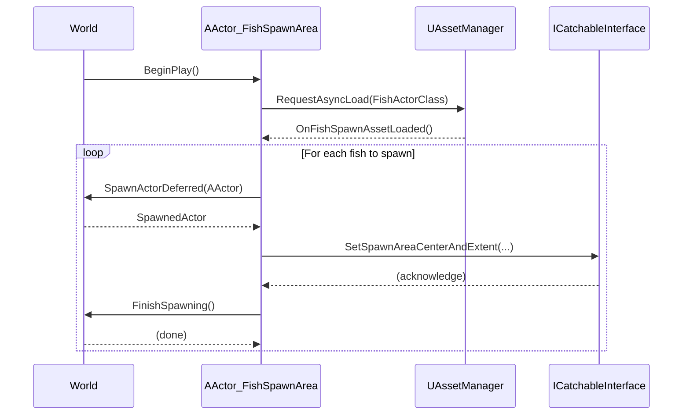
```mermaid
sequenceDiagram
    participant World
    participant AActor_FishSpawnArea
    participant UAssetManager
    participant ICatchableInterface

    World->>AActor_FishSpawnArea: BeginPlay()
    AActor_FishSpawnArea->>UAssetManager: RequestAsyncLoad(FishActorClass)
    UAssetManager-->>AActor_FishSpawnArea: OnFishSpawnAssetLoaded()
    loop For each fish to spawn
        AActor_FishSpawnArea->>World: SpawnActorDeferred(AActor)
        World-->>AActor_FishSpawnArea: SpawnedActor
        AActor_FishSpawnArea->>ICatchableInterface: SetSpawnAreaCenterAndExtent(...)
        ICatchableInterface-->>AActor_FishSpawnArea: (acknowledge)
        AActor_FishSpawnArea->>World: FinishSpawning()
        World-->>AActor_FishSpawnArea: (done)
    end

```
This sequence shows the asynchronous loading and subsequent spawning of fish actors within the defined spawn area. The spawn area provides its bounds to each fish so they can wander within it.

Sources: [Source/FishingFeature/Private/Actor/Actor_FishSpawnArea.cpp](https://github.com/rezonated/Unreal-Fishing-Test/blob/main/Source/FishingFeature/Private/Actor/Actor_FishSpawnArea.cpp)

#### The Casting Process

The casting process begins when the player presses and holds the cast input action. The duration of the hold determines the casting distance.

1.  **Input Handling**: The `APlayerController_StairwayFishingGamePlayerController` captures the `Started`, `Triggered`, and `Completed` events from the `CastingInputAction`. These events are broadcast via delegates.
2.  **Casting Logic**: The `UActorComponent_FishingComponent` listens to these delegates.
    *   On `Started`, it begins tracking the cast time and shows a target decal on the water.
    *   While `Triggered` (held down), it continuously updates the cast location based on the elapsed time, mapping it to a min/max distance. A line trace from the calculated position downwards determines the final water surface location.
    *   On `Completed` (released), it triggers the throwing animation and instructs the `AActor_FishingRod` to throw its bobber.

Sources: [Source/StairwayFishingGameCore/Private/PlayerController/PlayerController_StairwayFishingGamePlayerController.cpp](https://github.com/rezonated/Unreal-Fishing-Test/blob/main/Source/StairwayFishingGameCore/Private/PlayerController/PlayerController_StairwayFishingGamePlayerController.cpp), [Source/FishingFeature/Private/ActorComponent/ActorComponent_FishingComponent.cpp](https://github.com/rezonated/Unreal-Fishing-Test/blob/main/Source/FishingFeature/Private/ActorComponent/ActorComponent_FishingComponent.cpp)

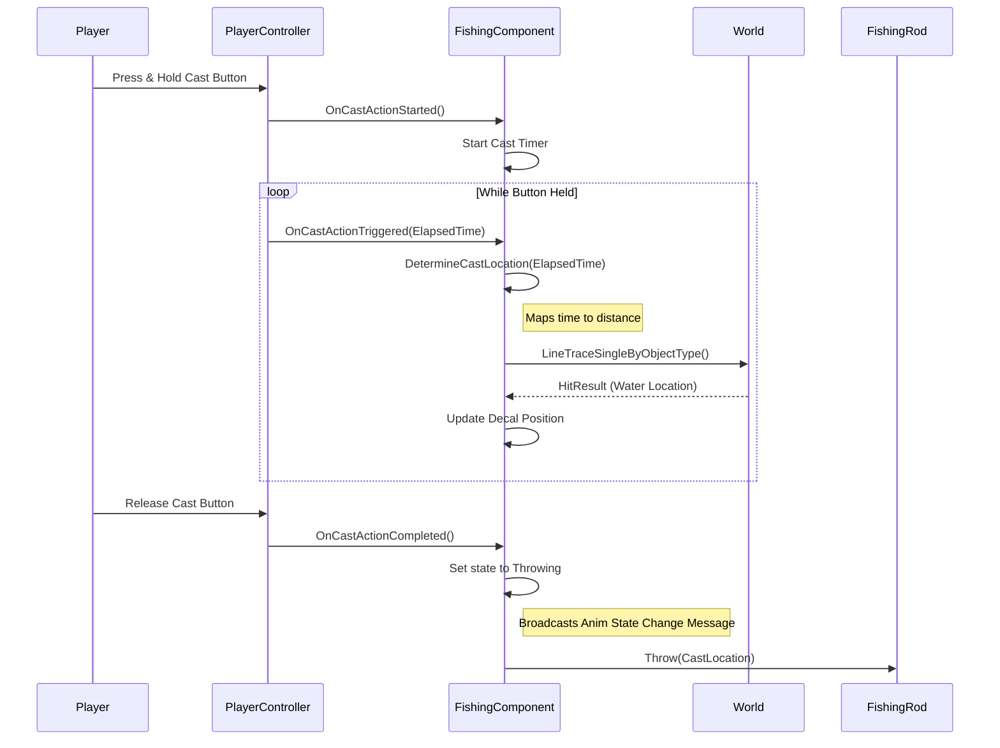
```mermaid
sequenceDiagram
    participant Player
    participant PlayerController
    participant FishingComponent
    participant World
    participant FishingRod

    Player->>PlayerController: Press & Hold Cast Button
    PlayerController->>FishingComponent: OnCastActionStarted()
    FishingComponent->>FishingComponent: Start Cast Timer
    loop While Button Held
        PlayerController->>FishingComponent: OnCastActionTriggered(ElapsedTime)
        FishingComponent->>FishingComponent: DetermineCastLocation(ElapsedTime)
        Note right of FishingComponent: Maps time to distance
        FishingComponent->>World: LineTraceSingleByObjectType()
        World-->>FishingComponent: HitResult (Water Location)
        FishingComponent->>FishingComponent: Update Decal Position
    end
    Player->>PlayerController: Release Cast Button
    PlayerController->>FishingComponent: OnCastActionCompleted()
    FishingComponent->>FishingComponent: Set state to Throwing
    Note right of FishingComponent: Broadcasts Anim State Change Message
    FishingComponent->>FishingRod: Throw(CastLocation)
```
This diagram details the flow from player input to the bobber being cast into the water.

Sources: [Source/FishingFeature/Private/ActorComponent/ActorComponent_FishingComponent.cpp](https://github.com/rezonated/Unreal-Fishing-Test/blob/main/Source/FishingFeature/Private/ActorComponent/ActorComponent_FishingComponent.cpp), [Source/FishingFeature/Private/Actor/Actor_FishingRod.cpp](https://github.com/rezonated/Unreal-Fishing-Test/blob/main/Source/FishingFeature/Private/Actor/Actor_FishingRod.cpp)

#### Catching a Fish

Once the bobber lands in the water, the `FishingComponent` attempts to find a nearby fish.

1.  **Bobber Lands**: The `AActor_FishingRod` notifies the `FishingComponent` via a delegate (`OnLandsOnWater`) when its throwing timeline is complete.
2.  **Find Catchable**: The `FishingComponent` performs a sphere trace around the bobber's location to find all actors implementing `ICatchableInterface`. It sorts these actors by distance and selects the nearest one as `CurrentCatchable`.
3.  **Luring the Fish**: The `FishingComponent` calls `ReeledIn()` on the `CurrentCatchable` (`AActor_Fish`). The fish then uses a timeline to move from its current position to the bobber's location.
4.  **Waiting State**: The `FishingComponent` enters the `WaitingForFish` state and starts a timer (`TimeToFish`). If the player does not act before this timer runs out, the fish escapes.
5.  **Reeling In**: If the player presses the cast button again while in the `WaitingForFish` state, the catch is successful. The component transitions to the `Reeling_In` state, and a message is sent to the animation system to play the reeling animation.

Sources: [Source/FishingFeature/Private/ActorComponent/ActorComponent_FishingComponent.cpp](https://github.com/rezonated/Unreal-Fishing-Test/blob/main/Source/FishingFeature/Private/ActorComponent/ActorComponent_FishingComponent.cpp), [Source/FishingFeature/Private/Actor/Actor_Fish.cpp](https://github.com/rezonated/Unreal-Fishing-Test/blob/main/Source/FishingFeature/Private/Actor/Actor_Fish.cpp)

### State Management and Messaging

I relied on Gameplay Tags for both internal state management and for communication via a global messaging subsystem.

#### Component State Machine

The `UActorComponent_FishingComponent` uses a set of `FGameplayTag` variables to manage its internal state, ensuring operations occur in the correct sequence.

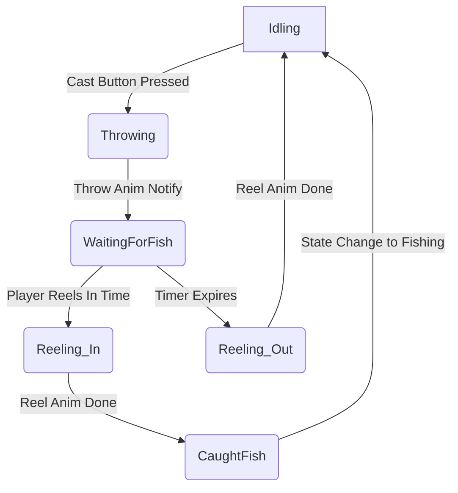
```mermaid
graph TD
    A[Idling] -->|Cast Button Pressed| B(Throwing);
    B -->|Throw Anim Notify| C(WaitingForFish);
    C -->|Player Reels In Time| D(Reeling_In);
    C -->|Timer Expires| E(Reeling_Out);
    E -->|Reel Anim Done| A;
    D -->|Reel Anim Done| F(CaughtFish);
    F -->|State Change to Fishing| A;
```
This state diagram shows the primary states of the `FishingComponent` and the transitions between them.

Sources: [Source/FishingGameplayTags/Private/FishingTags.cpp](https://github.com/rezonated/Unreal-Fishing-Test/blob/main/Source/FishingGameplayTags/Private/FishingTags.cpp), [Source/FishingFeature/Private/ActorComponent/ActorComponent_FishingComponent.cpp](https://github.com/rezonated/Unreal-Fishing-Test/blob/main/Source/FishingFeature/Private/ActorComponent/ActorComponent_FishingComponent.cpp)

#### Messaging System

I achieved decoupled communication using `UVAGameplayMessagingSubsystem`. Components can broadcast messages on specific `FGameplayTag` channels, and other components can create listeners for those channels without needing direct references.

**Key Messaging Channels:**

| Channel Tag                               | Payload Type  | Description                                                                                                                                     |
| ----------------------------------------- | ------------- | ----------------------------------------------------------------------------------------------------------------------------------------------- |
| `Messaging.Fishing.UI.Cast.Update`        | `float`       | Broadcasts the current charge of the cast (0.0 to 1.0) for UI elements like a power bar.                                                          |
| `Messaging.Fishing.AnimInstance.StateChange` | `FGameplayTag`| Sent to the Animation Blueprint to switch between animation states (e.g., `Idling`, `Throwing`, `Reeling_In`).                                     |
| `Messaging.GameState.StateChange`         | `FGameplayTag`| Broadcast when a high-level game state change is required, such as from `Fishing` to `ShowFish`. This is received by the `GameState`.               |
| `Messaging.GameMode.StateChange.Finish`   | `FGameplayTag`| Broadcast by the `GameMode` after its state transition (including screen fade) is complete. The `FishingComponent` listens for this to finalize the catch. |
| `Messaging.Fishing.Notify.Throw`          | Empty         | An animation notify that signals the exact moment in an animation the bobber should be thrown. The `FishingComponent` listens for this.             |
| `Messaging.Fishing.Notify.ReelDone`       | Empty         | An animation notify that signals the reeling animation has finished.                                                                            |

Sources: [Source/FishingGameplayTags/Private/FishingTags.cpp](https://github.com/rezonated/Unreal-Fishing-Test/blob/main/Source/FishingGameplayTags/Private/FishingTags.cpp), [Source/VAGameplayMessaging/Private/GameInstanceSubsystem/VAGameplayMessagingSubsystem.cpp](https://github.com/rezonated/Unreal-Fishing-Test/blob/main/Source/VAGameplayMessaging/Private/GameInstanceSubsystem/VAGameplayMessagingSubsystem.cpp), [Source/FishingFeature/Private/ActorComponent/ActorComponent_FishingComponent.cpp](https://github.com/rezonated/Unreal-Fishing-Test/blob/main/Source/FishingFeature/Private/ActorComponent/ActorComponent_FishingComponent.cpp)

The `VAGameplayMessagingSubsystem` uses a `TMap<FGameplayTag, FChannelMembersData>` to keep track of all active listeners for each channel. When a message is broadcast, it looks up the channel tag in the map and iterates through the list of listeners, invoking their `OnGameplayMessageReceived` delegate.

Sources: [Source/VAGameplayMessaging/Private/GameInstanceSubsystem/VAGameplayMessagingSubsystem.cpp](https://github.com/rezonated/Unreal-Fishing-Test/blob/main/Source/VAGameplayMessaging/Private/GameInstanceSubsystem/VAGameplayMessagingSubsystem.cpp)

### Configuration via Data Assets

I made the fishing system configurable through the use of `UDataAsset`. This allows me to tweak gameplay parameters without modifying code.

-   **`DataAsset_FishingComponentConfig`**: Configures the core fishing mechanics.
    -   `MaximumTimeToCast`: How long the player can hold the button to charge a cast.
    -   `MinimumCastDistance` / `MaximumCastDistance`: The range of the cast distance.
    -   `CastRadius`: The radius of the sphere trace used to find fish.
    -   `TimeToFish`: The window of time the player has to reel in a fish after it bites.
    -   `FishingRodActorClass`: A soft reference to the `AActor_FishingRod` blueprint to spawn.
-   **`DataAsset_ActorFishConfig`**: Configures the behavior of an individual fish.
    -   `FishRotationSpeed` / `FishMoveSpeed`: Controls the speed of the fish's wandering movement.
    -   `FishReelingInCurve`: A `UCurveFloat` that defines the fish's movement as it's lured to the bobber.
    -   `FishBiteSound`: The sound to play when the fish is successfully caught.
-   **`DataAsset_FishSpawnAreaConfig`**: Configures the fish spawning logic.
    -   `FishActorClass`: A soft reference to the `AActor_Fish` blueprint to spawn.
    -   `FishSpawnAmount`: The number of fish to spawn in the area.
-   **`DataAsset_FishingRodConfig`**: Configures the fishing rod's animations.
    -   `BobberReelInCurve`: A `UCurveFloat` defining the bobber's trajectory when thrown.
    -   `BobberReelOutCurve`: A `UCurveFloat` defining the bobber's movement when reeled back.

### Editor Enhancements

To improve the workflow, I implemented a custom details panel customization for the `UActorComponent_FishingComponent`.

The `FDetailCustomization_FishingComponent` class provides a dropdown menu for selecting socket names (`FishingPoleSocketName`, `CarryFishSocketName`) in the editor. Instead of requiring me to manually type in socket names, this customization inspects the `OwnerSkeletalMesh` property within the component's configuration. It then populates a `SComboBox` with all available bone and socket names from that mesh, preventing typos and making setup faster. The dropdown is automatically updated whenever the assigned `SkeletalMesh` is changed.

Sources: [Source/FishingFeatureEditor/Private/DetailCustomization/DetailCustomization_FishingComponent.cpp](https://github.com/rezonated/Unreal-Fishing-Test/blob/main/Source/FishingFeatureEditor/Private/DetailCustomization/DetailCustomization_FishingComponent.cpp)

---

### Module Overview

#### Related Pages


> **Relevant source files**
>> - [Source/StairwayFishingGameCore/Private/GameModeBase/GameModeBase_StairwayFishingGame.cpp](https://github.com/rezonated/Unreal-Fishing-Test/blob/main/Source/StairwayFishingGameCore/Private/GameModeBase/GameModeBase_StairwayFishingGame.cpp)
> - [Source/FishingFeature/Private/ActorComponent/ActorComponent_FishingComponent.cpp](https://github.com/rezonated/Unreal-Fishing-Test/blob/main/Source/FishingFeature/Private/ActorComponent/ActorComponent_FishingComponent.cpp)
> - [Source/VAGameplayMessaging/Private/GameInstanceSubsystem/VAGameplayMessagingSubsystem.cpp](https://github.com/rezonated/Unreal-Fishing-Test/blob/main/Source/VAGameplayMessaging/Private/GameInstanceSubsystem/VAGameplayMessagingSubsystem.cpp)
> - [Source/StairwayFishingGameCore/Private/GameStateBase/GameStateBase_StairwayFishingGame.cpp](https://github.com/rezonated/Unreal-Fishing-Test/blob/main/Source/StairwayFishingGameCore/Private/GameStateBase/GameStateBase_StairwayFishingGame.cpp)
> - [Source/StairwayFishingGameCore/Private/PlayerController/PlayerController_StairwayFishingGamePlayerController.cpp](https://github.com/rezonated/Unreal-Fishing-Test/blob/main/Source/StairwayFishingGameCore/Private/PlayerController/PlayerController_StairwayFishingGamePlayerController.cpp)
> - [Source/FishingGameplayTags/Public/FishingTags.h](https://github.com/rezonated/Unreal-Fishing-Test/blob/main/Source/FishingGameplayTags/Public/FishingTags.h)
> - [Source/FishingFeature/Private/Actor/Actor_Fish.cpp](https://github.com/rezonated/Unreal-Fishing-Test/blob/main/Source/FishingFeature/Private/Actor/Actor_Fish.cpp)
> - [Source/FishingFeature/Private/Actor/Actor_FishingRod.cpp](https://github.com/rezonated/Unreal-Fishing-Test/blob/main/Source/FishingFeature/Private/Actor/Actor_FishingRod.cpp)
> - [Source/StairwayFishingGameCore/Private/Pawn/Pawn_StairwayFishingGame.cpp](https://github.com/rezonated/Unreal-Fishing-Test/blob/main/Source/StairwayFishingGameCore/Private/Pawn/Pawn_StairwayFishingGame.cpp)
> - [Source/FishingFeatureEditor/Private/DetailCustomization/DetailCustomization_FishingComponent.cpp](https://github.com/rezonated/Unreal-Fishing-Test/blob/main/Source/FishingFeatureEditor/Private/DetailCustomization/DetailCustomization_FishingComponent.cpp)

## Module Overview

Here is a technical overview of the Unreal-Fishing-Test project, a modular fishing game system I built in Unreal Engine. I designed the architecture to be event-driven and decoupled, separating the core gameplay logic, the fishing feature itself, and the messaging system into distinct modules. This separation facilitates maintenance, testing, and potential expansion of features.

The system's backbone is a custom gameplay messaging subsystem, `VAGameplayMessagingSubsystem`, which uses `FGameplayTag` channels for communication. This allows various components, such as the `PlayerController`, `FishingComponent`, and `GameMode`, to interact without direct dependencies. I managed the core gameplay loop through a state machine implemented across the `GameState` and `GameMode`, transitioning the player between fishing and displaying the catch.

### Core Modules

I structured the project into several key modules, each with a specific responsibility.

| Module                    | Responsibility                                                                                                     |
| ------------------------- | ------------------------------------------------------------------------------------------------------------------ |
| `StairwayFishingGameCore` | Manages the main game loop, player pawn, controller, game mode, and game state.                                    |
| `FishingFeature`          | Contains all logic and assets for the fishing mechanic, including the fishing component, rod, fish, and spawn areas. |
| `VAGameplayMessaging`     | Provides a global, event-driven messaging system for decoupled communication between modules.                      |
| `FishingGameplayTags`     | Defines and registers all `FGameplayTag` constants used for messaging and state management.                        |
| `FishingFeatureEditor`    | Implements Unreal Editor customizations to improve the development workflow, such as custom details panels.        |

#### Module Dependency Diagram

The following diagram illustrates the dependencies between the primary modules. The core game logic depends on the fishing feature and the messaging system, while the feature itself also relies on messaging to communicate events.

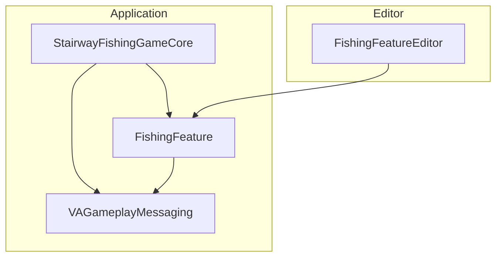
```mermaid
graph TD
    subgraph Application
        StairwayFishingGameCore
        FishingFeature
        VAGameplayMessaging
    end

    subgraph Editor
        FishingFeatureEditor
    end

    StairwayFishingGameCore --> FishingFeature
    StairwayFishingGameCore --> VAGameplayMessaging
    FishingFeature --> VAGameplayMessaging
    FishingFeatureEditor --> FishingFeature
```

### Gameplay Flow and State Management

I managed the primary gameplay loop using a state machine pattern distributed between `AGameStateBase_StairwayFishingGame` and `AGameModeBase_StairwayFishingGame`.

#### State Management

-   **`AGameStateBase_StairwayFishingGame`**: This class is responsible for maintaining the current state of the game loop, stored in the `CurrentFishingGameLoopState` property. It listens for state change requests on the `Messaging_GameState_StateChange` channel. When a new state is received, it updates its internal state and broadcasts the change via its `OnFishingGameLoopStateChanged` delegate.
-   **`AGameModeBase_StairwayFishingGame`**: The game mode listens to the `GameState`'s `OnFishingGameLoopStateChanged` delegate. Upon a state change, it orchestrates the necessary transitions, such as triggering camera fades, changing player input modes (e.g., from `FInputModeGameOnly` to `FInputModeUIOnly`), and instructing the player pawn to switch cameras via the `ISwitchableFishingViewInterface`.

#### Gameplay Sequence Diagram

This diagram illustrates the complete sequence of events from casting the line to catching a fish and transitioning to the "Show Fish" view.

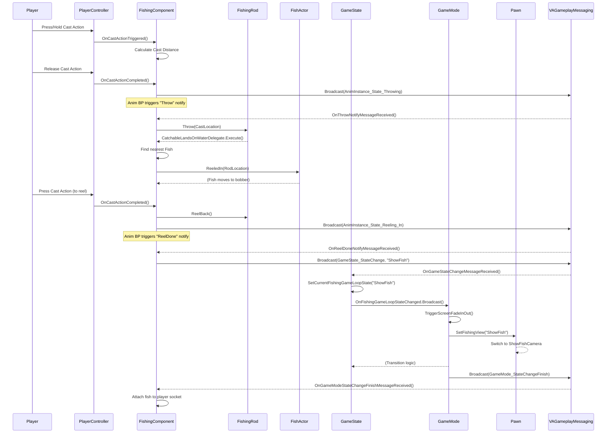
```mermaid
sequenceDiagram
    participant Player
    participant PC as PlayerController
    participant FC as FishingComponent
    participant FR as FishingRod
    participant Fish as FishActor
    participant GS as GameState
    participant GM as GameMode
    participant Pawn
    participant VAGameplayMessaging

    Player->>PC: Press/Hold Cast Action
    PC->>FC: OnCastActionTriggered()
    FC->>FC: Calculate Cast Distance
    Player->>PC: Release Cast Action
    PC->>FC: OnCastActionCompleted()
    FC->>VAGameplayMessaging: Broadcast(AnimInstance_State_Throwing)
    Note over FC: Anim BP triggers "Throw" notify

    VAGameplayMessaging-->>FC: OnThrowNotifyMessageReceived()
    FC->>FR: Throw(CastLocation)
    FR-->>FC: CatchableLandsOnWaterDelegate.Execute()
    FC->>FC: Find nearest Fish
    FC->>Fish: ReeledIn(RodLocation)
    Fish-->>FC: (Fish moves to bobber)

    Player->>PC: Press Cast Action (to reel)
    PC->>FC: OnCastActionCompleted()
    FC->>FR: ReelBack()
    FC->>VAGameplayMessaging: Broadcast(AnimInstance_State_Reeling_In)
    Note over FC: Anim BP triggers "ReelDone" notify

    VAGameplayMessaging-->>FC: OnReelDoneNotifyMessageReceived()
    FC->>VAGameplayMessaging: Broadcast(GameState_StateChange, "ShowFish")

    VAGameplayMessaging-->>GS: OnGameStateChangeMessageReceived()
    GS->>GS: SetCurrentFishingGameLoopState("ShowFish")
    GS->>GM: OnFishingGameLoopStateChanged.Broadcast()
    GM->>GM: TriggerScreenFadeInOut()
    GM->>Pawn: SetFishingView("ShowFish")
    Pawn-->>Pawn: Switch to ShowFishCamera
    GM-->>GS: (Transition logic)
    GM->>VAGameplayMessaging: Broadcast(GameMode_StateChangeFinish)

    VAGameplayMessaging-->>FC: OnGameModeStateChangeFinishMessageReceived()
    FC->>FC: Attach fish to player socket
```

### Event-Driven Communication

I relied on the `UVAGameplayMessagingSubsystem` for decoupled communication. This system allows any object to broadcast a message on a specific `FGameplayTag` channel, and any other object to listen for messages on that channel without needing a direct reference.

-   **Broadcasting**: Messages are sent using `UVAGameplayMessagingSubsystem::BroadcastMessage`. The payload can be any struct wrapped in the `FVAAnyUnreal` type, which allows for flexible data transfer.
-   **Listening**: Listeners are created using the async action `UVAGameplayMessaging_ListenForGameplayMessages::ListenForGameplayMessagesViaChannel`. This node registers itself with the subsystem and exposes a delegate (`OnGameplayMessageReceived`) that fires when a message is broadcast on the subscribed channel.

#### Key Gameplay Tags

Gameplay Tags are central to the messaging system, defining channels for events and states.

| Tag Category             | Tag Name                       | Purpose                                                                |
| ------------------------ | ------------------------------ | ---------------------------------------------------------------------- |
| `Messaging.Fishing`      | `UI.Cast.Update`               | Sends updates to the UI about the casting power meter.                 |
| `Messaging.Fishing`      | `Notify.Throw`                 | Fired by an animation notify to signal the moment to throw the line.   |
| `Messaging.Fishing`      | `Notify.ReelDone`              | Fired by an animation notify when the reeling animation is complete.   |
| `Messaging.Fishing`      | `AnimInstance.StateChange`     | Instructs the character's Animation Blueprint to switch states.        |
| `Messaging.GameState`    | `StateChange`                  | Requests a change in the global game loop state (e.g., to "ShowFish"). |
| `Messaging.GameMode`     | `StateChange.Finish`           | Signals that the GameMode has completed its state transition logic.    |
| `FishingGameLoopState`   | `Fishing` / `ShowFish`         | Defines the primary states of the game loop.                           |
| `FishingComponent.State` | `Idling`, `Throwing`, etc.     | Defines the internal states of the `FishingComponent`.                 |
| `AnimInstance.Fishing`   | `Idling`, `Throwing`, etc.     | Defines animation states for the character's animation blueprint.      |

### Fishing Mechanic Implementation

The `FishingFeature` module encapsulates all components related to the act of fishing.

#### Class Relationship Diagram

This diagram shows the main classes within the `FishingFeature` module and their relationships.

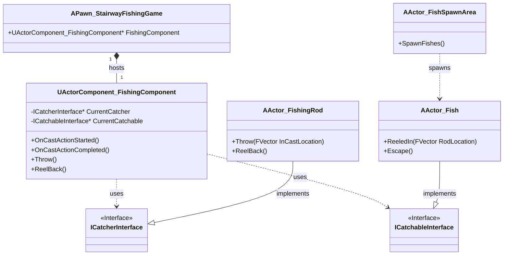
```mermaid
classDiagram
    direction TD
    class APawn_StairwayFishingGame {
        +UActorComponent_FishingComponent* FishingComponent
    }
    class UActorComponent_FishingComponent {
        -ICatcherInterface* CurrentCatcher
        -ICatchableInterface* CurrentCatchable
        +OnCastActionStarted()
        +OnCastActionCompleted()
        +Throw()
        +ReelBack()
    }
    class ICatcherInterface {
        <<Interface>>
    }
    class AActor_FishingRod {
        +Throw(FVector InCastLocation)
        +ReelBack()
    }
    class ICatchableInterface {
        <<Interface>>
    }
    class AActor_Fish {
        +ReeledIn(FVector RodLocation)
        +Escape()
    }
    class AActor_FishSpawnArea {
        +SpawnFishes()
    }

    APawn_StairwayFishingGame "1" *-- "1" UActorComponent_FishingComponent : hosts
    UActorComponent_FishingComponent ..> ICatcherInterface : uses
    UActorComponent_FishingComponent ..> ICatchableInterface : uses
    AActor_FishingRod --|> ICatcherInterface : implements
    AActor_Fish --|> ICatchableInterface : implements
    AActor_FishSpawnArea ..> AActor_Fish : spawns
```

#### Core Components

-   **`UActorComponent_FishingComponent`**: This is the brain of the fishing system. Attached to the player pawn, it manages the fishing state machine (`Idling`, `Throwing`, `WaitingForFish`, etc.). It binds to player input delegates from the `PlayerController`, handles the logic for casting distance, detects nearby fish using sphere traces, and orchestrates interactions between the fishing rod (`ICatcherInterface`) and the fish (`ICatchableInterface`).
-   **`AActor_FishingRod`**: Implements the `ICatcherInterface`. This actor represents the physical fishing rod and bobber. It uses `FTimeline` components driven by `UCurveFloat` assets to create smooth, data-driven animations for casting out (`Throw`) and reeling back (`ReelBack`) the bobber.
-   **`AActor_Fish`**: Implements the `ICatchableInterface`. Each fish is an autonomous actor that wanders within its spawn area. It uses timelines to handle its movement when it is being reeled in or when it escapes.
-   **`AActor_FishSpawnArea`**: This actor defines a volume (`UBoxComponent`) where fish can be spawned. It asynchronously loads the fish actor class using `UAssetManager` and then spawns a configured number of fish at random points within its bounds.

### Input Handling

I managed player input using Unreal Engine's Enhanced Input system.

-   **`APlayerController_StairwayFishingGamePlayerController`**: This class is responsible for setting up the input mapping context and binding to input actions. It defines a `CastingInputAction` which is bound to `Started`, `Triggered`, and `Completed` events.
-   **Delegates**: Instead of directly handling logic, the Player Controller exposes delegates (`OnCastActionStarted`, `OnCastActionTriggered`, `OnCastActionCompleted`). Other systems, like the `UActorComponent_FishingComponent`, can bind to these delegates to receive input events. This decouples the input source from the gameplay logic.

### Editor Customization

To enhance the developer experience, I included an editor module, `FishingFeatureEditor`.

-   **`FDetailCustomization_FishingComponent`**: This class provides a custom details panel UI for the `FFishingComponentConfig` struct within the `UActorComponent_FishingComponent`. It replaces the default `FName` text fields for socket names (`FishingPoleSocketName`, `CarryFishSocketName`) with a dropdown combo box. This combo box is dynamically populated with all available bone and socket names from the `USkeletalMesh` assigned in the config, reducing errors from typos and making configuration faster.

---

### Core Gameplay Classes

#### Related Pages


> **Relevant source files**
>> - [Source/StairwayFishingGameCore/Public/GameModeBase/GameModeBase_StairwayFishingGame.h](https://github.com/rezonated/Unreal-Fishing-Test/blob/main/Source/StairwayFishingGameCore/Public/GameModeBase/GameModeBase_StairwayFishingGame.h)
> - [Source/StairwayFishingGameCore/Private/GameModeBase/GameModeBase_StairwayFishingGame.cpp](https://github.com/rezonated/Unreal-Fishing-Test/blob/main/Source/StairwayFishingGameCore/Private/GameModeBase/GameModeBase_StairwayFishingGame.cpp)
> - [Source/StairwayFishingGameCore/Public/GameStateBase/GameStateBase_StairwayFishingGame.h](https://github.com/rezonated/Unreal-Fishing-Test/blob/main/Source/StairwayFishingGameCore/Public/GameStateBase/GameStateBase_StairwayFishingGame.h)
> - [Source/StairwayFishingGameCore/Private/GameStateBase/GameStateBase_StairwayFishingGame.cpp](https://github.com/rezonated/Unreal-Fishing-Test/blob/main/Source/StairwayFishingGameCore/Private/GameStateBase/GameStateBase_StairwayFishingGame.cpp)
> - [Source/StairwayFishingGameCore/Public/PlayerController/PlayerController_StairwayFishingGamePlayerController.h](https://github.com/rezonated/Unreal-Fishing-Test/blob/main/Source/StairwayFishingGameCore/Public/PlayerController/PlayerController_StairwayFishingGamePlayerController.h)
> - [Source/StairwayFishingGameCore/Private/PlayerController/PlayerController_StairwayFishingGamePlayerController.cpp](https://github.com/rezonated/Unreal-Fishing-Test/blob/main/Source/StairwayFishingGameCore/Private/PlayerController/PlayerController_StairwayFishingGamePlayerController.cpp)
> - [Source/StairwayFishingGameCore/Public/Pawn/Pawn_StairwayFishingGame.h](https://github.com/rezonated/Unreal-Fishing-Test/blob/main/Source/StairwayFishingGameCore/Public/Pawn/Pawn_StairwayFishingGame.h)
> - [Source/StairwayFishingGameCore/Private/Pawn/Pawn_StairwayFishingGame.cpp](https://github.com/rezonated/Unreal-Fishing-Test/blob/main/Source/StairwayFishingGameCore/Private/Pawn/Pawn_StairwayFishingGame.cpp)
> - [Source/FishingFeature/Private/ActorComponent/ActorComponent_FishingComponent.cpp](https://github.com/rezonated/Unreal-Fishing-Test/blob/main/Source/FishingFeature/Private/ActorComponent/ActorComponent_FishingComponent.cpp)
> - [Source/VAGameplayMessaging/Private/GameInstanceSubsystem/VAGameplayMessagingSubsystem.cpp](https://github.com/rezonated/Unreal-Fishing-Test/blob/main/Source/VAGameplayMessaging/Private/GameInstanceSubsystem/VAGameplayMessagingSubsystem.cpp)
> - [Source/FishingGameplayTags/Public/FishingTags.h](https://github.com/rezonated/Unreal-Fishing-Test/blob/main/Source/FishingGameplayTags/Public/FishingTags.h)

## Core Gameplay Classes

I built the core gameplay classes on the standard Unreal Engine gameplay framework. This system is composed of four main classes: `AGameModeBase_StairwayFishingGame`, `AGameStateBase_StairwayFishingGame`, `APlayerController_StairwayFishingGamePlayerController`, and `APawn_StairwayFishingGame`. Together, they manage the game's rules, state, player input, and the player's representation in the world.

I designed the architecture to be event-driven, primarily using the `VAGameplayMessagingSubsystem` to communicate state changes between classes. The `GameState` acts as the central authority for the current game loop state, while the `GameMode` observes these changes and orchestrates transitions, such as camera fades and view switching on the `Pawn`. The `PlayerController` is dedicated to handling raw player input via the Enhanced Input system and broadcasting it to interested listeners, like the `FishingComponent` on the Pawn.

### System Architecture Overview

The following diagram illustrates the primary relationships and dependencies between the core gameplay classes.

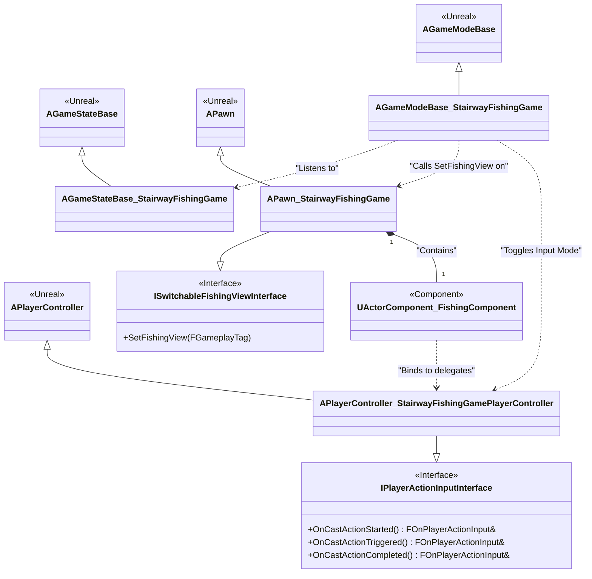
```mermaid
classDiagram
    direction TD
    class AGameModeBase {
        <<Unreal>>
    }
    class AGameStateBase {
        <<Unreal>>
    }
    class APlayerController {
        <<Unreal>>
    }
    class APawn {
        <<Unreal>>
    }
    class AGameModeBase_StairwayFishingGame
    class AGameStateBase_StairwayFishingGame
    class APlayerController_StairwayFishingGamePlayerController
    class APawn_StairwayFishingGame
    class IPlayerActionInputInterface {
        <<Interface>>
        +OnCastActionStarted() FOnPlayerActionInput&
        +OnCastActionTriggered() FOnPlayerActionInput&
        +OnCastActionCompleted() FOnPlayerActionInput&
    }
    class ISwitchableFishingViewInterface {
        <<Interface>>
        +SetFishingView(FGameplayTag)
    }
    class UActorComponent_FishingComponent {
        <<Component>>
    }

    AGameModeBase <|-- AGameModeBase_StairwayFishingGame
    AGameStateBase <|-- AGameStateBase_StairwayFishingGame
    APlayerController <|-- APlayerController_StairwayFishingGamePlayerController
    APawn <|-- APawn_StairwayFishingGame

    APlayerController_StairwayFishingGamePlayerController --|> IPlayerActionInputInterface
    APawn_StairwayFishingGame --|> ISwitchableFishingViewInterface

    AGameModeBase_StairwayFishingGame ..> AGameStateBase_StairwayFishingGame : "Listens to"
    AGameModeBase_StairwayFishingGame ..> APawn_StairwayFishingGame : "Calls SetFishingView on"
    AGameModeBase_StairwayFishingGame ..> APlayerController_StairwayFishingGamePlayerController : "Toggles Input Mode"
    
    APawn_StairwayFishingGame "1" *-- "1" UActorComponent_FishingComponent : "Contains"
    UActorComponent_FishingComponent ..> APlayerController_StairwayFishingGamePlayerController : "Binds to delegates"

```
This diagram shows the inheritance from base Unreal classes and the key interactions. The `GameMode` listens to the `GameState` and directs the `Pawn` and `PlayerController` during state transitions. The `Pawn` implements the view-switching logic and contains the core `FishingComponent`, which in turn binds to input delegates from the `PlayerController`.

Sources: [Source/StairwayFishingGameCore/Public/Pawn/Pawn_StairwayFishingGame.h](https://github.com/rezonated/Unreal-Fishing-Test/blob/main/Source/StairwayFishingGameCore/Public/Pawn/Pawn_StairwayFishingGame.h), [Source/StairwayFishingGameCore/Public/PlayerController/PlayerController_StairwayFishingGamePlayerController.h](https://github.com/rezonated/Unreal-Fishing-Test/blob/main/Source/StairwayFishingGameCore/Public/PlayerController/PlayerController_StairwayFishingGamePlayerController.h), [Source/StairwayFishingGameCore/Public/GameModeBase/GameModeBase_StairwayFishingGame.h](https://github.com/rezonated/Unreal-Fishing-Test/blob/main/Source/StairwayFishingGameCore/Public/GameModeBase/GameModeBase_StairwayFishingGame.h), [Source/FishingFeature/Private/ActorComponent/ActorComponent_FishingComponent.cpp](https://github.com/rezonated/Unreal-Fishing-Test/blob/main/Source/FishingFeature/Private/ActorComponent/ActorComponent_FishingComponent.cpp)

### `AGameStateBase_StairwayFishingGame`

The `AGameStateBase_StairwayFishingGame` class is the authority on the current state of the game loop. Its primary role is to hold and manage the `CurrentFishingGameLoopState` as an `FGameplayTag`.

#### State Management
The game state listens for messages on the `Messaging_GameState_StateChange` channel. When a message containing a new `FGameplayTag` is received, it updates its internal state and broadcasts the change via the `OnFishingGameLoopStateChanged` delegate. This decoupling allows any system to request a state change without needing a direct reference to the `GameState` or its observers.

In `BeginPlay`, it sets up an asynchronous listener for the state change message channel.
```cpp {linenos=inline}
// Source/StairwayFishingGameCore/Private/GameStateBase/GameStateBase_StairwayFishingGame.cpp
void AGameStateBase_StairwayFishingGame::BeginPlay()
{
	Super::BeginPlay();

	GameStateChangeMessageListenerAsync = UVAGameplayMessaging_ListenForGameplayMessages::ListenForGameplayMessagesViaChannel(this, FFishingTags::Get().Messaging_GameState_StateChange);

	GameStateChangeMessageListenerAsync->OnGameplayMessageReceived.AddUniqueDynamic(
		this, &ThisClass::OnGameStateChangeMessageReceived);

	GameStateChangeMessageListenerAsync->Activate();
}
```

When a message is received, `OnGameStateChangeMessageReceived` validates the payload and calls `SetCurrentFishingGameLoopState`, which triggers the broadcast.

Sources: [Source/StairwayFishingGameCore/Public/GameStateBase/GameStateBase_StairwayFishingGame.h](https://github.com/rezonated/Unreal-Fishing-Test/blob/main/Source/StairwayFishingGameCore/Public/GameStateBase/GameStateBase_StairwayFishingGame.h), [Source/StairwayFishingGameCore/Private/GameStateBase/GameStateBase_StairwayFishingGame.cpp](https://github.com/rezonated/Unreal-Fishing-Test/blob/main/Source/StairwayFishingGameCore/Private/GameStateBase/GameStateBase_StairwayFishingGame.cpp)

### `AGameModeBase_StairwayFishingGame`

The `AGameModeBase_StairwayFishingGame` orchestrates high-level game flow based on state changes from the `AGameStateBase`. It is responsible for managing visual transitions and player input modes.

#### Responding to State Changes
Upon `BeginPlay`, the `GameMode` finds the `GameState` and binds its `OnFishingGameLoopStateChanged` method to the `GameState`'s delegate. When this event fires, the `GameMode` executes a series of actions to transition the game smoothly.

The core transition logic involves:
1.  Determining if the new state is for fishing (`FishingGameLoopState_Fishing`) or not.
2.  Toggling the `PlayerController`'s input mode between `FInputModeGameOnly` and `FInputModeUIOnly`, and showing/hiding the mouse cursor accordingly.
3.  Triggering a screen fade-out, switching the camera view on the possessed `Pawn`, and then fading back in.

This entire sequence is initiated within `OnFishingGameLoopStateChanged`.

Sources: [Source/StairwayFishingGameCore/Private/GameModeBase/GameModeBase_StairwayFishingGame.cpp](https://github.com/rezonated/Unreal-Fishing-Test/blob/main/Source/StairwayFishingGameCore/Private/GameModeBase/GameModeBase_StairwayFishingGame.cpp)

#### State Transition Flow

The following diagram illustrates the sequence of events when the game state changes.

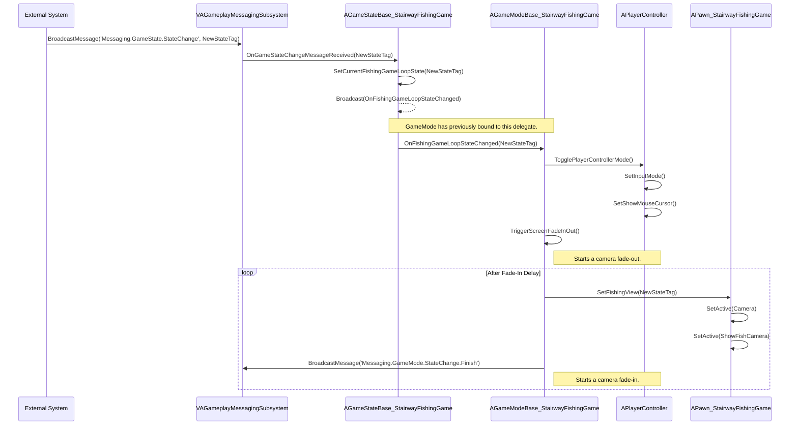
```mermaid
sequenceDiagram
    participant System as External System
    participant Messaging as VAGameplayMessagingSubsystem
    participant GameState as AGameStateBase_StairwayFishingGame
    participant GameMode as AGameModeBase_StairwayFishingGame
    participant PC as APlayerController
    participant Pawn as APawn_StairwayFishingGame

    System->>Messaging: BroadcastMessage('Messaging.GameState.StateChange', NewStateTag)
    Messaging->>GameState: OnGameStateChangeMessageReceived(NewStateTag)
    GameState->>GameState: SetCurrentFishingGameLoopState(NewStateTag)
    GameState-->>GameState: Broadcast(OnFishingGameLoopStateChanged)
    
    Note over GameState, GameMode: GameMode has previously bound to this delegate.
    
    GameState->>GameMode: OnFishingGameLoopStateChanged(NewStateTag)
    GameMode->>PC: TogglePlayerControllerMode()
    PC->>PC: SetInputMode()
    PC->>PC: SetShowMouseCursor()
    
    GameMode->>GameMode: TriggerScreenFadeInOut()
    Note right of GameMode: Starts a camera fade-out.
    
    loop After Fade-In Delay
        GameMode->>Pawn: SetFishingView(NewStateTag)
        Pawn->>Pawn: SetActive(Camera)
        Pawn->>Pawn: SetActive(ShowFishCamera)
        
        GameMode->>Messaging: BroadcastMessage('Messaging.GameMode.StateChange.Finish')
        Note right of GameMode: Starts a camera fade-in.
    end
```
This flow demonstrates the decoupled communication. An external system sends a message, the `GameState` updates and broadcasts, and the `GameMode` reacts by coordinating the `PlayerController` and `Pawn` to reflect the new state.

Sources: [Source/StairwayFishingGameCore/Private/GameModeBase/GameModeBase_StairwayFishingGame.cpp](https://github.com/rezonated/Unreal-Fishing-Test/blob/main/Source/StairwayFishingGameCore/Private/GameModeBase/GameModeBase_StairwayFishingGame.cpp), [Source/StairwayFishingGameCore/Private/GameStateBase/GameStateBase_StairwayFishingGame.cpp](https://github.com/rezonated/Unreal-Fishing-Test/blob/main/Source/StairwayFishingGameCore/Private/GameStateBase/GameStateBase_StairwayFishingGame.cpp), [Source/StairwayFishingGameCore/Private/Pawn/Pawn_StairwayFishingGame.cpp](https://github.com/rezonated/Unreal-Fishing-Test/blob/main/Source/StairwayFishingGameCore/Private/Pawn/Pawn_StairwayFishingGame.cpp)

### `APlayerController_StairwayFishingGamePlayerController`

This class is responsible for translating player hardware input into gameplay actions using Unreal's Enhanced Input system. It implements the `IPlayerActionInputInterface` to expose delegates that other systems can bind to.

### Input Handling

Key properties for input are defined in the header:
| Property | Type | Description |
| --- | --- | --- |
| `DefaultInputMappingContext` | `UInputMappingContext*` | The mapping context that links keys to input actions. |
| `CastingInputAction` | `UInputAction*` | The input action for the primary fishing cast. |

Sources: [Source/StairwayFishingGameCore/Public/PlayerController/PlayerController_StairwayFishingGamePlayerController.h](https://github.com/rezonated/Unreal-Fishing-Test/blob/main/Source/StairwayFishingGameCore/Public/PlayerController/PlayerController_StairwayFishingGamePlayerController.h)

In `BeginPlay`, the controller maps the `DefaultInputMappingContext`. The `MapInputActions` function then binds controller methods (`OnCastStarted`, `OnCastTriggered`, `OnCastFinished`) to the different trigger events of the `CastingInputAction`.

```cpp {linenos=inline}
// Source/StairwayFishingGameCore/Private/PlayerController/PlayerController_StairwayFishingGamePlayerController.cpp
void APlayerController_StairwayFishingGamePlayerController::MapInputActions()
{
    // ... error checking ...
	EnhancedInputComponent->BindAction(CastingInputAction, ETriggerEvent::Started, this, &ThisClass::OnCastStarted);
	EnhancedInputComponent->BindAction(CastingInputAction, ETriggerEvent::Triggered, this, &ThisClass::OnCastTriggered);
	EnhancedInputComponent->BindAction(CastingInputAction, ETriggerEvent::Completed, this, &ThisClass::OnCastFinished);
}
```

These handler functions then broadcast their respective delegates, passing the elapsed time of the input action as a parameter. This allows listeners, such as the `UActorComponent_FishingComponent`, to react to the input without being tightly coupled to the `PlayerController`.

Sources: [Source/StairwayFishingGameCore/Private/PlayerController/PlayerController_StairwayFishingGamePlayerController.cpp](https://github.com/rezonated/Unreal-Fishing-Test/blob/main/Source/StairwayFishingGameCore/Private/PlayerController/PlayerController_StairwayFishingGamePlayerController.cpp)

### `APawn_StairwayFishingGame`

This class represents the player character in the game world. Since no player movement is required, it inherits from `APawn` instead of `ACharacter`. It contains all the necessary visual and logical components for the fishing gameplay.

#### Components
The Pawn is an aggregate of several components that provide its functionality:

| Component | Type | Description |
| --- | --- | --- |
| `Capsule` | `UCapsuleComponent*` | The root component, providing collision. |
| `Mesh` | `USkeletalMeshComponent*` | The visual representation of the player character. |
| `SpringArm` | `USpringArmComponent*` | Positions the main camera at a distance from the pawn. |
| `Camera` | `UCameraComponent*` | The main top-down gameplay camera. Active by default. |
| `CastMeterBarWidget` | `UWidgetComponent*` | A UI widget component for displaying the cast meter. |
| `FishingComponent` | `UActorComponent_FishingComponent*` | The core component that contains all fishing logic. |
| `ShowFishCamera` | `UCameraComponent*` | A secondary camera used for showing the caught fish. Inactive by default. |

Sources: [Source/StairwayFishingGameCore/Public/Pawn/Pawn_StairwayFishingGame.h](https://github.com/rezonated/Unreal-Fishing-Test/blob/main/Source/StairwayFishingGameCore/Public/Pawn/Pawn_StairwayFishingGame.h)

#### View Switching
The Pawn implements the `ISwitchableFishingViewInterface`, which requires it to define the `SetFishingView` method. This function is called by the `GameMode` during a state transition. It activates or deactivates the `Camera` and `ShowFishCamera` based on whether the new game state tag matches `FishingGameLoopState_Fishing`.

```cpp {linenos=inline}
// Source/StairwayFishingGameCore/Private/Pawn/Pawn_StairwayFishingGame.cpp
void APawn_StairwayFishingGame::SetFishingView(const FGameplayTag& InFishingGameLoopStateTag)
{
    // ... validation ...
	const bool bShouldFish = InFishingGameLoopStateTag.MatchesTag(FFishingTags::Get().FishingGameLoopState_Fishing);

	if (Camera)
	{
		Camera->SetActive(bShouldFish);
	}

	if (ShowFishCamera)
	{
		ShowFishCamera->SetActive(!bShouldFish);
	}
}
```
This simple mechanism allows the `GameMode` to control the player's perspective without needing to know the specific implementation details of the Pawn's cameras.

Sources: [Source/StairwayFishingGameCore/Public/Pawn/Pawn_StairwayFishingGame.h](https://github.com/rezonated/Unreal-Fishing-Test/blob/main/Source/StairwayFishingGameCore/Public/Pawn/Pawn_StairwayFishingGame.h), [Source/StairwayFishingGameCore/Private/Pawn/Pawn_StairwayFishingGame.cpp](https://github.com/rezonated/Unreal-Fishing-Test/blob/main/Source/StairwayFishingGameCore/Private/Pawn/Pawn_StairwayFishingGame.cpp)

### Summary

I created the core gameplay classes to form a solid foundation using standard Unreal Engine patterns. The `GameState` serves as a single source of truth for the game loop state, while the `GameMode` acts as a director, orchestrating transitions. I handled player interaction cleanly via the `PlayerController` and its delegate system, which provides input to the `FishingComponent` on the `Pawn`. This separation of concerns ensures that each class has a distinct responsibility, making the system easier to maintain and expand.

---

### Messaging System (VAGameplayMessaging)

#### Related Pages


> **Relevant source files**
>
> - [Source/VAGameplayMessaging/Public/GameInstanceSubsystem/VAGameplayMessagingSubsystem.h](https://github.com/rezonated/Unreal-Fishing-Test/blob/main/Source/VAGameplayMessaging/Public/GameInstanceSubsystem/VAGameplayMessagingSubsystem.h)
> - [Source/VAGameplayMessaging/Private/GameInstanceSubsystem/VAGameplayMessagingSubsystem.cpp](https://github.com/rezonated/Unreal-Fishing-Test/blob/main/Source/VAGameplayMessaging/Private/GameInstanceSubsystem/VAGameplayMessagingSubsystem.cpp)
> - [Source/VAGameplayMessaging/Public/VACancellableAsyncAction/VAGameplayMessaging_ListenForGameplayMessages.h](https://github.com/rezonated/Unreal-Fishing-Test/blob/main/Source/VAGameplayMessaging/Public/VACancellableAsyncAction/VAGameplayMessaging_ListenForGameplayMessages.h)
> - [Source/VAGameplayMessaging/Private/VACancellableAsyncAction/VAGameplayMessaging_ListenForGameplayMessages.cpp](https://github.com/rezonated/Unreal-Fishing-Test/blob/main/Source/VAGameplayMessaging/Private/VACancellableAsyncAction/VAGameplayMessaging_ListenForGameplayMessages.cpp)
> - [Source/FishingGameplayTags/Public/FishingTags.h](https://github.com/rezonated/Unreal-Fishing-Test/blob/main/Source/FishingGameplayTags/Public/FishingTags.h)
> - [Source/FishingFeature/Private/ActorComponent/ActorComponent_FishingComponent.cpp](https://github.com/rezonated/Unreal-Fishing-Test/blob/main/Source/FishingFeature/Private/ActorComponent/ActorComponent_FishingComponent.cpp)
> - [Source/StairwayFishingGameCore/Private/GameStateBase/GameStateBase_StairwayFishingGame.cpp](https://github.com/rezonated/Unreal-Fishing-Test/blob/main/Source/StairwayFishingGameCore/Private/GameStateBase/GameStateBase_StairwayFishingGame.cpp)
> - [Source/StairwayFishingGameUI/Private/UserWidget/MeterBar/UserWidgetMeterBar_CastMeterBar.cpp](https://github.com/rezonated/Unreal-Fishing-Test/blob/main/Source/StairwayFishingGameUI/Private/UserWidget/MeterBar/UserWidgetMeterBar_CastMeterBar.cpp)

## Messaging System (VAGameplayMessaging)

I used the VAGameplayMessaging system to provide a decoupled communication framework for different parts of the application. I leveraged a centralized `UGameInstanceSubsystem` to manage message channels identified by `FGameplayTag`. This allows various game features, UI elements, and animation instances to communicate without holding direct references to each other, promoting modularity and reducing dependencies.

Messages are broadcast on specific channels, and any object can listen to one or more channels using a cancellable asynchronous action. I ensured the system supports flexible data transfer through the `FVAAnyUnreal` struct, which can encapsulate any USTRUCT, UObject, or primitive type as a message payload.

### Core Architecture

I built the system around a central hub, `UVAGameplayMessagingSubsystem`, which is a `UGameInstanceSubsystem`. This ensures it has a global scope and persists for the entire game session. The subsystem's primary responsibility is to maintain a map of message channels and their corresponding listeners.

*   **`UVAGameplayMessagingSubsystem`**: The central singleton that manages all message channels and listeners.
*   **`ChannelToMembersMap`**: A `TMap<FGameplayTag, FChannelMembersData>` within the subsystem. It maps a gameplay tag (the channel) to a struct containing an array of active listeners.
*   **`UVAGameplayMessaging_ListenForGameplayMessages`**: A `UVACancellableAsyncAction` that acts as a proxy for any object wanting to listen to messages. It handles its own registration and unregistration with the subsystem.

#### Component Relationships

The following diagram illustrates the relationship between the core components of the messaging system.

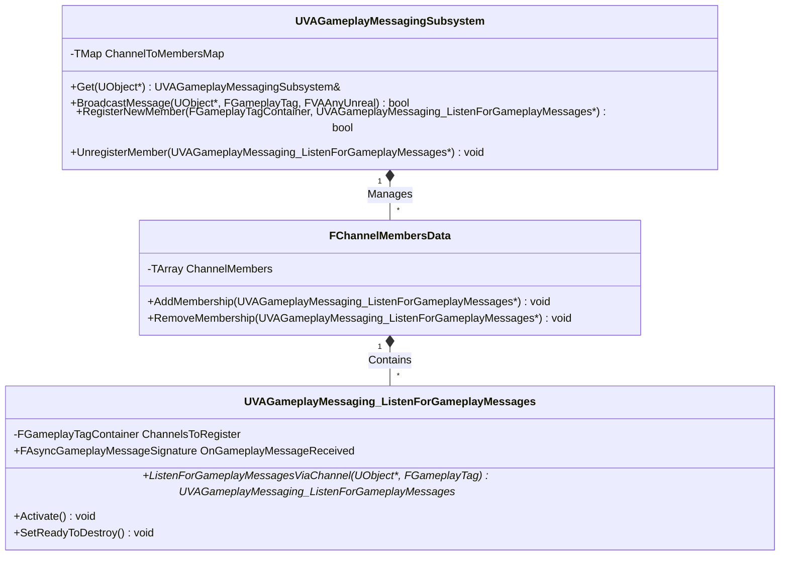
```mermaid
classDiagram
    direction TD
    class UVAGameplayMessagingSubsystem {
        -TMap<FGameplayTag, FChannelMembersData> ChannelToMembersMap
        +Get(UObject*) UVAGameplayMessagingSubsystem&
        +BroadcastMessage(UObject*, FGameplayTag, FVAAnyUnreal) bool
        +RegisterNewMember(FGameplayTagContainer, UVAGameplayMessaging_ListenForGameplayMessages*) bool
        +UnregisterMember(UVAGameplayMessaging_ListenForGameplayMessages*) void
    }
    class FChannelMembersData {
        -TArray<UVAGameplayMessaging_ListenForGameplayMessages*> ChannelMembers
        +AddMembership(UVAGameplayMessaging_ListenForGameplayMessages*) void
        +RemoveMembership(UVAGameplayMessaging_ListenForGameplayMessages*) void
    }
    class UVAGameplayMessaging_ListenForGameplayMessages {
        -FGameplayTagContainer ChannelsToRegister
        +FAsyncGameplayMessageSignature OnGameplayMessageReceived
        +ListenForGameplayMessagesViaChannel(UObject*, FGameplayTag) UVAGameplayMessaging_ListenForGameplayMessages*
        +Activate() void
        +SetReadyToDestroy() void
    }

    UVAGameplayMessagingSubsystem "1" *-- "*" FChannelMembersData : Manages
    FChannelMembersData "1" *-- "*" UVAGameplayMessaging_ListenForGameplayMessages : Contains
```
This diagram shows that the `UVAGameplayMessagingSubsystem` contains a map of `FChannelMembersData`, and each `FChannelMembersData` instance holds a list of `UVAGameplayMessaging_ListenForGameplayMessages` listeners.

### Broadcasting Messages

Messages are sent using the static function `UVAGameplayMessagingSubsystem::BroadcastMessage`. This function retrieves the subsystem instance and calls an internal method to perform the broadcast.

The internal broadcast process is as follows:
1.  Validate the `InChannel` `FGameplayTag`.
2.  Check if the channel exists in the `ChannelToMembersMap`.
3.  Retrieve the list of listeners (`UVAGameplayMessaging_ListenForGameplayMessages*`) for that channel.
4.  Iterate through each listener, checking if it is valid.
5.  If a listener is invalid, it is removed from the channel's member list.
6.  For each valid listener, its `OnGameplayMessageReceived` delegate is broadcast, passing the channel tag and the message payload.

#### Broadcast Flow Diagram

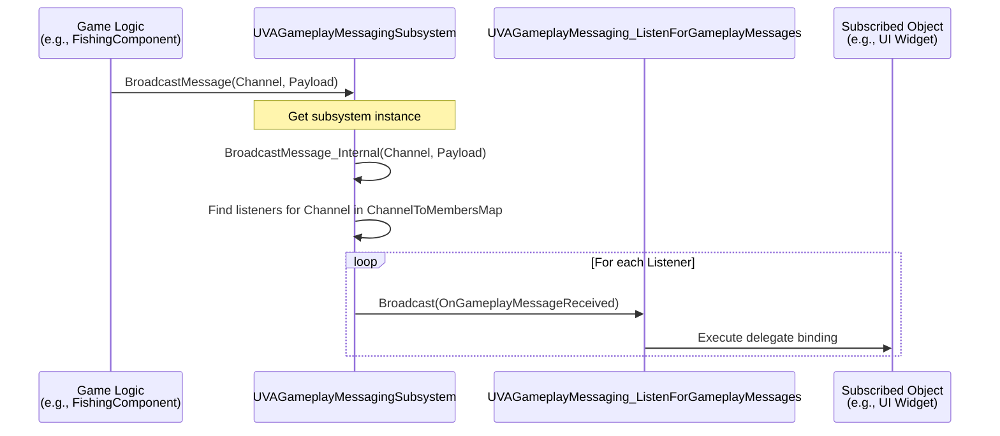
```mermaid
sequenceDiagram
    participant Broadcaster as Game Logic<br>(e.g., FishingComponent)
    participant Subsystem as UVAGameplayMessagingSubsystem
    participant Listener as UVAGameplayMessaging_ListenForGameplayMessages
    participant Receiver as Subscribed Object<br>(e.g., UI Widget)

    Broadcaster->>Subsystem: BroadcastMessage(Channel, Payload)
    Note over Subsystem: Get subsystem instance
    Subsystem->>Subsystem: BroadcastMessage_Internal(Channel, Payload)
    Subsystem->>Subsystem: Find listeners for Channel in ChannelToMembersMap
    loop For each Listener
        Subsystem->>Listener: Broadcast(OnGameplayMessageReceived)
        Listener->>Receiver: Execute delegate binding
    end
```
This sequence shows a game object broadcasting a message, the subsystem finding and notifying the relevant listener, which in turn executes the delegate bound by the final receiving object.

### Listening for Messages

Objects subscribe to message channels by creating an instance of `UVAGameplayMessaging_ListenForGameplayMessages`. This is typically done via one of its static factory functions, which are designed for use in both C++ and Blueprints.

1.  **Creation**: An object calls `ListenForGameplayMessagesViaChannel` or `ListenForGameplayMessagesViaMultipleChannels`. This creates a new proxy object (the listener).
2.  **Activation**: The listener's `Activate()` method is called.
3.  **Registration**: Inside `Activate()`, the listener calls `Subsystem->RegisterNewMember()`, passing a reference to itself and the channels it wants to subscribe to.
4.  **Storage**: The subsystem adds the listener to the `ChannelToMembersMap` for each requested channel. If a channel does not exist, it is created.

The listener's `OnGameplayMessageReceived` delegate should be bound to a function in the subscribing object before activation to handle incoming messages.

#### Listener Registration and Cancellation Flow

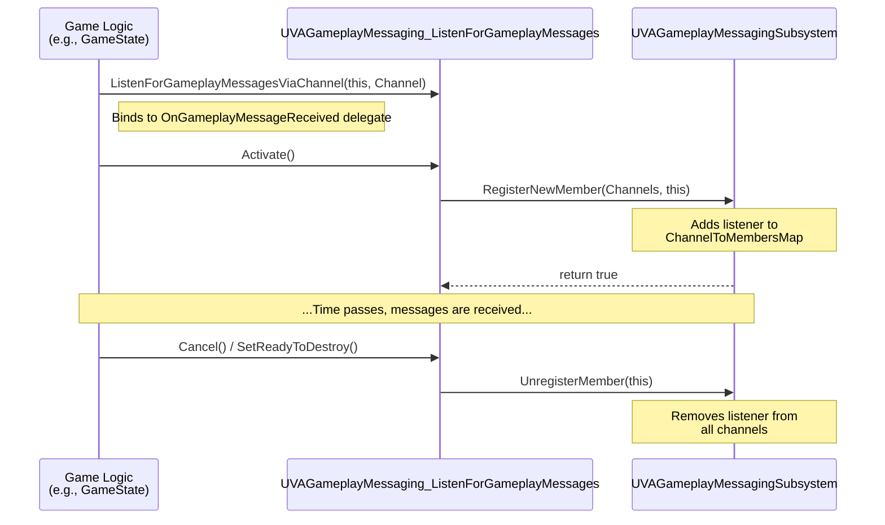
```mermaid
sequenceDiagram
    participant Subscriber as Game Logic<br>(e.g., GameState)
    participant Listener as UVAGameplayMessaging_ListenForGameplayMessages
    participant Subsystem as UVAGameplayMessagingSubsystem

    Subscriber->>Listener: ListenForGameplayMessagesViaChannel(this, Channel)
    Note right of Subscriber: Binds to OnGameplayMessageReceived delegate
    Subscriber->>Listener: Activate()
    Listener->>Subsystem: RegisterNewMember(Channels, this)
    Note over Subsystem: Adds listener to<br>ChannelToMembersMap
    Subsystem-->>Listener: return true
    
    Note over Subscriber, Subsystem: ...Time passes, messages are received...

    Subscriber->>Listener: Cancel() / SetReadyToDestroy()
    Listener->>Subsystem: UnregisterMember(this)
    Note over Subsystem: Removes listener from<br>all channels
```
This diagram illustrates the lifecycle of a listener, from its creation and registration with the subsystem to its eventual cancellation and unregistration.

### Message Structure

#### Channels (`FGameplayTag`)

Communication channels are defined by `FGameplayTag`. This leverages Unreal Engine's hierarchical tagging system, allowing for organized and easily identifiable message streams. A central class, `FFishingTags`, defines all the native gameplay tags used by the fishing feature, ensuring consistency.

Example channels:
*   `Messaging.Fishing.UI.Cast.Update`: Used to update the UI with the current casting progress.
*   `Messaging.Fishing.Notify.Throw`: An animation notify that triggers the fishing rod to throw the bobber.
*   `Messaging.GameState.StateChange`: Used to request a change in the global game state.

#### Payloads (`FVAAnyUnreal`)

The system uses the `FVAAnyUnreal` struct for message payloads. This is a wrapper that can hold a value of almost any Unreal type, including primitives (`float`, `int32`), USTRUCTs, and UObjects. The receiving end can then safely check the type of the payload before attempting to extract the value.

```cpp {linenos=inline}
// Example of a broadcaster sending a float payload
// Source/FishingFeature/Private/ActorComponent/ActorComponent_FishingComponent.cpp
UVAGameplayMessagingSubsystem::Get(this).BroadcastMessage(this, FFishingTags::Get().Messaging_Fishing_UI_Cast_Update, InProgress);

// Example of a receiver handling the float payload
// Source/StairwayFishingGameUI/Private/UserWidget/MeterBar/UserWidgetMeterBar_CastMeterBar.cpp
const bool bPayloadIsFloat = MessagePayload.Is<float>();
if (!bPayloadIsFloat)
{
    // ... log error
    return;
}
const float Progress = MessagePayload.Get<float>();
```
This provides type safety at runtime and avoids the need for multiple broadcast functions with different signatures.

### Lifecycle Management

The lifecycle of listeners is managed primarily by the `UVACancellableAsyncAction` base class.
- **Registration**: When `Activate()` is called on a `UVAGameplayMessaging_ListenForGameplayMessages` instance, it registers itself with the subsystem.
- **Unregistration**: When the async action is cancelled (e.g., via a `Cancel()` call or the owning object being destroyed), its `SetReadyToDestroy()` method is invoked. This method calls `Subsystem->UnregisterMember(this)`, which iterates through the entire `ChannelToMembersMap` and removes the listener from any channel it was a part of.
- **Cleanup**: The `UVAGameplayMessagingSubsystem` itself, upon `Deinitialize()`, clears its `ChannelToMembersMap` entirely, ensuring no dangling references remain.

### Key Components Summary

| Component | Type | Role | Source File |
| --- | --- | --- | --- |
| `UVAGameplayMessagingSubsystem` | `UGameInstanceSubsystem` | Central hub for message routing. Manages channels and listeners. | `VAGameplayMessagingSubsystem.h` |
| `UVAGameplayMessaging_ListenForGameplayMessages` | `UVACancellableAsyncAction` | Client-side proxy for subscribing to channels. Manages its own lifecycle. | `VAGameplayMessaging_ListenForGameplayMessages.h` |
| `FChannelMembersData` | `USTRUCT` | A container struct holding an array of listeners for a single channel. | `VAGameplayMessagingSubsystem.h` |
| `FGameplayTag` | `struct` | Used to define unique message channels. | `FishingTags.h` |
| `FVAAnyUnreal` | `struct` | A type-safe wrapper for message payloads of any type. | `VAGameplayMessagingSubsystem.h` |

### Conclusion

The VAGameplayMessaging system is a data-driven framework that enables decoupled communication between different gameplay systems. By leveraging `UGameInstanceSubsystem` for global access, `FGameplayTag` for channel definition, and `UVACancellableAsyncAction` for lifecycle-aware listeners, I provided a clean and scalable solution for event handling within the project. Its use of `FVAAnyUnreal` for payloads adds a layer of type-safe flexibility, making it adaptable to a wide variety of communication needs.

---

### Fishing Gameplay Loop

#### Related Pages


> **Relevant source files**
>
> The following files were used as context for generating this wiki page:
>
> - [Source/FishingFeature/Private/ActorComponent/ActorComponent_FishingComponent.cpp](https://github.com/rezonated/Unreal-Fishing-Test/blob/main/Source/FishingFeature/Private/ActorComponent/ActorComponent_FishingComponent.cpp)
> - [Source/FishingFeature/Private/Actor/Actor_FishingRod.cpp](https://github.com/rezonated/Unreal-Fishing-Test/blob/main/Source/FishingFeature/Private/Actor/Actor_FishingRod.cpp)
> - [Source/FishingFeature/Private/Actor/Actor_Fish.cpp](https://github.com/rezonated/Unreal-Fishing-Test/blob/main/Source/FishingFeature/Private/Actor/Actor_Fish.cpp)
> - [Source/FishingFeature/Private/Actor/Actor_FishSpawnArea.cpp](https://github.com/rezonated/Unreal-Fishing-Test/blob/main/Source/FishingFeature/Private/Actor/Actor_FishSpawnArea.cpp)
> - [Source/FishingGameplayTags/Private/FishingTags.cpp](https://github.com/rezonated/Unreal-Fishing-Test/blob/main/Source/FishingGameplayTags/Private/FishingTags.cpp)
> - [Source/StairwayFishingGameCore/Private/GameModeBase/GameModeBase_StairwayFishingGame.cpp](https://github.com/rezonated/Unreal-Fishing-Test/blob/main/Source/StairwayFishingGameCore/Private/GameModeBase/GameModeBase_StairwayFishingGame.cpp)
> - [Source/StairwayFishingGameCore/Private/Pawn/Pawn_StairwayFishingGame.cpp](https://github.com/rezonated/Unreal-Fishing-Test/blob/main/Source/StairwayFishingGameCore/Private/Pawn/Pawn_StairwayFishingGame.cpp)

## Fishing Gameplay Loop

I implemented the Fishing Gameplay Loop as a self-contained feature that manages all logic related to casting a fishing rod, waiting for a fish to bite, and reeling it in. I orchestrated the system via the `UActorComponent_FishingComponent`, which acts as a state machine and mediator between the player, the fishing rod, and the fish.

The feature is heavily reliant on a state management system using Gameplay Tags and communicates between different objects asynchronously via the `VAGameplayMessagingSubsystem`. This decoupled architecture allows me to clearly separate concerns between player input, animation, game logic, and actor behaviors. I made the entire process configurable through Data Assets, allowing designers to tweak parameters like casting distance, wait times, and actor classes without changing code.

### Core Components

The system is composed of several key actors and components that work together to create the fishing experience.

| Component/Actor | Role | Source File |
| --- | --- | --- |
| `UActorComponent_FishingComponent` | The central orchestrator of the fishing logic. Manages states, timers, player input, and communication between other components. | `ActorComponent_FishingComponent.h` |
| `AActor_FishingRod` | Represents the physical fishing rod and bobber. Implements the `ICatcherInterface` and handles the visual throwing and reeling of the line. | `Actor_FishingRod.cpp` |
| `AActor_Fish` | Represents a catchable fish. Implements the `ICatchableInterface` and manages its own movement, including wandering, being reeled in, and escaping. | `Actor_Fish.cpp` |
| `AActor_FishSpawnArea` | Spawns a configurable number of `AActor_Fish` instances within a defined `UBoxComponent` volume at the start of the game. | `Actor_FishSpawnArea.cpp` |
| `AGameModeBase_StairwayFishingGame` | Manages high-level game state transitions, such as fading the screen and switching cameras when a fish is caught and displayed. | `GameModeBase_StairwayFishingGame.cpp` |
| `APawn_StairwayFishingGame` | The player's pawn which owns the `UActorComponent_FishingComponent` and holds the different cameras used for gameplay and showing the catch. | `Pawn_StairwayFishingGame.cpp` |

#### Component Relationships

The following diagram illustrates the primary relationships between the core classes. The `FishingComponent` acts as a central hub, interacting with the rod (`ICatcherInterface`) and the fish (`ICatchableInterface`).

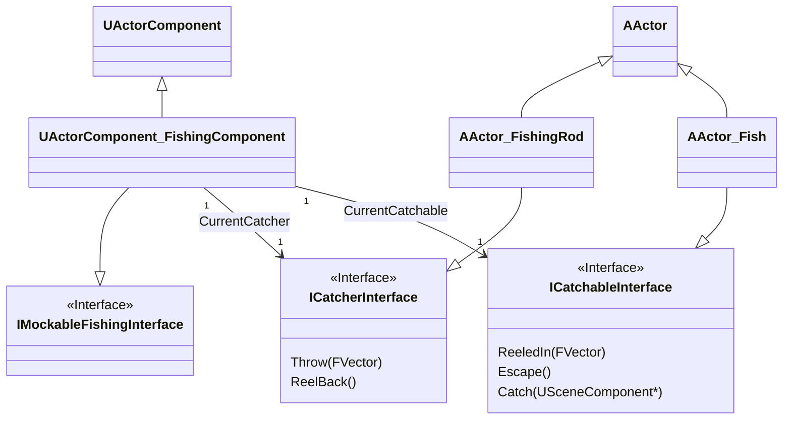
```mermaid
classDiagram
    direction TD
    class UActorComponent
    class AActor
    class UActorComponent_FishingComponent
    class AActor_FishingRod
    class AActor_Fish
    class IMockableFishingInterface {
        <<Interface>>
    }
    class ICatcherInterface {
        <<Interface>>
        Throw(FVector)
        ReelBack()
    }
    class ICatchableInterface {
        <<Interface>>
        ReeledIn(FVector)
        Escape()
        Catch(USceneComponent*)
    }

    UActorComponent <|-- UActorComponent_FishingComponent
    AActor <|-- AActor_FishingRod
    AActor <|-- AActor_Fish

    UActorComponent_FishingComponent --|> IMockableFishingInterface
    AActor_FishingRod --|> ICatcherInterface
    AActor_Fish --|> ICatchableInterface

    UActorComponent_FishingComponent "1" --> "1" ICatcherInterface : CurrentCatcher
    UActorComponent_FishingComponent "1" --> "1" ICatchableInterface : CurrentCatchable
```

### State Management with Gameplay Tags

I drove the fishing loop with a state machine implemented within `UActorComponent_FishingComponent`. The current state is tracked using a `FGameplayTag`, which dictates how the component responds to player input and game events. All tags are centrally defined in the `FFishingTags` class.

#### Fishing Component States

The `FishingComponent.State.*` tags define the current stage of the fishing process.

| Tag | Description |
| --- | --- |
| `FishingComponent.State.Idling` | The default state. The player can start casting. |
| `FishingComponent.State.Throwing` | The player has finished charging the cast and the rod is being thrown. Input is ignored. |
| `FishingComponent.State.WaitingForFish` | The bobber is in the water. A timer is active, waiting for a fish to bite. Early input will cause the fish to escape. |
| `FishingComponent.State.AbleToReel` | The fish has bitten. The player must press the action button to reel it in. |
| `FishingComponent.State.Reeling_In` | The fish has been caught and is being reeled back to the player. |
| `FishingComponent.State.Reeling_Out` | The rod is being reeled back after a failed attempt or the fish escaped. |

#### Animation States

A parallel set of tags, `AnimInstance.Fishing.State.*`, is used to drive the character's animations. These are broadcast via the messaging system to the character's Animation Blueprint.

| Tag | Description |
| --- | --- |
| `AnimInstance.Fishing.State.Idling` | Corresponds to the idle animation state. |
| `AnimInstance.Fishing.State.Throwing` | Triggers the casting/throwing animation montage. |
| `AnimInstance.Fishing.State.Reeling_In` | Triggers the animation for successfully reeling in a fish. |
| `AnimInstance.Fishing.State.Reeling_Out` | Triggers the animation for reeling in an empty line. |
| `AnimInstance.Fishing.State.ShowFish` | Triggers the animation for showing off the caught fish. |

#### State Machine Flow

The diagram below shows the typical flow of states within the `UActorComponent_FishingComponent`.

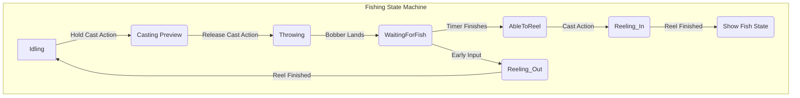
```mermaid
graph TD
    subgraph Fishing State Machine
        A[Idling] -->|Hold Cast Action| B(Casting Preview)
        B -->|Release Cast Action| C(Throwing)
        C -->|Bobber Lands| D(WaitingForFish)
        D -->|Timer Finishes| E(AbleToReel)
        D -->|Early Input| F(Reeling_Out)
        E -->|Cast Action| G(Reeling_In)
        F -->|Reel Finished| A
        G -->|Reel Finished| H(Show Fish State)
    end
```

### The Fishing Process Step-by-Step

The entire fishing sequence, from casting to catching, follows a well-defined series of events orchestrated by the `FishingComponent`.

#### 1. Initialization and Spawning

-   **Fish Spawning**: On `BeginPlay`, the `AActor_FishSpawnArea` asynchronously loads the `FishActorClass` defined in its config. Once loaded, it spawns a specified number of fish actors at random locations within its `UBoxComponent` bounds. Each fish is initialized with the spawn area's center and extent, which it uses for its wandering behavior.
-   **Rod Spawning**: The `UActorComponent_FishingComponent` also asynchronously loads its `FishingRodActorClass`. When loaded, the fishing rod actor is spawned and attached to a specified socket on the owner's skeletal mesh.

#### 2. Casting the Line

-   **Charging the Cast**: The player presses and holds the cast action button. This calls `OnCastAction` in the `FishingComponent`.
-   **Determining Location**: While the button is held, `DetermineCastLocation` is called continuously. It maps the elapsed time the button has been held to a distance between a minimum and maximum value. This determines the cast's target position in front of the player.
    ```cpp {linenos=inline}
    // Source/FishingFeature/Private/ActorComponent/ActorComponent_FishingComponent.cpp
    const float MappedForwardDistance = FMath::GetMappedRangeValueClamped(FVector2D(0.f, MaximumTimeToCast), FVector2D(MinimumCastDistance, MaximumCastDistance), InElapsedTime);
    const FVector ForwardDirection = InitialActorForwardVector * MappedForwardDistance;
    const FVector CastStartPosition = InitialActorLocation + ForwardDirection;
    ```
-   **Finding the Water**: `AttemptToCast` then performs a line trace downwards from the target position to find a water body (identified by the `TRACE_WATER_BODY` collision channel). If water is found, the hit location is stored as `CastLocation`, and a decal actor is made visible at that spot to give the player feedback.

#### 3. Throwing and Waiting

-   **Throwing**: When the player releases the cast button, `OnCastActionEnded` is called. The component's state changes to `Throwing`, and it broadcasts a message to the animation system to play the "throwing" animation.
-   **Animation Notify**: The throwing animation contains a notify that sends a `Messaging.Fishing.Notify.Throw` message. The `FishingComponent` listens for this message and, upon receiving it, calls the `Throw()` method on the `CurrentCatcher` (the fishing rod).
-   **Bobber Movement**: `AActor_FishingRod::Throw` starts a timeline (`ThrowReelInTimeline`) that interpolates the bobber's position from the rod to the `CastLocation`.
-   **Landing on Water**: When the timeline finishes, a delegate is executed, calling `OnBobberLandsOnWater` in the `FishingComponent`.
-   **Finding a Fish**: The component then performs a sphere trace around the `CastLocation` to find the nearest `ICatchableInterface` (a fish).
-   **Waiting Period**: A timer is started for a duration defined by `TimeToFish` in the config, and the state changes to `WaitingForFish`. The targeted fish is notified via its `ReeledIn()` method, causing it to swim towards the bobber.

#### 4. Reeling In the Catch

-   **The Bite**: When the `WaitingForFish` timer completes, the state transitions to `AbleToReel`.
-   **Player Action**: The player must now press the cast action button again. If they do, `OnCastAction` is triggered while in the `AbleToReel` state.
-   **Catching**: The fish is "caught" by calling `CurrentCatchable->Catch()`, which attaches the fish actor to an attach point on the fishing rod's bobber. The `ReelBack()` method is then called on the rod.
-   **Reeling Back**: `AActor_FishingRod::ReelBack` uses another timeline (`PullReelOutTimeline`) to move the bobber (and the attached fish) back to its starting position on the rod.

#### 5. Success and Failure

-   **Success**: If the reeling process completes with a fish attached, an animation notify sends a `Messaging.Fishing.Notify.ReelDone` message. The `FishingComponent` receives this and broadcasts another message, `Messaging_GameState_StateChange`, with the payload `FishingGameLoopState_ShowFish`.
-   **Failure (Escaping Fish)**: If the player presses the action button *during* the `WaitingForFish` state (before the timer finishes), it is considered an early reel. `LetCatchableEscape` is called, which in turn calls the `Escape()` method on the fish. The fish plays an escape timeline to swim back to its original location, and the player reels in an empty line.

### System Communication and Game State Flow

The `VAGameplayMessagingSubsystem` is used for decoupled communication between different parts of the game. This is particularly important for triggering logic from animation notifies and for signaling changes to the main game mode.

The sequence diagram below details the interactions during a successful fishing attempt.

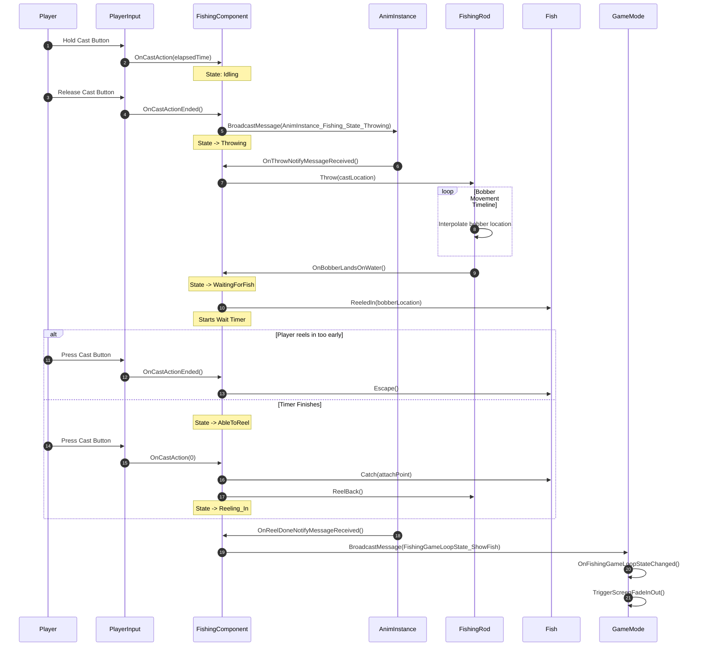
```mermaid
sequenceDiagram
    autonumber
    participant Player
    participant PlayerInput
    participant FishingComponent
    participant AnimInstance
    participant FishingRod
    participant Fish
    participant GameMode

    Player->>PlayerInput: Hold Cast Button
    PlayerInput->>FishingComponent: OnCastAction(elapsedTime)
    Note over FishingComponent: State: Idling
    
    Player->>PlayerInput: Release Cast Button
    PlayerInput->>FishingComponent: OnCastActionEnded()
    FishingComponent->>AnimInstance: BroadcastMessage(AnimInstance_Fishing_State_Throwing)
    Note over FishingComponent: State -> Throwing
    
    AnimInstance->>FishingComponent: OnThrowNotifyMessageReceived()
    FishingComponent->>FishingRod: Throw(castLocation)
    
    loop Bobber Movement Timeline
        FishingRod->>FishingRod: Interpolate bobber location
    end
    
    FishingRod->>FishingComponent: OnBobberLandsOnWater()
    Note over FishingComponent: State -> WaitingForFish
    FishingComponent->>Fish: ReeledIn(bobberLocation)
    Note over FishingComponent: Starts Wait Timer
    
    alt Player reels in too early
        Player->>PlayerInput: Press Cast Button
        PlayerInput->>FishingComponent: OnCastActionEnded()
        FishingComponent->>Fish: Escape()
    else Timer Finishes
        Note over FishingComponent: State -> AbleToReel
        Player->>PlayerInput: Press Cast Button
        PlayerInput->>FishingComponent: OnCastAction(0)
        FishingComponent->>Fish: Catch(attachPoint)
        FishingComponent->>FishingRod: ReelBack()
        Note over FishingComponent: State -> Reeling_In
    end

    AnimInstance->>FishingComponent: OnReelDoneNotifyMessageReceived()
    FishingComponent->>GameMode: BroadcastMessage(FishingGameLoopState_ShowFish)
    GameMode->>GameMode: OnFishingGameLoopStateChanged()
    GameMode->>GameMode: TriggerScreenFadeInOut()
```

When the `GameMode` receives the `FishingGameLoopState_ShowFish` message, it initiates a screen fade, switches the active camera on the player pawn to a "show fish" camera, and changes the input mode to UI-only, presenting the player with options to continue or quit.

### Testability

I designed the system with testability in mind. The `UActorComponent_FishingComponent` implements the `IMockableFishingInterface`, which exposes methods to drive the fishing logic programmatically.

-   `MockCast(float InElapsedTime)`: Simulates holding the cast button for a specific duration.
-   `MockCastEnd()`: Simulates releasing the cast button.

Functional tests, such as `AFunctionalTest_FishingFeatureTest`, can get a reference to this interface and call these methods to validate the entire fishing loop without requiring actual player input. The interface also provides delegates like `OnMockAbleToCatchFishDone` and `OnMockBobberLandsOnWater` that tests can bind to for asserting outcomes at specific stages of the process.

---

### Player Input and Controls

#### Related Pages


> **Relevant source files**
>
> The following files were used as context for generating this wiki page:
>
> - [Source/StairwayFishingGameCore/Public/PlayerController/PlayerController_StairwayFishingGamePlayerController.h](https://github.com/rezonated/Unreal-Fishing-Test/blob/main/Source/StairwayFishingGameCore/Public/PlayerController/PlayerController_StairwayFishingGamePlayerController.h)
> - [Source/StairwayFishingGameCore/Private/PlayerController/PlayerController_StairwayFishingGamePlayerController.cpp](https://github.com/rezonated/Unreal-Fishing-Test/blob/main/Source/StairwayFishingGameCore/Private/PlayerController/PlayerController_StairwayFishingGamePlayerController.cpp)
> - [Source/FishingFeature/Private/ActorComponent/ActorComponent_FishingComponent.cpp](https://github.com/rezonated/Unreal-Fishing-Test/blob/main/Source/FishingFeature/Private/ActorComponent/ActorComponent_FishingComponent.cpp)
> - [Source/StairwayFishingGameCore/Public/GameModeBase/GameModeBase_StairwayFishingGame.h](https://github.com/rezonated/Unreal-Fishing-Test/blob/main/Source/StairwayFishingGameCore/Public/GameModeBase/GameModeBase_StairwayFishingGame.h)
> - [Source/StairwayFishingGameCore/Private/GameModeBase/GameModeBase_StairwayFishingGame.cpp](https://github.com/rezonated/Unreal-Fishing-Test/blob/main/Source/StairwayFishingGameCore/Private/GameModeBase/GameModeBase_StairwayFishingGame.cpp)
> - [Source/StairwayFishingGameCore/Public/Pawn/Pawn_StairwayFishingGame.h](https://github.com/rezonated/Unreal-Fishing-Test/blob/main/Source/StairwayFishingGameCore/Public/Pawn/Pawn_StairwayFishingGame.h)

## Player Input and Controls

I built the player input and control system upon Unreal Engine's Enhanced Input System. It provides a decoupled, event-driven architecture for handling player actions, primarily the fishing cast mechanic. The core components include a dedicated Player Controller that interprets raw input, an interface to broadcast input events, and a consumer component that implements the game logic. The system is also managed by the Game Mode, which controls whether the player is in a "Game" or "UI" input context based on the current game state.

The primary input action is the "Casting" action, which is bound to multiple trigger events (Started, Triggered, Completed) to allow for nuanced control, such as charging a cast by holding down a button. This design separates the input handling from the game mechanics, allowing different components to react to player input without being tightly coupled to the `PlayerController`.

### Architecture Overview

The system revolves around four key classes that collaborate to translate a physical input into a gameplay action. The `APlayerController_StairwayFishingGamePlayerController` is the central hub, responsible for setting up input mappings and broadcasting actions. It uses the `IPlayerActionInputInterface` to expose delegates, which are then bound by the `UActorComponent_FishingComponent` to execute fishing logic. The `AGameModeBase_StairwayFishingGame` oversees the process by managing the overall input mode.

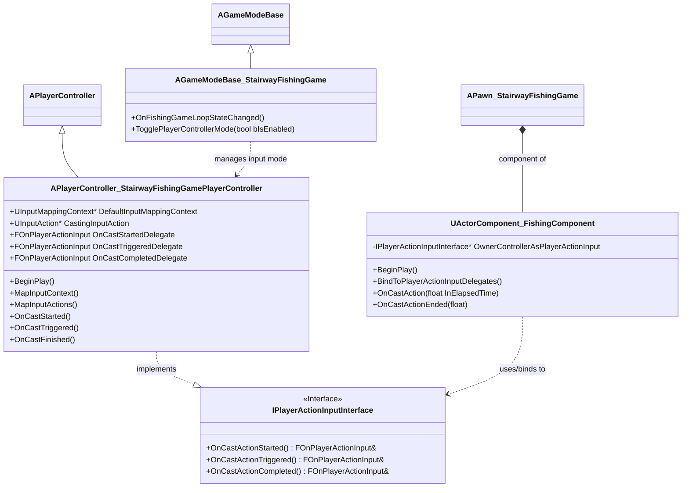
```mermaid
classDiagram
    direction TD

    class APlayerController
    class AGameModeBase
    class APawn_StairwayFishingGame

    class APlayerController_StairwayFishingGamePlayerController {
      +UInputMappingContext* DefaultInputMappingContext
      +UInputAction* CastingInputAction
      +FOnPlayerActionInput OnCastStartedDelegate
      +FOnPlayerActionInput OnCastTriggeredDelegate
      +FOnPlayerActionInput OnCastCompletedDelegate
      +BeginPlay()
      +MapInputContext()
      +MapInputActions()
      +OnCastStarted()
      +OnCastTriggered()
      +OnCastFinished()
    }

    class IPlayerActionInputInterface {
      <<Interface>>
      +OnCastActionStarted() FOnPlayerActionInput&
      +OnCastActionTriggered() FOnPlayerActionInput&
      +OnCastActionCompleted() FOnPlayerActionInput&
    }

    class UActorComponent_FishingComponent {
      -IPlayerActionInputInterface* OwnerControllerAsPlayerActionInput
      +BeginPlay()
      +BindToPlayerActionInputDelegates()
      +OnCastAction(float InElapsedTime)
      +OnCastActionEnded(float)
    }

    class AGameModeBase_StairwayFishingGame {
      +OnFishingGameLoopStateChanged()
      +TogglePlayerControllerMode(bool bIsEnabled)
    }

    APlayerController <|-- APlayerController_StairwayFishingGamePlayerController
    APlayerController_StairwayFishingGamePlayerController ..|> IPlayerActionInputInterface: implements
    APawn_StairwayFishingGame *-- UActorComponent_FishingComponent : component of
    UActorComponent_FishingComponent ..> IPlayerActionInputInterface : uses/binds to
    AGameModeBase <|-- AGameModeBase_StairwayFishingGame
    AGameModeBase_StairwayFishingGame ..> APlayerController_StairwayFishingGamePlayerController : manages input mode

```

#### Input Handling Flow

The following diagram illustrates the sequence of events from a player's physical input to the execution of the corresponding game logic within the `UActorComponent_FishingComponent`.

```mermaid
sequenceDiagram
    participant Player
    participant EILS as UEnhancedInput<br>LocalPlayerSubsystem
    participant PC as APlayerController_StairwayFishingGamePlayerController
    participant FC as UActorComponent_FishingComponent

    Player->>EILS: Press/Hold/Release Cast Input
    EILS->>PC: OnCastStarted(instance)
    PC->>PC: BroadcastCastDelegateAndValue(OnCastStartedDelegate, instance)
    PC->>FC: OnCastAction(elapsedTime)
    
    loop While input held
        EILS->>PC: OnCastTriggered(instance)
        PC->>PC: BroadcastCastDelegateAndValue(OnCastTriggeredDelegate, instance)
        PC->>FC: OnCastAction(elapsedTime)
    end

    EILS->>PC: OnCastCompleted(instance)
    PC->>PC: BroadcastCastDelegateAndValue(OnCastCompletedDelegate, instance)
    PC->>FC: OnCastActionEnded(elapsedTime)
```

### Key Components

#### APlayerController_StairwayFishingGamePlayerController

This class is the primary handler for player input. It is configured with an Input Mapping Context and specific Input Actions to translate hardware inputs into game events.

##### Initialization and Mapping

On `BeginPlay`, the controller adds its `DefaultInputMappingContext` to the `UEnhancedInputLocalPlayerSubsystem` and binds its handler functions to the `CastingInputAction`.

```cpp {linenos=inline}
// Source/StairwayFishingGameCore/Private/PlayerController/PlayerController_StairwayFishingGamePlayerController.cpp
void APlayerController_StairwayFishingGamePlayerController::MapInputActions()
{
	UEnhancedInputComponent* EnhancedInputComponent = nullptr;
	if (!GetEnhancedInputComponent(EnhancedInputComponent))
	{
		// ... error logging ...
		return;
	}
	if (!CastingInputAction)
	{
		// ... error logging ...
		return;
	}

	EnhancedInputComponent->BindAction(CastingInputAction, ETriggerEvent::Started, this, &ThisClass::OnCastStarted);
	EnhancedInputComponent->BindAction(CastingInputAction, ETriggerEvent::Triggered, this, &ThisClass::OnCastTriggered);
	EnhancedInputComponent->BindAction(CastingInputAction, ETriggerEvent::Completed, this, &ThisClass::OnCastFinished);
}
```

##### IPlayerActionInputInterface

To decouple input broadcasting from any specific consumer, the controller implements the `IPlayerActionInputInterface`. This interface defines a contract for any class that wants to provide player action events. It exposes delegates for the three primary states of the cast action.

| Delegate                | Description                                                                 |
| ----------------------- | --------------------------------------------------------------------------- |
| `OnCastActionStarted()`   | Fired once when the `CastingInputAction` is started (e.g., button press).     |
| `OnCastActionTriggered()` | Fired every frame that the `CastingInputAction` is active (e.g., button held). |
| `OnCastActionCompleted()` | Fired once when the `CastingInputAction` is completed (e.g., button release). |

#### UActorComponent_FishingComponent

This component contains the core fishing logic and acts as the consumer of the input events broadcast by the `PlayerController`.

##### Delegate Binding

In its `BeginPlay` sequence, the `UActorComponent_FishingComponent` finds the pawn's controller, verifies it implements `IPlayerActionInputInterface`, and binds its own functions to the interface's delegates. This establishes the communication link without the component needing a direct reference to the concrete `PlayerController` class.

```cpp {linenos=inline}
// Source/FishingFeature/Private/ActorComponent/ActorComponent_FishingComponent.cpp
void UActorComponent_FishingComponent::BindToPlayerActionInputDelegates()
{
    // ... code to get OwnerControllerAsPlayerActionInput ...

	OwnerControllerAsPlayerActionInput->OnCastActionStarted().BindUObject(this, &ThisClass::OnCastAction);
	OwnerControllerAsPlayerActionInput->OnCastActionTriggered().BindUObject(this, &ThisClass::OnCastAction);
	OwnerControllerAsPlayerActionInput->OnCastActionCompleted().BindUObject(this, &ThisClass::OnCastActionEnded);
}
```
The `OnCastAction` method handles both starting the cast and reeling in a fish, depending on the current `CurrentFishingState`. The `OnCastActionEnded` method is responsible for executing the throw after the player releases the input.

### Input Mode Management

The `AGameModeBase_StairwayFishingGame` is responsible for managing the global input mode of the `PlayerController`. This ensures the player can only control the character when appropriate and can interact with UI elements at other times.

#### State-Driven Control

The `OnFishingGameLoopStateChanged` function is the entry point for this logic. When the game state changes (e.g., from `Fishing` to `ShowFish`), it calls `TogglePlayerControllerMode` to update the input settings.

```mermaid
graph TD
    A[Game State Changes] --> B{OnFishingGameLoopStateChanged}
    B --> C[bShouldFish = State == Fishing?]
    C -->|true| D[TogglePlayerControllerMode]
    C -->|false| E[TogglePlayerControllerMode]
    D --> F[SetInputMode HideMouseCursor]
    E --> G[SetInputMode ShowMouseCursor]
```

The `TogglePlayerControllerMode` function directly manipulates the `PlayerController` to switch between game input and UI input.

| State | Input Mode | Mouse Cursor |
| ----- | ---------- | ------------ |
| Fishing | `FInputModeGameOnly` | Hidden |
| Not Fishing | `FInputModeUIOnly` | Visible |

```cpp {linenos=inline}
// Source/StairwayFishingGameCore/Private/GameModeBase/GameModeBase_StairwayFishingGame.cpp
void AGameModeBase_StairwayFishingGame::TogglePlayerControllerMode(APlayerController* InPlayerController, const bool& bIsEnabled) const
{
	if (!InPlayerController)
	{
		// ... error logging ...
		return;
	}

	InPlayerController->EnableInput(InPlayerController);
	
	if (!bIsEnabled)
	{
		InPlayerController->SetInputMode(FInputModeUIOnly());
	}
	else
	{
		InPlayerController->SetInputMode(FInputModeGameOnly());
	}

	InPlayerController->SetShowMouseCursor(!bIsEnabled);
}
```

---

### Configuration with Data Assets

#### Related Pages


> **Relevant source files**
>
> The following files were used as context for generating this wiki page:
>
> - [Source/FishingFeature/Public/DataAsset/DataAsset_FishingComponentConfig.h](https://github.com/rezonated/Unreal-Fishing-Test/blob/main/Source/FishingFeature/Public/DataAsset/DataAsset_FishingComponentConfig.h)
> - [Source/FishingFeature/Private/ActorComponent/ActorComponent_FishingComponent.cpp](https://github.com/rezonated/Unreal-Fishing-Test/blob/main/Source/FishingFeature/Private/ActorComponent/ActorComponent_FishingComponent.cpp)
> - [Source/FishingFeature/Public/DataAsset/DataAsset_FishSpawnAreaConfig.h](https://github.com/rezonated/Unreal-Fishing-Test/blob/main/Source/FishingFeature/Public/DataAsset/DataAsset_FishSpawnAreaConfig.h)
> - [Source/FishingFeature/Private/Actor/Actor_FishSpawnArea.cpp](https://github.com/rezonated/Unreal-Fishing-Test/blob/main/Source/FishingFeature/Private/Actor/Actor_FishSpawnArea.cpp)
> - [Source/FishingFeature/Public/DataAsset/DataAsset_ActorFishConfig.h](https://github.com/rezonated/Unreal-Fishing-Test/blob/main/Source/FishingFeature/Public/DataAsset/DataAsset_ActorFishConfig.h)
> - [Source/FishingFeature/Private/Actor/Actor_Fish.cpp](https://github.com/rezonated/Unreal-Fishing-Test/blob/main/Source/FishingFeature/Private/Actor/Actor_Fish.cpp)
> - [Source/FishingFeature/Public/Actor/Actor_FishingRod.h](https://github.com/rezonated/Unreal-Fishing-Test/blob/main/Source/FishingFeature/Public/Actor/Actor_FishingRod.h)
> - [Source/FishingFeature/Private/Actor/Actor_FishingRod.cpp](https://github.com/rezonated/Unreal-Fishing-Test/blob/main/Source/FishingFeature/Private/Actor/Actor_FishingRod.cpp)

## Configuration with Data Assets

I designed the fishing system to be configurable via Unreal Engine's Data Asset pattern. This approach decouples gameplay parameters from the core C++ logic, allowing me (or a designer) to create and modify different fishing behaviors, fish types, and spawning rules by editing asset files in the editor without changing code. The primary mechanism involves creating `UDataAsset`-derived classes that hold specific configuration structures. Actors and Components within the system then hold an editable reference to these Data Assets to retrieve their settings during initialization.

This document outlines the architecture of this configuration system and details the various Data Assets used to control the fishing feature, including the main `FishingComponent`, the `FishingRod`, individual `Fish` actors, and `FishSpawnArea`s.

### Core Configuration Architecture

The system's configuration is based on a consistent pattern where a C++ struct defines a set of related properties, and a `UDataAsset` class acts as a container for an instance of that struct. This Data Asset can then be created and edited within the Unreal Editor. Game objects, such as Actors and Actor Components, expose a `UPROPERTY(EditAnywhere)` pointer to the specific Data Asset type they require, allowing designers to assign a configuration asset in the editor.

The diagram below illustrates the relationship between a game object (`UActorComponent_FishingComponent`), its Data Asset (`UDataAsset_FishingComponentConfig`), and the underlying configuration struct (`FFishingComponentConfig`).

```mermaid
graph TD
    subgraph "C++ Code"
        A[FFishingComponentConfig Struct] --> B(UDataAsset_FishingComponentConfig Class);
        B -- "Contains instance of" --> A;
        C(UActorComponent_FishingComponent Class) -- "Holds UPROPERTY pointer to" --> B;
    end

    subgraph "Unreal Editor"
        D(DA_FishingComponentConfig Asset) -- "Instance of" --> B;
        E(Blueprint Actor) -- "Has instance of" --> C;
        E -- "Assigns Asset" --> D;
    end

    C -- "Reads config from" --> D;
```
*This diagram shows how the `UActorComponent_FishingComponent` class holds a reference to a `UDataAsset_FishingComponentConfig` class. In the editor, a Blueprint actor with this component assigns a specific Data Asset (e.g., `DA_FishingComponentConfig`) to it. The component then reads its configuration values from this asset at runtime.*

### Fishing Component Configuration

The `UActorComponent_FishingComponent` is the central component that manages the fishing state machine and logic. Its behavior is configured via `UDataAsset_FishingComponentConfig`.

#### `UDataAsset_FishingComponentConfig`

This Data Asset contains an `FFishingComponentConfig` struct, which holds parameters related to casting, targeting, and asset references.

```cpp {linenos=inline}
// Source/FishingFeature/Public/DataAsset/DataAsset_FishingComponentConfig.h
UCLASS()
class FISHINGFEATURE_API UDataAsset_FishingComponentConfig : public UDataAsset
{
	GENERATED_BODY()

public:
	/*
	 * Returns the fishing component config.
	 */
	FORCEINLINE FFishingComponentConfig GetFishingComponentConfig() const { return FishingComponentConfig; }

protected:
	/*
	 * The fishing component config.
	 */
	UPROPERTY(EditDefaultsOnly, Category = "Fishing Component Config")
	FFishingComponentConfig FishingComponentConfig;
};
```
The component retrieves these values to control gameplay logic, such as calculating the cast distance based on how long the cast action is held.

```cpp {linenos=inline}
// Source/FishingFeature/Private/ActorComponent/ActorComponent_FishingComponent.cpp
void UActorComponent_FishingComponent::DetermineCastLocation(const float& InElapsedTime)
{
	// ...
	const FFishingComponentConfig FishingComponentConfig = FishingComponentConfigData->GetFishingComponentConfig();

	const float MaximumTimeToCast = FishingComponentConfig.MaximumTimeToCast;
	const float MinimumCastDistance = FishingComponentConfig.MinimumCastDistance;
	const float MaximumCastDistance = FishingComponentConfig.MaximumCastDistance;

	const float MappedForwardDistance = FMath::GetMappedRangeValueClamped(FVector2D(0.f, MaximumTimeToCast), FVector2D(MinimumCastDistance, MaximumCastDistance), InElapsedTime);
    // ...
}
```

### Fishing Rod Configuration

The `AActor_FishingRod` is responsible for the visual representation and movement of the fishing rod and its bobber. Its configuration, defined in `UDataAsset_FishingRodConfig`, primarily controls the animation of the bobber using `UCurveFloat` assets.

#### `UDataAsset_FishingRodConfig`

This asset provides curves that drive timelines for the bobber's movement when it is cast (`Throw`) and reeled back.

The `SetupTimelines` function in `AActor_FishingRod` reads the curve assets from the config and binds them to `FTimeline` objects.

```cpp {linenos=inline}
// Source/FishingFeature/Private/Actor/Actor_FishingRod.cpp
void AActor_FishingRod::SetupTimelines()
{
	if (!FishingRodConfigData)
	{
		//...
		return;
	}

	const FFishingRodConfig FishingRodConfig = FishingRodConfigData->GetFishingRodConfig();

	UCurveFloat* BobberReelInCurve = FishingRodConfig.BobberReelInCurve;
	if (BobberReelInCurve)
	{
		BIND_TIMELINE(ThrowReelInFloatUpdate, &ThisClass::OnThrowReelInUpdate, ThrowReelInFinishedEvent, &ThisClass::OnThrowReelInFinished)

		SetupTimelineDataAndCallbacks(&ThrowReelInTimeline, ThrowReelInFloatUpdate, ThrowReelInFinishedEvent, BobberReelInCurve);
	}
    // ...
}
```
This allows designers to visually author the acceleration and deceleration of the bobber's movement in the editor.

### Fish Actor Configuration

The behavior of individual fish is defined by `UDataAsset_ActorFishConfig`. This allows for different types of fish with unique movement characteristics and sounds.

#### `UDataAsset_ActorFishConfig`

This Data Asset contains an `FActorFishConfig` struct with parameters controlling the fish's AI and interaction behaviors.

| Property | Type | Description |
|---|---|---|
| `FishRotationSpeed` | `float` | The speed at which the fish turns while wandering. |
| `FishMoveSpeed` | `float` | The speed at which the fish moves while wandering. |
| `FishWanderTargetRadius` | `float` | The radius around a wander target point. Once the fish enters this radius, it selects a new target. |
| `FishReelingInCurve` | `UCurveFloat*` | A curve asset that controls the fish's movement when it's being reeled towards the bobber. |
| `FishEscapedCurve` | `UCurveFloat*` | A curve asset that controls the fish's movement when it escapes back to its original location. |
| `FishBiteSound` | `USoundBase*` | The sound played when the fish "bites" the bobber. |

The `AActor_Fish` class retrieves these values in `SetupFishMovementValues` and uses them in its `WanderWithinBoundingBox` logic, which runs every tick.

```mermaid
graph TD
    subgraph "Configuration"
        ConfigAsset(DA_ActorFishConfig)
    end

    subgraph "Initialization"
        A[AActor_Fish::BeginPlay] --> B(AActor_Fish::SetupFishMovementValues);
        B -- "Reads values from" --> ConfigAsset;
        B --> C{Cache values like<br>FishMoveSpeed,<br>FishRotationSpeed};
    end

    subgraph "Runtime (Tick)"
        D[AActor_Fish::Tick] --> E(AActor_Fish::WanderWithinBoundingBox);
        E -- "Uses cached values to" --> F(Calculate new location & rotation);
        F --> G(SetActorLocationAndRotation);
    end
```
*This diagram illustrates the data flow from the `DA_ActorFishConfig` asset to the `AActor_Fish`'s movement logic. Values are read once during initialization and then used every frame to drive the fish's wandering behavior.*

### Fish Spawning Configuration

The `AActor_FishSpawnArea` is a volume that handles the spawning of fish within its bounds. It uses `UDataAsset_FishSpawnAreaConfig` to determine what kind of fish to spawn and how many.

#### `UDataAsset_FishSpawnAreaConfig`

This Data Asset holds an `FFishSpawnAreaConfig` struct.

| Property | Type | Description |
|---|---|---|
| `FishActorClass` | `TSoftClassPtr<AActor>` | A soft reference to the fish actor class to be spawned. Using a soft pointer allows for asynchronous loading. |
| `FishSpawnAmount` | `int32` | The number of fish to spawn within the area. |

The spawning process is asynchronous to avoid hitches when loading fish assets. The `AActor_FishSpawnArea` requests the asset load on `BeginPlay` and spawns the actors in a callback once the load is complete.

#### Asynchronous Spawning Flow

```mermaid
sequenceDiagram
    participant A as AActor_FishSpawnArea
    participant B as UAssetManager
    participant C as StreamableManager

    A->>A: BeginPlay()
    A->>A: RequestLoadFishAssetSoftClass()
    Note right of A: Reads FishActorClass from its Data Asset
    A->>B: GetStreamableManager()
    B-->>A: Returns StreamableManager
    A->>C: RequestAsyncLoad(FishActorClass, OnFishSpawnAssetLoaded)
    C-->>A: Returns FStreamableHandle

    Note over A,C: ...Time passes while asset loads...

    C->>A: OnFishSpawnAssetLoaded() callback
    A->>A: SpawnFishes()
    loop For each FishSpawnAmount
        A->>A: SpawnActorDeferred()
        A->>A: SetSpawnAreaCenterAndExtent()
        A->>A: FinishSpawning()
    end
```
*This sequence diagram shows how `AActor_FishSpawnArea` initiates an asynchronous load of the fish actor class. The `UAssetManager` handles the loading in the background. Once complete, the `OnFishSpawnAssetLoaded` callback is executed, which then proceeds to spawn the configured number of fish.*

### Conclusion

The extensive use of Data Assets for configuration is a cornerstone of the fishing feature's design. It provides a clean separation between data and logic, empowering designers to iterate on gameplay balance, asset usage, and behavior without requiring engineering support. This modular and data-driven approach makes the system scalable and easy to maintain.

---

### UI Widgets

#### Related Pages


> **Relevant source files**
>
> The following files were used as context for generating this wiki page:
>
> - [Source/StairwayFishingGameUI/Private/UserWidget/MeterBar/UserWidgetMeterBar_CastMeterBar.cpp](https://github.com/rezonated/Unreal-Fishing-Test/blob/main/Source/StairwayFishingGameUI/Private/UserWidget/MeterBar/UserWidgetMeterBar_CastMeterBar.cpp)
> - [Source/StairwayFishingGameUI/Private/UserWidget/UserWidget_FishingDoneScreen.cpp](https://github.com/rezonated/Unreal-Fishing-Test/blob/main/Source/StairwayFishingGameUI/Private/UserWidget/UserWidget_FishingDoneScreen.cpp)
> - [Source/StairwayFishingGameUI/Public/UserWidget/UserWidget_MainOverlay.h](https://github.com/rezonated/Unreal-Fishing-Test/blob/main/Source/StairwayFishingGameUI/Public/UserWidget/UserWidget_MainOverlay.h)
> - [Source/FishingFeature/Private/ActorComponent/ActorComponent_FishingComponent.cpp](https://github.com/rezonated/Unreal-Fishing-Test/blob/main/Source/FishingFeature/Private/ActorComponent/ActorComponent_FishingComponent.cpp)
> - [Source/StairwayFishingGameCore/Private/GameModeBase/GameModeBase_StairwayFishingGame.cpp](https://github.com/rezonated/Unreal-Fishing-Test/blob/main/Source/StairwayFishingGameCore/Private/GameModeBase/GameModeBase_StairwayFishingGame.cpp)
> - [Source/StairwayFishingGameCore/Public/Pawn/Pawn_StairwayFishingGame.h](https://github.com/rezonated/Unreal-Fishing-Test/blob/main/Source/StairwayFishingGameCore/Public/Pawn/Pawn_StairwayFishingGame.h)

## UI Widgets

I created the UI system in the Stairway Fishing Game to provide visual feedback to the player for key gameplay actions, such as casting power and end-of-round options. I designed the system to be decoupled from the core gameplay logic, reacting to events broadcasted through the `VAGameplayMessagingSubsystem`. This event-driven architecture allows for flexible and maintainable UI components that respond to specific gameplay tags and payloads.

The primary UI components include a main overlay that acts as a container, a dynamic cast meter bar that reflects the player's casting charge, and a "Fishing Done" screen that appears after a fish is successfully caught. These widgets are primarily managed through C++ logic, with their visual layout defined in Blueprint User Widgets.

### UI Architecture Overview

The UI is structured with a main container widget, `UUserWidget_MainOverlay`, which holds other specialized widgets. The `APawn_StairwayFishingGame` pawn directly incorporates the `CastMeterBarWidget` as a `UWidgetComponent`, while the `UserWidget_MainOverlay` is likely added to the viewport by the game's HUD management system.

This diagram illustrates the composition of the UI widgets.

```mermaid
graph TD
    subgraph "Game UI"
        A[UUserWidget_MainOverlay] --> B[UUserWidget_FishingDoneScreen];
        C(APawn_StairwayFishingGame) --> D[UWidgetComponent: CastMeterBarWidget];
    end
```
*   `UUserWidget_MainOverlay` is the top-level widget containing the `FishingDoneScreen`.
*   The `APawn_StairwayFishingGame` contains the `CastMeterBarWidget` as a component, which renders the `UUserWidgetMeterBar_CastMeterBar`.

#### Key UI Widgets

| Widget Class                      | Description                                                                                                                              | Source File                                                                                                |
| --------------------------------- | ---------------------------------------------------------------------------------------------------------------------------------------- | ---------------------------------------------------------------------------------------------------------- |
| `UUserWidget_MainOverlay`         | The main overlay for the game, acting as a container for other UI elements like the fishing done screen.                                   | `UserWidget_MainOverlay.h`                                                                                 |
| `UUserWidgetMeterBar_CastMeterBar`  | A progress bar that visually represents the power of the player's cast. Its value and color are updated dynamically based on gameplay events. | `UserWidgetMeterBar_CastMeterBar.cpp`                                                                      |
| `UUserWidget_FishingDoneScreen`   | A screen that appears after a fishing attempt is complete, typically showing buttons to restart or quit.                                   | `UserWidget_FishingDoneScreen.cpp`                                                                         |

### Cast Meter Bar

The `UUserWidgetMeterBar_CastMeterBar` provides real-time feedback to the player during the casting action. It listens for messages from the gameplay system to update its progress and color.

#### Initialization and State

Upon construction (`NativeConstruct`), the meter bar initializes itself to a progress of 0 and becomes hidden. It then registers a listener for UI update messages.

```cpp {linenos=inline}
// Source/StairwayFishingGameUI/Private/UserWidget/MeterBar/UserWidgetMeterBar_CastMeterBar.cpp
void UUserWidgetMeterBar_CastMeterBar::NativeConstruct()
{
	Super::NativeConstruct();

	ListenForUICastUpdateMessage();

	InitializeMeterBar();
}
```

#### Event Listening and Data Flow

The cast meter's logic is driven by the `VAGameplayMessagingSubsystem`. It subscribes to a specific channel identified by the `Messaging_Fishing_UI_Cast_Update` gameplay tag.

The sequence of events for updating the cast meter is as follows:
1.  The `PlayerController` detects a "Cast" input action.
2.  It notifies the `UActorComponent_FishingComponent` attached to the pawn.
3.  The `FishingComponent` calculates the cast progress as a float value.
4.  It broadcasts this float value on the `Messaging_Fishing_UI_Cast_Update` channel.
5.  The `UUserWidgetMeterBar_CastMeterBar`, which is listening on this channel, receives the message.
6.  It updates its progress bar's percentage and color based on the received float value.

```mermaid
sequenceDiagram
    participant PC as PlayerController
    participant FC as FishingComponent
    participant GMS as VAGameplayMessagingSubsystem
    participant CMB as CastMeterBar

    PC->>FC: OnCastAction(elapsedTime)
    FC->>FC: GetMappedElapsedTimeToMaximumCastTime()
    FC->>GMS: BroadcastMessage(UI_Cast_Update, progress_float)
    GMS-->>FC: 
    GMS->>CMB: OnGameplayMessageReceived(payload: float)
    CMB->>CMB: SetProgress(progress)
    CMB->>CMB: SetProgressBarColor(color)
    CMB->>CMB: ToggleVisibility(true)
```
*This diagram illustrates the message flow from player input to the UI update for the cast meter.*

The `OnFishingMessageReceived` function handles the incoming message, validates that the payload is a float, and then updates the UI elements. The progress bar's color is determined by sampling a `UCurveLinearColor` asset (`CastMeterBarColorCurve`) at the given progress value.

```cpp {linenos=inline}
// Source/StairwayFishingGameUI/Private/UserWidget/MeterBar/UserWidgetMeterBar_CastMeterBar.cpp
void UUserWidgetMeterBar_CastMeterBar::OnFishingMessageReceived(const FGameplayTag& Channel,
	const FVAAnyUnreal&                                                             MessagePayload)
{
	// ... payload validation ...

	const float        Progress = MessagePayload.Get<float>();
	const FLinearColor Color = GetColorForProgress(Progress);

	const bool bShouldBeVisible = Progress > 0.f;
	ToggleVisibility(bShouldBeVisible);

	SetProgress(Progress);
	SetProgressBarColor(Color);
}
```

### Fishing Done Screen

The `UUserWidget_FishingDoneScreen` is a widget that becomes visible at the end of a successful fishing sequence, presenting the player with further options. Its visibility is controlled by the game's overall state.

#### Visibility Control

Similar to the cast meter, this widget listens for messages via the `VAGameplayMessagingSubsystem`. It subscribes to the `Messaging_GameMode_StateChangeFinish` channel. When it receives a message, it checks if the payload `FGameplayTag` matches `FishingGameLoopState_ShowFish`. If it does, the widget's button container becomes visible.

The flow for showing the "Fishing Done" screen is:
1.  The `FishingComponent` determines a fish has been caught and notifies the system to change the game state to `ShowFish`.
2.  The `GameMode` processes this state change.
3.  After the state transition is complete (including camera fades), the `GameMode` broadcasts a `Messaging_GameMode_StateChangeFinish` message with the new state tag (`FishingGameLoopState_ShowFish`).
4.  The `UUserWidget_FishingDoneScreen` receives this message and makes its buttons visible.

```mermaid
sequenceDiagram
    participant FC as FishingComponent
    participant GMS as VAGameplayMessagingSubsystem
    participant GM as GameMode
    participant FDS as FishingDoneScreen

    FC->>GMS: BroadcastMessage(GameState_StateChange, ShowFish)
    
    Note over GMS, GM: GameState notifies GameMode
    
    GM->>GM: OnFishingGameLoopStateChanged(ShowFish)
    GM->>GM: TriggerScreenFadeInOut()
    
    loop Fade-in Timer
        GM->>GMS: BroadcastMessage(StateChangeFinish, ShowFish)
    end
    
    GMS->>FDS: OnFishingGameLoopStateChanged(payload: ShowFish)
    FDS->>FDS: ToggleWidgetButtonsContainerVisibility(true)
```
*This diagram shows the event sequence that leads to the "Fishing Done" screen being displayed.*

#### UI Message Subscriptions

The UI widgets rely on a set of predefined gameplay messages to function.

| Message Channel Tag                    | Payload Type      | Emitter(s)                                    | Listener(s)                                | Description                                                              |
| -------------------------------------- | ----------------- | --------------------------------------------- | ------------------------------------------ | ------------------------------------------------------------------------ |
| `Messaging_Fishing_UI_Cast_Update`     | `float`           | `UActorComponent_FishingComponent`            | `UUserWidgetMeterBar_CastMeterBar`           | Updates the cast meter's progress during the casting action.             |
| `Messaging_GameMode_StateChangeFinish` | `FGameplayTag`    | `AGameModeBase_StairwayFishingGame`           | `UUserWidget_FishingDoneScreen`            | Signals that a game state transition has finished, used to show the UI.  |

This decoupled, message-based approach ensures that the UI can react to gameplay events without having direct dependencies on the actors or components that trigger them.

---

### Functional Testing

#### Related Pages

> **Relevant source files**
> - [Source/FishingFeatureTests/Private/FunctionalTest/FunctionalTest_FishingFeatureTest.cpp](https://github.com/rezonated/Unreal-Fishing-Test/blob/main/Source/FishingFeatureTests/Private/FunctionalTest/FunctionalTest_FishingFeatureTest.cpp)
> - [Source/FishingFeatureTests/Private/FunctionalTest/FishingFeatureTest/FunctionalFishingFeatureTest_AbleToCatchFish.cpp](https://github.com/rezonated/Unreal-Fishing-Test/blob/main/Source/FishingFeatureTests/Private/FunctionalTest/FishingFeatureTest/FunctionalFishingFeatureTest_AbleToCatchFish.cpp)
> - [Source/FishingFeatureTests/Public/FunctionalTest/FishingFeatureTest/FunctionalFishingFeatureTest_AbleToCatchFish.h](https://github.com/rezonated/Unreal-Fishing-Test/blob/main/Source/FishingFeatureTests/Public/FunctionalTest/FishingFeatureTest/FunctionalFishingFeatureTest_AbleToCatchFish.h)
> - [Source/FishingFeatureTests/Public/FunctionalTest/FishingFeatureTest/FunctionalFishingFeatureTest_ReelTest.h](https://github.com/rezonated/Unreal-Fishing-Test/blob/main/Source/FishingFeatureTests/Public/FunctionalTest/FishingFeatureTest/FunctionalFishingFeatureTest_ReelTest.h)
> - [Source/FishingFeature/Private/ActorComponent/ActorComponent_FishingComponent.cpp](https://github.com/rezonated/Unreal-Fishing-Test/blob/main/Source/FishingFeature/Private/ActorComponent/ActorComponent_FishingComponent.cpp)
> - [Source/FishingFeature/Private/Actor/Actor_Fish.cpp](https://github.com/rezonated/Unreal-Fishing-Test/blob/main/Source/FishingFeature/Private/Actor/Actor_Fish.cpp)

## Functional Testing

I utilized Unreal Engine's built-in Functional Test framework to automate the validation of the core fishing gameplay mechanics. I designed these tests to run within a game session, simulating player actions and verifying the responses of the `UActorComponent_FishingComponent`. My primary goal was to ensure that key features like casting, fish detection, and reeling behave as expected under various conditions.

The testing architecture is built around a base test class, `AFunctionalTest_FishingFeatureTest`, which provides common setup and utility functions. I implemented specific test scenarios, such as verifying the ability to catch a fish or successfully reeling one in, in derived classes. These tests interact with the fishing component through a dedicated `IMockableFishingInterface`, allowing the test framework to drive the component's state machine and listen for outcomes via delegates.

### Test Framework Architecture

The functional testing setup is composed of a base class that handles common initialization and several derived classes that implement specific test cases.

```mermaid
graph TD
    A[AFunctionalTest] --> B[AFunctionalTest_FishingFeatureTest];
    B --> C[AFunctionalFishingFeatureTest_AbleToCatchFish];
    B --> D[AFunctionalFishingFeatureTest_ReelTest];
```
<center><i>Functional Test Class Hierarchy</i></center>

#### Base Test Class: AFunctionalTest_FishingFeatureTest

This class serves as the foundation for all fishing-related functional tests. Its main responsibility is to prepare the test environment by locating the target `UActorComponent_FishingComponent` to be tested.

-   **`PrepLookForMockableFishingComponent()`**: This function is called at the start of a test. It finds the first player controller and its associated pawn. It then iterates through the pawn's components to find one that implements the `UMockableFishingInterface`. This interface provides the necessary hooks (`MockCast`, `MockCastEnd`, and delegates) for the test to drive and monitor the fishing component's behavior. If a valid component cannot be found, the test fails immediately.

#### Test Execution Flow

The tests simulate player input by using the `Tick` function to manage time. A common pattern is to increment a timer (`CurrentMockFishingTime`) and continuously call the `MockCast` function on the fishing component. Once the timer reaches a randomized duration, `MockCastEnd` is called to simulate the player releasing the cast action. The test then waits for delegates to be fired from the fishing component to determine the outcome.

```mermaid
sequenceDiagram
    participant Test as AFunctionalTest_FishingFeatureTest
    participant Component as UActorComponent_FishingComponent

    loop Every Frame
        Test->>Test: CurrentMockFishingTime += DeltaTime
        Test->>Component: MockCast(CurrentMockFishingTime)
    end

    alt CurrentMockFishingTime >= RandomizedTime
        Test->>Component: MockCastEnd()
        Note over Component: Begins internal logic (casting, waiting for fish, etc.)
    end
```
<center><i>General Test Input Simulation Flow</i></center>

### Test Scenarios

Specific gameplay mechanics are validated through dedicated test actor classes.

#### Able to Catch Fish Test

The `AFunctionalFishingFeatureTest_AbleToCatchFish` class is designed to verify that the fishing component can successfully detect a fish after casting.

**Purpose**: To confirm that after a cast, a sphere trace is performed, a nearby "catchable" actor is identified, and the component transitions to the "waiting for fish" state.

**Execution Steps**:
1.  **BeginPlay**: The test prepares the environment using `PrepLookForMockableFishingComponent`. It then binds a handler, `OnMockAbleToCatchFishDone`, to the corresponding delegate on the mockable interface. A random hold time for the cast is calculated.
2.  **Tick**: The test simulates holding down the cast button for the randomized duration.
3.  **Cast End**: `MockCastEnd` is called, triggering the fishing component's casting logic.
4.  **Verification**: The fishing component, upon the bobber landing, performs a sphere trace to find catchable actors (`AttemptGetNearestCatchable`). It then sorts them by distance and selects the nearest one. Finally, it executes the `MockAbleToCatchFishDoneDelegate` with `true` if a catchable was found, or `false` otherwise.
5.  **Result**: The test's `OnMockAbleToCatchFishDone` handler receives the result. If the result is `true`, the test passes; otherwise, it fails.

```mermaid
sequenceDiagram
    autonumber
    participant Test as AFunctionalFishingFeatureTest_AbleToCatchFish
    participant Component as UActorComponent_FishingComponent

    Test->>Component: OnMockAbleToCatchFishDone().BindUObject()
    
    loop Until RandomizedMockFishingTime
        Test->>Component: MockCast(CurrentTime)
    end
    
    Test->>Component: MockCastEnd()
    Note over Component: Initiates cast animation and logic
    
    Note over Component: Bobber lands...
    Component->>Component: AttemptGetNearestCatchable()
    Note right of Component: Sphere trace for fish
    
    alt Fish found
        Component-->>Test: MockAbleToCatchFishDoneDelegate.Execute(true)
    else No fish found
        Component-->>Test: MockAbleToCatchFishDoneDelegate.Execute(false)
    end

    Test->>Test: OnMockAbleToCatchFishDone(bSuccess)
    Test->>Test: FinishTest(Succeeded or Failed)
```
<center><i>"Able to Catch Fish" Test Sequence</i></center>

#### Reel In Test

The `AFunctionalFishingFeatureTest_ReelTest` class validates the player's ability to reel in a fish. This test is more complex as it involves multiple stages of the fishing process and can be configured to test both success and failure scenarios.

**Purpose**: To confirm the entire sequence from casting, waiting for a fish to bite, and reeling it in. The `bExpectedResult` property allows the test to verify both successful reels and failures (e.g., reeling in too early).

| Property | Type | Description |
|---|---|---|
| `MinMockHoldFishingTime` | `float` | Minimum time to simulate holding the cast action. |
| `MaxMockHoldFishingTime` | `float` | Maximum time to simulate holding the cast action. |
| `MinMockReelInTime` | `float` | Minimum delay before simulating the reel-in action after a fish is on the line. |
| `MaxMockReelInTime` | `float` | Maximum delay before simulating the reel-in action after a fish is on the line. |
| `bExpectedResult` | `bool` | The expected outcome of the test (`true` for a successful catch, `false` for a failed one). |

**Execution Steps**:
1.  **BeginPlay**: The test binds to two delegates: `OnMockReelInDone` and `OnBobberLandsOnWater`.
2.  **Casting**: The test simulates a cast, similar to the "Able to Catch Fish" test.
3.  **Bobber Lands**: The `OnBobberLandsOnWater` delegate is triggered by the fishing component. The test handler for this delegate then starts another timer to simulate waiting for the fish to bite before reeling.
4.  **Reeling**: After a randomized `ReelInTime`, the test calls `OnCastAction` again, which in the `AbleToReel` state, triggers the catch logic.
5.  **Verification**: The fishing component processes the reel-in action. If the state is correct (`AbleToReel`), it attaches the fish and reels back, eventually firing `MockReelInDoneDelegate` with `true`. If the player reels too early (while in `WaitingForFish` state), the fish escapes, and the delegate is fired with `false`.
6.  **Result**: The `OnMockReelInDone` handler compares the boolean result from the delegate with its configured `bExpectedResult` to determine if the test passed or failed.

## Summary

The functional testing suite provides an automated and reliable way to validate the fishing feature's complex state machine. By simulating player actions and using a mockable interface with delegates, the tests can confirm the correctness of critical gameplay flows, from casting and finding a fish to successfully reeling it in. This ensures that changes to the fishing component or related data assets do not introduce regressions and that the core mechanic remains stable.