# Wiki Documentation for https://github.com/rezonated/Unreal-Fishing-Test

Generated on: 2025-11-08 16:56:06

## Table of Contents

- [Home](#page-home)
- [Getting Started](#page-getting-started)
- [Module Overview](#page-module-overview)
- [Core Gameplay Classes](#page-core-classes)
- [Messaging System (VAGameplayMessaging)](#page-messaging-system)
- [Fishing Gameplay Loop](#page-gameplay-loop)
- [Player Input and Controls](#page-player-input)
- [Configuration with Data Assets](#page-data-assets)
- [UI Widgets](#page-ui-widgets)
- [Functional Testing](#page-functional-testing)

<a id='page-home'></a>

## Home

### Related Pages

Related topics: [Getting Started](#page-getting-started)

<details>
<summary>Relevant source files</summary>

The following files were used as context for generating this wiki page:

- [Source/FishingFeature/Private/ActorComponent/ActorComponent_FishingComponent.cpp](https://github.com/rezonated/Unreal-Fishing-Test/blob/main/Source/FishingFeature/Private/ActorComponent/ActorComponent_FishingComponent.cpp)
- [Source/StairwayFishingGameCore/Private/PlayerController/PlayerController_StairwayFishingGamePlayerController.cpp](https://github.com/rezonated/Unreal-Fishing-Test/blob/main/Source/StairwayFishingGameCore/Private/PlayerController/PlayerController_StairwayFishingGamePlayerController.cpp)
- [Source/VAGameplayMessaging/Private/GameInstanceSubsystem/VAGameplayMessagingSubsystem.cpp](https://github.com/rezonated/Unreal-Fishing-Test/blob/main/Source/VAGameplayMessaging/Private/GameInstanceSubsystem/VAGameplayMessagingSubsystem.cpp)
- [Source/FishingGameplayTags/Public/FishingTags.h](https://github.com/rezonated/Unreal-Fishing-Test/blob/main/Source/FishingGameplayTags/Public/FishingTags.h)
- [Source/StairwayFishingGameCore/Private/GameModeBase/GameModeBase_StairwayFishingGame.cpp](https://github.com/rezonated/Unreal-Fishing-Test/blob/main/Source/StairwayFishingGameCore/Private/GameModeBase/GameModeBase_StairwayFishingGame.cpp)
- [Source/FishingFeature/Private/Actor/Actor_FishingRod.cpp](https://github.com/rezonated/Unreal-Fishing-Test/blob/main/Source/FishingFeature/Private/Actor/Actor_FishingRod.cpp)
- [Source/FishingFeature/Private/Actor/Actor_Fish.cpp](https://github.com/rezonated/Unreal-Fishing-Test/blob/main/Source/FishingFeature/Private/Actor/Actor_Fish.cpp)
- [Source/FishingFeature/Private/Actor/Actor_FishSpawnArea.cpp](https://github.com/rezonated/Unreal-Fishing-Test/blob/main/Source/FishingFeature/Private/Actor/Actor_FishSpawnArea.cpp)
- [Source/StairwayFishingGameCore/Private/Pawn/Pawn_StairwayFishingGame.cpp](https://github.com/rezonated/Unreal-Fishing-Test/blob/main/Source/StairwayFishingGameCore/Private/Pawn/Pawn_StairwayFishingGame.cpp)
</details>

# Home

## Introduction

The Unreal Fishing Test project implements a modular, event-driven fishing gameplay system. The core architecture is centered around the `UActorComponent_FishingComponent`, which acts as the primary logic controller for all fishing-related actions. The system is decoupled through the extensive use of a `UVAGameplayMessagingSubsystem` and `FGameplayTag` for state management and event communication, allowing different parts of the system (UI, animation, game logic) to react to events without direct dependencies.

The gameplay loop involves player input for casting, a timed waiting period, and reeling in a catch. The system features distinct actors for the fishing rod, the fish, and spawn areas, each with its own configurable behavior driven by `UDataAsset` instances. This data-driven approach allows for easy tuning of parameters like cast distance, fish behavior, and spawn rates without altering code. High-level game states, such as transitioning from fishing to displaying the caught fish, are managed by the `AGameModeBase_StairwayFishingGame`, which handles camera transitions and player input modes.

## System Architecture

The fishing system is composed of several key classes that interact to create the complete gameplay experience. The `UActorComponent_FishingComponent` is the central orchestrator, attached to the player pawn. It processes input, manages the fishing state machine, and communicates with other actors and systems.

Sources: [Source/FishingFeature/Private/ActorComponent/ActorComponent_FishingComponent.cpp](), [Source/StairwayFishingGameCore/Private/PlayerController/PlayerController_StairwayFishingGamePlayerController.cpp]()

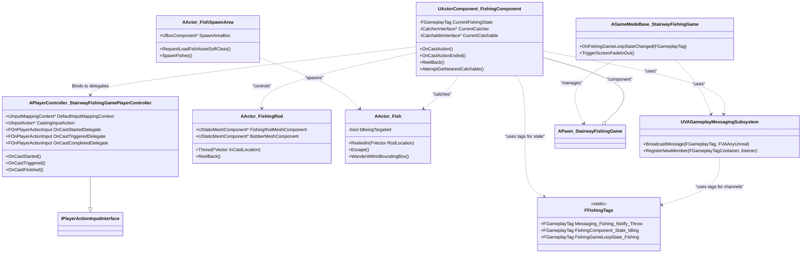
This diagram illustrates the primary classes and their relationships. The `PlayerController` captures input and invokes delegates that the `FishingComponent` listens to. The `FishingComponent` then drives the behavior of the `FishingRod` and interacts with `Fish` actors, which are spawned by the `FishSpawnArea`. All major state changes and events are communicated via the `VAGameplayMessagingSubsystem` using channels defined in `FFishingTags`.

Sources: [Source/FishingFeature/Private/ActorComponent/ActorComponent_FishingComponent.cpp](), [Source/StairwayFishingGameCore/Public/PlayerController/PlayerController_StairwayFishingGamePlayerController.h](), [Source/FishingFeature/Public/Actor/Actor_FishSpawnArea.h](), [Source/VAGameplayMessaging/Private/GameInstanceSubsystem/VAGameplayMessagingSubsystem.cpp](), [Source/FishingGameplayTags/Public/FishingTags.h]()

## Core Gameplay Loop: Casting and Catching

The fishing process is a multi-stage sequence initiated by the player and managed by the `UActorComponent_FishingComponent`. It flows from input capture, through casting and waiting, to finally reeling in a fish.

### Input Handling

Player input is the entry point for the fishing mechanic. The `APlayerController_StairwayFishingGamePlayerController` is responsible for binding hardware input to gameplay actions.

1.  On `BeginPlay`, the controller maps the `DefaultInputMappingContext`.
2.  The `CastingInputAction` is bound to three separate trigger events: `Started`, `Triggered`, and `Completed`.
3.  Each event calls a corresponding handler (`OnCastStarted`, `OnCastTriggered`, `OnCastFinished`), which in turn executes a public delegate (`OnCastStartedDelegate`, etc.).
4.  The `UActorComponent_FishingComponent` binds its own functions (`OnCastAction`, `OnCastActionEnded`) to these delegates to initiate and conclude the fishing actions.

Sources: [Source/StairwayFishingGameCore/Private/PlayerController/PlayerController_StairwayFishingGamePlayerController.cpp:13-22, 60-77](), [Source/FishingFeature/Private/ActorComponent/ActorComponent_FishingComponent.cpp:333-356]()

```mermaid
sequenceDiagram
    participant Player
    participant PC as APlayerController
    participant FC as UActorComponent_FishingComponent
    participant UI

    Player->>+PC: Press and Hold Cast Button
    PC->>PC: OnCastStarted()
    PC-->>FC: OnCastStartedDelegate.Execute()
    FC->>+FC: OnCastAction(elapsedTime)
    FC->>FC: ToggleDecalVisibility(true)
    loop While Button is Held
        PC->>PC: OnCastTriggered()
        PC-->>FC: OnCastTriggeredDelegate.Execute()
        FC->>FC: OnCastAction(elapsedTime)
        FC->>FC: DetermineCastLocation(elapsedTime)
        FC-->>UI: BroadcastUIMessage(progress)
    end
    Player->>-PC: Release Cast Button
    PC->>PC: OnCastFinished()
    PC-->>FC: OnCastCompletedDelegate.Execute()
    FC->>FC: OnCastActionEnded()
    FC->>-FC: ToggleDecalVisibility(false)
```
This sequence shows how player input is translated into continuous updates for the casting power and visual feedback, culminating in the final cast action when the input is released.

### The Fishing Sequence

Once the cast is initiated by `OnCastActionEnded`, a complex sequence of events involving animations, timelines, and messaging occurs to simulate the fishing process.

```mermaid
sequenceDiagram
    autonumber
    participant FC as FishingComponent
    participant GMS as VAGameplayMessagingSubsystem
    participant Anim as AnimInstance
    participant Rod as AActor_FishingRod
    participant Fish as AActor_Fish
    participant GM as GameMode

    FC->>+GMS: BroadcastMessage(AnimInstance_State_Throwing)
    GMS-->>Anim: OnGameplayMessageReceived
    Anim->>Anim: Play Throw Montage
    Note right of Anim: Montage contains Anim Notifies
    Anim->>+GMS: BroadcastMessage(Notify_Throw)
    GMS-->>-FC: OnThrowNotifyMessageReceived
    FC->>+Rod: Throw(CastLocation)
    Rod->>Rod: ThrowReelInTimeline.PlayFromStart()
    Note over Rod: Animates bobber to water
    Rod-->>-FC: CatchableLandsOnWaterDelegate.Execute()
    FC->>+FC: OnBobberLandsOnWater()
    FC->>FC: AttemptGetNearestCatchable()
    FC->>+Fish: ReeledIn(RodLocation)
    Fish->>Fish: ReeledInTimeline.PlayFromStart()
    Note over Fish: Animates fish towards bobber
    FC->>FC: StartWaitingForFishTimer()
    FC-->>-FC: CurrentFishingState = WaitingForFish
    
    alt Player Reels In Successfully
        Note over FC: Timer completes, player reels
        FC->>+GMS: BroadcastMessage(AnimInstance_State_Reeling_In)
        GMS-->>Anim: OnGameplayMessageReceived
        Anim->>Anim: Play Reel In Montage
        Anim->>+GMS: BroadcastMessage(Notify_ReelDone)
        GMS-->>-FC: OnReelDoneNotifyMessageReceived
        FC->>+GMS: BroadcastMessage(GameState_StateChange, ShowFish)
        GMS-->>-GM: OnGameplayMessageReceived
        GM->>GM: OnFishingGameLoopStateChanged(ShowFish)
    else Player Fails or Releases Early
        FC->>+Fish: Escape()
        Fish->>Fish: EscapeTimeline.PlayFromStart()
        Fish-->>-Fish: bBeingTargeted = false
        FC->>FC: ReelBack()
        FC-->>-FC: ResetStateAndTimer()
    end
```
This diagram details the event-driven flow of the fishing action. The `FishingComponent` initiates state changes by sending messages, which are received by the Animation Instance. The animation, in turn, sends notify messages back at key moments, driving the logic forward without the `FishingComponent` needing to know about animation specifics.

Sources: [Source/FishingFeature/Private/ActorComponent/ActorComponent_FishingComponent.cpp:525-540, 584-593, 735-742](), [Source/FishingFeature/Private/Actor/Actor_FishingRod.cpp:32-36, 185-190](), [Source/FishingFeature/Private/Actor/Actor_Fish.cpp:35-41, 260-265](), [Source/StairwayFishingGameCore/Private/GameModeBase/GameModeBase_StairwayFishingGame.cpp:20-22]()

## Key Components and Actors

### `UActorComponent_FishingComponent`

This is the central class of the feature, responsible for managing the entire fishing lifecycle.

| Responsibility | Description |
| :--- | :--- |
| **State Management** | Uses `FGameplayTag` to track the current state (e.g., `Idling`, `Throwing`, `WaitingForFish`). |
| **Input Binding** | Binds to delegates from the `PlayerController` to react to player input. |
| **Actor Spawning** | Asynchronously loads and spawns the `AActor_FishingRod`. |
| **Logic Orchestration** | Calls functions on the `FishingRod` and `Fish` actors at appropriate times. |
| **Event Handling** | Listens for messages (e.g., animation notifies) from the `VAGameplayMessagingSubsystem`. |
| **Physics/Tracing** | Performs line traces to find a valid water surface for casting and sphere traces to find nearby fish. |

The component's behavior is highly configurable through `UDataAsset_FishingComponentConfig`, which defines properties like cast range, timing, and socket names for attaching the rod.

Sources: [Source/FishingFeature/Private/ActorComponent/ActorComponent_FishingComponent.cpp]()

### `AActor_FishingRod`

This actor is the visual representation of the fishing rod and bobber.

-   **Components**: It consists of a `FishingRodMeshComponent` (the rod) and a `BobberMeshComponent`. A `CatchableAttachPoint` is attached to the bobber for holding the fish.
-   **Animation**: It does not use skeletal animation. Instead, it uses `FTimeline` objects driven by `UCurveFloat` assets to smoothly interpolate the bobber's position when `Throw()` and `ReelBack()` are called. This provides a simple yet effective procedural animation.

Sources: [Source/FishingFeature/Private/Actor/Actor_FishingRod.cpp:16-28, 102-121]()

### `AActor_Fish`

Represents a single fish that can be caught.

-   **AI Behavior**: When not targeted, the fish performs a simple `WanderWithinBoundingBox` behavior, moving towards random points within the confines of its `AActor_FishSpawnArea`.
-   **State**: A boolean `bBeingTargeted` flag controls whether the fish is wandering or being interacted with.
-   **Interaction**: Implements the `ICatchableInterface`. The `ReeledIn` function triggers a timeline to move the fish towards the bobber. The `Escape` function triggers a different timeline to return it to its initial location.

Sources: [Source/FishingFeature/Private/Actor/Actor_Fish.cpp:35-47, 137-153]()

### `AActor_FishSpawnArea`

This actor defines a volume in the world where fish can be spawned and exist.

-   **Spawning Logic**: On `BeginPlay`, it asynchronously requests to load the fish actor's class from a `TSoftClassPtr` defined in its config data asset.
-   **Async Loading**: It uses `UAssetManager::GetStreamableManager().RequestAsyncLoad` to prevent hitches from loading the fish asset.
-   **Volume**: Once the asset is loaded, it spawns a configured number of fish at random locations within its `UBoxComponent` bounds. It also passes its bounds to each fish so they know the area within which they can wander.

Sources: [Source/FishingFeature/Private/Actor/Actor_FishSpawnArea.cpp:40-50, 93-100]()

## State and Event Management

The system is heavily reliant on a decoupled messaging system and gameplay tags for managing state and communication.

### Gameplay Tags (`FFishingTags`)

A central singleton class, `FFishingTags`, defines all gameplay tags used by the system. This prevents errors from typos and provides a single source of truth for all tags.

| Tag Category | Example | Purpose |
| :--- | :--- | :--- |
| **Messaging Channel** | `Messaging.Fishing.Notify.Throw` | Used as a channel ID for broadcasting and listening to events. |
| **Anim Instance State** | `AnimInstance.Fishing.State.Throwing` | Sent to the Animation Blueprint to trigger a specific animation state. |
| **Component State** | `FishingComponent.State.WaitingForFish` | Used internally by `FishingComponent` to manage its state machine. |
| **Game Loop State** | `FishingGameLoopState.ShowFish` | A high-level state managed by the Game Mode. |

Sources: [Source/FishingGameplayTags/Public/FishingTags.h:23-132]()

### Game Mode State Transitions

The `AGameModeBase_StairwayFishingGame` handles high-level game states that affect the entire experience, such as switching between active gameplay and a cinematic view of a caught fish.

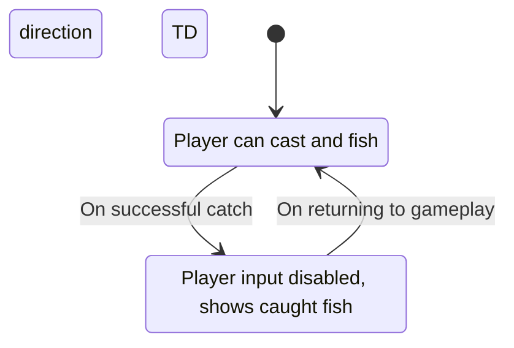
This state transition is handled in `OnFishingGameLoopStateChanged`. When the state changes, this function:
1.  Toggles player input between `FInputModeGameOnly` and `FInputModeUIOnly`.
2.  Initiates a camera fade-out.
3.  Switches the active camera on the pawn (which implements `ISwitchableFishingViewInterface`).
4.  Broadcasts a `Messaging_GameMode_StateChangeFinish` message.
5.  Initiates a camera fade-in.

Sources: [Source/StairwayFishingGameCore/Private/GameModeBase/GameModeBase_StairwayFishingGame.cpp:20-84](), [Source/StairwayFishingGameCore/Private/Pawn/Pawn_StairwayFishingGame.cpp:64-82]()

## Conclusion

The fishing system in this project is a well-structured and scalable feature built on modern Unreal Engine patterns. Its strength lies in its modular, component-based design and its use of a decoupled messaging system for communication. The data-driven configuration via `UDataAsset`s makes it easy for designers to tweak and balance the gameplay without programmer intervention. The clear separation of concerns—input handling in the `PlayerController`, core logic in the `ActorComponent`, and visual representation in various `Actor` classes—makes the system maintainable and extensible.

---

<a id='page-getting-started'></a>

## Getting Started

### Related Pages

Related topics: [Home](#page-home), [Functional Testing](#page-functional-testing)

<details>
<summary>Relevant source files</summary>

The following files were used as context for generating this wiki page:

- [Source\StairwayFishingGameCore\Private\GameModeBase\GameModeBase_StairwayFishingGame.cpp](https://github.com/rezonated/Unreal-Fishing-Test/blob/main/Source/StairwayFishingGameCore/Private/GameModeBase/GameModeBase_StairwayFishingGame.cpp)
- [Source\FishingFeature\Private\Actor\Actor_FishSpawnArea.cpp](https://github.com/rezonated/Unreal-Fishing-Test/blob/main/Source/FishingFeature/Private/Actor/Actor_FishSpawnArea.cpp)
- [Source\FishingFeature\Private\ActorComponent\ActorComponent_FishingComponent.cpp](https://github.com/rezonated/Unreal-Fishing-Test/blob/main/Source/FishingFeature/Private/ActorComponent/ActorComponent_FishingComponent.cpp)
- [Source\FishingFeature\Private\Actor\Actor_FishingRod.cpp](https://github.com/rezonated/Unreal-Fishing-Test/blob/main/Source/FishingFeature/Private/Actor/Actor_FishingRod.cpp)
- [Source\StairwayFishingGameCore\Private\PlayerController\PlayerController_StairwayFishingGamePlayerController.cpp](https://github.com/rezonated/Unreal-Fishing-Test/blob/main/Source/StairwayFishingGameCore/Private/PlayerController/PlayerController_StairwayFishingGamePlayerController.cpp)
- [Source\StairwayFishingGameCore\Private\Pawn\Pawn_StairwayFishingGame.cpp](https://github.com/rezonated/Unreal-Fishing-Test/blob/main/Source/StairwayFishingGameCore/Private/Pawn/Pawn_StairwayFishingGame.cpp)
- [Source\FishingFeature\Private\Actor\Actor_Fish.cpp](https://github.com/rezonated/Unreal-Fishing-Test/blob/main/Source/FishingFeature/Private/Actor/Actor_Fish.cpp)
- [Source\VAGameplayMessaging\Private\GameInstanceSubsystem\VAGameplayMessagingSubsystem.cpp](https://github.com/rezonated/Unreal-Fishing-Test/blob/main/Source/VAGameplayMessaging/Private/GameInstanceSubsystem/VAGameplayMessagingSubsystem.cpp)
- [Source\FishingGameplayTags\Public\FishingTags.h](https://github.com/rezonated/Unreal-Fishing-Test/blob/main/Source/FishingGameplayTags/Public/FishingTags.h)
- [Source\FishingFeatureEditor\Private\DetailCustomization\DetailCustomization_FishingComponent.cpp](https://github.com/rezonated/Unreal-Fishing-Test/blob/main/Source/FishingFeatureEditor/Private/DetailCustomization/DetailCustomization_FishingComponent.cpp)
</details>

# Getting Started

This document provides a comprehensive technical overview of the fishing gameplay system in the Unreal-Fishing-Test project. The system is a self-contained feature designed to handle all aspects of fishing, from casting a line to catching a fish. It is built upon several core components, a data-driven configuration approach using Data Assets, and a decoupled messaging system for communication between different parts of the game. The core logic is encapsulated within an Actor Component, making it portable and easy to attach to any player character.

The architecture emphasizes separation of concerns: player input, fishing logic, actor behaviors (fish, fishing rod), and game state transitions are all handled by distinct classes. Communication is facilitated by the `VAGameplayMessagingSubsystem`, which uses `FGameplayTag` as channels to broadcast and listen for events, avoiding hard references between components. This guide will detail the key components, the overall gameplay flow, the state management system, and the configuration options available to designers.

## Core Architecture and Components

The fishing system is composed of several key classes that work together to create the full gameplay experience. The main components are the Player Pawn, the Fishing Component, the Fishing Rod, the Fish, and the Fish Spawn Area.

Sources: [Source\StairwayFishingGameCore\Private\Pawn\Pawn_StairwayFishingGame.cpp](), [Source\FishingFeature\Private\ActorComponent\ActorComponent_FishingComponent.cpp](), [Source\FishingFeature\Private\Actor\Actor_FishingRod.cpp](), [Source\FishingFeature\Private\Actor\Actor_Fish.cpp](), [Source\FishingFeature\Private\Actor\Actor_FishSpawnArea.cpp]()

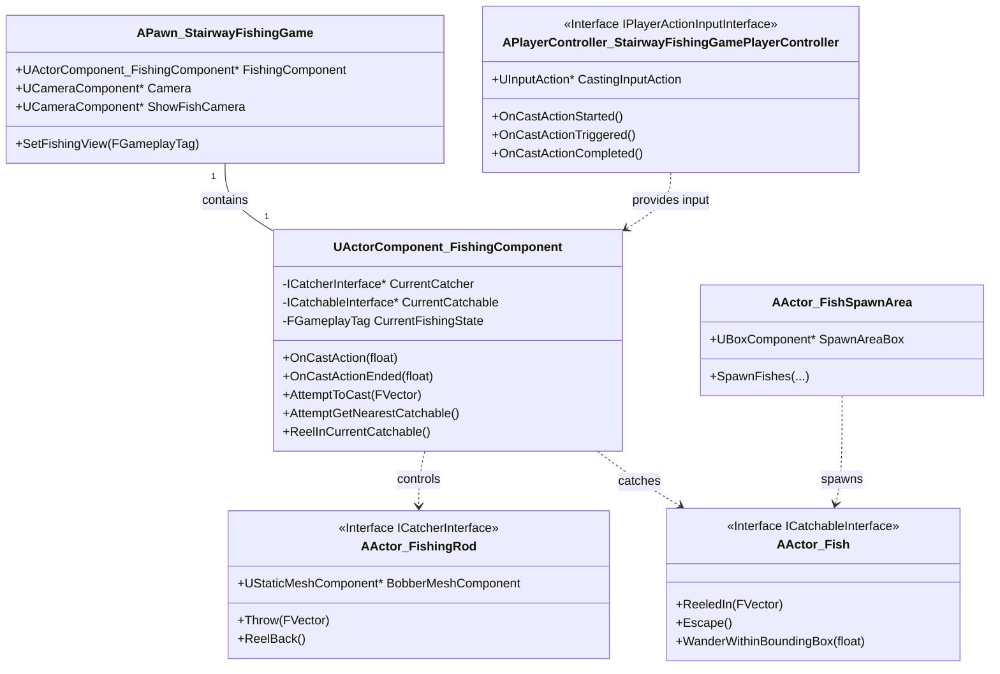
This diagram illustrates the primary classes and their relationships within the fishing system.

Sources: [Source\StairwayFishingGameCore\Public\PlayerController\PlayerController_StairwayFishingGamePlayerController.h](), [Source\StairwayFishingGameCore\Private\Pawn\Pawn_StairwayFishingGame.cpp](), [Source\FishingFeature\Private\ActorComponent\ActorComponent_FishingComponent.cpp](), [Source\FishingFeature\Public\Actor\Actor_FishSpawnArea.h]()

### Key Components

| Component                                                          | Description                                                                                                                                                                                               | Source File                                                                                                                                      |
| ------------------------------------------------------------------ | --------------------------------------------------------------------------------------------------------------------------------------------------------------------------------------------------------- | ------------------------------------------------------------------------------------------------------------------------------------------------ |
| `APawn_StairwayFishingGame`                                        | The player character pawn. It hosts the `UActorComponent_FishingComponent` and manages the active camera between the main gameplay view and the "show fish" view.                                           | `Pawn/Pawn_StairwayFishingGame.h`                                                                                                                |
| `UActorComponent_FishingComponent`                                 | The central logic hub for the fishing mechanic. It manages states, handles player input for casting, detects catchable fish, and controls the fishing rod and caught fish.                                   | `ActorComponent/ActorComponent_FishingComponent.h`                                                                                               |
| `APlayerController_StairwayFishingGamePlayerController`            | Implements `IPlayerActionInputInterface` to handle raw input from Unreal's Enhanced Input system. It binds the `CastingInputAction` and broadcasts delegates for `Started`, `Triggered`, and `Completed` events. | `PlayerController/PlayerController_StairwayFishingGamePlayerController.h`                                                                        |
| `AActor_FishSpawnArea`                                             | An actor responsible for spawning `AActor_Fish` instances within a defined `UBoxComponent` volume at the start of the game. It asynchronously loads the fish asset before spawning.                         | `Actor/Actor_FishSpawnArea.h`                                                                                                                    |
| `AActor_Fish`                                                      | Represents a catchable fish. It implements the `ICatchableInterface`, manages its own wandering movement within its spawn area, and handles being reeled in or escaping.                                      | `Actor/Actor_Fish.h`                                                                                                                             |
| `AActor_FishingRod`                                                | The visual representation of the fishing rod and bobber. It implements the `ICatcherInterface` and uses timelines to animate the bobber being thrown and reeled back.                                         | `Actor/Actor_FishingRod.h`                                                                                                                       |
| `AGameModeBase_StairwayFishingGame`                                | Manages the high-level game loop state transitions. It listens for state change requests and orchestrates screen fades and player input mode changes between "fishing" and "show fish" states.                | `GameModeBase/GameModeBase_StairwayFishingGame.h`                                                                                                |

## Gameplay Flow

The fishing process follows a well-defined sequence of events, from game initialization to catching a fish. This flow is managed by the core components and driven by player input and a messaging system.

### Initialization and Fish Spawning

When the level starts, the `AActor_FishSpawnArea` is responsible for populating the water with fish.

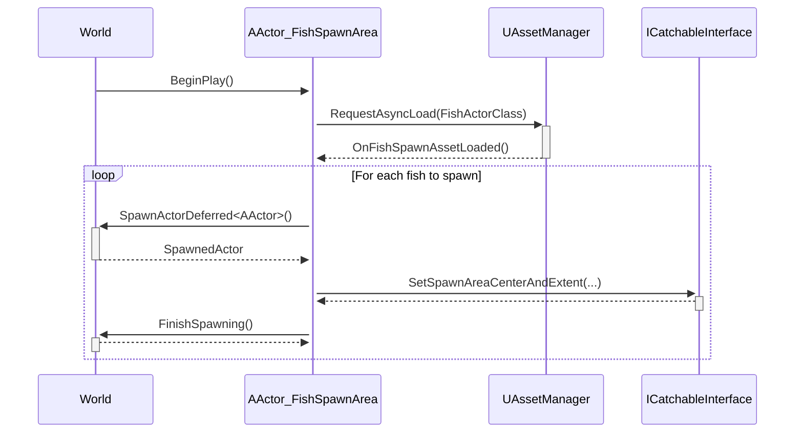
This sequence shows the asynchronous loading and subsequent spawning of fish actors within the defined spawn area. The spawn area provides its bounds to each fish so they can wander within it.

Sources: [Source\FishingFeature\Private\Actor\Actor_FishSpawnArea.cpp:32-40](), [Source\FishingFeature\Private\Actor\Actor_FishSpawnArea.cpp:66-107]()

### The Casting Process

The casting process begins when the player presses and holds the cast input action. The duration of the hold determines the casting distance.

1.  **Input Handling**: The `APlayerController_StairwayFishingGamePlayerController` captures the `Started`, `Triggered`, and `Completed` events from the `CastingInputAction`. These events are broadcast via delegates.
2.  **Casting Logic**: The `UActorComponent_FishingComponent` listens to these delegates.
    *   On `Started`, it begins tracking the cast time and shows a target decal on the water.
    *   While `Triggered` (held down), it continuously updates the cast location based on the elapsed time, mapping it to a min/max distance. A line trace from the calculated position downwards determines the final water surface location.
    *   On `Completed` (released), it triggers the throwing animation and instructs the `AActor_FishingRod` to throw its bobber.

Sources: [Source\StairwayFishingGameCore\Private\PlayerController\PlayerController_StairwayFishingGamePlayerController.cpp:45-70](), [Source\FishingFeature\Private\ActorComponent\ActorComponent_FishingComponent.cpp:559-620]()

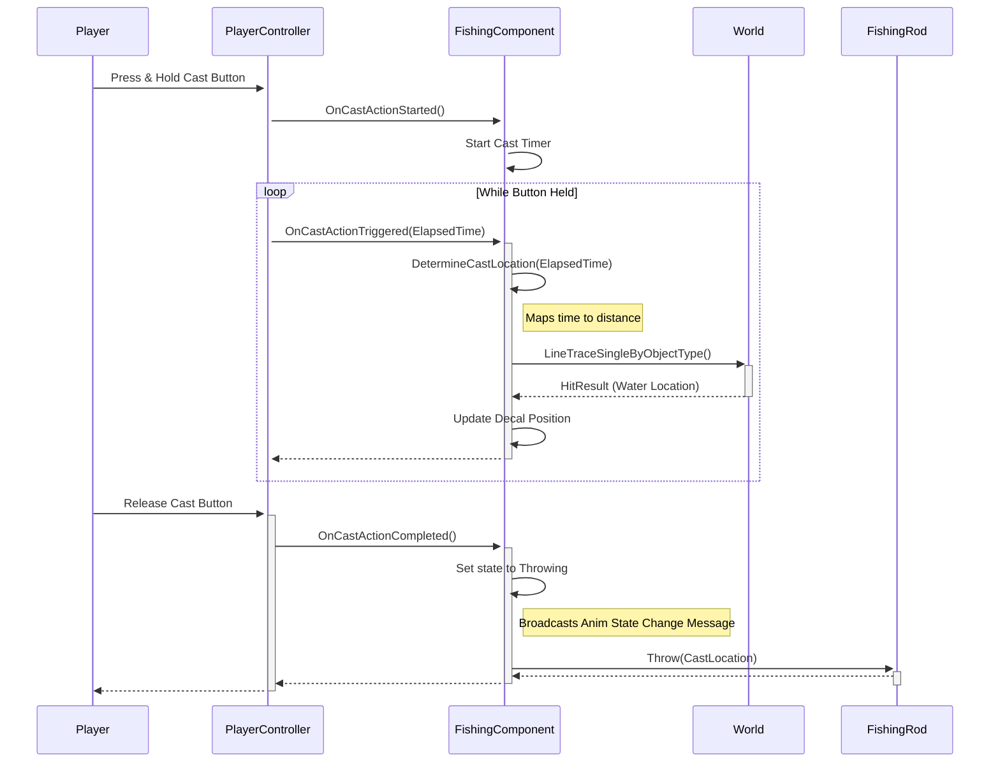
This diagram details the flow from player input to the bobber being cast into the water.

Sources: [Source\FishingFeature\Private\ActorComponent\ActorComponent_FishingComponent.cpp:559-620](), [Source\FishingFeature\Private\Actor\Actor_FishingRod.cpp:24-29]()

### Catching a Fish

Once the bobber lands in the water, the `FishingComponent` attempts to find a nearby fish.

1.  **Bobber Lands**: The `AActor_FishingRod` notifies the `FishingComponent` via a delegate (`OnLandsOnWater`) when its throwing timeline is complete.
2.  **Find Catchable**: The `FishingComponent` performs a sphere trace around the bobber's location to find all actors implementing `ICatchableInterface`. It sorts these actors by distance and selects the nearest one as `CurrentCatchable`.
3.  **Luring the Fish**: The `FishingComponent` calls `ReeledIn()` on the `CurrentCatchable` (`AActor_Fish`). The fish then uses a timeline to move from its current position to the bobber's location.
4.  **Waiting State**: The `FishingComponent` enters the `WaitingForFish` state and starts a timer (`TimeToFish`). If the player does not act before this timer runs out, the fish escapes.
5.  **Reeling In**: If the player presses the cast button again while in the `WaitingForFish` state, the catch is successful. The component transitions to the `Reeling_In` state, and a message is sent to the animation system to play the reeling animation.

Sources: [Source\FishingFeature\Private\ActorComponent\ActorComponent_FishingComponent.cpp:457-463](), [Source\FishingFeature\Private\ActorComponent\ActorComponent_FishingComponent.cpp:411-455](), [Source\FishingFeature\Private\Actor\Actor_Fish.cpp:26-35]()

## State Management and Messaging

The system relies heavily on Gameplay Tags for both internal state management and for communication via a global messaging subsystem.

### Component State Machine

The `UActorComponent_FishingComponent` uses a set of `FGameplayTag` variables to manage its internal state, ensuring operations occur in the correct sequence.

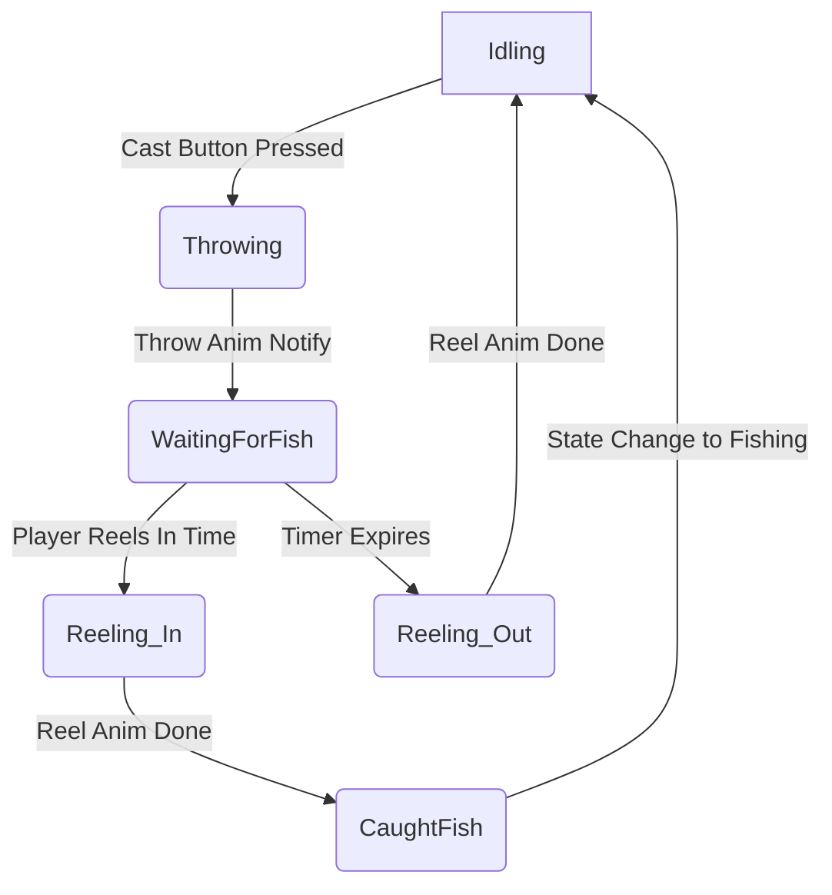
This state diagram shows the primary states of the `FishingComponent` and the transitions between them.

Sources: [Source\FishingGameplayTags\Private\FishingTags.cpp:21-26](), [Source\FishingFeature\Private\ActorComponent\ActorComponent_FishingComponent.cpp]()

### Messaging System

Decoupled communication is achieved using `UVAGameplayMessagingSubsystem`. Components can broadcast messages on specific `FGameplayTag` channels, and other components can create listeners for those channels without needing direct references.

**Key Messaging Channels:**

| Channel Tag                               | Payload Type  | Description                                                                                                                                     |
| ----------------------------------------- | ------------- | ----------------------------------------------------------------------------------------------------------------------------------------------- |
| `Messaging.Fishing.UI.Cast.Update`        | `float`       | Broadcasts the current charge of the cast (0.0 to 1.0) for UI elements like a power bar.                                                          |
| `Messaging.Fishing.AnimInstance.StateChange` | `FGameplayTag`| Sent to the Animation Blueprint to switch between animation states (e.g., `Idling`, `Throwing`, `Reeling_In`).                                     |
| `Messaging.GameState.StateChange`         | `FGameplayTag`| Broadcast when a high-level game state change is required, such as from `Fishing` to `ShowFish`. This is received by the `GameState`.               |
| `Messaging.GameMode.StateChange.Finish`   | `FGameplayTag`| Broadcast by the `GameMode` after its state transition (including screen fade) is complete. The `FishingComponent` listens for this to finalize the catch. |
| `Messaging.Fishing.Notify.Throw`          | Empty         | An animation notify that signals the exact moment in an animation the bobber should be thrown. The `FishingComponent` listens for this.             |
| `Messaging.Fishing.Notify.ReelDone`       | Empty         | An animation notify that signals the reeling animation has finished.                                                                            |

Sources: [Source\FishingGameplayTags\Private\FishingTags.cpp:7-15](), [Source\VAGameplayMessaging\Private\GameInstanceSubsystem\VAGameplayMessagingSubsystem.cpp](), [Source\FishingFeature\Private\ActorComponent\ActorComponent_FishingComponent.cpp:65-75]()

The `VAGameplayMessagingSubsystem` uses a `TMap<FGameplayTag, FChannelMembersData>` to keep track of all active listeners for each channel. When a message is broadcast, it looks up the channel tag in the map and iterates through the list of listeners, invoking their `OnGameplayMessageReceived` delegate.

Sources: [Source\VAGameplayMessaging\Private\GameInstanceSubsystem\VAGameplayMessagingSubsystem.cpp:77-113]()

## Configuration via Data Assets

The fishing system is highly configurable through the use of `UDataAsset`. This allows designers to tweak gameplay parameters without modifying code.

-   **`DataAsset_FishingComponentConfig`**: Configures the core fishing mechanics.
    -   `MaximumTimeToCast`: How long the player can hold the button to charge a cast.
    -   `MinimumCastDistance` / `MaximumCastDistance`: The range of the cast distance.
    -   `CastRadius`: The radius of the sphere trace used to find fish.
    -   `TimeToFish`: The window of time the player has to reel in a fish after it bites.
    -   `FishingRodActorClass`: A soft reference to the `AActor_FishingRod` blueprint to spawn.
-   **`DataAsset_ActorFishConfig`**: Configures the behavior of an individual fish.
    -   `FishRotationSpeed` / `FishMoveSpeed`: Controls the speed of the fish's wandering movement.
    -   `FishReelingInCurve`: A `UCurveFloat` that defines the fish's movement as it's lured to the bobber.
    -   `FishBiteSound`: The sound to play when the fish is successfully caught.
-   **`DataAsset_FishSpawnAreaConfig`**: Configures the fish spawning logic.
    -   `FishActorClass`: A soft reference to the `AActor_Fish` blueprint to spawn.
    -   `FishSpawnAmount`: The number of fish to spawn in the area.
-   **`DataAsset_FishingRodConfig`**: Configures the fishing rod's animations.
    -   `BobberReelInCurve`: A `UCurveFloat` defining the bobber's trajectory when thrown.
    -   `BobberReelOutCurve`: A `UCurveFloat` defining the bobber's movement when reeled back.

## Editor Enhancements

To improve the workflow for designers, a custom details panel customization is implemented for the `UActorComponent_FishingComponent`.

The `FDetailCustomization_FishingComponent` class provides a user-friendly dropdown menu for selecting socket names (`FishingPoleSocketName`, `CarryFishSocketName`) in the editor. Instead of requiring designers to manually type in socket names, this customization inspects the `OwnerSkeletalMesh` property within the component's configuration. It then populates a `SComboBox` with all available bone and socket names from that mesh, preventing typos and making setup much faster and more reliable. The dropdown is automatically updated whenever the assigned `SkeletalMesh` is changed.

Sources: [Source\FishingFeatureEditor\Private\DetailCustomization\DetailCustomization_FishingComponent.cpp:70-149]()

---

<a id='page-module-overview'></a>

## Module Overview

### Related Pages

Related topics: [Core Gameplay Classes](#page-core-classes), [Messaging System (VAGameplayMessaging)](#page-messaging-system)

<details>
<summary>Relevant source files</summary>

The following files were used as context for generating this wiki page:

- [Source/StairwayFishingGameCore/Private/GameModeBase/GameModeBase_StairwayFishingGame.cpp](https://github.com/rezonated/Unreal-Fishing-Test/blob/main/Source/StairwayFishingGameCore/Private/GameModeBase/GameModeBase_StairwayFishingGame.cpp)
- [Source/FishingFeature/Private/ActorComponent/ActorComponent_FishingComponent.cpp](https://github.com/rezonated/Unreal-Fishing-Test/blob/main/Source/FishingFeature/Private/ActorComponent/ActorComponent_FishingComponent.cpp)
- [Source/VAGameplayMessaging/Private/GameInstanceSubsystem/VAGameplayMessagingSubsystem.cpp](https://github.com/rezonated/Unreal-Fishing-Test/blob/main/Source/VAGameplayMessaging/Private/GameInstanceSubsystem/VAGameplayMessagingSubsystem.cpp)
- [Source/StairwayFishingGameCore/Private/GameStateBase/GameStateBase_StairwayFishingGame.cpp](https://github.com/rezonated/Unreal-Fishing-Test/blob/main/Source/StairwayFishingGameCore/Private/GameStateBase/GameStateBase_StairwayFishingGame.cpp)
- [Source/StairwayFishingGameCore/Private/PlayerController/PlayerController_StairwayFishingGamePlayerController.cpp](https://github.com/rezonated/Unreal-Fishing-Test/blob/main/Source/StairwayFishingGameCore/Private/PlayerController/PlayerController_StairwayFishingGamePlayerController.cpp)
- [Source/FishingGameplayTags/Public/FishingTags.h](https://github.com/rezonated/Unreal-Fishing-Test/blob/main/Source/FishingGameplayTags/Public/FishingTags.h)
- [Source/FishingFeature/Private/Actor/Actor_Fish.cpp](https://github.com/rezonated/Unreal-Fishing-Test/blob/main/Source/FishingFeature/Private/Actor/Actor_Fish.cpp)
- [Source/FishingFeature/Private/Actor/Actor_FishingRod.cpp](https://github.com/rezonated/Unreal-Fishing-Test/blob/main/Source/FishingFeature/Private/Actor/Actor_FishingRod.cpp)
- [Source/StairwayFishingGameCore/Private/Pawn/Pawn_StairwayFishingGame.cpp](https://github.com/rezonated/Unreal-Fishing-Test/blob/main/Source/StairwayFishingGameCore/Private/Pawn/Pawn_StairwayFishingGame.cpp)
- [Source/FishingFeatureEditor/Private/DetailCustomization/DetailCustomization_FishingComponent.cpp](https://github.com/rezonated/Unreal-Fishing-Test/blob/main/Source/FishingFeatureEditor/Private/DetailCustomization/DetailCustomization_FishingComponent.cpp)

</details>

# Module Overview

This document provides a technical overview of the Unreal-Fishing-Test project, a modular fishing game system built in Unreal Engine. The architecture is designed to be event-driven and decoupled, separating the core gameplay logic, the fishing feature itself, and the messaging system into distinct modules. This separation facilitates maintenance, testing, and potential expansion of features.

The system's backbone is a custom gameplay messaging subsystem, `VAGameplayMessagingSubsystem`, which uses `FGameplayTag` channels for communication. This allows various components, such as the `PlayerController`, `FishingComponent`, and `GameMode`, to interact without direct dependencies. The core gameplay loop is managed through a state machine implemented across the `GameState` and `GameMode`, transitioning the player between fishing and displaying the catch.

## Core Modules

The project is structured into several key modules, each with a specific responsibility.

| Module                    | Responsibility                                                                                                     |
| ------------------------- | ------------------------------------------------------------------------------------------------------------------ |
| `StairwayFishingGameCore` | Manages the main game loop, player pawn, controller, game mode, and game state.                                    |
| `FishingFeature`          | Contains all logic and assets for the fishing mechanic, including the fishing component, rod, fish, and spawn areas. |
| `VAGameplayMessaging`     | Provides a global, event-driven messaging system for decoupled communication between modules.                      |
| `FishingGameplayTags`     | Defines and registers all `FGameplayTag` constants used for messaging and state management.                        |
| `FishingFeatureEditor`    | Implements Unreal Editor customizations to improve the development workflow, such as custom details panels.        |

### Module Dependency Diagram

The following diagram illustrates the dependencies between the primary modules. The core game logic depends on the fishing feature and the messaging system, while the feature itself also relies on messaging to communicate events.

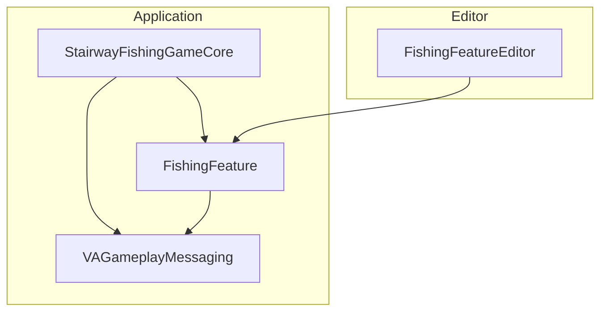
*Sources: [StairwayFishingGameCore/StairwayFishingGameCore.Build.cs](), [FishingFeature/FishingFeature.Build.cs](), [VAGameplayMessaging/VAGameplayMessaging.Build.cs]()*

## Gameplay Flow and State Management

The primary gameplay loop is managed by a state machine pattern distributed between `AGameStateBase_StairwayFishingGame` and `AGameModeBase_StairwayFishingGame`.

### State Management

-   **`AGameStateBase_StairwayFishingGame`**: This class is responsible for maintaining the current state of the game loop, stored in the `CurrentFishingGameLoopState` property. It listens for state change requests on the `Messaging_GameState_StateChange` channel. When a new state is received, it updates its internal state and broadcasts the change via its `OnFishingGameLoopStateChanged` delegate.
    *Sources: [Source/StairwayFishingGameCore/Public/GameStateBase/GameStateBase_StairwayFishingGame.h:35](), [Source/StairwayFishingGameCore/Private/GameStateBase/GameStateBase_StairwayFishingGame.cpp:15-19]()*

-   **`AGameModeBase_StairwayFishingGame`**: The game mode listens to the `GameState`'s `OnFishingGameLoopStateChanged` delegate. Upon a state change, it orchestrates the necessary transitions, such as triggering camera fades, changing player input modes (e.g., from `FInputModeGameOnly` to `FInputModeUIOnly`), and instructing the player pawn to switch cameras via the `ISwitchableFishingViewInterface`.
    *Sources: [Source/StairwayFishingGameCore/Private/GameModeBase/GameModeBase_StairwayFishingGame.cpp:18-80]()*

### Gameplay Sequence Diagram

This diagram illustrates the complete sequence of events from casting the line to catching a fish and transitioning to the "Show Fish" view.

```mermaid
sequenceDiagram
    participant Player as actor
    participant PC as PlayerController
    participant FC as FishingComponent
    participant FR as FishingRod
    participant Fish as FishActor
    participant GS as GameState
    participant GM as GameMode
    participant Pawn

    Player->>+PC: Press/Hold Cast Action
    PC->>FC: OnCastActionTriggered()
    FC->>FC: Calculate Cast Distance
    Player->>-PC: Release Cast Action
    PC->>FC: OnCastActionCompleted()
    FC->>VAGameplayMessaging: Broadcast(AnimInstance_State_Throwing)
    Note over FC: Anim BP triggers "Throw" notify

    VAGameplayMessaging-->>FC: OnThrowNotifyMessageReceived()
    FC->>+FR: Throw(CastLocation)
    FR-->>-FC: CatchableLandsOnWaterDelegate.Execute()
    FC->>FC: Find nearest Fish
    FC->>+Fish: ReeledIn(RodLocation)
    Fish-->>-FC: (Fish moves to bobber)

    Player->>+PC: Press Cast Action (to reel)
    PC->>FC: OnCastActionCompleted()
    FC->>FR: ReelBack()
    FC->>VAGameplayMessaging: Broadcast(AnimInstance_State_Reeling_In)
    Note over FC: Anim BP triggers "ReelDone" notify

    VAGameplayMessaging-->>FC: OnReelDoneNotifyMessageReceived()
    FC->>VAGameplayMessaging: Broadcast(GameState_StateChange, "ShowFish")

    VAGameplayMessaging-->>+GS: OnGameStateChangeMessageReceived()
    GS->>GS: SetCurrentFishingGameLoopState("ShowFish")
    GS->>+GM: OnFishingGameLoopStateChanged.Broadcast()
    GM->>GM: TriggerScreenFadeInOut()
    GM->>+Pawn: SetFishingView("ShowFish")
    Pawn-->>-Pawn: Switch to ShowFishCamera
    GM-->>-GS: (Transition logic)
    GM->>VAGameplayMessaging: Broadcast(GameMode_StateChangeFinish)

    VAGameplayMessaging-->>FC: OnGameModeStateChangeFinishMessageReceived()
    FC->>FC: Attach fish to player socket
```
*Sources: [Source/StairwayFishingGameCore/Private/PlayerController/PlayerController_StairwayFishingGamePlayerController.cpp:78-83](), [Source/FishingFeature/Private/ActorComponent/ActorComponent_FishingComponent.cpp:751-766, 819-835](), [Source/StairwayFishingGameCore/Private/GameStateBase/GameStateBase_StairwayFishingGame.cpp:46-59](), [Source/StairwayFishingGameCore/Private/GameModeBase/GameModeBase_StairwayFishingGame.cpp:18-80]()*

## Event-Driven Communication

The project heavily relies on the `UVAGameplayMessagingSubsystem` for decoupled communication. This system allows any object to broadcast a message on a specific `FGameplayTag` channel, and any other object to listen for messages on that channel without needing a direct reference.

-   **Broadcasting**: Messages are sent using `UVAGameplayMessagingSubsystem::BroadcastMessage`. The payload can be any struct wrapped in the `FVAAnyUnreal` type, which allows for flexible data transfer.
    *Sources: [Source/VAGameplayMessaging/Private/GameInstanceSubsystem/VAGameplayMessagingSubsystem.cpp:52-65]()*
-   **Listening**: Listeners are created using the async action `UVAGameplayMessaging_ListenForGameplayMessages::ListenForGameplayMessagesViaChannel`. This node registers itself with the subsystem and exposes a delegate (`OnGameplayMessageReceived`) that fires when a message is broadcast on the subscribed channel.
    *Sources: [Source/FishingFeature/Private/ActorComponent/ActorComponent_FishingComponent.cpp:61-65](), [Source/VAGameplayMessaging/Private/GameInstanceSubsystem/VAGameplayMessagingSubsystem.cpp:131-168]()*

### Key Gameplay Tags

Gameplay Tags are central to the messaging system, defining channels for events and states.

| Tag Category             | Tag Name                       | Purpose                                                                |
| ------------------------ | ------------------------------ | ---------------------------------------------------------------------- |
| `Messaging.Fishing`      | `UI.Cast.Update`               | Sends updates to the UI about the casting power meter.                 |
| `Messaging.Fishing`      | `Notify.Throw`                 | Fired by an animation notify to signal the moment to throw the line.   |
| `Messaging.Fishing`      | `Notify.ReelDone`              | Fired by an animation notify when the reeling animation is complete.   |
| `Messaging.Fishing`      | `AnimInstance.StateChange`     | Instructs the character's Animation Blueprint to switch states.        |
| `Messaging.GameState`    | `StateChange`                  | Requests a change in the global game loop state (e.g., to "ShowFish"). |
| `Messaging.GameMode`     | `StateChange.Finish`           | Signals that the GameMode has completed its state transition logic.    |
| `FishingGameLoopState`   | `Fishing` / `ShowFish`         | Defines the primary states of the game loop.                           |
| `FishingComponent.State` | `Idling`, `Throwing`, etc.     | Defines the internal states of the `FishingComponent`.                 |
| `AnimInstance.Fishing`   | `Idling`, `Throwing`, etc.     | Defines animation states for the character's animation blueprint.      |

*Sources: [Source/FishingGameplayTags/Public/FishingTags.h](), [Source/FishingGameplayTags/Private/FishingTags.cpp]()*

## Fishing Mechanic Implementation

The `FishingFeature` module encapsulates all components related to the act of fishing.

### Class Relationship Diagram

This diagram shows the main classes within the `FishingFeature` module and their relationships.

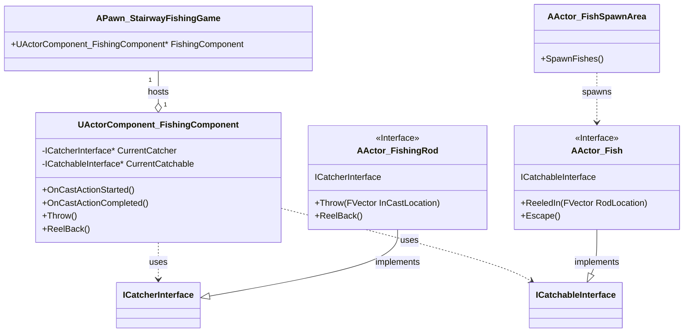

### Core Components

-   **`UActorComponent_FishingComponent`**: This is the brain of the fishing system. Attached to the player pawn, it manages the fishing state machine (`Idling`, `Throwing`, `WaitingForFish`, etc.). It binds to player input delegates from the `PlayerController`, handles the logic for casting distance, detects nearby fish using sphere traces, and orchestrates interactions between the fishing rod (`ICatcherInterface`) and the fish (`ICatchableInterface`).
    *Sources: [Source/FishingFeature/Private/ActorComponent/ActorComponent_FishingComponent.cpp]()*

-   **`AActor_FishingRod`**: Implements the `ICatcherInterface`. This actor represents the physical fishing rod and bobber. It uses `FTimeline` components driven by `UCurveFloat` assets to create smooth, data-driven animations for casting out (`Throw`) and reeling back (`ReelBack`) the bobber.
    *Sources: [Source/FishingFeature/Private/Actor/Actor_FishingRod.cpp:27-40, 94-113]()*

-   **`AActor_Fish`**: Implements the `ICatchableInterface`. Each fish is an autonomous actor that wanders within its spawn area. It uses timelines to handle its movement when it is being reeled in or when it escapes.
    *Sources: [Source/FishingFeature/Private/Actor/Actor_Fish.cpp:24-41, 117-133]()*

-   **`AActor_FishSpawnArea`**: This actor defines a volume (`UBoxComponent`) where fish can be spawned. It asynchronously loads the fish actor class using `UAssetManager` and then spawns a configured number of fish at random points within its bounds.
    *Sources: [Source/FishingFeature/Public/Actor/Actor_FishSpawnArea.h:21-26](), [Source/FishingFeature/Private/Actor/Actor_FishSpawnArea.cpp:23-32, 79-116]()*

## Input Handling

Player input is managed by Unreal Engine's Enhanced Input system.

-   **`APlayerController_StairwayFishingGamePlayerController`**: This class is responsible for setting up the input mapping context and binding to input actions. It defines a `CastingInputAction` which is bound to `Started`, `Triggered`, and `Completed` events.
-   **Delegates**: Instead of directly handling logic, the Player Controller exposes delegates (`OnCastActionStarted`, `OnCastActionTriggered`, `OnCastActionCompleted`). Other systems, like the `UActorComponent_FishingComponent`, can bind to these delegates to receive input events. This decouples the input source from the gameplay logic.

*Sources: [Source/StairwayFishingGameCore/Public/PlayerController/PlayerController_StairwayFishingGamePlayerController.h:25-35](), [Source/StairwayFishingGameCore/Private/PlayerController/PlayerController_StairwayFishingGamePlayerController.cpp:56-71]()*

## Editor Customization

To enhance the developer experience, the project includes an editor module, `FishingFeatureEditor`.

-   **`FDetailCustomization_FishingComponent`**: This class provides a custom details panel UI for the `FFishingComponentConfig` struct within the `UActorComponent_FishingComponent`. It replaces the default `FName` text fields for socket names (`FishingPoleSocketName`, `CarryFishSocketName`) with a dropdown combo box. This combo box is dynamically populated with all available bone and socket names from the `USkeletalMesh` assigned in the config, reducing errors from typos and making configuration faster and more intuitive.
    *Sources: [Source/FishingFeatureEditor/Private/DetailCustomization/DetailCustomization_FishingComponent.cpp:16-52, 73-138]()*

---

<a id='page-core-classes'></a>

## Core Gameplay Classes

### Related Pages

Related topics: [Module Overview](#page-module-overview), [Fishing Gameplay Loop](#page-gameplay-loop)

<details>
<summary>Relevant source files</summary>

The following files were used as context for generating this wiki page:

- [Source/StairwayFishingGameCore/Public/GameModeBase/GameModeBase_StairwayFishingGame.h](https://github.com/rezonated/Unreal-Fishing-Test/blob/main/Source/StairwayFishingGameCore/Public/GameModeBase/GameModeBase_StairwayFishingGame.h)
- [Source/StairwayFishingGameCore/Private/GameModeBase/GameModeBase_StairwayFishingGame.cpp](https://github.com/rezonated/Unreal-Fishing-Test/blob/main/Source/StairwayFishingGameCore/Private/GameModeBase/GameModeBase_StairwayFishingGame.cpp)
- [Source/StairwayFishingGameCore/Public/GameStateBase/GameStateBase_StairwayFishingGame.h](https://github.com/rezonated/Unreal-Fishing-Test/blob/main/Source/StairwayFishingGameCore/Public/GameStateBase/GameStateBase_StairwayFishingGame.h)
- [Source/StairwayFishingGameCore/Private/GameStateBase/GameStateBase_StairwayFishingGame.cpp](https://github.com/rezonated/Unreal-Fishing-Test/blob/main/Source/StairwayFishingGameCore/Private/GameStateBase/GameStateBase_StairwayFishingGame.cpp)
- [Source/StairwayFishingGameCore/Public/PlayerController/PlayerController_StairwayFishingGamePlayerController.h](https://github.com/rezonated/Unreal-Fishing-Test/blob/main/Source/StairwayFishingGameCore/Public/PlayerController/PlayerController_StairwayFishingGamePlayerController.h)
- [Source/StairwayFishingGameCore/Private/PlayerController/PlayerController_StairwayFishingGamePlayerController.cpp](https://github.com/rezonated/Unreal-Fishing-Test/blob/main/Source/StairwayFishingGameCore/Private/PlayerController/PlayerController_StairwayFishingGamePlayerController.cpp)
- [Source/StairwayFishingGameCore/Public/Pawn/Pawn_StairwayFishingGame.h](https://github.com/rezonated/Unreal-Fishing-Test/blob/main/Source/StairwayFishingGameCore/Public/Pawn/Pawn_StairwayFishingGame.h)
- [Source/StairwayFishingGameCore/Private/Pawn/Pawn_StairwayFishingGame.cpp](https://github.com/rezonated/Unreal-Fishing-Test/blob/main/Source/StairwayFishingGameCore/Private/Pawn/Pawn_StairwayFishingGame.cpp)
- [Source/FishingFeature/Private/ActorComponent/ActorComponent_FishingComponent.cpp](https://github.com/rezonated/Unreal-Fishing-Test/blob/main/Source/FishingFeature/Private/ActorComponent/ActorComponent_FishingComponent.cpp)
- [Source/VAGameplayMessaging/Private/GameInstanceSubsystem/VAGameplayMessagingSubsystem.cpp](https://github.com/rezonated/Unreal-Fishing-Test/blob/main/Source/VAGameplayMessaging/Private/GameInstanceSubsystem/VAGameplayMessagingSubsystem.cpp)
- [Source/FishingGameplayTags/Public/FishingTags.h](https://github.com/rezonated/Unreal-Fishing-Test/blob/main/Source/FishingGameplayTags/Public/FishingTags.h)

</details>

# Core Gameplay Classes

The core gameplay classes form the foundational structure of the Stairway Fishing Game, adhering to the standard Unreal Engine gameplay framework. This system is composed of four main classes: `AGameModeBase_StairwayFishingGame`, `AGameStateBase_StairwayFishingGame`, `APlayerController_StairwayFishingGamePlayerController`, and `APawn_StairwayFishingGame`. Together, they manage the game's rules, state, player input, and the player's representation in the world.

The architecture is event-driven, primarily using the `VAGameplayMessagingSubsystem` to communicate state changes between classes. The `GameState` acts as the central authority for the current game loop state, while the `GameMode` observes these changes and orchestrates transitions, such as camera fades and view switching on the `Pawn`. The `PlayerController` is dedicated to handling raw player input via the Enhanced Input system and broadcasting it to interested listeners, like the `FishingComponent` on the Pawn.

## System Architecture Overview

The following diagram illustrates the primary relationships and dependencies between the core gameplay classes.

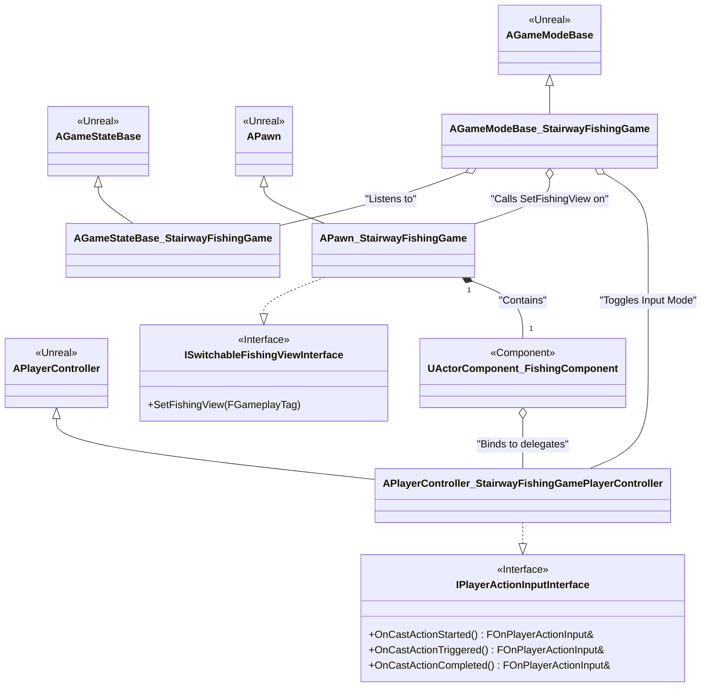
This diagram shows the inheritance from base Unreal classes and the key interactions. The `GameMode` listens to the `GameState` and directs the `Pawn` and `PlayerController` during state transitions. The `Pawn` implements the view-switching logic and contains the core `FishingComponent`, which in turn binds to input delegates from the `PlayerController`.

Sources: [Source/StairwayFishingGameCore/Public/Pawn/Pawn_StairwayFishingGame.h:20](), [Source/StairwayFishingGameCore/Public/PlayerController/PlayerController_StairwayFishingGamePlayerController.h:17](), [Source/StairwayFishingGameCore/Public/GameModeBase/GameModeBase_StairwayFishingGame.h:46](), [Source/FishingFeature/Private/ActorComponent/ActorComponent_FishingComponent.cpp:142-152]()

## `AGameStateBase_StairwayFishingGame`

The `AGameStateBase_StairwayFishingGame` class is the authority on the current state of the game loop. Its primary role is to hold and manage the `CurrentFishingGameLoopState` as an `FGameplayTag`.

### State Management
The game state listens for messages on the `Messaging_GameState_StateChange` channel. When a message containing a new `FGameplayTag` is received, it updates its internal state and broadcasts the change via the `OnFishingGameLoopStateChanged` delegate. This decoupling allows any system to request a state change without needing a direct reference to the `GameState` or its observers.

In `BeginPlay`, it sets up an asynchronous listener for the state change message channel.
```cpp
// Source/StairwayFishingGameCore/Private/GameStateBase/GameStateBase_StairwayFishingGame.cpp:24-29
void AGameStateBase_StairwayFishingGame::BeginPlay()
{
	Super::BeginPlay();

	GameStateChangeMessageListenerAsync = UVAGameplayMessaging_ListenForGameplayMessages::ListenForGameplayMessagesViaChannel(this, FFishingTags::Get().Messaging_GameState_StateChange);

	GameStateChangeMessageListenerAsync->OnGameplayMessageReceived.AddUniqueDynamic(
		this, &ThisClass::OnGameStateChangeMessageReceived);

	GameStateChangeMessageListenerAsync->Activate();
}
```

When a message is received, `OnGameStateChangeMessageReceived` validates the payload and calls `SetCurrentFishingGameLoopState`, which triggers the broadcast.

Sources: [Source/StairwayFishingGameCore/Public/GameStateBase/GameStateBase_StairwayFishingGame.h](), [Source/StairwayFishingGameCore/Private/GameStateBase/GameStateBase_StairwayFishingGame.cpp]()

## `AGameModeBase_StairwayFishingGame`

The `AGameModeBase_StairwayFishingGame` orchestrates high-level game flow based on state changes from the `AGameStateBase`. It is responsible for managing visual transitions and player input modes.

### Responding to State Changes
Upon `BeginPlay`, the `GameMode` finds the `GameState` and binds its `OnFishingGameLoopStateChanged` method to the `GameState`'s delegate. When this event fires, the `GameMode` executes a series of actions to transition the game smoothly.

The core transition logic involves:
1.  Determining if the new state is for fishing (`FishingGameLoopState_Fishing`) or not.
2.  Toggling the `PlayerController`'s input mode between `FInputModeGameOnly` and `FInputModeUIOnly`, and showing/hiding the mouse cursor accordingly.
3.  Triggering a screen fade-out, switching the camera view on the possessed `Pawn`, and then fading back in.

This entire sequence is initiated within `OnFishingGameLoopStateChanged`.

Sources: [Source/StairwayFishingGameCore/Private/GameModeBase/GameModeBase_StairwayFishingGame.cpp:18-80]()

### State Transition Flow

The following diagram illustrates the sequence of events when the game state changes.

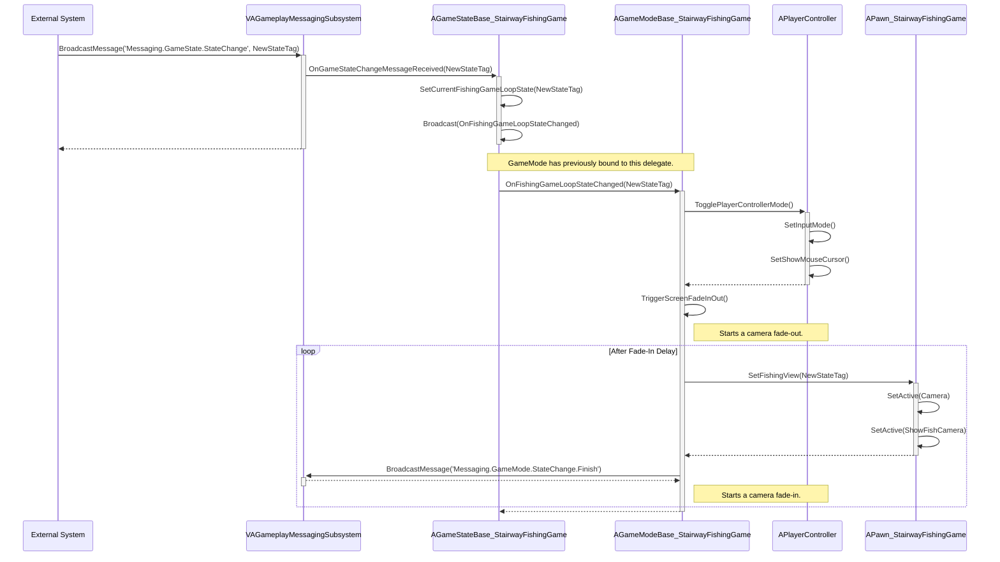
This flow demonstrates the decoupled communication. An external system sends a message, the `GameState` updates and broadcasts, and the `GameMode` reacts by coordinating the `PlayerController` and `Pawn` to reflect the new state.

Sources: [Source/StairwayFishingGameCore/Private/GameModeBase/GameModeBase_StairwayFishingGame.cpp:18-80](), [Source/StairwayFishingGameCore/Private/GameStateBase/GameStateBase_StairwayFishingGame.cpp:44-60](), [Source/StairwayFishingGameCore/Private/Pawn/Pawn_StairwayFishingGame.cpp:66-82]()

## `APlayerController_StairwayFishingGamePlayerController`

This class is responsible for translating player hardware input into gameplay actions using Unreal's Enhanced Input system. It implements the `IPlayerActionInputInterface` to expose delegates that other systems can bind to.

### Input Handling

Key properties for input are defined in the header:
| Property | Type | Description |
| --- | --- | --- |
| `DefaultInputMappingContext` | `UInputMappingContext*` | The mapping context that links keys to input actions. |
| `CastingInputAction` | `UInputAction*` | The input action for the primary fishing cast. |

Sources: [Source/StairwayFishingGameCore/Public/PlayerController/PlayerController_StairwayFishingGamePlayerController.h:111-117]()

In `BeginPlay`, the controller maps the `DefaultInputMappingContext`. The `MapInputActions` function then binds controller methods (`OnCastStarted`, `OnCastTriggered`, `OnCastFinished`) to the different trigger events of the `CastingInputAction`.

```cpp
// Source/StairwayFishingGameCore/Private/PlayerController/PlayerController_StairwayFishingGamePlayerController.cpp:49-55
void APlayerController_StairwayFishingGamePlayerController::MapInputActions()
{
    // ... error checking ...
	EnhancedInputComponent->BindAction(CastingInputAction, ETriggerEvent::Started, this, &ThisClass::OnCastStarted);
	EnhancedInputComponent->BindAction(CastingInputAction, ETriggerEvent::Triggered, this, &ThisClass::OnCastTriggered);
	EnhancedInputComponent->BindAction(CastingInputAction, ETriggerEvent::Completed, this, &ThisClass::OnCastFinished);
}
```

These handler functions then broadcast their respective delegates, passing the elapsed time of the input action as a parameter. This allows listeners, such as the `UActorComponent_FishingComponent`, to react to the input without being tightly coupled to the `PlayerController`.

Sources: [Source/StairwayFishingGameCore/Private/PlayerController/PlayerController_StairwayFishingGamePlayerController.cpp:46-58, 70-72]()

## `APawn_StairwayFishingGame`

This class represents the player character in the game world. Since no player movement is required, it inherits from `APawn` instead of `ACharacter`. It contains all the necessary visual and logical components for the fishing gameplay.

### Components
The Pawn is an aggregate of several components that provide its functionality:

| Component | Type | Description |
| --- | --- | --- |
| `Capsule` | `UCapsuleComponent*` | The root component, providing collision. |
| `Mesh` | `USkeletalMeshComponent*` | The visual representation of the player character. |
| `SpringArm` | `USpringArmComponent*` | Positions the main camera at a distance from the pawn. |
| `Camera` | `UCameraComponent*` | The main top-down gameplay camera. Active by default. |
| `CastMeterBarWidget` | `UWidgetComponent*` | A UI widget component for displaying the cast meter. |
| `FishingComponent` | `UActorComponent_FishingComponent*` | The core component that contains all fishing logic. |
| `ShowFishCamera` | `UCameraComponent*` | A secondary camera used for showing the caught fish. Inactive by default. |

Sources: [Source/StairwayFishingGameCore/Public/Pawn/Pawn_StairwayFishingGame.h:32-62]()

### View Switching
The Pawn implements the `ISwitchableFishingViewInterface`, which requires it to define the `SetFishingView` method. This function is called by the `GameMode` during a state transition. It activates or deactivates the `Camera` and `ShowFishCamera` based on whether the new game state tag matches `FishingGameLoopState_Fishing`.

```cpp
// Source/StairwayFishingGameCore/Private/Pawn/Pawn_StairwayFishingGame.cpp:73-82
void APawn_StairwayFishingGame::SetFishingView(const FGameplayTag& InFishingGameLoopStateTag)
{
    // ... validation ...
	const bool bShouldFish = InFishingGameLoopStateTag.MatchesTag(FFishingTags::Get().FishingGameLoopState_Fishing);

	if (Camera)
	{
		Camera->SetActive(bShouldFish);
	}

	if (ShowFishCamera)
	{
		ShowFishCamera->SetActive(!bShouldFish);
	}
}
```
This simple mechanism allows the `GameMode` to control the player's perspective without needing to know the specific implementation details of the Pawn's cameras.

Sources: [Source/StairwayFishingGameCore/Public/Pawn/Pawn_StairwayFishingGame.h:25](), [Source/StairwayFishingGameCore/Private/Pawn/Pawn_StairwayFishingGame.cpp:66-82]()

## Summary

The core gameplay classes of the Stairway Fishing Game create a robust and extensible foundation using standard Unreal Engine patterns. The `GameState` serves as a single source of truth for the game loop state, while the `GameMode` acts as a director, orchestrating transitions. Player interaction is cleanly handled by the `PlayerController` and its delegate system, which provides input to the `FishingComponent` on the `Pawn`. This separation of concerns ensures that each class has a distinct responsibility, making the system easier to maintain and expand.

---

<a id='page-messaging-system'></a>

## Messaging System (VAGameplayMessaging)

### Related Pages

Related topics: [Module Overview](#page-module-overview), [Fishing Gameplay Loop](#page-gameplay-loop)

<details>
<summary>Relevant source files</summary>
The following files were used as context for generating this wiki page:

- [Source/VAGameplayMessaging/Public/GameInstanceSubsystem/VAGameplayMessagingSubsystem.h](https://github.com/rezonated/Unreal-Fishing-Test/blob/main/Source/VAGameplayMessaging/Public/GameInstanceSubsystem/VAGameplayMessagingSubsystem.h)
- [Source/VAGameplayMessaging/Private/GameInstanceSubsystem/VAGameplayMessagingSubsystem.cpp](https://github.com/rezonated/Unreal-Fishing-Test/blob/main/Source/VAGameplayMessaging/Private/GameInstanceSubsystem/VAGameplayMessagingSubsystem.cpp)
- [Source/VAGameplayMessaging/Public/VACancellableAsyncAction/VAGameplayMessaging_ListenForGameplayMessages.h](https://github.com/rezonated/Unreal-Fishing-Test/blob/main/Source/VAGameplayMessaging/Public/VACancellableAsyncAction/VAGameplayMessaging_ListenForGameplayMessages.h)
- [Source/VAGameplayMessaging/Private/VACancellableAsyncAction/VAGameplayMessaging_ListenForGameplayMessages.cpp](https://github.com/rezonated/Unreal-Fishing-Test/blob/main/Source/VAGameplayMessaging/Private/VACancellableAsyncAction/VAGameplayMessaging_ListenForGameplayMessages.cpp)
- [Source/FishingGameplayTags/Public/FishingTags.h](https://github.com/rezonated/Unreal-Fishing-Test/blob/main/Source/FishingGameplayTags/Public/FishingTags.h)
- [Source/FishingFeature/Private/ActorComponent/ActorComponent_FishingComponent.cpp](https://github.com/rezonated/Unreal-Fishing-Test/blob/main/Source/FishingFeature/Private/ActorComponent/ActorComponent_FishingComponent.cpp)
- [Source/StairwayFishingGameCore/Private/GameStateBase/GameStateBase_StairwayFishingGame.cpp](https://github.com/rezonated/Unreal-Fishing-Test/blob/main/Source/StairwayFishingGameCore/Private/GameStateBase/GameStateBase_StairwayFishingGame.cpp)
- [Source/StairwayFishingGameUI/Private/UserWidget/MeterBar/UserWidgetMeterBar_CastMeterBar.cpp](https://github.com/rezonated/Unreal-Fishing-Test/blob/main/Source/StairwayFishingGameUI/Private/UserWidget/MeterBar/UserWidgetMeterBar_CastMeterBar.cpp)
</details>

# Messaging System (VAGameplayMessaging)

The VAGameplayMessaging system provides a decoupled, event-driven communication framework for different parts of the application. It uses a centralized `UGameInstanceSubsystem` to manage message channels identified by `FGameplayTag`. This allows various game features, UI elements, and animation instances to communicate without holding direct references to each other, promoting modularity and reducing dependencies.

Messages are broadcast on specific channels, and any object can listen to one or more channels using a cancellable asynchronous action. The system supports flexible data transfer through the `FVAAnyUnreal` struct, which can encapsulate any USTRUCT, UObject, or primitive type as a message payload.

## Core Architecture

The system is built around a central hub, `UVAGameplayMessagingSubsystem`, which is a `UGameInstanceSubsystem`. This ensures it has a global scope and persists for the entire game session. The subsystem's primary responsibility is to maintain a map of message channels and their corresponding listeners.

*   **`UVAGameplayMessagingSubsystem`**: The central singleton that manages all message channels and listeners.
*   **`ChannelToMembersMap`**: A `TMap<FGameplayTag, FChannelMembersData>` within the subsystem. It maps a gameplay tag (the channel) to a struct containing an array of active listeners.
*   **`UVAGameplayMessaging_ListenForGameplayMessages`**: A `UVACancellableAsyncAction` that acts as a proxy for any object wanting to listen to messages. It handles its own registration and unregistration with the subsystem.

Sources: [VAGameplayMessagingSubsystem.h:10-80](), [VAGameplayMessaging_ListenForGameplayMessages.h:14-43]()

### Component Relationships

The following diagram illustrates the relationship between the core components of the messaging system.

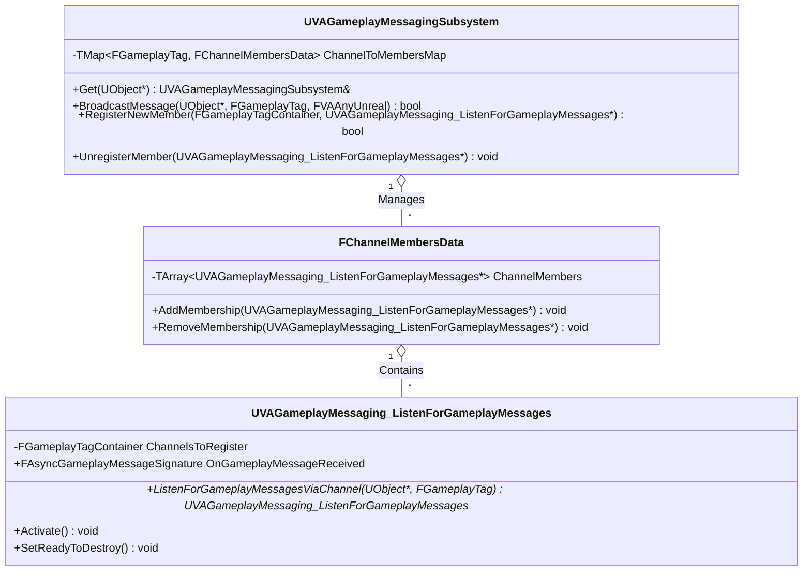
This diagram shows that the `UVAGameplayMessagingSubsystem` contains a map of `FChannelMembersData`, and each `FChannelMembersData` instance holds a list of `UVAGameplayMessaging_ListenForGameplayMessages` listeners.

Sources: [VAGameplayMessagingSubsystem.h:10-80](), [VAGameplayMessaging_ListenForGameplayMessages.h:14-43]()

## Broadcasting Messages

Messages are sent using the static function `UVAGameplayMessagingSubsystem::BroadcastMessage`. This function retrieves the subsystem instance and calls an internal method to perform the broadcast.

The internal broadcast process is as follows:
1.  Validate the `InChannel` `FGameplayTag`.
2.  Check if the channel exists in the `ChannelToMembersMap`.
3.  Retrieve the list of listeners (`UVAGameplayMessaging_ListenForGameplayMessages*`) for that channel.
4.  Iterate through each listener, checking if it is valid.
5.  If a listener is invalid, it is removed from the channel's member list.
6.  For each valid listener, its `OnGameplayMessageReceived` delegate is broadcast, passing the channel tag and the message payload.

Sources: [VAGameplayMessagingSubsystem.cpp:53-125]()

### Broadcast Flow Diagram

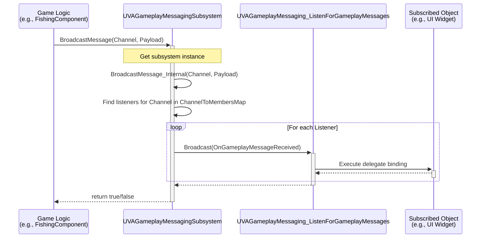
This sequence shows a game object broadcasting a message, the subsystem finding and notifying the relevant listener, which in turn executes the delegate bound by the final receiving object.

Sources: [ActorComponent_FishingComponent.cpp:525](), [VAGameplayMessagingSubsystem.cpp:80-125](), [UserWidgetMeterBar_CastMeterBar.cpp:88-103]()

## Listening for Messages

Objects subscribe to message channels by creating an instance of `UVAGameplayMessaging_ListenForGameplayMessages`. This is typically done via one of its static factory functions, which are designed for use in both C++ and Blueprints.

1.  **Creation**: An object calls `ListenForGameplayMessagesViaChannel` or `ListenForGameplayMessagesViaMultipleChannels`. This creates a new proxy object (the listener).
2.  **Activation**: The listener's `Activate()` method is called.
3.  **Registration**: Inside `Activate()`, the listener calls `Subsystem->RegisterNewMember()`, passing a reference to itself and the channels it wants to subscribe to.
4.  **Storage**: The subsystem adds the listener to the `ChannelToMembersMap` for each requested channel. If a channel does not exist, it is created.

The listener's `OnGameplayMessageReceived` delegate should be bound to a function in the subscribing object before activation to handle incoming messages.

Sources: [VAGameplayMessaging_ListenForGameplayMessages.cpp:7-54](), [VAGameplayMessagingSubsystem.cpp:127-172]()

### Listener Registration and Cancellation Flow

```mermaid
sequenceDiagram
    participant Subscriber as Game Logic<br>(e.g., GameState)
    participant Listener as UVAGameplayMessaging_ListenForGameplayMessages
    participant Subsystem as UVAGameplayMessagingSubsystem

    Subscriber->>Listener: ListenForGameplayMessagesViaChannel(this, Channel)
    Note right of Subscriber: Binds to OnGameplayMessageReceived delegate
    Subscriber->>+Listener: Activate()
    Listener->>+Subsystem: RegisterNewMember(Channels, this)
    Note over Subsystem: Adds listener to<br>ChannelToMembersMap
    Subsystem-->>-Listener: return true
    Listener-->>-Subscriber: 
    
    ...Time passes, messages are received...

    Subscriber->>+Listener: Cancel() / SetReadyToDestroy()
    Listener->>+Subsystem: UnregisterMember(this)
    Note over Subsystem: Removes listener from<br>all channels
    Subsystem-->>-Listener: 
    Listener-->>-Subscriber: 
```
This diagram illustrates the lifecycle of a listener, from its creation and registration with the subsystem to its eventual cancellation and unregistration.

Sources: [GameStateBase_StairwayFishingGame.cpp:21-28](), [VAGameplayMessaging_ListenForGameplayMessages.cpp:56-86](), [VAGameplayMessagingSubsystem.cpp:127-190]()

## Message Structure

### Channels (`FGameplayTag`)

Communication channels are defined by `FGameplayTag`. This leverages Unreal Engine's hierarchical tagging system, allowing for organized and easily identifiable message streams. A central class, `FFishingTags`, defines all the native gameplay tags used by the fishing feature, ensuring consistency.

Example channels:
*   `Messaging.Fishing.UI.Cast.Update`: Used to update the UI with the current casting progress.
*   `Messaging.Fishing.Notify.Throw`: An animation notify that triggers the fishing rod to throw the bobber.
*   `Messaging.GameState.StateChange`: Used to request a change in the global game state.

Sources: [FishingTags.h:35-55]()

### Payloads (`FVAAnyUnreal`)

The system uses the `FVAAnyUnreal` struct for message payloads. This is a wrapper that can hold a value of almost any Unreal type, including primitives (`float`, `int32`), USTRUCTs, and UObjects. The receiving end can then safely check the type of the payload before attempting to extract the value.

```cpp
// Example of a broadcaster sending a float payload
// Source/FishingFeature/Private/ActorComponent/ActorComponent_FishingComponent.cpp:525-526
UVAGameplayMessagingSubsystem::Get(this).BroadcastMessage(this, FFishingTags::Get().Messaging_Fishing_UI_Cast_Update, InProgress);

// Example of a receiver handling the float payload
// Source/StairwayFishingGameUI/Private/UserWidget/MeterBar/UserWidgetMeterBar_CastMeterBar.cpp:90-96
const bool bPayloadIsFloat = MessagePayload.Is<float>();
if (!bPayloadIsFloat)
{
    // ... log error
    return;
}
const float Progress = MessagePayload.Get<float>();
```
This provides type safety at runtime and avoids the need for multiple broadcast functions with different signatures.

Sources: [VAGameplayMessagingSubsystem.h:61](), [UserWidgetMeterBar_CastMeterBar.cpp:88-96](), [GameStateBase_StairwayFishingGame.cpp:52-58]()

## Lifecycle Management

The lifecycle of listeners is managed primarily by the `UVACancellableAsyncAction` base class.
- **Registration**: When `Activate()` is called on a `UVAGameplayMessaging_ListenForGameplayMessages` instance, it registers itself with the subsystem.
- **Unregistration**: When the async action is cancelled (e.g., via a `Cancel()` call or the owning object being destroyed), its `SetReadyToDestroy()` method is invoked. This method calls `Subsystem->UnregisterMember(this)`, which iterates through the entire `ChannelToMembersMap` and removes the listener from any channel it was a part of.
- **Cleanup**: The `UVAGameplayMessagingSubsystem` itself, upon `Deinitialize()`, clears its `ChannelToMembersMap` entirely, ensuring no dangling references remain.

Sources: [VAGameplayMessaging_ListenForGameplayMessages.cpp:88-106](), [VAGameplayMessagingSubsystem.cpp:174-197]()

## Key Components Summary

| Component | Type | Role | Source File |
| --- | --- | --- | --- |
| `UVAGameplayMessagingSubsystem` | `UGameInstanceSubsystem` | Central hub for message routing. Manages channels and listeners. | `VAGameplayMessagingSubsystem.h` |
| `UVAGameplayMessaging_ListenForGameplayMessages` | `UVACancellableAsyncAction` | Client-side proxy for subscribing to channels. Manages its own lifecycle. | `VAGameplayMessaging_ListenForGameplayMessages.h` |
| `FChannelMembersData` | `USTRUCT` | A container struct holding an array of listeners for a single channel. | `VAGameplayMessagingSubsystem.h` |
| `FGameplayTag` | `struct` | Used to define unique message channels. | `FishingTags.h` |
| `FVAAnyUnreal` | `struct` | A type-safe wrapper for message payloads of any type. | `VAGameplayMessagingSubsystem.h` |

## Conclusion

The VAGameplayMessaging system is a powerful, data-driven framework that enables robust, decoupled communication between different gameplay systems. By leveraging `UGameInstanceSubsystem` for global access, `FGameplayTag` for channel definition, and `UVACancellableAsyncAction` for lifecycle-aware listeners, it provides a clean and scalable solution for event handling within the project. Its use of `FVAAnyUnreal` for payloads adds a layer of type-safe flexibility, making it adaptable to a wide variety of communication needs.
Error: Invalid operation: The `response.text` quick accessor requires the response to contain a valid `Part`, but none were returned. The candidate's [finish_reason](https://ai.google.dev/api/generate-content#finishreason) is 1.

---

<a id='page-gameplay-loop'></a>

## Fishing Gameplay Loop

### Related Pages

Related topics: [Player Input and Controls](#page-player-input), [Configuration with Data Assets](#page-data-assets), [Messaging System (VAGameplayMessaging)](#page-messaging-system)

<details>
<summary>Relevant source files</summary>

The following files were used as context for generating this wiki page:

- [Source/FishingFeature/Private/ActorComponent/ActorComponent_FishingComponent.cpp](https://github.comcom/rezonated/Unreal-Fishing-Test/blob/main/Source/FishingFeature/Private/ActorComponent/ActorComponent_FishingComponent.cpp)
- [Source/FishingFeature/Private/Actor/Actor_FishingRod.cpp](https://github.comcom/rezonated/Unreal-Fishing-Test/blob/main/Source/FishingFeature/Private/Actor/Actor_FishingRod.cpp)
- [Source/FishingFeature/Private/Actor/Actor_Fish.cpp](https://github.comcom/rezonated/Unreal-Fishing-Test/blob/main/Source/FishingFeature/Private/Actor/Actor_Fish.cpp)
- [Source/FishingFeature/Private/Actor/Actor_FishSpawnArea.cpp](https://github.comcom/rezonated/Unreal-Fishing-Test/blob/main/Source/FishingFeature/Private/Actor/Actor_FishSpawnArea.cpp)
- [Source/FishingGameplayTags/Private/FishingTags.cpp](https://github.comcom/rezonated/Unreal-Fishing-Test/blob/main/Source/FishingGameplayTags/Private/FishingTags.cpp)
- [Source/StairwayFishingGameCore/Private/GameModeBase/GameModeBase_StairwayFishingGame.cpp](https://github.comcom/rezonated/Unreal-Fishing-Test/blob/main/Source/StairwayFishingGameCore/Private/GameModeBase/GameModeBase_StairwayFishingGame.cpp)
- [Source/StairwayFishingGameCore/Private/Pawn/Pawn_StairwayFishingGame.cpp](https://github.comcom/rezonated/Unreal-Fishing-Test/blob/main/Source/StairwayFishingGameCore/Private/Pawn/Pawn_StairwayFishingGame.cpp)
</details>

# Fishing Gameplay Loop

The Fishing Gameplay Loop is a self-contained feature that manages all logic related to casting a fishing rod, waiting for a fish to bite, and reeling it in. The system is orchestrated by the `UActorComponent_FishingComponent`, which acts as a state machine and mediator between the player, the fishing rod, and the fish.

The feature is heavily reliant on a state management system using Gameplay Tags and communicates between different objects asynchronously via the `VAGameplayMessagingSubsystem`. This decoupled architecture allows for clear separation of concerns between player input, animation, game logic, and actor behaviors. The entire process is configurable through Data Assets, allowing designers to tweak parameters like casting distance, wait times, and actor classes without changing code.

## Core Components

The system is composed of several key actors and components that work together to create the fishing experience.

| Component/Actor | Role | Source File |
| --- | --- | --- |
| `UActorComponent_FishingComponent` | The central orchestrator of the fishing logic. Manages states, timers, player input, and communication between other components. | `ActorComponent_FishingComponent.h` |
| `AActor_FishingRod` | Represents the physical fishing rod and bobber. Implements the `ICatcherInterface` and handles the visual throwing and reeling of the line. | `Actor_FishingRod.cpp` |
| `AActor_Fish` | Represents a catchable fish. Implements the `ICatchableInterface` and manages its own movement, including wandering, being reeled in, and escaping. | `Actor_Fish.cpp` |
| `AActor_FishSpawnArea` | Spawns a configurable number of `AActor_Fish` instances within a defined `UBoxComponent` volume at the start of the game. | `Actor_FishSpawnArea.cpp` |
| `AGameModeBase_StairwayFishingGame` | Manages high-level game state transitions, such as fading the screen and switching cameras when a fish is caught and displayed. | `GameModeBase_StairwayFishingGame.cpp` |
| `APawn_StairwayFishingGame` | The player's pawn which owns the `UActorComponent_FishingComponent` and holds the different cameras used for gameplay and showing the catch. | `Pawn_StairwayFishingGame.cpp` |

### Component Relationships

The following diagram illustrates the primary relationships between the core classes. The `FishingComponent` acts as a central hub, interacting with the rod (`ICatcherInterface`) and the fish (`ICatchableInterface`).

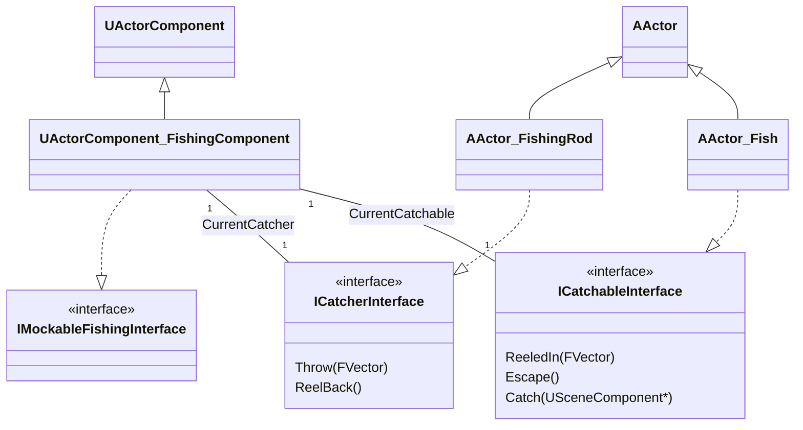
*Sources: [ActorComponent_FishingComponent.h](), [Actor_FishingRod.h](), [Actor_Fish.h]()*

## State Management with Gameplay Tags

The fishing loop is driven by a state machine implemented within `UActorComponent_FishingComponent`. The current state is tracked using a `FGameplayTag`, which dictates how the component responds to player input and game events. All tags are centrally defined in the `FFishingTags` class.

*Sources: [FishingTags.cpp:32-38](), [ActorComponent_FishingComponent.cpp:25]()*

### Fishing Component States

The `FishingComponent.State.*` tags define the current stage of the fishing process.

| Tag | Description |
| --- | --- |
| `FishingComponent.State.Idling` | The default state. The player can start casting. |
| `FishingComponent.State.Throwing` | The player has finished charging the cast and the rod is being thrown. Input is ignored. |
| `FishingComponent.State.WaitingForFish` | The bobber is in the water. A timer is active, waiting for a fish to bite. Early input will cause the fish to escape. |
| `FishingComponent.State.AbleToReel` | The fish has bitten. The player must press the action button to reel it in. |
| `FishingComponent.State.Reeling_In` | The fish has been caught and is being reeled back to the player. |
| `FishingComponent.State.Reeling_Out` | The rod is being reeled back after a failed attempt or the fish escaped. |

### Animation States

A parallel set of tags, `AnimInstance.Fishing.State.*`, is used to drive the character's animations. These are broadcast via the messaging system to the character's Animation Blueprint.

| Tag | Description |
| --- | --- |
| `AnimInstance.Fishing.State.Idling` | Corresponds to the idle animation state. |
| `AnimInstance.Fishing.State.Throwing` | Triggers the casting/throwing animation montage. |
| `AnimInstance.Fishing.State.Reeling_In` | Triggers the animation for successfully reeling in a fish. |
| `AnimInstance.Fishing.State.Reeling_Out` | Triggers the animation for reeling in an empty line. |
| `AnimInstance.Fishing.State.ShowFish` | Triggers the animation for showing off the caught fish. |

*Sources: [FishingTags.cpp:22-28]()*

### State Machine Flow

The diagram below shows the typical flow of states within the `UActorComponent_FishingComponent`.

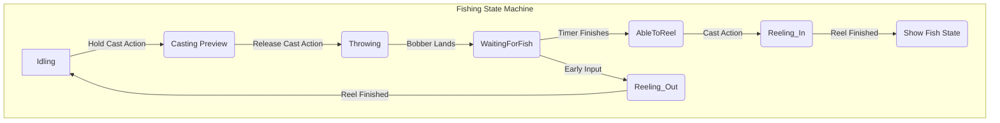
*Sources: [ActorComponent_FishingComponent.cpp]()*

## The Fishing Process Step-by-Step

The entire fishing sequence, from casting to catching, follows a well-defined series of events orchestrated by the `FishingComponent`.

### 1. Initialization and Spawning

-   **Fish Spawning**: On `BeginPlay`, the `AActor_FishSpawnArea` asynchronously loads the `FishActorClass` defined in its config. Once loaded, it spawns a specified number of fish actors at random locations within its `UBoxComponent` bounds. Each fish is initialized with the spawn area's center and extent, which it uses for its wandering behavior.
    *Sources: [Actor_FishSpawnArea.cpp:38-40](), [Actor_FishSpawnArea.cpp:84-118](), [Actor_Fish.cpp:151-153]()*
-   **Rod Spawning**: The `UActorComponent_FishingComponent` also asynchronously loads its `FishingRodActorClass`. When loaded, the fishing rod actor is spawned and attached to a specified socket on the owner's skeletal mesh.
    *Sources: [ActorComponent_FishingComponent.cpp:40-47](), [ActorComponent_FishingComponent.cpp:241-274]()*

### 2. Casting the Line

-   **Charging the Cast**: The player presses and holds the cast action button. This calls `OnCastAction` in the `FishingComponent`.
-   **Determining Location**: While the button is held, `DetermineCastLocation` is called continuously. It maps the elapsed time the button has been held to a distance between a minimum and maximum value. This determines the cast's target position in front of the player.
    ```cpp
    // Source/FishingFeature/Private/ActorComponent/ActorComponent_FishingComponent.cpp:602-604
    const float MappedForwardDistance = FMath::GetMappedRangeValueClamped(FVector2D(0.f, MaximumTimeToCast), FVector2D(MinimumCastDistance, MaximumCastDistance), InElapsedTime);
    const FVector ForwardDirection = InitialActorForwardVector * MappedForwardDistance;
    const FVector CastStartPosition = InitialActorLocation + ForwardDirection;
    ```
    *Sources: [ActorComponent_FishingComponent.cpp:592-608]()*
-   **Finding the Water**: `AttemptToCast` then performs a line trace downwards from the target position to find a water body (identified by the `TRACE_WATER_BODY` collision channel). If water is found, the hit location is stored as `CastLocation`, and a decal actor is made visible at that spot to give the player feedback.
    *Sources: [ActorComponent_FishingComponent.cpp:611-641]()*

### 3. Throwing and Waiting

-   **Throwing**: When the player releases the cast button, `OnCastActionEnded` is called. The component's state changes to `Throwing`, and it broadcasts a message to the animation system to play the "throwing" animation.
    *Sources: [ActorComponent_FishingComponent.cpp:559-561]()*
-   **Animation Notify**: The throwing animation contains a notify that sends a `Messaging.Fishing.Notify.Throw` message. The `FishingComponent` listens for this message and, upon receiving it, calls the `Throw()` method on the `CurrentCatcher` (the fishing rod).
    *Sources: [ActorComponent_FishingComponent.cpp:732-741]()*
-   **Bobber Movement**: `AActor_FishingRod::Throw` starts a timeline (`ThrowReelInTimeline`) that interpolates the bobber's position from the rod to the `CastLocation`.
    *Sources: [Actor_FishingRod.cpp:29-32]()*
-   **Landing on Water**: When the timeline finishes, a delegate is executed, calling `OnBobberLandsOnWater` in the `FishingComponent`.
    *Sources: [Actor_FishingRod.cpp:180-182](), [ActorComponent_FishingComponent.cpp:564-572]()*
-   **Finding a Fish**: The component then performs a sphere trace around the `CastLocation` to find the nearest `ICatchableInterface` (a fish).
    *Sources: [ActorComponent_FishingComponent.cpp:484-526]()*
-   **Waiting Period**: A timer is started for a duration defined by `TimeToFish` in the config, and the state changes to `WaitingForFish`. The targeted fish is notified via its `ReeledIn()` method, causing it to swim towards the bobber.
    *Sources: [ActorComponent_FishingComponent.cpp:529-540](), [Actor_Fish.cpp:53-60]()*

### 4. Reeling In the Catch

-   **The Bite**: When the `WaitingForFish` timer completes, the state transitions to `AbleToReel`.
    *Sources: [ActorComponent_FishingComponent.cpp:477-482]()*
-   **Player Action**: The player must now press the cast action button again. If they do, `OnCastAction` is triggered while in the `AbleToReel` state.
-   **Catching**: The fish is "caught" by calling `CurrentCatchable->Catch()`, which attaches the fish actor to an attach point on the fishing rod's bobber. The `ReelBack()` method is then called on the rod.
    *Sources: [ActorComponent_FishingComponent.cpp:443-458]()*
-   **Reeling Back**: `AActor_FishingRod::ReelBack` uses another timeline (`PullReelOutTimeline`) to move the bobber (and the attached fish) back to its starting position on the rod.
    *Sources: [Actor_FishingRod.cpp:34-37]()*

### 5. Success and Failure

-   **Success**: If the reeling process completes with a fish attached, an animation notify sends a `Messaging.Fishing.Notify.ReelDone` message. The `FishingComponent` receives this and broadcasts another message, `Messaging_GameState_StateChange`, with the payload `FishingGameLoopState_ShowFish`.
    *Sources: [ActorComponent_FishingComponent.cpp:743-757]()*
-   **Failure (Escaping Fish)**: If the player presses the action button *during* the `WaitingForFish` state (before the timer finishes), it is considered an early reel. `LetCatchableEscape` is called, which in turn calls the `Escape()` method on the fish. The fish plays an escape timeline to swim back to its original location, and the player reels in an empty line.
    *Sources: [ActorComponent_FishingComponent.cpp:542-552](), [ActorComponent_FishingComponent.cpp:542-552](), [Actor_Fish.cpp:62-67]()*

## System Communication and Game State Flow

The `VAGameplayMessagingSubsystem` is used for decoupled communication between different parts of the game. This is particularly important for triggering logic from animation notifies and for signaling changes to the main game mode.

The sequence diagram below details the interactions during a successful fishing attempt.

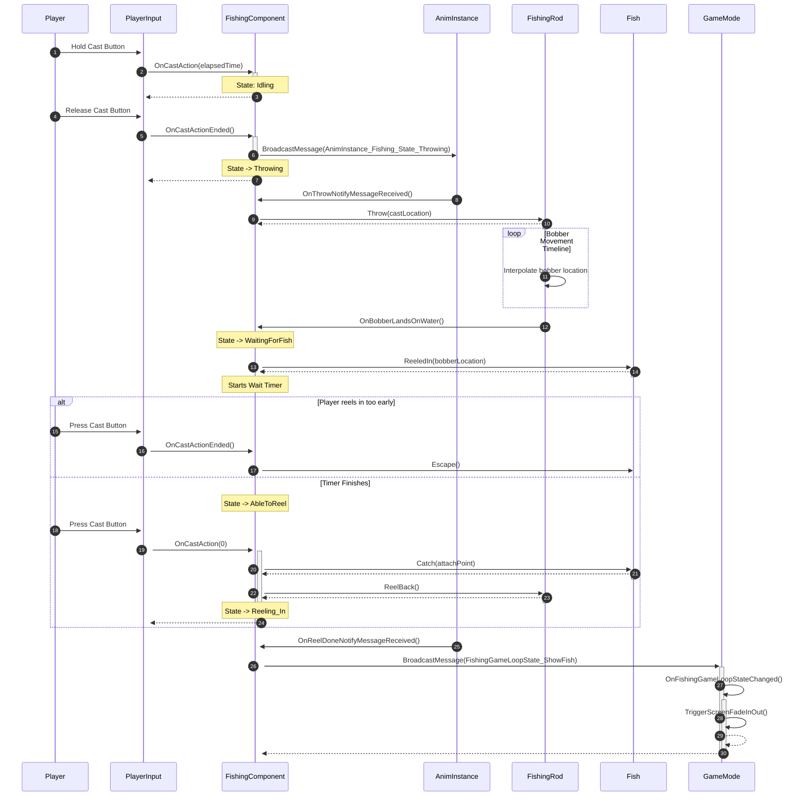
*Sources: [ActorComponent_FishingComponent.cpp](), [GameModeBase_StairwayFishingGame.cpp](), [FishingTags.cpp]()*

When the `GameMode` receives the `FishingGameLoopState_ShowFish` message, it initiates a screen fade, switches the active camera on the player pawn to a "show fish" camera, and changes the input mode to UI-only, presenting the player with options to continue or quit.

*Sources: [GameModeBase_StairwayFishingGame.cpp:32-84](), [Pawn_StairwayFishingGame.cpp:58-75]()*

## Testability

The system is designed with testability in mind. The `UActorComponent_FishingComponent` implements the `IMockableFishingInterface`, which exposes methods to drive the fishing logic programmatically.

-   `MockCast(float InElapsedTime)`: Simulates holding the cast button for a specific duration.
-   `MockCastEnd()`: Simulates releasing the cast button.

Functional tests, such as `AFunctionalTest_FishingFeatureTest`, can get a reference to this interface and call these methods to validate the entire fishing loop without requiring actual player input. The interface also provides delegates like `OnMockAbleToCatchFishDone` and `OnMockBobberLandsOnWater` that tests can bind to for asserting outcomes at specific stages of the process.

*Sources: [ActorComponent_FishingComponent.h:81-98](), [FunctionalTest_FishingFeatureTest.cpp:21-72]()*

---

<a id='page-player-input'></a>

## Player Input and Controls

### Related Pages

Related topics: [Fishing Gameplay Loop](#page-gameplay-loop)

<details>
<summary>Relevant source files</summary>
The following files were used as context for generating this wiki page:

- [Source/StairwayFishingGameCore/Public/PlayerController/PlayerController_StairwayFishingGamePlayerController.h](https://github.com/rezonated/Unreal-Fishing-Test/blob/main/Source/StairwayFishingGameCore/Public/PlayerController/PlayerController_StairwayFishingGamePlayerController.h)
- [Source/StairwayFishingGameCore/Private/PlayerController/PlayerController_StairwayFishingGamePlayerController.cpp](https://github.com/rezonated/Unreal-Fishing-Test/blob/main/Source/StairwayFishingGameCore/Private/PlayerController/PlayerController_StairwayFishingGamePlayerController.cpp)
- [Source/FishingFeature/Private/ActorComponent/ActorComponent_FishingComponent.cpp](https://github.com/rezonated/Unreal-Fishing-Test/blob/main/Source/FishingFeature/Private/ActorComponent/ActorComponent_FishingComponent.cpp)
- [Source/StairwayFishingGameCore/Public/GameModeBase/GameModeBase_StairwayFishingGame.h](https://github.com/rezonated/Unreal-Fishing-Test/blob/main/Source/StairwayFishingGameCore/Public/GameModeBase/GameModeBase_StairwayFishingGame.h)
- [Source/StairwayFishingGameCore/Private/GameModeBase/GameModeBase_StairwayFishingGame.cpp](https://github.com/rezonated/Unreal-Fishing-Test/blob/main/Source/StairwayFishingGameCore/Private/GameModeBase/GameModeBase_StairwayFishingGame.cpp)
- [Source/StairwayFishingGameCore/Public/Pawn/Pawn_StairwayFishingGame.h](https://github.com/rezonated/Unreal-Fishing-Test/blob/main/Source/StairwayFishingGameCore/Public/Pawn/Pawn_StairwayFishingGame.h)

</details>

# Player Input and Controls

The player input and control system is built upon Unreal Engine's Enhanced Input System. It provides a decoupled, event-driven architecture for handling player actions, primarily the fishing cast mechanic. The core components include a dedicated Player Controller that interprets raw input, an interface to broadcast input events, and a consumer component that implements the game logic. The system is also managed by the Game Mode, which controls whether the player is in a "Game" or "UI" input context based on the current game state.

The primary input action is the "Casting" action, which is bound to multiple trigger events (Started, Triggered, Completed) to allow for nuanced control, such as charging a cast by holding down a button. This design separates the input handling from the game mechanics, allowing different components to react to player input without being tightly coupled to the `PlayerController`.

## Architecture Overview

The system revolves around four key classes that collaborate to translate a physical input into a gameplay action. The `APlayerController_StairwayFishingGamePlayerController` is the central hub, responsible for setting up input mappings and broadcasting actions. It uses the `IPlayerActionInputInterface` to expose delegates, which are then bound by the `UActorComponent_FishingComponent` to execute fishing logic. The `AGameModeBase_StairwayFishingGame` oversees the process by managing the overall input mode.

Sources: [PlayerController_StairwayFishingGamePlayerController.h](), [ActorComponent_FishingComponent.cpp](), [GameModeBase_StairwayFishingGame.h]()

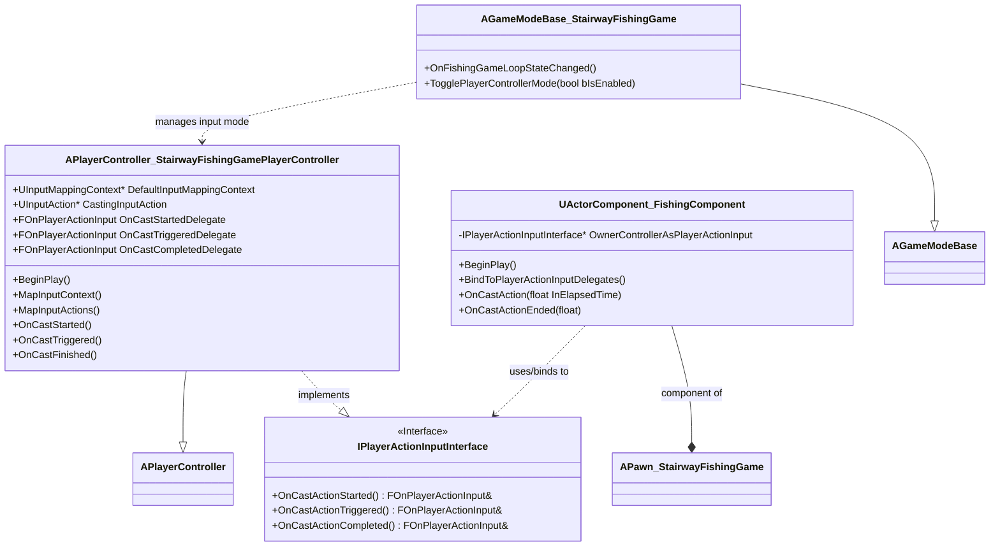

### Input Handling Flow

The following diagram illustrates the sequence of events from a player's physical input to the execution of the corresponding game logic within the `UActorComponent_FishingComponent`.

```mermaid
sequenceDiagram
    participant Player as actor Player
    participant EILS as UEnhancedInput<br>LocalPlayerSubsystem
    participant PC as APlayerController_StairwayFishingGamePlayerController
    participant FC as UActorComponent_FishingComponent

    Player->>+EILS: Press/Hold/Release Cast Input
    EILS->>+PC: OnCastStarted(instance)
    PC->>PC: BroadcastCastDelegateAndValue(OnCastStartedDelegate, instance)
    PC->>+FC: OnCastAction(elapsedTime)
    FC-->>-PC:
    PC-->>-EILS:
    
    loop While input held
        EILS->>+PC: OnCastTriggered(instance)
        PC->>PC: BroadcastCastDelegateAndValue(OnCastTriggeredDelegate, instance)
        PC->>+FC: OnCastAction(elapsedTime)
        FC-->>-PC:
        PC-->>-EILS:
    end

    EILS->>+PC: OnCastCompleted(instance)
    PC->>PC: BroadcastCastDelegateAndValue(OnCastCompletedDelegate, instance)
    PC->>+FC: OnCastActionEnded(elapsedTime)
    FC-->>-PC:
    PC-->>-EILS:
    EILS-->>-Player:
```

## Key Components

### APlayerController_StairwayFishingGamePlayerController

This class is the primary handler for player input. It is configured with an Input Mapping Context and specific Input Actions to translate hardware inputs into game events.

Sources: [PlayerController_StairwayFishingGamePlayerController.h](), [PlayerController_StairwayFishingGamePlayerController.cpp]()

#### Initialization and Mapping

On `BeginPlay`, the controller adds its `DefaultInputMappingContext` to the `UEnhancedInputLocalPlayerSubsystem` and binds its handler functions to the `CastingInputAction`.

```cpp
// Source/StairwayFishingGameCore/Private/PlayerController/PlayerController_StairwayFishingGamePlayerController.cpp:48-60
void APlayerController_StairwayFishingGamePlayerController::MapInputActions()
{
	UEnhancedInputComponent* EnhancedInputComponent = nullptr;
	if (!GetEnhancedInputComponent(EnhancedInputComponent))
	{
		// ... error logging ...
		return;
	}
	if (!CastingInputAction)
	{
		// ... error logging ...
		return;
	}

	EnhancedInputComponent->BindAction(CastingInputAction, ETriggerEvent::Started, this, &ThisClass::OnCastStarted);
	EnhancedInputComponent->BindAction(CastingInputAction, ETriggerEvent::Triggered, this, &ThisClass::OnCastTriggered);
	EnhancedInputComponent->BindAction(CastingInputAction, ETriggerEvent::Completed, this, &ThisClass::OnCastFinished);
}
```
Sources: [PlayerController_StairwayFishingGamePlayerController.cpp:48-74]()

#### IPlayerActionInputInterface

To decouple input broadcasting from any specific consumer, the controller implements the `IPlayerActionInputInterface`. This interface defines a contract for any class that wants to provide player action events. It exposes delegates for the three primary states of the cast action.

| Delegate                | Description                                                                 |
| ----------------------- | --------------------------------------------------------------------------- |
| `OnCastActionStarted()`   | Fired once when the `CastingInputAction` is started (e.g., button press).     |
| `OnCastActionTriggered()` | Fired every frame that the `CastingInputAction` is active (e.g., button held). |
| `OnCastActionCompleted()` | Fired once when the `CastingInputAction` is completed (e.g., button release). |

Sources: [PlayerController_StairwayFishingGamePlayerController.h:23-41]()

### UActorComponent_FishingComponent

This component contains the core fishing logic and acts as the consumer of the input events broadcast by the `PlayerController`.

#### Delegate Binding

In its `BeginPlay` sequence, the `UActorComponent_FishingComponent` finds the pawn's controller, verifies it implements `IPlayerActionInputInterface`, and binds its own functions to the interface's delegates. This establishes the communication link without the component needing a direct reference to the concrete `PlayerController` class.

```cpp
// Source/FishingFeature/Private/ActorComponent/ActorComponent_FishingComponent.cpp:659-664
void UActorComponent_FishingComponent::BindToPlayerActionInputDelegates()
{
    // ... code to get OwnerControllerAsPlayerActionInput ...

	OwnerControllerAsPlayerActionInput->OnCastActionStarted().BindUObject(this, &ThisClass::OnCastAction);
	OwnerControllerAsPlayerActionInput->OnCastActionTriggered().BindUObject(this, &ThisClass::OnCastAction);
	OwnerControllerAsPlayerActionInput->OnCastActionCompleted().BindUObject(this, &ThisClass::OnCastActionEnded);
}
```
Sources: [ActorComponent_FishingComponent.cpp:635-664]()

The `OnCastAction` method handles both starting the cast and reeling in a fish, depending on the current `CurrentFishingState`. The `OnCastActionEnded` method is responsible for executing the throw after the player releases the input.

Sources: [ActorComponent_FishingComponent.cpp:666-688, 862-894]()

## Input Mode Management

The `AGameModeBase_StairwayFishingGame` is responsible for managing the global input mode of the `PlayerController`. This ensures the player can only control the character when appropriate and can interact with UI elements at other times.

Sources: [GameModeBase_StairwayFishingGame.h](), [GameModeBase_StairwayFishingGame.cpp]()

### State-Driven Control

The `OnFishingGameLoopStateChanged` function is the entry point for this logic. When the game state changes (e.g., from `Fishing` to `ShowFish`), it calls `TogglePlayerControllerMode` to update the input settings.

```mermaid
graph TD
    A[Game State Changes] --> B{OnFishingGameLoopStateChanged};
    B --> C{bShouldFish = State == Fishing?};
    C -->|true| D[TogglePlayerControllerMode(true)];
    C -->|false| E[TogglePlayerControllerMode(false)];
    D --> F[SetInputMode(GameOnly)<br>HideMouseCursor()];
    E --> G[SetInputMode(UIOnly)<br>ShowMouseCursor()];
```
Sources: [GameModeBase_StairwayFishingGame.cpp:21-81]()

The `TogglePlayerControllerMode` function directly manipulates the `PlayerController` to switch between game input and UI input.

| State | Input Mode | Mouse Cursor |
| ----- | ---------- | ------------ |
| Fishing | `FInputModeGameOnly` | Hidden |
| Not Fishing | `FInputModeUIOnly` | Visible |

```cpp
// Source/StairwayFishingGameCore/Private/GameModeBase/GameModeBase_StairwayFishingGame.cpp:131-147
void AGameModeBase_StairwayFishingGame::TogglePlayerControllerMode(APlayerController* InPlayerController, const bool& bIsEnabled) const
{
	if (!InPlayerController)
	{
		// ... error logging ...
		return;
	}

	InPlayerController->EnableInput(InPlayerController);
	
	if (!bIsEnabled)
	{
		InPlayerController->SetInputMode(FInputModeUIOnly());
	}
	else
	{
		InPlayerController->SetInputMode(FInputModeGameOnly());
	}

	InPlayerController->SetShowMouseCursor(!bIsEnabled);
}
```
Sources: [GameModeBase_StairwayFishingGame.cpp:131-147]()

---

<a id='page-data-assets'></a>

## Configuration with Data Assets

### Related Pages

Related topics: [Fishing Gameplay Loop](#page-gameplay-loop)

<details>
<summary>Relevant source files</summary>
The following files were used as context for generating this wiki page:

- [Source/FishingFeature/Public/DataAsset/DataAsset_FishingComponentConfig.h](https://github.com/rezonated/Unreal-Fishing-Test/blob/main/Source/FishingFeature/Public/DataAsset/DataAsset_FishingComponentConfig.h)
- [Source/FishingFeature/Private/ActorComponent/ActorComponent_FishingComponent.cpp](https://github.com/rezonated/Unreal-Fishing-Test/blob/main/Source/FishingFeature/Private/ActorComponent/ActorComponent_FishingComponent.cpp)
- [Source/FishingFeature/Public/DataAsset/DataAsset_FishSpawnAreaConfig.h](https://github.com/rezonated/Unreal-Fishing-Test/blob/main/Source/FishingFeature/Public/DataAsset/DataAsset_FishSpawnAreaConfig.h)
- [Source/FishingFeature/Private/Actor/Actor_FishSpawnArea.cpp](https://github.com/rezonated/Unreal-Fishing-Test/blob/main/Source/FishingFeature/Private/Actor/Actor_FishSpawnArea.cpp)
- [Source/FishingFeature/Public/DataAsset/DataAsset_ActorFishConfig.h](https://github.com/rezonated/Unreal-Fishing-Test/blob/main/Source/FishingFeature/Public/DataAsset/DataAsset_ActorFishConfig.h)
- [Source/FishingFeature/Private/Actor/Actor_Fish.cpp](https://github.com/rezonated/Unreal-Fishing-Test/blob/main/Source/FishingFeature/Private/Actor/Actor_Fish.cpp)
- [Source/FishingFeature/Public/Actor/Actor_FishingRod.h](https://github.com/rezonated/Unreal-Fishing-Test/blob/main/Source/FishingFeature/Public/Actor/Actor_FishingRod.h)
- [Source/FishingFeature/Private/Actor/Actor_FishingRod.cpp](https://github.com/rezonated/Unreal-Fishing-Test/blob/main/Source/FishingFeature/Private/Actor/Actor_FishingRod.cpp)
</details>

# Configuration with Data Assets

The fishing system is designed to be highly configurable through Unreal Engine's Data Asset pattern. This approach decouples gameplay parameters from the core C++ logic, allowing designers to create and modify different fishing behaviors, fish types, and spawning rules by editing asset files in the editor without changing code. The primary mechanism involves creating `UDataAsset`-derived classes that hold specific configuration structures. Actors and Components within the system then hold an editable reference to these Data Assets to retrieve their settings during initialization.

This document outlines the architecture of this configuration system and details the various Data Assets used to control the fishing feature, including the main `FishingComponent`, the `FishingRod`, individual `Fish` actors, and `FishSpawnArea`s.

## Core Configuration Architecture

The system's configuration is based on a consistent pattern where a C++ struct defines a set of related properties, and a `UDataAsset` class acts as a container for an instance of that struct. This Data Asset can then be created and edited within the Unreal Editor. Game objects, such as Actors and Actor Components, expose a `UPROPERTY(EditAnywhere)` pointer to the specific Data Asset type they require, allowing designers to assign a configuration asset in the editor.

The diagram below illustrates the relationship between a game object (`UActorComponent_FishingComponent`), its Data Asset (`UDataAsset_FishingComponentConfig`), and the underlying configuration struct (`FFishingComponentConfig`).

```mermaid
graph TD
    subgraph "C++ Code"
        A[FFishingComponentConfig Struct] --> B(UDataAsset_FishingComponentConfig Class);
        B -- "Contains instance of" --> A;
        C(UActorComponent_FishingComponent Class) -- "Holds UPROPERTY pointer to" --> B;
    end

    subgraph "Unreal Editor"
        D(DA_FishingComponentConfig Asset) -- "Instance of" --> B;
        E(Blueprint Actor) -- "Has instance of" --> C;
        E -- "Assigns Asset" --> D;
    end

    C -- "Reads config from" --> D;
```
*This diagram shows how the `UActorComponent_FishingComponent` class holds a reference to a `UDataAsset_FishingComponentConfig` class. In the editor, a Blueprint actor with this component assigns a specific Data Asset (e.g., `DA_FishingComponentConfig`) to it. The component then reads its configuration values from this asset at runtime.*

Sources: [Source/FishingFeature/Public/DataAsset/DataAsset_FishingComponentConfig.h](), [Source/FishingFeature/Private/ActorComponent/ActorComponent_FishingComponent.cpp:38-43]()

## Fishing Component Configuration

The `UActorComponent_FishingComponent` is the central component that manages the fishing state machine and logic. Its behavior is configured via `UDataAsset_FishingComponentConfig`.

### `UDataAsset_FishingComponentConfig`

This Data Asset contains an `FFishingComponentConfig` struct, which holds parameters related to casting, targeting, and asset references.

```cpp
// Source/FishingFeature/Public/DataAsset/DataAsset_FishingComponentConfig.h:17
UCLASS()
class FISHINGFEATURE_API UDataAsset_FishingComponentConfig : public UDataAsset
{
	GENERATED_BODY()

public:
	/*
	 * Returns the fishing component config.
	 */
	FORCEINLINE FFishingComponentConfig GetFishingComponentConfig() const { return FishingComponentConfig; }

protected:
	/*
	 * The fishing component config.
	 */
	UPROPERTY(EditDefaultsOnly, Category = "Fishing Component Config")
	FFishingComponentConfig FishingComponentConfig;
};
```
Sources: [Source/FishingFeature/Public/DataAsset/DataAsset_FishingComponentConfig.h:17-37]()

The component retrieves these values to control gameplay logic, such as calculating the cast distance based on how long the cast action is held.

```cpp
// Source/FishingFeature/Private/ActorComponent/ActorComponent_FishingComponent.cpp:665
void UActorComponent_FishingComponent::DetermineCastLocation(const float& InElapsedTime)
{
	// ...
	const FFishingComponentConfig FishingComponentConfig = FishingComponentConfigData->GetFishingComponentConfig();

	const float MaximumTimeToCast = FishingComponentConfig.MaximumTimeToCast;
	const float MinimumCastDistance = FishingComponentConfig.MinimumCastDistance;
	const float MaximumCastDistance = FishingComponentConfig.MaximumCastDistance;

	const float MappedForwardDistance = FMath::GetMappedRangeValueClamped(FVector2D(0.f, MaximumTimeToCast), FVector2D(MinimumCastDistance, MaximumCastDistance), InElapsedTime);
    // ...
}
```
Sources: [Source/FishingFeature/Private/ActorComponent/ActorComponent_FishingComponent.cpp:665-683]()

## Fishing Rod Configuration

The `AActor_FishingRod` is responsible for the visual representation and movement of the fishing rod and its bobber. Its configuration, defined in `UDataAsset_FishingRodConfig`, primarily controls the animation of the bobber using `UCurveFloat` assets.

### `UDataAsset_FishingRodConfig`

This asset provides curves that drive timelines for the bobber's movement when it is cast (`Throw`) and reeled back.

The `SetupTimelines` function in `AActor_FishingRod` reads the curve assets from the config and binds them to `FTimeline` objects.

```cpp
// Source/FishingFeature/Private/Actor/Actor_FishingRod.cpp:97
void AActor_FishingRod::SetupTimelines()
{
	if (!FishingRodConfigData)
	{
		//...
		return;
	}

	const FFishingRodConfig FishingRodConfig = FishingRodConfigData->GetFishingRodConfig();

	UCurveFloat* BobberReelInCurve = FishingRodConfig.BobberReelInCurve;
	if (BobberReelInCurve)
	{
		BIND_TIMELINE(ThrowReelInFloatUpdate, &ThisClass::OnThrowReelInUpdate, ThrowReelInFinishedEvent, &ThisClass::OnThrowReelInFinished)

		SetupTimelineDataAndCallbacks(&ThrowReelInTimeline, ThrowReelInFloatUpdate, ThrowReelInFinishedEvent, BobberReelInCurve);
	}
    // ...
}
```
This allows designers to visually author the acceleration and deceleration of the bobber's movement in the editor.

Sources: [Source/FishingFeature/Private/Actor/Actor_FishingRod.cpp:97-120](), [Source/FishingFeature/Public/Actor/Actor_FishingRod.h:60-61]()

## Fish Actor Configuration

The behavior of individual fish is defined by `UDataAsset_ActorFishConfig`. This allows for different types of fish with unique movement characteristics and sounds.

### `UDataAsset_ActorFishConfig`

This Data Asset contains an `FActorFishConfig` struct with parameters controlling the fish's AI and interaction behaviors.

| Property | Type | Description |
|---|---|---|
| `FishRotationSpeed` | `float` | The speed at which the fish turns while wandering. |
| `FishMoveSpeed` | `float` | The speed at which the fish moves while wandering. |
| `FishWanderTargetRadius` | `float` | The radius around a wander target point. Once the fish enters this radius, it selects a new target. |
| `FishReelingInCurve` | `UCurveFloat*` | A curve asset that controls the fish's movement when it's being reeled towards the bobber. |
| `FishEscapedCurve` | `UCurveFloat*` | A curve asset that controls the fish's movement when it escapes back to its original location. |
| `FishBiteSound` | `USoundBase*` | The sound played when the fish "bites" the bobber. |

The `AActor_Fish` class retrieves these values in `SetupFishMovementValues` and uses them in its `WanderWithinBoundingBox` logic, which runs every tick.

```mermaid
graph TD
    subgraph "Configuration"
        ConfigAsset(DA_ActorFishConfig)
    end

    subgraph "Initialization"
        A[AActor_Fish::BeginPlay] --> B(AActor_Fish::SetupFishMovementValues);
        B -- "Reads values from" --> ConfigAsset;
        B --> C{Cache values like<br>FishMoveSpeed,<br>FishRotationSpeed};
    end

    subgraph "Runtime (Tick)"
        D[AActor_Fish::Tick] --> E(AActor_Fish::WanderWithinBoundingBox);
        E -- "Uses cached values to" --> F(Calculate new location & rotation);
        F --> G(SetActorLocationAndRotation);
    end
```
*This diagram illustrates the data flow from the `DA_ActorFishConfig` asset to the `AActor_Fish`'s movement logic. Values are read once during initialization and then used every frame to drive the fish's wandering behavior.*

Sources: [Source/FishingFeature/Public/DataAsset/DataAsset_ActorFishConfig.h](), [Source/FishingFeature/Private/Actor/Actor_Fish.cpp:57-70, 149-166]()

## Fish Spawning Configuration

The `AActor_FishSpawnArea` is a volume that handles the spawning of fish within its bounds. It uses `UDataAsset_FishSpawnAreaConfig` to determine what kind of fish to spawn and how many.

### `UDataAsset_FishSpawnAreaConfig`

This Data Asset holds an `FFishSpawnAreaConfig` struct.

| Property | Type | Description |
|---|---|---|
| `FishActorClass` | `TSoftClassPtr<AActor>` | A soft reference to the fish actor class to be spawned. Using a soft pointer allows for asynchronous loading. |
| `FishSpawnAmount` | `int32` | The number of fish to spawn within the area. |

The spawning process is asynchronous to avoid hitches when loading fish assets. The `AActor_FishSpawnArea` requests the asset load on `BeginPlay` and spawns the actors in a callback once the load is complete.

### Asynchronous Spawning Flow

```mermaid
sequenceDiagram
    participant A as AActor_FishSpawnArea
    participant B as UAssetManager
    participant C as StreamableManager

    A->>A: BeginPlay()
    A->>A: RequestLoadFishAssetSoftClass()
    Note right of A: Reads FishActorClass from its Data Asset
    A->>+B: GetStreamableManager()
    B-->>-A: Returns StreamableManager
    A->>+C: RequestAsyncLoad(FishActorClass, OnFishSpawnAssetLoaded)
    C-->>-A: Returns FStreamableHandle

    Note over A,C: ...Time passes while asset loads...

    C->>A: OnFishSpawnAssetLoaded() callback
    A->>A: SpawnFishes()
    loop For each FishSpawnAmount
        A->>A: SpawnActorDeferred()
        A->>A: SetSpawnAreaCenterAndExtent()
        A->>A: FinishSpawning()
    end
```
*This sequence diagram shows how `AActor_FishSpawnArea` initiates an asynchronous load of the fish actor class. The `UAssetManager` handles the loading in the background. Once complete, the `OnFishSpawnAssetLoaded` callback is executed, which then proceeds to spawn the configured number of fish.*

Sources: [Source/FishingFeature/Public/DataAsset/DataAsset_FishSpawnAreaConfig.h](), [Source/FishingFeature/Private/Actor/Actor_FishSpawnArea.cpp:32-44, 72-91]()

## Conclusion

The extensive use of Data Assets for configuration is a cornerstone of the fishing feature's design. It provides a clean separation between data and logic, empowering designers to iterate on gameplay balance, asset usage, and behavior without requiring engineering support. This modular and data-driven approach makes the system scalable and easy to maintain.

---

<a id='page-ui-widgets'></a>

## UI Widgets

### Related Pages

Related topics: [Fishing Gameplay Loop](#page-gameplay-loop)

<details>
<summary>Relevant source files</summary>

The following files were used as context for generating this wiki page:

- [Source/StairwayFishingGameUI/Private/UserWidget/MeterBar/UserWidgetMeterBar_CastMeterBar.cpp](https://github.com/rezonated/Unreal-Fishing-Test/blob/main/Source/StairwayFishingGameUI/Private/UserWidget/MeterBar/UserWidgetMeterBar_CastMeterBar.cpp)
- [Source/StairwayFishingGameUI/Private/UserWidget/UserWidget_FishingDoneScreen.cpp](https://github.com/rezonated/Unreal-Fishing-Test/blob/main/Source/StairwayFishingGameUI/Private/UserWidget/UserWidget_FishingDoneScreen.cpp)
- [Source/StairwayFishingGameUI/Public/UserWidget/UserWidget_MainOverlay.h](https://github.com/rezonated/Unreal-Fishing-Test/blob/main/Source/StairwayFishingGameUI/Public/UserWidget/UserWidget_MainOverlay.h)
- [Source/FishingFeature/Private/ActorComponent/ActorComponent_FishingComponent.cpp](https://github.com/rezonated/Unreal-Fishing-Test/blob/main/Source/FishingFeature/Private/ActorComponent/ActorComponent_FishingComponent.cpp)
- [Source/StairwayFishingGameCore/Private/GameModeBase/GameModeBase_StairwayFishingGame.cpp](https://github.com/rezonated/Unreal-Fishing-Test/blob/main/Source/StairwayFishingGameCore/Private/GameModeBase/GameModeBase_StairwayFishingGame.cpp)
- [Source/StairwayFishingGameCore/Public/Pawn/Pawn_StairwayFishingGame.h](https://github.com/rezonated/Unreal-Fishing-Test/blob/main/Source/StairwayFishingGameCore/Public/Pawn/Pawn_StairwayFishingGame.h)

</details>

# UI Widgets

The UI system in the Stairway Fishing Game provides visual feedback to the player for key gameplay actions, such as casting power and end-of-round options. The system is designed to be decoupled from the core gameplay logic, reacting to events broadcasted through the `VAGameplayMessagingSubsystem`. This event-driven architecture allows for flexible and maintainable UI components that respond to specific gameplay tags and payloads.

The primary UI components include a main overlay that acts as a container, a dynamic cast meter bar that reflects the player's casting charge, and a "Fishing Done" screen that appears after a fish is successfully caught. These widgets are primarily managed through C++ logic, with their visual layout defined in Blueprint User Widgets.

## UI Architecture Overview

The UI is structured with a main container widget, `UUserWidget_MainOverlay`, which holds other specialized widgets. The `APawn_StairwayFishingGame` pawn directly incorporates the `CastMeterBarWidget` as a `UWidgetComponent`, while the `UserWidget_MainOverlay` is likely added to the viewport by the game's HUD management system.

This diagram illustrates the composition of the UI widgets.

```mermaid
graph TD
    subgraph "Game UI"
        A[UUserWidget_MainOverlay] --> B[UUserWidget_FishingDoneScreen];
        C(APawn_StairwayFishingGame) --> D[UWidgetComponent: CastMeterBarWidget];
    end
```
*   `UUserWidget_MainOverlay` is the top-level widget containing the `FishingDoneScreen`.
*   The `APawn_StairwayFishingGame` contains the `CastMeterBarWidget` as a component, which renders the `UUserWidgetMeterBar_CastMeterBar`.

Sources: [Source/StairwayFishingGameUI/Public/UserWidget/UserWidget_MainOverlay.h:17-18](), [Source/StairwayFishingGameCore/Public/Pawn/Pawn_StairwayFishingGame.h:71-72]()

### Key UI Widgets

| Widget Class                      | Description                                                                                                                              | Source File                                                                                                |
| --------------------------------- | ---------------------------------------------------------------------------------------------------------------------------------------- | ---------------------------------------------------------------------------------------------------------- |
| `UUserWidget_MainOverlay`         | The main overlay for the game, acting as a container for other UI elements like the fishing done screen.                                   | `UserWidget_MainOverlay.h`                                                                                 |
| `UUserWidgetMeterBar_CastMeterBar`  | A progress bar that visually represents the power of the player's cast. Its value and color are updated dynamically based on gameplay events. | `UserWidgetMeterBar_CastMeterBar.cpp`                                                                      |
| `UUserWidget_FishingDoneScreen`   | A screen that appears after a fishing attempt is complete, typically showing buttons to restart or quit.                                   | `UserWidget_FishingDoneScreen.cpp`                                                                         |

## Cast Meter Bar

The `UUserWidgetMeterBar_CastMeterBar` provides real-time feedback to the player during the casting action. It listens for messages from the gameplay system to update its progress and color.

Sources: [Source/StairwayFishingGameUI/Private/UserWidget/MeterBar/UserWidgetMeterBar_CastMeterBar.cpp]()

### Initialization and State

Upon construction (`NativeConstruct`), the meter bar initializes itself to a progress of 0 and becomes hidden. It then registers a listener for UI update messages.

```cpp
// Source/StairwayFishingGameUI/Private/UserWidget/MeterBar/UserWidgetMeterBar_CastMeterBar.cpp:27-33
void UUserWidgetMeterBar_CastMeterBar::NativeConstruct()
{
	Super::NativeConstruct();

	ListenForUICastUpdateMessage();

	InitializeMeterBar();
}
```
Sources: [Source/StairwayFishingGameUI/Private/UserWidget/MeterBar/UserWidgetMeterBar_CastMeterBar.cpp:27-33]()

### Event Listening and Data Flow

The cast meter's logic is driven by the `VAGameplayMessagingSubsystem`. It subscribes to a specific channel identified by the `Messaging_Fishing_UI_Cast_Update` gameplay tag.

The sequence of events for updating the cast meter is as follows:
1.  The `PlayerController` detects a "Cast" input action.
2.  It notifies the `UActorComponent_FishingComponent` attached to the pawn.
3.  The `FishingComponent` calculates the cast progress as a float value.
4.  It broadcasts this float value on the `Messaging_Fishing_UI_Cast_Update` channel.
5.  The `UUserWidgetMeterBar_CastMeterBar`, which is listening on this channel, receives the message.
6.  It updates its progress bar's percentage and color based on the received float value.

```mermaid
sequenceDiagram
    participant PC as PlayerController
    participant FC as FishingComponent
    participant GMS as VAGameplayMessagingSubsystem
    participant CMB as CastMeterBar

    PC->>+FC: OnCastAction(elapsedTime)
    FC->>FC: GetMappedElapsedTimeToMaximumCastTime()
    FC->>+GMS: BroadcastMessage(UI_Cast_Update, progress_float)
    GMS-->>-FC: 
    GMS->>+CMB: OnGameplayMessageReceived(payload: float)
    CMB->>CMB: SetProgress(progress)
    CMB->>CMB: SetProgressBarColor(color)
    CMB->>CMB: ToggleVisibility(true)
    CMB-->>-GMS: 
    FC-->>-PC: 
```
*This diagram illustrates the message flow from player input to the UI update for the cast meter.*

The `OnFishingMessageReceived` function handles the incoming message, validates that the payload is a float, and then updates the UI elements. The progress bar's color is determined by sampling a `UCurveLinearColor` asset (`CastMeterBarColorCurve`) at the given progress value.

```cpp
// Source/StairwayFishingGameUI/Private/UserWidget/MeterBar/UserWidgetMeterBar_CastMeterBar.cpp:92-108
void UUserWidgetMeterBar_CastMeterBar::OnFishingMessageReceived(const FGameplayTag& Channel,
	const FVAAnyUnreal&                                                             MessagePayload)
{
	// ... payload validation ...

	const float        Progress = MessagePayload.Get<float>();
	const FLinearColor Color = GetColorForProgress(Progress);

	const bool bShouldBeVisible = Progress > 0.f;
	ToggleVisibility(bShouldBeVisible);

	SetProgress(Progress);
	SetProgressBarColor(Color);
}
```
Sources: [Source/StairwayFishingGameUI/Private/UserWidget/MeterBar/UserWidgetMeterBar_CastMeterBar.cpp:92-108](), [Source/FishingFeature/Private/ActorComponent/ActorComponent_FishingComponent.cpp:728-731]()

## Fishing Done Screen

The `UUserWidget_FishingDoneScreen` is a widget that becomes visible at the end of a successful fishing sequence, presenting the player with further options. Its visibility is controlled by the game's overall state.

Sources: [Source/StairwayFishingGameUI/Private/UserWidget/UserWidget_FishingDoneScreen.cpp]()

### Visibility Control

Similar to the cast meter, this widget listens for messages via the `VAGameplayMessagingSubsystem`. It subscribes to the `Messaging_GameMode_StateChangeFinish` channel. When it receives a message, it checks if the payload `FGameplayTag` matches `FishingGameLoopState_ShowFish`. If it does, the widget's button container becomes visible.

The flow for showing the "Fishing Done" screen is:
1.  The `FishingComponent` determines a fish has been caught and notifies the system to change the game state to `ShowFish`.
2.  The `GameMode` processes this state change.
3.  After the state transition is complete (including camera fades), the `GameMode` broadcasts a `Messaging_GameMode_StateChangeFinish` message with the new state tag (`FishingGameLoopState_ShowFish`).
4.  The `UUserWidget_FishingDoneScreen` receives this message and makes its buttons visible.

```mermaid
sequenceDiagram
    participant FC as FishingComponent
    participant GMS as VAGameplayMessagingSubsystem
    participant GM as GameMode
    participant FDS as FishingDoneScreen

    FC->>+GMS: BroadcastMessage(GameState_StateChange, ShowFish)
    GMS-->>-FC: 
    
    Note over GMS, GM: GameState notifies GameMode
    
    GM->>+GM: OnFishingGameLoopStateChanged(ShowFish)
    GM->>GM: TriggerScreenFadeInOut()
    
    loop Fade-in Timer
        GM->>+GMS: BroadcastMessage(StateChangeFinish, ShowFish)
        GMS-->>-GM: 
    end
    
    GMS->>+FDS: OnFishingGameLoopStateChanged(payload: ShowFish)
    FDS->>FDS: ToggleWidgetButtonsContainerVisibility(true)
    FDS-->>-GMS: 
```
*This diagram shows the event sequence that leads to the "Fishing Done" screen being displayed.*

Sources: [Source/StairwayFishingGameUI/Private/UserWidget/UserWidget_FishingDoneScreen.cpp:68-83](), [Source/StairwayFishingGameCore/Private/GameModeBase/GameModeBase_StairwayFishingGame.cpp:89-93](), [Source/FishingFeature/Private/ActorComponent/ActorComponent_FishingComponent.cpp:844-846]()

### UI Message Subscriptions

The UI widgets rely on a set of predefined gameplay messages to function.

| Message Channel Tag                    | Payload Type      | Emitter(s)                                    | Listener(s)                                | Description                                                              |
| -------------------------------------- | ----------------- | --------------------------------------------- | ------------------------------------------ | ------------------------------------------------------------------------ |
| `Messaging_Fishing_UI_Cast_Update`     | `float`           | `UActorComponent_FishingComponent`            | `UUserWidgetMeterBar_CastMeterBar`           | Updates the cast meter's progress during the casting action.             |
| `Messaging_GameMode_StateChangeFinish` | `FGameplayTag`    | `AGameModeBase_StairwayFishingGame`           | `UUserWidget_FishingDoneScreen`            | Signals that a game state transition has finished, used to show the UI.  |

This decoupled, message-based approach ensures that the UI can react to gameplay events without having direct dependencies on the actors or components that trigger them.

---

<a id='page-functional-testing'></a>

## Functional Testing

### Related Pages

Related topics: [Getting Started](#page-getting-started)

<details>
<summary>Relevant source files</summary>

The following files were used as context for generating this wiki page:

- [Source/FishingFeatureTests/Private/FunctionalTest/FunctionalTest_FishingFeatureTest.cpp](https://github.com/rezonated/Unreal-Fishing-Test/blob/main/Source/FishingFeatureTests/Private/FunctionalTest/FunctionalTest_FishingFeatureTest.cpp)
- [Source/FishingFeatureTests/Private/FunctionalTest/FishingFeatureTest/FunctionalFishingFeatureTest_AbleToCatchFish.cpp](https://github.com/rezonated/Unreal-Fishing-Test/blob/main/Source/FishingFeatureTests/Private/FunctionalTest/FishingFeatureTest/FunctionalFishingFeatureTest_AbleToCatchFish.cpp)
- [Source/FishingFeatureTests/Public/FunctionalTest/FishingFeatureTest/FunctionalFishingFeatureTest_AbleToCatchFish.h](https://github.com/rezonated/Unreal-Fishing-Test/blob/main/Source/FishingFeatureTests/Public/FunctionalTest/FishingFeatureTest/FunctionalFishingFeatureTest_AbleToCatchFish.h)
- [Source/FishingFeatureTests/Public/FunctionalTest/FishingFeatureTest/FunctionalFishingFeatureTest_ReelTest.h](https://github.com/rezonated/Unreal-Fishing-Test/blob/main/Source/FishingFeatureTests/Public/FunctionalTest/FishingFeatureTest/FunctionalFishingFeatureTest_ReelTest.h)
- [Source/FishingFeature/Private/ActorComponent/ActorComponent_FishingComponent.cpp](https://github.com/rezonated/Unreal-Fishing-Test/blob/main/Source/FishingFeature/Private/ActorComponent/ActorComponent_FishingComponent.cpp)
- [Source/FishingFeature/Private/Actor/Actor_Fish.cpp](https://github.com/rezonated/Unreal-Fishing-Test/blob/main/Source/FishingFeature/Private/Actor/Actor_Fish.cpp)

</details>

# Functional Testing

The project utilizes Unreal Engine's built-in Functional Test framework to automate the validation of the core fishing gameplay mechanics. These tests are designed to run within a game session, simulating player actions and verifying the responses of the `UActorComponent_FishingComponent`. The primary goal is to ensure that key features like casting, fish detection, and reeling behave as expected under various conditions.

The testing architecture is built around a base test class, `AFunctionalTest_FishingFeatureTest`, which provides common setup and utility functions. Specific test scenarios, such as verifying the ability to catch a fish or successfully reeling one in, are implemented in derived classes. These tests interact with the fishing component through a dedicated `IMockableFishingInterface`, allowing the test framework to drive the component's state machine and listen for outcomes via delegates.

## Test Framework Architecture

The functional testing setup is composed of a base class that handles common initialization and several derived classes that implement specific test cases.

Sources: [Source/FishingFeatureTests/Private/FunctionalTest/FunctionalTest_FishingFeatureTest.cpp](), [Source/FishingFeatureTests/Public/FunctionalTest/FishingFeatureTest/FunctionalFishingFeatureTest_AbleToCatchFish.h](), [Source/FishingFeatureTests/Public/FunctionalTest/FishingFeatureTest/FunctionalFishingFeatureTest_ReelTest.h]()

```mermaid
graph TD
    A[AFunctionalTest] --> B[AFunctionalTest_FishingFeatureTest];
    B --> C[AFunctionalFishingFeatureTest_AbleToCatchFish];
    B --> D[AFunctionalFishingFeatureTest_ReelTest];
```
<center><i>Functional Test Class Hierarchy</i></center>

Sources: [Source/FishingFeatureTests/Public/FunctionalTest/FishingFeatureTest/FunctionalFishingFeatureTest_AbleToCatchFish.h:13](), [Source/FishingFeatureTests/Public/FunctionalTest/FishingFeatureTest/FunctionalFishingFeatureTest_ReelTest.h:15]()

### Base Test Class: AFunctionalTest_FishingFeatureTest

This class serves as the foundation for all fishing-related functional tests. Its main responsibility is to prepare the test environment by locating the target `UActorComponent_FishingComponent` to be tested.

-   **`PrepLookForMockableFishingComponent()`**: This function is called at the start of a test. It finds the first player controller and its associated pawn. It then iterates through the pawn's components to find one that implements the `UMockableFishingInterface`. This interface provides the necessary hooks (`MockCast`, `MockCastEnd`, and delegates) for the test to drive and monitor the fishing component's behavior. If a valid component cannot be found, the test fails immediately.

Sources: [Source/FishingFeatureTests/Private/FunctionalTest/FunctionalTest_FishingFeatureTest.cpp:13-72]()

### Test Execution Flow

The tests simulate player input by using the `Tick` function to manage time. A common pattern is to increment a timer (`CurrentMockFishingTime`) and continuously call the `MockCast` function on the fishing component. Once the timer reaches a randomized duration, `MockCastEnd` is called to simulate the player releasing the cast action. The test then waits for delegates to be fired from the fishing component to determine the outcome.

```mermaid
sequenceDiagram
    participant Test as AFunctionalTest_FishingFeatureTest
    participant Component as UActorComponent_FishingComponent

    loop Every Frame
        Test->>Test: CurrentMockFishingTime += DeltaTime
        Test->>+Component: MockCast(CurrentMockFishingTime)
        Component-->>-Test: 
    end

    alt CurrentMockFishingTime >= RandomizedTime
        Test->>+Component: MockCastEnd()
        Component-->>-Test: 
        Note over Component: Begins internal logic (casting, waiting for fish, etc.)
    end
```
<center><i>General Test Input Simulation Flow</i></center>

Sources: [Source/FishingFeatureTests/Private/FunctionalTest/FishingFeatureTest/FunctionalFishingFeatureTest_AbleToCatchFish.cpp:27-40]()

## Test Scenarios

Specific gameplay mechanics are validated through dedicated test actor classes.

### Able to Catch Fish Test

The `AFunctionalFishingFeatureTest_AbleToCatchFish` class is designed to verify that the fishing component can successfully detect a fish after casting.

**Purpose**: To confirm that after a cast, a sphere trace is performed, a nearby "catchable" actor is identified, and the component transitions to the "waiting for fish" state.

**Execution Steps**:
1.  **BeginPlay**: The test prepares the environment using `PrepLookForMockableFishingComponent`. It then binds a handler, `OnMockAbleToCatchFishDone`, to the corresponding delegate on the mockable interface. A random hold time for the cast is calculated.
2.  **Tick**: The test simulates holding down the cast button for the randomized duration.
3.  **Cast End**: `MockCastEnd` is called, triggering the fishing component's casting logic.
4.  **Verification**: The fishing component, upon the bobber landing, performs a sphere trace to find catchable actors (`AttemptGetNearestCatchable`). It then sorts them by distance and selects the nearest one. Finally, it executes the `MockAbleToCatchFishDoneDelegate` with `true` if a catchable was found, or `false` otherwise.
5.  **Result**: The test's `OnMockAbleToCatchFishDone` handler receives the result. If the result is `true`, the test passes; otherwise, it fails.

```mermaid
sequenceDiagram
    autonumber
    participant Test as AFunctionalFishingFeatureTest_AbleToCatchFish
    participant Component as UActorComponent_FishingComponent

    Test->>+Component: OnMockAbleToCatchFishDone().BindUObject()
    Component-->>-Test: Delegate bound
    
    loop Until RandomizedMockFishingTime
        Test->>+Component: MockCast(CurrentTime)
        Component-->>-Test: 
    end
    
    Test->>+Component: MockCastEnd()
    Note over Component: Initiates cast animation and logic
    Component-->>-Test: 
    
    Note over Component: Bobber lands...
    Component->>+Component: AttemptGetNearestCatchable()
    Note right of Component: Sphere trace for fish
    
    alt Fish found
        Component-->>-Test: MockAbleToCatchFishDoneDelegate.Execute(true)
    else No fish found
        Component-->>-Test: MockAbleToCatchFishDoneDelegate.Execute(false)
    end

    Test->>Test: OnMockAbleToCatchFishDone(bSuccess)
    Test->>Test: FinishTest(Succeeded or Failed)
```
<center><i>"Able to Catch Fish" Test Sequence</i></center>

Sources: [Source/FishingFeatureTests/Private/FunctionalTest/FishingFeatureTest/FunctionalFishingFeatureTest_AbleToCatchFish.cpp:16-52](), [Source/FishingFeature/Private/ActorComponent/ActorComponent_FishingComponent.cpp:789-854]()

### Reel In Test

The `AFunctionalFishingFeatureTest_ReelTest` class validates the player's ability to reel in a fish. This test is more complex as it involves multiple stages of the fishing process and can be configured to test both success and failure scenarios.

**Purpose**: To confirm the entire sequence from casting, waiting for a fish to bite, and reeling it in. The `bExpectedResult` property allows the test to verify both successful reels and failures (e.g., reeling in too early).

| Property | Type | Description |
|---|---|---|
| `MinMockHoldFishingTime` | `float` | Minimum time to simulate holding the cast action. |
| `MaxMockHoldFishingTime` | `float` | Maximum time to simulate holding the cast action. |
| `MinMockReelInTime` | `float` | Minimum delay before simulating the reel-in action after a fish is on the line. |
| `MaxMockReelInTime` | `float` | Maximum delay before simulating the reel-in action after a fish is on the line. |
| `bExpectedResult` | `bool` | The expected outcome of the test (`true` for a successful catch, `false` for a failed one). |

Sources: [Source/FishingFeatureTests/Public/FunctionalTest/FishingFeatureTest/FunctionalFishingFeatureTest_ReelTest.h:69-99]()

**Execution Steps**:
1.  **BeginPlay**: The test binds to two delegates: `OnMockReelInDone` and `OnBobberLandsOnWater`.
2.  **Casting**: The test simulates a cast, similar to the "Able to Catch Fish" test.
3.  **Bobber Lands**: The `OnBobberLandsOnWater` delegate is triggered by the fishing component. The test handler for this delegate then starts another timer to simulate waiting for the fish to bite before reeling.
4.  **Reeling**: After a randomized `ReelInTime`, the test calls `OnCastAction` again, which, in the `AbleToReel` state, triggers the catch logic.
5.  **Verification**: The fishing component processes the reel-in action. If the state is correct (`AbleToReel`), it attaches the fish and reels back, eventually firing `MockReelInDoneDelegate` with `true`. If the player reels too early (while in `WaitingForFish` state), the fish escapes, and the delegate is fired with `false`.
6.  **Result**: The `OnMockReelInDone` handler compares the boolean result from the delegate with its configured `bExpectedResult` to determine if the test passed or failed.

Sources: [Source/FishingFeature/Private/ActorComponent/ActorComponent_FishingComponent.cpp:756-787](), [Source/FishingFeature/Private/ActorComponent/ActorComponent_FishingComponent.cpp:328-348](), [Source/FishingFeature/Private/Actor/Actor_Fish.cpp:32-39]()

## Summary

The functional testing suite provides an automated and reliable way to validate the fishing feature's complex state machine. By simulating player actions and using a mockable interface with delegates, the tests can confirm the correctness of critical gameplay flows, from casting and finding a fish to successfully reeling it in. This ensures that changes to the fishing component or related data assets do not introduce regressions and that the core mechanic remains stable.

---

